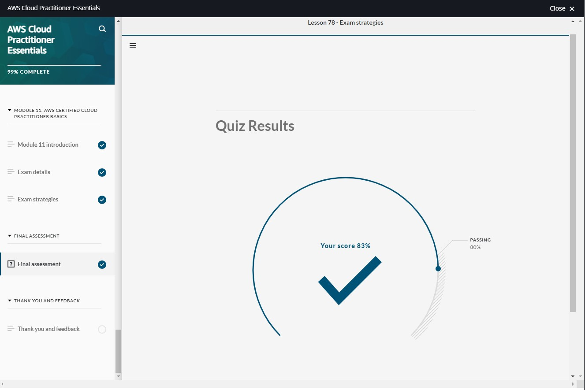

# Amazon's AWS Cloud Practitioner Essentials Course

## [Module 12: Final Assessment](https://dxdn3xrr0vpde.cloudfront.net/files/a/w/aws_prod1_docebosaas_com/1635055200/AuvPMHohi-inboCWfdCtLQ/tincan/9fcdd31716ade4bd2b683417d7ab62bbaa2de2ed/index.html?endpoint=https%3A%2F%2Fexplore.skillbuilder.aws%2Ftcapi%2F&auth=Basic%20L2YyZDI3MjgzLWMzNTYtNDY3ZS04NmQzLWI3M2JkM2Q1OTkyMDokMnkkMTMkNHB5Njg3aVVnSy9vbnA4WTlrSmwwZTIuWTg3bEk3c0RXbnpmOFJ1eGlDaUtvNUxacnhKRnU%3D&actor=%7B%22mbox%22%3A%22mailto%3Ajoanne-middour%40outlook.com%22%2C%22name%22%3A%22Joanne+Middour%22%7D&registration=7eb5932e-f317-4da7-a8a8-17f73f3f0422&activity_id=http%3A%2F%2FJsdOGRWZzljloSEdyFptOL7JZcTBEIYc_rise&Accept-Language=en&course_id=134&content_token=7eb5932e-f317-4da7-a8a8-17f73f3f0422&session_context=lms&course_code=DIG-BF-100-CECPEB-10-EN&course_id=134&username=f2d27283-c356-467e-86d3-b73bd3d59920&user_id=748669&hash=742480e34a02697f77a43362ebb311ab0012df6cf1e43ee8bb14788a6b80eff1#/lessons/sk94wGJKpiTDcVWvZ-Mfj_1w8ohctKjf)

You want to store data in a volume that is attached to an Amazon EC2 instance. Which service should you use?

- [ ] Amazon Simple Storage Service (Amazon S3)

- [x] Amazon Elastic Block Store (Amazon EBS)  `<-- Correct`

- [ ] AWS Lambda

- [ ] Amazon ElastiCache

  > The correct response option is **Amazon Elastic Block Store (Amazon EBS)**.
  > 
  > Amazon EBS provides block-level storage volumes that you can use with Amazon EC2 instances. If you stop or terminate an Amazon EC2 instance, all the data on the attached EBS volume remains available.
  > 
  > The other response options are incorrect because:
  > 
  > - Amazon Simple Storage Service (Amazon S3) is a service that provides object-level storage. Amazon S3 stores data as objects within buckets.
  > - AWS Lambda is a service that lets you run code without provisioning or managing servers.
  > - Amazon ElastiCache is a service that adds caching layers on top of your databases to help improve the read times of common requests.
  > 
  > **Learn more:**
  > 
  > - [Amazon EBS](https://aws.amazon.com/ebs)
  > 

Which service enables you to review details for user activities and API calls that have occurred within your AWS environment?

- [ ] Amazon CloudWatch

- [ ] AWS Trusted Advisor

- [ ] Amazon Inspector

- [x] AWS CloudTrail  `<-- Correct`

  > The correct response option is **AWS CloudTrail**.
  > 
  > With CloudTrail, you can view a complete history of user activity and API calls for your applications and resources.
  > 
  > Events are typically updated in CloudTrail within 15 minutes after an API call was made. You can filter events by specifying the time and date that an API call occurred, the user who requested the action, the type of resource that was involved in the API call, and more.
  > 
  > The other response options are incorrect because:
  > 
  > - Amazon CloudWatch is a service that provides data that you can use to monitor your applications, optimize resource utilization, and respond to system-wide performance changes.
  > - Amazon Inspector is a service that checks applications for security vulnerabilities and deviations from security best practices.
  > - AWS Trusted Advisor is an online tool that inspects your AWS environment and provides real-time guidance in accordance with AWS best practices.
  > 
  > **Learn more:**
  > 
  > - [AWS CloudTrail](https://aws.amazon.com/cloudtrail)
  > 

Which statement best describes an Availability Zone?

- [x] A fully isolated portion of the AWS global infrastructure  `<-- Correct`

- [ ] A separate geographical location with multiple locations that are isolated from each other

- [ ] The server from which Amazon CloudFront gets your files

- [ ] A site that Amazon CloudFront uses to cache copies of content for faster delivery to users at any location

  > The correct response option is **A fully isolated portion of the AWS global infrastructure**.
  >
  > An Availability Zone is a single data center or a group of data centers within a Region. 
  > 
  > Availability Zones are located tens of miles apart from each other. This helps them to provide interconnectivity to support the services and applications that run within a Region.
  > 
  > The other response options are incorrect because:
  > 
  > - A separate geographical location with multiple locations that are isolated from each other - This response option describes a Region.
  > - The server from which Amazon CloudFront gets your files - This response option describes an origin.
  > - A site that Amazon CloudFront uses to cache copies of content for faster delivery to users at any location - This response option describes an Edge location.
  > 
  > **Learn more:**
  > 
  > - [AWS global infrastructure](https://aws.amazon.com/about-aws/global-infrastructure)
  > - [Regions and Availability Zones](https://aws.amazon.com/about-aws/global-infrastructure/regions_az/)
  > 

You are running an Amazon EC2 instance and want to store data in an attached resource. Your data is temporary and will not be kept long term. Which resource should you use?

- [ ] Amazon S3 bucket

- [x] Instance store  `<-- Correct`

- [ ] Subnet

- [ ] Amazon Elastic Block Store (Amazon EBS) volume

  > The correct response option is **instance store**.
  > 
  > Instance stores are ideal for temporary data that does not need to be kept long term. 
  > 
  > When an Amazon EC2 instance is stopped or terminated, all the data that has been written to the attached instance store is deleted.
  > 
  > The other response options are incorrect because:
  > 
  > - Amazon EBS volumes are ideal for data that needs to be retained. When an Amazon EC2 instance is stopped or terminated, all of the data on the attached EBS volume is still available.
  > - Amazon S3 buckets cannot be attached to Amazon EC2 instances.
  > - A subnet is a section of a virtual private cloud (VPC) in which you can group resources based on security or operational needs.
  > 
  > **Learn more:**
  > 
  > - [Amazon EC2 instance store](https://docs.aws.amazon.com/AWSEC2/latest/UserGuide/InstanceStorage.html)
  > 

Which actions can you perform in Amazon Route 53? (Select TWO.)

- [x] Manage DNS records for domain names.  `<-- Correct`

- [ ] Automate the deployment of workloads into your AWS environment.

- [x] Connect user requests to infrastructure in AWS and outside of AWS.  `<-- Correct`

- [ ] Access AWS security and compliance reports and select online agreements.

- [ ] Monitor your applications and respond to system-wide performance changes.

  > The correct two response options are:
  > 
  > - **Connect user requests to infrastructure in AWS and outside of AWS.**
  > - **Manage DNS records for domain names.**
  > 
  > Amazon Route 53 is a DNS web service. It gives developers and businesses a reliable way to route end users to internet applications that are hosted in AWS.  
  > 
  > Additionally, you can transfer DNS records for existing domain names that are currently managed by other domain registrars, or register new domain names directly within Amazon Route 53.
  > 
  > The other response options are incorrect because:
  > 
  > - Monitor your applications and respond to system-wide performance changes - These actions can be performed in Amazon CloudWatch.
  > - Access AWS security and compliance reports and special online agreements - This action can be performed in AWS Artifact.
  > - Automate the deployment of workloads into your AWS environment - This action can be performed with AWS Quick Starts.
  > 
  > **Learn more:**
  > 
  > - [Amazon Route 53](https://aws.amazon.com/route53)
  > 

Which service enables you to build the workflows that are required for human review of machine learning predictions?

- [ ] Amazon Augmented AI  `<-- Correct`

- [ ] Amazon Aurora

- [x] Amazon Textract  `<-- Wrong`
 
- [ ] Amazon Lex

  > The correct response option is **Amazon Augmented AI**.
  > 
  > Amazon Augmented AI (Amazon A2I) provides built-in human review workflows for common machine learning use cases, such as content moderation and text extraction from documents. With Amazon A2I, you can also create your own workflows for machine learning models built on Amazon SageMaker or any other tools.
  > 
  > The other response options are incorrect because:
  > 
  > - Amazon Textract is a machine learning service that automatically extracts text and data from scanned documents.
  > - Amazon Lex is a service that enables you to build conversational interfaces using voice and text.
  > - Amazon Aurora is an enterprise-class relational database.
  > 
  > **Learn more:**
  > 
  > - [Amazon Augmented AI](https://aws.amazon.com/augmented-ai)
  > 

Which pillar of the AWS Well-Architected Framework focuses on using computing resources in ways that meet system requirements?

- [ ] Operational Excellence

- [x] Performance Efficiency  `<-- Correct`

- [ ] Security

- [ ] Reliability

  > The correct response option is **Performance Efficiency**.
  > 
  > The Performance Efficiency pillar focuses on using computing resources efficiently to meet system requirements, and to maintain that efficiency as demand changes and technologies evolve.
  > 
  > The other responses are incorrect because:
  > 
  > - The Operational Excellence pillar includes the ability to run workloads effectively, gain insights into their operations, and continuously improve supporting processes to deliver business value. 
  > - The Security pillar focuses on protecting data, systems, and assets. It also focuses on using cloud technologies to improve the security of your workloads.
  > - The Reliability pillar focuses on the ability of a workload to consistently and correctly perform its intended functions.
  > 
  > **Learn more:**
  > 
  > - [AWS Well-Architected Framework](https://d1.awsstatic.com/whitepapers/architecture/AWS_Well-Architected_Framework.pdf)
  > 

You want Amazon S3 to monitor your objects’ access patterns. Which storage class should you use? 

- [x] S3 Intelligent-Tiering  `<-- Correct`

- [ ] S3 Glacier

- [ ] S3 One Zone-IA

- [ ] S3 Standard-IA

  > The correct response option is **S3 Intelligent-Tiering**.
  > 
  > In the S3 Intelligent-Tiering storage class, Amazon S3 monitors objects’ access patterns. If you haven’t accessed an object for 30 consecutive days, Amazon S3 automatically moves it to the infrequent access tier, S3 Standard-IA. If you access an object in the infrequent access tier, Amazon S3 automatically moves it to the frequent access tier, S3 Standard.
  > 
  > The other response options are incorrect because:
  > 
  > - S3 Glacier is a low-cost storage class that is ideal for data archiving. You can retrieve objects stored in the S3 Glacier storage class within a few minutes to a few hours.
  > - The S3 Standard-IA storage class is ideal for data that is infrequently accessed but requires high availability when needed. Both S3 Standard and S3 Standard-IA store data in a minimum of three Availability Zones. S3 Standard-IA provides the same level of availability as S3 Standard but at a lower storage price. 
  > - S3 One Zone-IA is ideal for infrequently accessed data that does not require high availability.
  > 
  > **Learn more:**
  > 
  > - [Amazon S3 storage classes](https://aws.amazon.com/s3/storage-classes/)
  > 

Which migration strategy involves changing how an application is architected and developed, typically by using cloud-native features?

- [x] Replatforming  `<-- Wrong`

- [ ] Refactoring  `<-- Correct`

- [ ] Rehosting

- [ ] Repurchasing

  > The correct response option is **Refactoring**.
  > 
  > The other response options are incorrect because:
  > 
  > - Repurchasing involves replacing an existing application with a cloud-based version, such as software found in AWS Marketplace.
  > - Rehosting involves moving an application to the cloud with little to no modifications to the application itself. It is also known as “lift and shift.”
  > - Replatforming involves selectively optimizing aspects of an application to achieve benefits in the cloud without changing the core architecture of the application. It is also known as “lift, tinker, and shift.”
  > 
  > **Learn more:**
  > 
  > - [6 Strategies for Migrating Applications to the Cloud](https://aws.amazon.com/blogs/enterprise-strategy/6-strategies-for-migrating-applications-to-the-cloud/)
  > 

Which service is used to quickly deploy and scale applications on AWS?

- [ ] AWS Snowball

- [ ] AWS Outposts

- [ ] Amazon CloudFront

- [x] AWS Elastic Beanstalk  `<-- Correct`

  > The correct response option is **AWS Elastic Beanstalk**.
  > 
  > You upload your application, and Elastic Beanstalk automatically handles the deployment details of capacity provisioning, load balancing, auto-scaling, and application health monitoring.
  > 
  > The other response options are incorrect because:
  > 
  > - AWS Outposts is a service that enables you to run infrastructure in a hybrid cloud approach.
  > - Amazon CloudFront is a content delivery service. 
  > - AWS Snowball is a device that enables you to transfer large amounts of data into and out of AWS.
  > 
  > **Learn more:**
  > 
  > - [AWS Quick Starts](https://aws.amazon.com/quickstart)
  > 

Which component or service enables you to establish a dedicated private connection between your data center and virtual private cloud (VPC)?

- [ ] Virtual private gateway

- [x] AWS Direct Connect  `<-- Correct`

- [ ] Amazon CloudFront

- [ ] Internet gateway

  > The correct response option is **AWS Direct Connect**.
  > 
  > AWS Direct Connect is a service that enables you to establish a dedicated private connection between your data center and VPC. 
  > 
  > The private connection that AWS Direct Connect provides helps you to reduce network costs and increase the amount of bandwidth that can travel through your network.
  > 
  > The other response options are incorrect because:
  > 
  > - Amazon CloudFront is a content delivery service. It uses a network of edge locations to cache content and deliver content to customers all over the world.
  > - A virtual private gateway enables you to establish a virtual private network (VPN) connection between your VPC and a private network, such as an on-premises data center or internal corporate network. A virtual private gateway only allows traffic into the VPC only if it is coming from an approved network.
  > - An internet gateway is a connection between a VPC and the internet. It allows public traffic from the internet to access a VPC.
  > 
  > **Learn more:**
  > 
  > - [AWS Direct Connect](https://aws.amazon.com/directconnect)
  > 

Which service is used to transfer up to 80 PB of data to AWS?

- [ ] Amazon Neptune

- [ ] Amazon CloudFront

- [ ] AWS Snowmobile  `<-- Correct` (I thought Snowmobile transferred more than 80 PB) I looked it up and I was right about it transferring more; It is up to 100 PB (1 Exabyte)

- [x] AWS DeepRacer  `<-- Wrong`

  > The correct response option is **AWS Snowmobile**.
  > 
  > AWS Snowmobile is a service that is used for transferring up to 80 PB of data to AWS. Each Snowmobile is a 45-foot long shipping container that is pulled by a semi-trailer truck. It can transfer up to 80 PB of data.
  > 
  > The other response options are incorrect because:
  > 
  > - Amazon Neptune is a graph database service. You can use Amazon Neptune to build and run applications that work with highly connected datasets, such as recommendation engines, fraud detection, and knowledge graphs.
  > - Amazon CloudFront is a content delivery service.
  > - AWS DeepRacer is an autonomous 1/18 scale race car that you can use to test reinforcement learning models.
  > 
  > **Learn more:**
  > 
  > - [AWS Snow Family](https://aws.amazon.com/snow)
  > 

Which virtual private cloud (VPC) component controls inbound and outbound traffic for Amazon EC2 instances?

- [ ] Internet gateway

- [ ] Network access control list

- [x] Security group  `<-- Correct`

- [ ] Subnet

  > The correct response option is **security group**.
  > 
  > A security group is a virtual firewall that controls inbound and outbound traffic for an Amazon EC2 instance. 
  > 
  > By default, a security group denies all inbound traffic and allows all outbound traffic. You can add custom rules to configure which traffic should be allowed or denied.
  > 
  > The other response options are incorrect because:
  > 
  > - A subnet is a section of a VPC in which you can group resources based on security or operational needs.
  > - A network access control list (ACL) is a virtual firewall that controls inbound and outbound traffic at the subnet level.
  > - An internet gateway is a connection between a VPC and the internet. It allows public traffic from the internet to access a VPC.
  > 
  > **Learn more:**
  > 
  > - [Security groups for your VPC](https://docs.aws.amazon.com/vpc/latest/userguide/VPC_SecurityGroups.html)
  > 

Which Support plans include access to all AWS Trusted Advisor checks? (Select TWO.)

- [ ] AWS Free Tier

- [x] Enterprise  `<-- Correct`

- [ ] Basic

- [x] Business  `<-- Correct`

- [ ] Developer

  > The two correct response options are:
  > 
  > - **Enterprise**
  > - **Business**
  > 
  > The other response options are incorrect because:
  > 
  > - The Basic and Developer Support plans provide access to a limited selection of AWS Trusted Advisor checks.
  > - The AWS Free Tier is not a Support plan. It is a program that consists of three types of offers that allow customers to use AWS services without incurring costs: Always free, 12 months free, and Trials.
  > 
  > **Learn more:**
  > 
  > - [AWS Trusted Advisor](https://aws.amazon.com/premiumsupport/technology/trusted-advisor/)
  > 

Which statement best describes Amazon GuardDuty?

- [ ] A service that checks applications for security vulnerabilities and deviations from security best practices

- [ ] A service that lets you monitor network requests that come into your web applications

- [x] A service that provides intelligent threat detection for your AWS infrastructure and resources  `<-- Correct`

- [ ] A service that helps protect your applications against distributed denial-of-service (DDoS) attacks

  > The correct response option is **A service that provides intelligent threat detection for your AWS infrastructure and resources**.
  > 
  > AWS GuardDuty identifies threats by continually monitoring the network activity and account behavior within your AWS environment.
  > 
  > The other response options are incorrect because:
  > 
  > - A service that helps protect your applications against distributed denial-of-service (DDoS) attacks - This response option describes AWS Shield.
  > - A service that checks applications for security vulnerabilities and deviations from security best practices - This response option describes Amazon Inspector.
  > - A service that lets you monitor network requests that come into your web applications - This response option describes AWS WAF.
  > 
  > **Learn more:**
  > 
  > - [Amazon GuardDuty](https://aws.amazon.com/guardduty)
  > 

Which tool is used to automate actions for AWS services and applications through scripts? 

- [ ] Amazon QLDB

- [ ] AWS Snowball

- [x] AWS Command Line Interface  `<-- Correct`

- [ ] Amazon Redshift

  > The correct response option is **AWS Command Line Interface**.
  > 
  > The AWS Command Line Interface (AWS CLI) enables you to control multiple AWS services directly from the command line within one tool. For example, you can use commands to start an Amazon EC2 instance, connect an Amazon EC2 instance to a specific Auto Scaling group, and more. The AWS CLI is available for users on Windows, macOS, and Linux.
  > 
  > The other response options are incorrect because:
  > 
  > - Amazon Redshift is a data warehousing service that you can use for big data analytics. It offers the ability to collect data from many sources and help you to understand relationships and trends across your data. 
  > - Amazon Quantum Ledger Database (Amazon QLDB) is a ledger database service. You can use Amazon QLDB to review a complete history of all the changes that have been made to your application data.
  > - AWS Snowball is a device that enables you to transfer large amounts of data into and out of AWS.
  > 
  > **Learn more:**
  > 
  > - [AWS Command Line Interface](https://aws.amazon.com/cli/)
  > 

Which action can you perform in Amazon CloudFront?

- [ ] Provision an isolated section of the AWS Cloud to launch resources in a virtual network that you define.

- [x] Deliver content to customers through a global network of edge locations.  `<-- Correct`

- [ ] Provision resources by using programming languages or a text file.

- [ ] Run infrastructure in a hybrid cloud approach.

  > The correct response is **Deliver content to customers through a global network of edge locations**.
  > 
  > Amazon CloudFront is a content delivery service. 
  > 
  > It uses a network of edge locations to cache content and deliver content to customers all over the world. When content is cached, it is stored locally as a copy. This content might be video files, photos, webpages, and so on.
  > 
  > The other response options are incorrect because:
  > 
  > - Run infrastructure in a hybrid cloud approach - This action can be performed with *AWS Outposts*. 
  > - Provision resources by using programming languages or a text file - This action can be performed in *AWS CloudFormation*.
  > - Provision an isolated section of the AWS Cloud to launch resources in a virtual network that you define - This action can be performed in *Amazon Virtual Private Cloud (Amazon VPC)*.
  > 
  > **Learn more:**
  > 
  > - [Amazon CloudFront](https://aws.amazon.com/cloudfront)
  > 

Which Perspective of the AWS Cloud Adoption Framework focuses on recovering IT workloads to meet the requirements of your business stakeholders?

- [x] Operations Perspective  `<-- Correct`

- [ ] People Perspective

- [ ] Governance Perspective

- [ ] Business Perspective

  > The correct response option is **Operations Perspective**.
  > 
  > The Operations Perspective of the AWS Cloud Adoption Framework also includes principles for operating in the cloud by using agile best practices.
  > 
  > The other response options are incorrect because: 
  > 
  > - The Business Perspective helps you to move from a model that separates business and IT strategies into a business model that integrates IT strategy.
  > - The People Perspective helps Human Resources (HR) employees prepare their teams for cloud adoption by updating organizational processes and staff skills to include cloud-based competencies.
  > - The Governance Perspective helps you understand how to update the staff skills and organizational processes that are necessary to ensure business governance in the cloud.
  > 
  > **Learn more:**
  > 
  > - [Whitepaper: An Overview of the AWS Cloud Adoption Framework](https://d1.awsstatic.com/whitepapers/aws_cloud_adoption_framework.pdf)
  > 

Which statement is TRUE for AWS Lambda?

- [x] You pay only for compute time while your code is running.  `<-- Correct`

- [ ] To use AWS Lambda, you must configure the servers that run your code.

- [ ] Before using AWS Lambda, you must prepay for your estimated compute time.

- [ ] The first step in using AWS Lambda is provisioning a server.

  > The correct response option is **You pay only for compute time while your code is running**.
  > 
  > AWS Lambda is a service that lets you run code without needing to provision or manage servers.
  > 
  > While using AWS Lambda, you pay only for the compute time that you consume. You are charged only when your code is running. With AWS Lambda, you can run code for virtually any type of application or backend service, all with zero administration. 
  > 
  > **Learn more:**
  > 
  > - [AWS Lambda](https://aws.amazon.com/lambda)
  > 

In the S3 Intelligent-Tiering storage class, Amazon S3 moves objects between a frequent access tier and an infrequent access tier. Which storage classes are used for these tiers? (Select TWO.)

- [ ] S3 One Zone-IA

- [x] S3 Standard  `<-- Correct`

- [x] S3 Standard-IA  `<-- Correct`

- [ ] S3 Glacier

- [ ] S3 Glacier Deep Archive

  > The two correct response options are:
  > 
  > - **S3 Standard**
  > - **S3 Standard-IA**
  > 
  > In the S3 Intelligent-Tiering storage class, Amazon S3 monitors objects’ access patterns. If you haven’t accessed an object for 30 consecutive days, Amazon S3 automatically moves it to the infrequent access tier, S3 Standard-IA. If you access an object in the infrequent access tier, Amazon S3 automatically moves it to the frequent access tier, S3 Standard.
  > 
  > **Learn more:**
  > 
  > - [Amazon S3 storage classes](https://aws.amazon.com/s3/storage-classes/)
  > 

Which compute option reduces costs when you commit to a consistent amount of compute usage for a 1-year or 3-year term?

- [ ] Spot Instances

- [ ] Dedicated Hosts

- [x] Reserved Instances  `<-- Wrong`

- [ ] Savings Plans  `<-- Correct`

  > The correct response option is **Savings Plans**.
  > 
  > Amazon EC2 Savings Plans enable you to reduce your compute costs by committing to a consistent amount of compute usage for a 1-year or 3-year term. This results in savings of up to 72% over On-Demand Instance costs. Any usage up to the commitment is charged at the discounted Savings Plan rate (for example, $10 an hour). Any usage beyond the commitment is charged at regular On-Demand Instance rates.
  > 
  > The other response options are incorrect because:
  > 
  > - Reserved Instances are a billing discount that is applied to the use of On-Demand Instances in your account. You can purchase Standard Reserved and Convertible Reserved Instances for a one-year or three-year term, and Scheduled Reserved Instances for a one-year term. Unlike Savings Plans, Reserved Instances do not require you to commit to a consistent amount of compute usage over the duration of the contract.
  > - Spot Instances are ideal for workloads with flexible start and end times or that can withstand interruptions. Spot Instances leverage unused EC2 computing capacity and offer you cost savings at up to 90% of On-Demand Instance prices.
  > - Dedicated Hosts are physical servers with EC2 instance capacity that is fully dedicated to your use.  
  >   You can use your existing per-socket, per-core, or per-VM software licenses to help maintain license compliance. You can purchase On-Demand Dedicated Hosts or Reserved Dedicated Hosts. Of all the Amazon EC2 options that were covered in this course, Dedicated Hosts are the most expensive.
  > 
  > **Learn more:**
  > 
  > - [Savings Plans]()
  > 

You want to store data in a key-value database. Which service should you use?

- [ ] Amazon RDS

- [x] Amazon DynamoDB  `<-- Correct`

- [ ] Amazon DocumentDB

- [ ] Amazon Aurora

  > The correct response option is **Amazon DynamoDB**.
  > 
  > Amazon DynamoDB is a key-value database service. A key-value database might include data pairs such as “Name: John Doe,” “Address: 123 Any Street,” and “City: Anytown”.
  > 
  > In a key-value database, you can add or remove attributes from items in the table at any time. Additionally, not every item in the table has to have the same attributes.  
  > 
  > The other response options are incorrect because:
  > 
  > - Amazon Relational Database Service (Amazon RDS) and Amazon Aurora use structured query language (SQL) to store and query data. They are not key-value databases.
  > - Amazon DocumentDB is a document database service that supports MongoDB workloads.
  > 
  > **Learn more:**
  > 
  > - [Amazon DynamoDB](https://aws.amazon.com/dynamodb)
  > 

Which tasks are the responsibilities of AWS? (Select TWO.)

- [ ] Creating IAM users and groups

- [ ] Training company employees on how to use AWS services

- [x] Maintaining virtualization infrastructure  `<-- Correct`

- [x] Configuring AWS infrastructure devices  `<-- Correct`

- [ ] Configuring security groups on Amazon EC2 instances

  > The two correct response options are:
  > 
  > - **Maintaining virtualization infrastructure**
  > - **Configuring AWS infrastructure devices**
  > 
  > The other three response options are tasks that are the responsibilities of customers.
  > 
  > **Learn more:**
  > 
  > - [AWS shared responsibility model](https://aws.amazon.com/compliance/shared-responsibility-model/)
  > 

Which statement best describes AWS Marketplace?

- [ ] A resource that provides guidance, architectural reviews, and ongoing communication with your company as you plan, deploy, and optimize your applications

- [x] A digital catalog that includes thousands of software listings from independent software vendors  `<-- Correct`

- [ ] An online tool that inspects your AWS environment and provides real-time guidance in accordance with AWS best practices

- [ ] A resource that can answer questions about best practices and assist with troubleshooting issues

  > The correct response option is **A digital catalog that includes thousands of listings from independent software vendors**.
  > 
  > You can use AWS Marketplace to find, test, and buy software that runs on AWS.
  > 
  > The other response options are incorrect because:
  > 
  > - A resource that can answer questions about best practices and assist with troubleshooting issues - This response option describes AWS Support.
  > - A resource that provides guidance, architectural reviews, and ongoing communication with your company as you plan, deploy, and optimize your applications - This response option describes a Technical Account Manager (TAM). 
  > - An online tool that inspects your AWS environment and provides real-time guidance in accordance with AWS best practices - This response option describes AWS Trusted Advisor.
  > 
  > **Learn more:**
  > 
  > - [AWS Marketplace]()
  > 

Which AWS Trusted Advisor category includes checks for your service limits and overutilized instances?

- [x] Cost Optimization  `<-- Wrong`

- [ ] Fault Tolerance

- [ ] Security

- [ ] Performance  `<-- Correct`

  > The correct response option is **Performance**.
  > 
  > In this category, AWS Trusted Advisor also helps improve the performance of your services by providing recommendations for how to take advantage of provisioned throughput.
  > 
  > The other response options are incorrect because:
  > 
  > - The Security category includes checks that help you to review your permissions and identify which AWS security features to enable.
  > - The Cost Optimization category includes checks for unused or idle resources that could be eliminated and provide cost savings.
  > - The Fault Tolerance category includes checks to help you improve your applications’ availability and redundancy.
  > 
  > **Learn more:**
  > 
  > - [AWS Trusted Advisor](https://aws.amazon.com/premiumsupport/technology/trusted-advisor/)
  > 

Which tool enables you to visualize, understand, and manage your AWS costs and usage over time?

- [ ] AWS Artifact

- [ ] AWS Budgets

- [x] AWS Cost Explorer  `<-- Correct`

- [ ] AWS Pricing Calculator

  > The correct response option is **AWS Cost Explorer**.
  > 
  > With AWS Cost Explorer, you can quickly create custom reports to analyze your AWS cost and usage data.
  > 
  > The other response options are incorrect because:
  > 
  > - AWS Budgets lets you set custom alerts that will notify you when your service usage exceeds (or is forecasted to exceed) the amount that you have budgeted.
  > - AWS Pricing Calculator lets you explore AWS services and create an estimate for the cost of your use cases on AWS. In the AWS Pricing Calculator, you can enter details for your cloud computing requirements and then receive a detailed estimate that can be exported and shared. 
  > - AWS Artifact is a service that enables you to access AWS security and compliance reports and special online agreements.
  > 
  > **Learn more:**
  > 
  > - [AWS Cost Explorer](https://aws.amazon.com/aws-cost-management/aws-cost-explorer/)
  > 

Which statement best describes Elastic Load Balancing?

- [ ] A service that provides data that you can use to monitor your applications, optimize resource utilization, and respond to system-wide performance changes

- [ ] A service that monitors your applications and automatically adds or removes capacity from your resource groups in response to changing demand

- [x] A service that distributes incoming traffic across multiple targets, such as Amazon EC2 instances  `<-- Correct`

- [ ] A service that enables you to set up, manage, and scale a distributed in-memory or cache environment in the cloud

  > The correct response option is **A service that distributes incoming traffic across multiple targets, such as Amazon EC2 instances**.
  > 
  > A load balancer acts as a single point of contact for all incoming web traffic to your Auto Scaling group. This means that as Amazon EC2 instances are added or removed in response to the amount of incoming traffic, these requests are routed to the load balancer first and then spread across multiple resources that will handle them.
  > 
  > The other response options are incorrect because:
  > 
  > - A service that monitors your applications and automatically adds or removes capacity from your resource groups in response to changing demand - This response option describes AWS Auto Scaling.
  > - A service that provides data that you can use to monitor your applications, optimize resource utilization, and respond to system-wide performance changes - This response option describes Amazon CloudWatch. Although Elastic Load Balancing does optimize resource utilization by distributing incoming traffic across available resources, this would not be the best response option because Elastic Load Balancing does not provide all the other listed features.
  > - A service that enables you to set up, manage, and scale a distributed in-memory or cache environment in the cloud - This response option describes Amazon ElastiCache.
  > 
  > **Learn more:**
  > 
  > - [Elastic Load Balancing](https://aws.amazon.com/elasticloadbalancing)
  > 

Which service is used to run containerized applications on AWS?

- [ ] Amazon Aurora

- [ ] Amazon SageMaker

- [x] Amazon Elastic Kubernetes Service (Amazon EKS)  `<-- Correct`

- [ ] Amazon Redshift

  > The correct response option is **Amazon Elastic Kubernetes Service (Amazon EKS)**.
  > 
  > Amazon EKS is a fully managed service that you can use to run Kubernetes on AWS. Kubernetes is open-source software that enables you to deploy and manage containerized applications at scale.
  > 
  > Containers provide you with a standard way to package your application's code and dependencies into a single object. Containers are frequently used for processes and workflows in which there are essential requirements for security, reliability, and scalability.
  > 
  > The other response options are incorrect because:
  > 
  > - Amazon SageMaker is a service that enables you to quickly build, train, and deploy machine learning models.
  > - Amazon Aurora is an enterprise-class relational database. 
  > - Amazon Redshift is a data warehousing service that you can use for big data analytics.
  > 
  > **Learn more:**
  > 
  > - [Amazon EKS](https://aws.amazon.com/eks)
  > 

Which service enables you to consolidate and manage multiple AWS accounts from a central location?

- [ ] AWS Artifact

- [x] AWS Organizations  `<-- Correct`

- [ ] AWS Identity and Access Management (IAM)

- [ ] AWS Key Management Service (AWS KMS)

  > The correct response option is **AWS Organizations**.
  > 
  > In AWS Organizations, you can centrally control permissions for the accounts in your organization by using service control policies (SCPs). Additionally, you can use the consolidated billing feature in AWS Organizations to combine usage and receive a single bill for multiple AWS accounts.
  > 
  > The other response options are incorrect because:
  > 
  > - AWS Identity and Access Management (IAM) is a service that you can use to manage access to AWS services and resources.  
  > - AWS Artifact is a service that enables you to access AWS security and compliance reports and special online agreements.
  > - AWS Key Management Service (AWS KMS) enables you to create, manage, and use cryptographic keys.
  > 
  > **Learn more:**
  > 
  > - [AWS Organizations]()
  > 

You want to send and receive messages between distributed application components. Which service should you use?    

- [ ] Amazon Route 53

- [ ] AWS Snowball

- [x] Amazon Simple Queue Service (Amazon SQS)  `<-- Correct`

- [ ] Amazon ElastiCache

  > The correct response option is **Amazon Simple Queue Service (Amazon SQS)**.
  > 
  > Amazon SQS is a message queuing service. Using Amazon SQS, you can send, store, and receive messages between software components at any volume size, without losing messages or requiring other services to be available. 
  > 
  > In Amazon SQS, an application sends messages into a queue. A user or service retrieves a message from the queue, processes it, and then deletes it from the queue.
  > 
  > The other response options are incorrect because: 
  > 
  > - AWS Snowball is a device that enables you to transfer large amounts of data into and out of AWS.
  > - Amazon ElastiCache is a service that adds caching layers on top of your databases to help improve the read times of common requests.
  > - Amazon Route 53 is a DNS web service. It gives developers and businesses a reliable way to route end users to internet applications that are hosted in AWS. Additionally, you can transfer DNS records for existing domain names that are currently managed by other domain registrars or register new domain names directly in Amazon Route 53.
  > 
  > **Learn more:**
  > 
  > - [Amazon SQS](https://aws.amazon.com/sqs)
  > 

## Final Results:

### 83%

