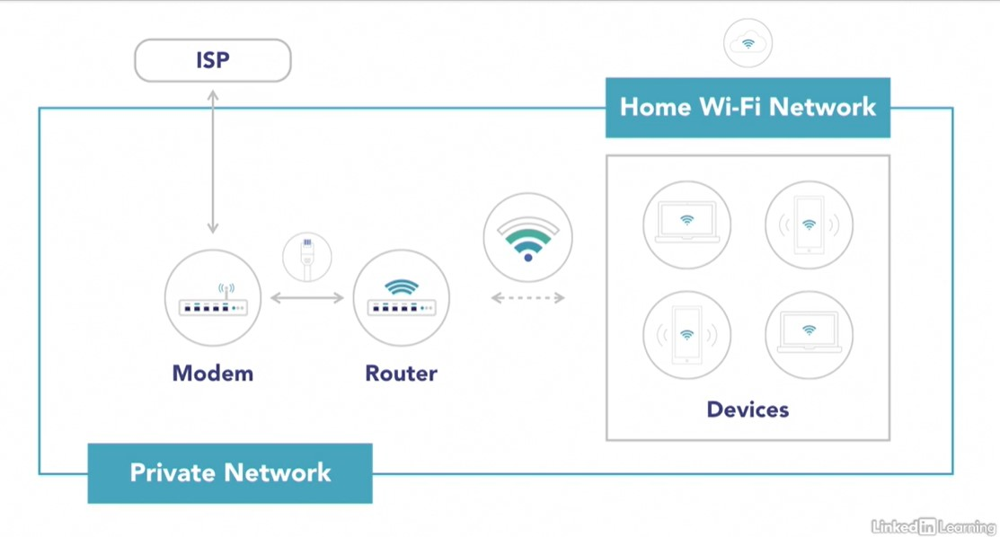

# Prepare for the AWS Certified Cloud Practitioner Exam

## [Introduction to AWS for Non-Engineers: 3 Core Services](https://www.linkedin.com/learning/introduction-to-aws-for-non-engineers-3-core-services-2?contextUrn=urn%3Ali%3AlyndaLearningPath%3Aember8982)

### The Technology Domain
- 33% of the certification exam (the largest portion)
- Four Parts:
  - Define methods of deploying and operating in the AWS Cloud
  - Define the AWS global infrastructure
  - Identify the core AWS services
  - Identify resources for technology support

### AWS Products and Services
- Study the services and products we talk about in this course
- There are only certain services that are considered core services and those will be the only ones on the exam
- Do not need to know the latest greatest services from AWS
- Be familiar with as many products and services as you can though
- Keep up with all the products that AWS currently offers at https://aws.amazon.com/products

## [EC2 (Amazon Elastic Compute Cloud)](https://www.linkedin.com/learning/introduction-to-aws-for-non-engineers-3-core-services-2/ec2-3?contextUrn=urn%3Ali%3AlyndaLearningPath%3Aember8982)
- Virtual server running on AWS (called an instance)
- Configurable by number of virtual CPUs, GBs of RAM, size/type of storage, and network speed
- Only charged for what you use, when you use it
- Deploy extremely scalable and reliable virtual servers within minutes/seconds
- One of the most widely used services in AWS
- Integrates with many other AWS services
- It is reliable and secure
- Allows you/your company to quickly and inexpensively spin up instances of virtual servers for all of your different needs

## [Elastic Beanstalk](https://www.linkedin.com/learning/introduction-to-aws-for-non-engineers-3-core-services-2/elastic-beanstalk-3?contextUrn=urn%3Ali%3AlyndaLearningPath%3Aember8982)
- Helps you to deploy and scale web applications by simply uploading your code
- Handles the deployment process including: 
  - The capacity provisioning
  - Load balancing
  - Auto scaling
  - Application health monitoring
- Accommodate services deployed using Java, .NET, PHP, Node.js, Python, Ruby, Go, and Docker
- You retain full control over the underlined resources at all times
- Free to use
- Only pay for the AWS services needed to store and run the web applications you've deployed
- Never have to worry about outgrowing the provisions provided because it autoscales your application up and down based on its needs
- You have complete freedom to select the AWS resources you want to use to store and run your application
- Allows for manual management of the infrastructure if you would like to manual take it over at any time
- Provisions and operates the infrastructure for you so you can focus on coding

## [Elastic Load Balancer](https://www.linkedin.com/learning/introduction-to-aws-for-non-engineers-3-core-services-2/elastic-load-balancing-3?contextUrn=urn%3Ali%3AlyndaLearningPath%3Aember8982)
When a server becomes overload with request it becomes completely overwhelmed and will load extremely slow or go down completely.

This is where Elastic Load Balancer can help
- Automatically distributes traffic coming in to multiple servers to avoid from one server getting overloaded during high traffic time
- The user sets up multiple replicated servers (multiple servers with the same content on them) in anticipation of the increase of traffic
- Then Elastic Load Balancer would stand in front of those servers and distribute the traffic to the different servers equally
- Kind of like an air traffic controller telling airplanes to go to different runways
- Help applications achieve fault-tolerance by ensuring scalability performance and security
- Monitor the health of the servers, if one goes down, it will send the traffic to the remaining healthy servers
- Highly available, secure, flexible, and monitorable

## [Lambda](https://www.linkedin.com/learning/introduction-to-aws-for-non-engineers-3-core-services-2/lambda-3?contextUrn=urn%3Ali%3AlyndaLearningPath%3Aember8982)
- Runs code (Lambda function) in response to an event
- All you have to do is upload your code and it automatically runs uploaded code and scales the applications for you
- Pay only for the time the code is running and each event trigger
- There are no servers to provision or manager and nothing to scale because Lambda takes care of all that for you

## [Lightsail](https://www.linkedin.com/learning/introduction-to-aws-for-non-engineers-3-core-services-2/lightsail-3?contextUrn=urn%3Ali%3AlyndaLearningPath%3Aember8982)
- Perfect for simpler workloads, quick deployments, and getting started on AWS
- Preconfigured and ready-to-use operating systems, web apps, and development stacks
- It is easy to get started while still being designed to scale with you as you grow
- Scalable with your project's growth
- You can use it to deploy simple web applications, create websites, run your business's software, or spin up developer or test environments
- Cost-effective monthly fees
- One-click-to-launch services, so getting started is a breeze
- Easy to quickly deploy projects

## [Deploying and Operating in AWS](https://www.linkedin.com/learning/introduction-to-aws-for-non-engineers-3-core-services-2/deploying-and-operating-in-aws-3?contextUrn=urn%3Ali%3AlyndaLearningPath%3Aember8982)
Can deploy in AWS with three methods that all reference the AWS API to help you deploy and manage your AWS cloud infrastructure:
- AWS Management Console
  - Graphical interface that supports the majority of AWS services
  - Like a "web portal" that you log into as you would your social media account to see everything that is offered on that website
  - Can access your billing statements, launch new services, check out the health of web apps, and so on
  - User-friendly and easy to navigate

- AWS Command-Line Interface (CLI)
  - Allows you to access AWS services via the command line
  - Programming language agnostic
  - Allows you to create scripts to run on AWS

- AWS Software Development Kits (SDKs)
  - Lets you incorporate connectivity and functionality of a wide range of AWS services into your code
  - Helping you to deploy AWS services and resources using a variety of popular programming languages, such as node.js, C++, java, Ruby, and PHP
  - Allows you to use AWS resources in existing applications

You can use 1, 2, or all 3 ways of deployment to AWS Cloud

Infrastructure as Code:  

AWS CLIs and SDKs allow you to create tools that are specific to your organization and help create an environment that utilizes infrastructure as code. With infrastructure as code, it can write code that describes the configurations for specific AWS Cloud services, and they can be deployed for you by AWS. This helps to speed up the deployment process and removes the risk of human error when spinning up new resources.

Some examples of AWS services that utilize infrastructure as code:
- Elastic Beanstalk
- AWS Lambda
- AWS CloudFormation

## [AWS Global Infrastructure](https://www.linkedin.com/learning/introduction-to-aws-for-non-engineers-3-core-services-2/aws-global-infrastructure-3?contextUrn=urn%3Ali%3AlyndaLearningPath%3Aember8982)

Availability Zones (AZs)
- AWS has data centers around the world called Availability Zones (AZs)
- Each AZ is completely independent of each other in network and power source
- There are currently almost six dozen Availability Zones (AZs) around the world

Regions
- Made up of 2 or more AZs
- There are currently 2 dozen AWS Regions around the world
- Some Regions have more AWS cloud services than others
- When a new AWS service is introduced it is generally introduced to a few specific Regions before being introduced to the whole world
- Some of the Regions that recieve new services earlier are:
  - US - East - N. Virginia
  - US - West - Northern CA
  - Some Asian Pacific Regions:
    - Singapore
    - Sydney
    - Tokyo
  - Some areas in the European Union
    - Frankfort
    - Ireland
- Generally you would choose a Region closest to your physical location to host your AWS cloud infrastructure because you can decrease network latency for your end users
- Some Regions cost more than others
- Service Level Agreements (SLAs) also vary by Region
- You may also have Compliance requirements to meet which may require you to host your resources in specific regions or multiple regions

High Availability
- Hosting your resources in multiple AZs or Regions help create what is know as **high availability**
- Highly available resources may have duplicate copies in multiple AZs or even Regions
- **Resiliency:** The ability to provide uninterrupted performance, even during natural disasters
- **Redundancy:** Having multiple copies of your data in different data centers
- Architect your AWS Cloud Infrastructure to protect against downtimes caused by natural disasters or power outages

Every Data Center, AZ, and Region is interconnected with highly available, low latency, private global network. This means that data transfers between data centers, AZs, and Regions are super fast, allowing customers to take advantage of the resources without lag.

## [Reviewing Compute Services](https://www.linkedin.com/learning/introduction-to-aws-for-non-engineers-3-core-services-2/study-break-reviewing-compute-services-2?contextUrn=urn%3Ali%3AlyndaLearningPath%3Aember8982)

## [Amazon Simple Storage Service (S3)](https://www.linkedin.com/learning/introduction-to-aws-for-non-engineers-3-core-services-2/s3-3?contextUrn=urn%3Ali%3AlyndaLearningPath%3Aember8982)
- **Object storage service:** storing each file as a separate entity (object)
- Offers industry-leading data availability, security, performance, and scalability
- Scalability refers to the way you can scale your usage up or down with extreme flexibility
- Charged only for what you use
- Designed for 99.999999999% durability meaning there is almost no chance of the data becoming corrupted
- Upload files (objects) of all sizes (0 byte ~ 5 terabytes)
- Wide variety of uses, such as use uploaded files for:
  - websites
  - mobile apps
  - backup and archiving
  - enterprise applications
  - IoT devices
  - big data analytics
- Easy-to-use management features to fine-tune access controls for your organization specific compliance requirements

There are many storage classes available, which support different data access levels at corresponding pricing:
1. Standard
2. Intelligent-Tiering
3. Standard-Infrequent Access
4. One Zone-Infrequent Access
5. Glacier
6. Glacier Deep Archive

You can also set up S3 "life-cycle" policies which will automatically transfer files from one storage class to a cheaper one after a certain number of days. These options range from using S3 Standard class to store your frequently accessed files to using S3 Glacier Deep Archive to store backup data that's rarely accessed for very cheap rates.

## [Elastic Black Storage](https://www.linkedin.com/learning/introduction-to-aws-for-non-engineers-3-core-services-2/elastic-block-store-3?contextUrn=urn%3Ali%3AlyndaLearningPath%3Aember8982)
- Allows you to add extra block storage to your EC2 instance and you don't even have to reboot your server
- Behaves like raw, un-formatted block devices which can be attached to an EC2 instance to expand your server's storage
- Can add multiple EBS volumes to the same EC2 instance
- Can use these volumes as file systems or hard drives
- Can dynamically change the configurations (settings, sizes, etc.) of a volume attached to an instance via the management console
- Automatically replicated within its availability zone, making them highly available and durable
- Many organizations use EBS to host their huge databases
- There are different EBS storage types available to fit your needs and budgets
- Can be encrypted for compliance
- **Persistent block storage volumes:** they don't disappear when EC2 instances are rebooted
- They exist independently of EC2 instances so they can be moved to other instances
- They are like external hard drives for your virtual servers

## [Snowball](https://www.linkedin.com/learning/introduction-to-aws-for-non-engineers-3-core-services-2/snowball-3?contextUrn=urn%3Ali%3AlyndaLearningPath%3Aember8982)
- One of the very few **Hardware Solutions** offered by AWS
- Data Migration Tool
- AWS will physically ship you a "Snowball" to move your data onto and ship back to Amazon in order to migrate huge amounts of data at once
- You can move up to 50 terabytes with a regular "Snowball" and up to 100 petabytes with a "Snowmobile" (45-foot-long shipping container pulled by a semi)
- Usage Fee for a "Snowball": Free for 10 days of onsite usage; extra usage fees for every extra day you keep it
- Service Fee per job starting at $200 for 50 terabytes "Snowball" to $320 for 80 terabyte "Snowball"
- Storage Fee: storage fee for data transferred into S3 (but no transfer fee)
- "Snowmobile": Expensive! (need to talk to an AWS associate for an estimate for your particular need)

How to request and use a "Snowball":
1. Go to your AWS Management Console and create a data transfer job
2. AWS will deliver one or more "Snowball" devices to you based on the amount of data
3. When it arrives, you attach the device to your local network
4. Run the Snowball client on your machine
5. Select the folder(s) and file(s) you want to encrypt and transfer onto the AWS cloud
6. Once the transfers are completed, mail the device(s) back to AWS
7. Once AWS receives the device(s), they will upload your files on to S3

## [Storage Gateway](https://www.linkedin.com/learning/introduction-to-aws-for-non-engineers-3-core-services-2/storage-gateway-3?contextUrn=urn%3Ali%3AlyndaLearningPath%3Aember8982)
- Connects your on premise storage with AWS Cloud storage, providing a hybrid storage solution for your IT infrastructure
- Seamlessly ingrates on-premises enterprise applications and corporate workflows with AWS's Cloud Storage services through the use of a virtual machine installed onto an on-premises data center's host server
- Basically it creates a "gate" that connects your on-site users and devices to the resources stored in AWS Cloud with minimum latency

AWS offers 3 types of storage solutions to met your needs:
1. File-based
   1. Files are stored as objects in S3
   2. There is a one-to-one representation of each file
   3. Asynchronously updates the objects to S3 as local files are updated
   4. Local cache is maintained to provide low-latency access to recently accessed files

2. Volume-based
   1. Uploads files in blocks (like virtual hard drives)
   2. Asynchronously backed up as point-in-time snapshots and stored as Elastic Block Store (EBS) snapshots
   3. There are two types of Volume Gateways:
      1. **Stored Volume:** Complete copy on-premises; sends snapshots to AWS
      2. **Cached Volume:** Keeps most recently accessed data on-premises; complete copy on AWS

3. Tape-based
   1. Utilizes virtual tapes
   2. Uses existing tape-based backup infrastructure to back up to virtual tapes on S3
   3. Can think of it as taking backup on physical tapes, except, instead of physical tapes they are digital tape cartilages stored on S3
   4. Data is stored locally, then asynchronously uploaded to S3
   5. The data can than be archived using AWS Glacier, which is like sending your physical tape backups to an off-site holding facility, like Iron Mountain

AWS Storage Gateway Pricing:

- You pay for storage and data retrieval
- The quicker you can access the data, the more expensive the solution is

## [Study Break: Review Storage](https://www.linkedin.com/learning/introduction-to-aws-for-non-engineers-3-core-services-2/study-break-reviewing-storage-services-4?contextUrn=urn%3Ali%3AlyndaLearningPath%3Aember8982)
Amazon Simple Storage (S3):
- Object storage service
- Designed for scalability, data availability, security, and performance
- Many storage classes available to fit your budget and needs
- Can set up S3 lifecycle policies to automatically transfer files from one storage class to a cheaper one after a certain number of days 

Amazon Elastic Block Store (EBS):
- Block storage service
- Behaves like raw, un-formatted block devices
- Can be attached to EC2 instance to expand their storage capacities
- Scalable, durable, and reliable storage option

AWS Snowball:
- One of very few hardware AWS services (a physical device)
- Data migration tool that can function as a storage device
- AWS physically ships you a "Snowball" to move data onto and mail back
- AWS uploads the mailed back data onto AWS S3
- Faster to upload to the cloud than using your internet

Amazon Storage Gateway:
- Hybrid storage solution for your IT infrastructure
- Provides low-latency for file access while also providing benefit of cost and time savings by leveraging cloud computing
- It is a "gate" that connects your onsite users and devices to resources stored in the AWS Cloud with minimal latency
- Offers 3 types: File Gateway, Tape Gateway, and Volume Gateway

## [DynamoDB](https://www.linkedin.com/learning/introduction-to-aws-for-non-engineers-3-core-services-2/dynamodb-3?contextUrn=urn%3Ali%3AlyndaLearningPath%3Aember8982)
- Low-maintenance solution that scales up and down with your needs
- Secure, scalable, fast, and flexible NoSQL database
- Virtually unlimited throughput and storage
- Will adapt with your needs so that your application speed and stability remains high
- **Serverless:** no need to provision, manage, or update your own servers
- AWS automatically scales your tables to adjust for capacity and maintain performance as well as maintaining stability with redundancies and fault tolerance
- You have to option of paying only for what you use or specifying a workload amount and paying for that provision

## [RDS](https://www.linkedin.com/learning/introduction-to-aws-for-non-engineers-3-core-services-2/rds-3?contextUrn=urn%3Ali%3AlyndaLearningPath%3Aember8982)
- Set up, operate, and scale a relational database
- Only pay for what you use or reserve at on-demand pricing (cheaper) or even lower hourly rates with Reserved Instance pricing
- AWS takes care of the provisioning, monitoring, and maintaining the database
- AWS does provide its own database engine, it is compatible with PostgresSQL, MySQL, MariaDB, Oracle Database, Microsoft SQL Server, and Amazon Aurora
- If you already have existing database they can me migrated using AWS Database Migration Service to migrate or replicate them into AWS RDS

## [Aurora](https://www.linkedin.com/learning/introduction-to-aws-for-non-engineers-3-core-services-2/aurora-3?contextUrn=urn%3Ali%3AlyndaLearningPath%3Aember8982) 
- One of the six relational database engines that you can use in AWS RDS
- Fully managed by AWS RDS; No administration or provisioning necessary
- Monitor performance through AWS alerting services
- MySQL and PostgresSQL compatible, but up to 5 times faster than standard MySQL and up to 3 times faster than standard PostgresSQL
- Get the same security, availability, and reliability of commercial databases for just 1/10th of the cost
- You can have databases scaling up to 64 TB per instance
- Hosted on distributed, fault-tolerant, self-healing storage systems with low latency
- You can migrate existing MySQL or PostgresSQL databases using the AWS Database Migration Service

## [Redshift](https://www.linkedin.com/learning/introduction-to-aws-for-non-engineers-3-core-services-2/redshift-3?contextUrn=urn%3Ali%3AlyndaLearningPath%3Aember8982)
- Fully managed, petabyte-scale data warehouse service
- In 2019 was 10 times faster than it was just 2 years prior
- Super fast and super cheap
- You only pay for what you use, starting as low as $0.25 per hour all the way up to petabytes for under $1000 per terabyte per year
- Fully integrated with your data lakes (repositories of data stored in their raw formats)
- You can deploy a new data warehouse in minutes
- Easily scalable with the click of a button
- Security is builtin too, so you can secure your whole database with the click of a mouse
- Data encryption is also simple, and encryption is compliant with many common requirements

## [Study Break: Reviewing Databases](https://www.linkedin.com/learning/introduction-to-aws-for-non-engineers-3-core-services-2/study-break-reviewing-database-services-3?contextUrn=urn%3Ali%3AlyndaLearningPath%3Aember8982)
- AWS DynamoDB:
  - Fast, flexible, fully managed, and secure
  - Nonrelational (NoSQL) database
  - Can handle more than 10 trillion request per day, and support peaks of more than 20 million request per second
  - Serverless - you don't have to provision, patch, or manage servers
  - Automatically scales up or down to adjust to your needs

- AWS Relational Database Service (RDS):
  - Fully managed relational database: don't have to provision or manage any servers
  - Highly scalable
  - Six database engines to choose from:
    - Amazon Aurora
    - PostgresSQL
    - MySQL
    - MariaDB
    - Oracle Database
    - SQL Server

- AWS Aurora:
  - One of the database engines you can use with AWS RDS
  - Fully managed by RDS (no servers to provision or manage)
  - MySQL and PostgresSQL compatible
  - Auto-scaling
  - Get the same security, availability, and reliability of commercial databases for FASTER and CHEAPER

- AWS Redshift:
  - Cloud-Based, Fully Managed (no servers to provision or manage) petabyte-scale data warehouse service
  - Faster and cheaper than other data warehouse providers
  - **Data warehouse:** stores extremely large amounts of data collected from a wide range of sources to analyze
  - Secure, quick to set up, and easy to scale
  - Encryption is compliant with many industry regulations

## [VPC](https://www.linkedin.com/learning/introduction-to-aws-for-non-engineers-3-core-services-2/vpc-3?contextUrn=urn%3Ali%3AlyndaLearningPath%3Aember8982)

This diagram shows an example of your home network
- ISP: Internet Service Provider (brings in a cable from the "street" that connects to your modem)
- Modem: Connection to the internet (also known as a Gateway)
- Router (Switch): Routes traffic between devices in the network and the internet
- Firewall: Protects your home network from attacks
- Your home wireless set up is a private network where you can create your own ecosystem for connecting devices and resources

### Amazon Virtual Private Cloud (VPC)
- A private network in the cloud
- Creates a logically isolated section in the cloud where you can provision your AWS resources
- Think of it like your corner in the cloud where you determine what comes in, goes out, and lives inside
- Very flexible and secure, allowing you to control almost every aspect of your virtual network
- Completely scalable, allowing you to instantly scale your resources up or down
- Boasts advanced security features, like security groups and network access control lists to help you filter inbound and outbound traffic at the instance level and sub-net level
- When you sign up for an AWS account, you automatically get a VPC provisioned to you, along with automatically configured sub-nets, IP ranges, route tables, and security groups to help you get started

This diagram shows an example of the AWS VPC

- AWS: The same as your internet provider
- Internet Gateway: Just like your modem in your home network
- Route Table: Just like your router in your home network
- Network Access Control List: Similar to your firewall on your home network
- Virtual Private Cloud: Just like your wireless network in your home and where all your AWS resources live

## [CloudFront](https://www.linkedin.com/learning/introduction-to-aws-for-non-engineers-3-core-services-2/cloudfront-3?contextUrn=urn%3Ali%3AlyndaLearningPath%3Aember8982)
- **Content Delivery Network (CDN):** Work behind the scenes to deliver your content faster and faster. It is a system of distributed servers around the world that delivers website and application content to end users based on a few factors:
  - Location of the user
  - Origin of the website/application 
  - Location of the content delivery server
- Securely delivers data, applications and APIs
- Seamlessly integrates with many AWS service to provide optimal performance and security
- Makes loading websites/apps for end users faster using edge locations to cache files and resources

This diagram shows how AWS CloudFront works in comparison to getting fruit from a farm to the grocery store to the consumer

- Origin: The farm where the fruit is grown and harvested from
- Edge Location: The grocery store that sells the fruit
- User: The consumer who purchases the fruit from the grocery store

More on CloudFront:
- Scalable: Allowing you to start small and scale up as traffic to your application/webpage increases
- Automatically manages traffic load without any intervention from you and utilizes application acceleration and optimization
- No minimum commitment or fixed-term contract
- Only pay for content delivered using the service

## [Route 53](https://www.linkedin.com/learning/introduction-to-aws-for-non-engineers-3-core-services-2/route-53-4?contextUrn=urn%3Ali%3AlyndaLearningPath%3Aember8982)
- Highly scalable cloud Domain Name System (DNS)
- Reliably and cost-effectively route end users to your internet applications
- Can connect user request to infrastructures running on AWS
- Can route users to infrastructures outside of AWS as a DNS service for domains purchased at other domain registrars
- Designed to be integrated with other AWS services
- Simple to set up, fast, secure, and cost-effective
- You are charged only for what you use, without any upfront fees or minimum usage commitments
- Automatically scales to handle large query volumes
- Basic Functions are:
  - Domain registration
  - Domain Name System (DNS)
  - Health checking of web apps accessibility
  - Auto Naming for service discovery
  - Create websites/apps with high availability by automatically rerouting traffic catered to demand and integrating with services that send alerts when downtimes occur

## [Study Break: Reviewing Network and Content Delivery](https://www.linkedin.com/learning/introduction-to-aws-for-non-engineers-3-core-services-2/study-break-network-and-content-delivery-3?contextUrn=urn%3Ali%3AlyndaLearningPath%3Aember8982)
- Amazon Virtual Private Cloud (VPC):
  - Isolated corner of AWS Cloud made for you at account creation
  - Provision AWS resources into a private virtual network that you define
  - Have complete control over the environment and security
  - It is a free service

- Amazon CloudFront:
  - Content deliver network (CDN): makes websites and apps load faster for users
  - Uses Edge Locations all around the world to cache resources for quicker retrieval by users close to the Edge Locations
  - Sees where the user is based and routes their traffic to the closest cached location to have the quickest loading time
  - Scalable and you only pay for content delivered while using the service

- Amazon Route 53:
  - Highly scalable domain name system (DNS)
  - Route users to your internal applications
  - Basic functions:
    - Domain registrations
    - DNS
    - Health checking of web applications' accesibility
    - Auto-naming for service discovery

## [CloudFormation](https://www.linkedin.com/learning/introduction-to-aws-for-non-engineers-3-core-services-2/cloudformation-3?contextUrn=urn%3Ali%3AlyndaLearningPath%3Aember8982)
- Templates: like recipes for resource deployment in AWS
- Can run it over and over to provision and deploy fully configured infrastructure
- Free to use
- Only have to pay for the resources used in the templates
- You can provision anything such as a multi-region, multi-tier application quickly with a simple text file written in JSON or YAML
- You can update or manage the templates (stacks) using AWS Management Console, command line tool (CLI), or Software Development Kit (SDK)
- You can also make different versions for different uses
- Version control is always available so you can revert back to previous settings whenever you want
- Brings to life "Infrastructure as Code": Ability to deploy IT infrastructure based on a text file that specifies resources and configurations you need for each service being deployed

## [CloudTrail](https://www.linkedin.com/learning/introduction-to-aws-for-non-engineers-3-core-services-2/cloudtrail-3?contextUrn=urn%3Ali%3AlyndaLearningPath%3Aember8982)
- Monitoring and auditing of IT infrastructure for compliance, user activity/API usage tracking, and risk auditing
- You can log and monitor account activities and event history
- Simplify compliance audits
- Discover/troubleshoot security and operational issues
- Provide visibility into user/resource activities
- Track and automatically respond to security threats
- Track actions taken through AWS Management Console, SDKs, and CLIs
- Review logs using CloudTrail event history
- Deliver the reports to S3 buckets or CloudWatch logs and events for more granular monitoring of AWS resources
- You can view, filter, and download account activities for the most recent 90 days for free
- You can also set up a "trail" that delivers a copy of management events in every region free of charge, however the data is sent to S3, so you will be charged for storage usage
- Data events, which are operations performed on, or within the resources itself also have very small charges

## [CloudWatch](https://www.linkedin.com/learning/introduction-to-aws-for-non-engineers-3-core-services-2/cloudwatch-3?contextUrn=urn%3Ali%3AlyndaLearningPath%3Aember8982)
- A monitoring and management system built for developers, system administrators, site-reliability engineers, and IT managers
- Natively integrated with over 70 AWS services
- Helps you gain system-wide visibility into resource utilization, application performance, and operational health
- It collects monitoring and operational data as logs, metrics and events to provide insight into your applications performances
- You can collect and track metrics in real-time or have it send off notifications when an event occurs
- Can set up CloudWatch alarms to automatically make changes using pre-defined triggers, so you don't have to lift a finger to fix common issues
- Pay-as-you-go model

## [Study Break: Reviewing Management Tools](https://www.linkedin.com/learning/introduction-to-aws-for-non-engineers-3-core-services-2/study-break-reviewing-management-tools-3?contextUrn=urn%3Ali%3AlyndaLearningPath%3Aember8982)
- AWS CloudFormation:
  - Create a "recipe" for spinning up identical sets of resources and services
  - Free to use, and you only pay for the resources you utilize by building a project on CloudFormation
  - Utilizes "Infrastructure as Code": Deploy IT infrastructure based on a text file written in code that specifies configurations for services and resources
  - Removes human error from manual setups
  - Saves time

- AWS CloudTrail:
  - Logs and monitors account activities
  - Provides event history of account activities; visibility into user and resource activities
  - Simplify compliance audits
  - Discover and troubleshoots security and operational issues
  - Tracks and automatically responds to security threats
  - Event tracker and security analysis tool to keep AWS cloud compliant and secure

- Amazon CloudWatch:
  - Gain system-wide visibility into resource utilization, application performance, and operational health
  - Collects monitoring and operational data as logs, metrics, and events
  - Provides insight into application performance
  - Can set up CloudWatch alarms to automatically make changes using preconfigured triggers to automatically solve common issues

## [Study Break: Exam Tips and Resources](https://www.linkedin.com/learning/introduction-to-aws-for-non-engineers-3-core-services-2/study-break-exam-tips-and-resources-2?contextUrn=urn%3Ali%3AlyndaLearningPath%3Aember8982)

### Compute Services
- Amazon Elastic Compute Cloud (EC2): Virtual Server
- AWS Elastic Beanstalk: Automatically "grows"  your application (like Jack's beanstalk) to meet demands
- Elastic Load Balancing: Balances incoming traffic loads
- AWS Lambda: Runs serverless code (Lambda Functions)
- AWS Lightsail: Provides preconfigured virtual servers

### Storage Services
- Amazon Simple Storage Service (S3): Object (files) storage
- Amazon Elastic Block Storage (EBS): Block Storage (virtual external hard drive)
- AWS Snowball: Transfers huge amounts of data (physical device)
- AWS Storage Gateway: Provides gateways to connect office to resources uploaded on the cloud

### Database Services
- Amazon DynamoDB: NoSQL (non-relational) database
- Amazon Relational Database Service (RDS): Relational database that supports six types of database engines
- Amazon Aurora: Relational database running on Amazon RDS
- Amazon Redshift: Data warehouse for A LOT of data

### Network and Content Delivery Services
- Amazon Virtual Private Cloud (VPC): Private virtual network
- Amazon CloudFront: Caches content to Edge Locations to load faster
- Amazon Route 53: Routes domains to services and IP addresses

### Management Tools
- AWS CloudFormation: Form resources from templates you create
- AWS CloudTrail: Tracks "trails" of action (audit logs)
- AWS CloudWatch: Watches for issues - and can automatically act on triggers that are pre-defined

### Infrastructure as Code
Write code to describe configurations to specific AWS Cloud services and AWS deploys the resources for you. It helps speed up the deployment process and removes the risk of human error when spinning up new resources.

Some AWS Cloud services that Utilize Infrastructure as Code:
- Elastic Beanstalk
- AWS Lambda
- AWS CloudFormation

### Deploying on the AWS Cloud
1. AWS Management Console
2. AWS Command-Line Interface (CLI)
3. AWS Software Development Kit (SDK)

### Availability Zones (AZ) and Regions

AWS has data centers around the world called Availability Zones (AZ)
- Each AZ is independent of each other in network and power source
- There are currently almost 6 dozen AZs around the world
- A Region is made of two or more AZs
- There are currently 2 dozen AWS Regions around the world
- You should strive to create a highly available, resilient and redundant IT infrastructure by replicating your AWS cloud resources across multiple AZs and potentially even Regions
