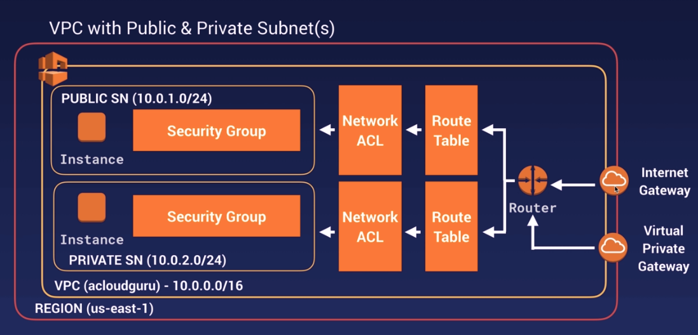
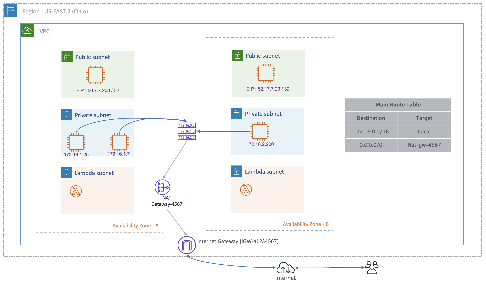
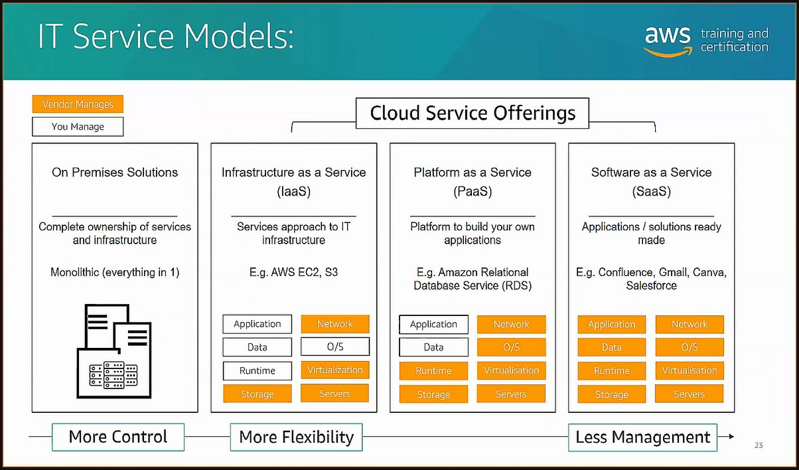

# Anagrams, Short Descriptions, Use Case for AWS Services

## A

| Anagram | Name | Short Description | Benefits | Use Cases | Pricing | Link |
| --- | --- | --- | --- | --- | --- | --- |
| AMIs | Amazon Machine Images | Provides the information required to launch an instance.   AMI must include:<ul><li>1 or more EBS snapshots or template for root volume of instance-store-backed AMIs</li><li>Launch permissions</li><li>A block device mapping</li></ul> | <ul><li>Can copy an AMI within the same Region or to different Regions</li><li>Can search for AMIs provided by AWS or by the community or create your own</li><li>You can deregister an AMI when it is no longer required</li><li>Can buy, share, and sell AMIs</li></ul> | Must use to create an instance | Varies based on AMI type/availability | https://docs.aws.amazon.com/AWSEC2/latest/UserGuide/AMIs.html |
|  |  |  |  |  |  |  |
|  | API Gateway | Create, maintain, and secure APIs at any scale. Can create RESTful APIs and WebSocket APIs that enable real-time two-way communication applications. Handles all tasks involved in accepting and processing up to hundreds of thousands of concurrent API calls. | <ul><li>Fully managed</li><li>Supports containerized/serverless workloads and web applications</li><li>Efficient API development</li><li>Performance at any scale</li><li>Cost savings at scale</li><li>Easy monitoring</li><li>Flexible security controls</li><li>RESTful API options</li></ul> | <ul><li>Serve dynamic content using a serverless solution</li><li>Traffic management</li><li>CORS support</li><li>Authorization and access control</li><li>Throttling</li><li>Monitoring</li><li>API version management</li></ul> | <ul><li>No minimum fees or startup costs</li><li>Pay for API calls received and the amount of data transferred out</li><li>Tiered pricing model can reduce cost as usage scales</li></ul> | https://aws.amazon.com/api-gateway/ |
|  |  |  |  |  |  |  |
|  | Aurora | MySQL/PostgresSQL-compatible [relational database](https://aws.amazon.com/relational-database/) built on the Cloud; Combines performance, security, reliability, and availability of traditional databases with simplicity and 1/10th the cost; 5x faster than MySQL; 3x faster than PostgresSQL | <ul><li>High performance/scalability</li><li>High Availability/durability offering 99.99% availability</li><li>Instance failover typically takes less than 30 seconds</li><li>Highly secure</li><li>MySQL/PostgresSQL compatible</li><li>Fully managed</li><li>Migration support</li><li>Distributed, fault-tolerant, self-healing storage system</li><li>Auto-scales up to 128 TB per database instance</li><li>Up to 15 low-latency read replicas</li><li>Point-in-time recovery</li><li>Continuous backup to S3</li><li>Replicate 6 copies (1 read/1 write per AZ) of your data across 3 AZs</li></ul> | <ul><li>Enterprise applications</li><li>Being a fully managed service, saves enterprises time with automation</li><li>Software as a Service (SaaS) Applications</li><li>Web and Mobile Gaming</li></ul> | 1/10th the cost of commercial-grade databases | https://aws.amazon.com/rds/aurora/ |
|  |  |  |  |  |  |  |
|  | Auto Scaling | Monitors your applications and automatically adjusts capacity to maintain steady, predictable performance at the lowest possible cost. Build scaling plans for EC2 instances, Spot Fleets, EC2 tasks, DynamoDB tables and indexes, and Aurora Replicas | <ul><li>Easy to setup within minutes</li><li>Makes scaling simple with recommendations to optimize performance, costs, or balance</li><li>Automatically maintain performance</li><li>Scales *in* and *out* (subtract or add instances) only</li></ul> | Automate scaling of your applications and resources. | <ul><li>No additional charge</li><li>Only pay for resources needed and CloudWatch monitoring fees</li></ul> | https://aws.amazon.com/autoscaling/ |
|  |  |  |  |  |  |  |
| AZ | Availability Zone | One or more isolated locations within a Region. Like a cluster of data centers | <ul><li>Can distribute your instance across multiple AZs to prevent application downtime</li><li>Can use [Elastic IP addresses](https://docs.aws.amazon.com/AWSEC2/latest/UserGuide/elastic-ip-addresses-eip.html) to mask a failure of an instance in an AZ</li><li>When setting up an instance in a Region, if no AZ is specified, AWS choose on closest to your customers</li></ul> |  | Varies based on the tier | https://docs.aws.amazon.com/AWSEC2/latest/UserGuide/using-regions-availability-zones.html#concepts-availability-zones |
|  |  |  |  |  |  |  |
| ACM | AWS Certificate Management | Easily provision, manage, and deploy public and private Secure Sockets Layer/Transport Layer Security (SSL/TLS) certificates for use with AWS services and your internal connected resources. | <ul><li>Free public certificates for ACM-integrated services</li><li>Managed certificate renewal</li><li>Get certificates easily</li><li>Security</li><li>Identity</li><li>Compliance</li></ul> | <ul><li>Protect and secure your website</li><li>Protect and secure your internal resources</li><li>Help meet compliance requirements</li><li>Improve uptime</li></ul> | No additional charge for public or private SSL/TLS certificates you use with [ACM-integrated services](https://docs.aws.amazon.com/acm/latest/userguide/acm-services.html). Only pay for the AWS resources you create to run your application. | https://aws.amazon.com/certificate-manager/ |
|  |  |  |  |  |  |  |

## B

| Anagram | Name | Short Description | Benefits | Use Cases | Pricing | Link |
| --- | --- | --- | --- | --- | --- | --- |
| - | Batch |  |  | Compute and Serverless |  |  |
|  |  |  |  |  |  |  |
| - | Backup |  |  | Storage |  |  |
|  |  |  |  |  |  |  |
| - | Budgets |  |  | Management; Monitoring; Governance; |  |  |
|  |  |  |  |  |  |  |

## C

| Anagram | Name | Short Description | Benefits | Use Cases | Pricing | Link |
| --- | --- | --- | --- | --- | --- | --- |
| - | CloudFormation |  |  | Management; Monitoring; Governance; |  |  |
|  |  |  |  |  |  |  |
| - | CloudFront | Service that speeds up distribution of your static and dynamic web content to your users on a global level | Uses `Edge Locations` to reduce latency;  | Networking; Content Delivery; |  | https://docs.aws.amazon.com/AmazonCloudFront/latest/DeveloperGuide/Introduction.html |
|  |  |  |  |  |  |  |
| Cloud HSM | Cloud Hardware Security Module | Storage server for encryption keys that only has access by the Customer. AWS does NOT have any access to this server. | Server belongs to ONLY 1 Customer at a time; Tamper Proof - will start deleting keys if hacked; Third Party Security Validation; | Security; Identity; Compliance; Banks; Governmental Agencies; Companies with extreme compliance regulations for key storage; | Very Pricey because we are paying for use of entire server. |  |
|  |  |  |  |  |  |  |
|  | CloudTrail | Monitors all activity performed by all users via AWS console, CLI, and SDKs.  |  | Management; Monitoring; Governance; |  |  |
|  |  |  |  |  |  |  |
| - | CloudWatch | Monitors your current services and will collect logs (access) /metrics (CPU usage, memory) in real-time on your AWS services and On-Premises infrastructure. | Keeps logs in CloudWatch for 15 months; Can transfer logs to S3 you specify; Can send notifications via AWS SNS based on a rule (alerts); Can automate actions to take when rule(alert) happens using AWS Lambda and Amazon EventBridge; Monitors both AWS services and on-premises infrastructure | Management; Monitoring; Governance; |  |  |
|  |  |  |  |  |  |  |
|  | CodeBuild |  |  | Developer Tools; |  |  |
|  |  |  |  |  |  |  |
|  | CodeCommit |  |  | Developer Tools; |  |  |
|  |  |  |  |  |  |  |
|  | CodeDeploy |  |  | Developer Tools; |  |  |
|  |  |  |  |  |  |  |
|  | CodePipeline | Fully managed continuous delivery service. Helps automate release pipelines for fast, reliable updates. Automates the build, test, and deploy phases everytime there is a code change. | Quickly iterate on feedback and get new features to your users faster; Integrate with source code on GitHub; Connects to existing tools and systems |  |  | https://aws.amazon.com/codepipeline/ |
|  |  |  |  |  |  |  |
| - | CodeStar |  |  | Developer Tools; |  |  |
|  |  |  |  |  |  |  |
| - | Cognito |  |  | Security; Identity; Compliance; |  |  |
|  |  |  |  |  |  |  |
| - | Config |  |  | Management; Monitoring; Governance; |  |  |
|  |  |  |  |  |  |  |
| - | Connect |  |  | Customer Engagement; |  |  |
|  |  |  |  |  |  |  |
| CLI | Command Line Interface |  |  |  |  |  |
|  |  |  |  |  |  |  |
| - | Cost and Usage Report | Only reports usage |  | Management; Monitoring; Governance; |  |  |
|  |  |  |  |  |  |  |
| - | Cost Explorer | Reports usage and provides other tools for forecasting future usage based on previous usage |  |  |  |  |
|  |  |  |  |  |  |  |

## D

| Anagram | Name | Short Description | Benefits | Use Cases | Pricing | Link |
| --- | --- | --- | --- | --- | --- | --- |
| - | Detective |  | Security; Identity; Compliance; |  |
|  |  |  |  |  |  |  |
| - | Direct Connect |  | Networking; Content Delivery; |  |
|  |  |  |  |  |  |  |
| - | DynamoDB | Managed schemaless NoSQL database | Key value store; Faster query time; Low-Latency; Serverless; Consistent Performance at any scale; Less than 10 milliseconds latency per query; | Databases; Does not need complex queries or joins; Gaming application; Mobile application; Global audience;  |  |  |
|  |  |  |  |  |  |  |

## E

**AWS Elsticity:**
    Scaling up and down with the demand of your needs

| Anagram | Name | Short Description | Benefits | Use Cases | Pricing | Link |
| --- | --- | --- | --- | --- | --- | --- |
| - | Elastic Beanstalk |  |  | Compute and Serverless |  |  |
|  |  |  |  |  |  |  |
| EBS | Elastic Block Storage | Block storage service that needs to be connected to one EC2 instance at a time in the same AZ. EBS is scalable but you have to manually scale it. | Files are separated into equal-sized pieces (blocks) of data; Can take a "SnapShot" (backup) of the data and store in an S3; Can recreate an EBS from a prior EBS SnapShot; Incremental (chained - only backs up changed data) faster backups (SnapShots); Restore from a specific backup (Snapshot) | Storage; Used for applications that run on Amazon EC2 instances; Best for databases | Pay for the amount of storage space you ask for, whether using all or not |  |
|  |  |  |  |  |  |  |
| - | ElastiCache |  |  | Database; |  |  |
|  |  |  |  |  |  |  |
| EC2 | Elastic Cloud Computing | Virtual Server running on AWS Cloud |  | Host an application, connect to a database, anything you need a server for. |  | https://aws.amazon.com/ec2/ |
|  |  |  |  |  |  |  |
| ECS | Elastic Container Service | Fully managed container orchestration service. Makes it easier for you to deploy, manage, and scale containerized applications. |  | Containers; Deploy in a hybrid environment; Support batch processing; Scale web applications. |  | https://aws.amazon.com/ecs/ |
|  |  |  |  |  |  |  |
| EFS | Elastic File Storage | Can connect to multiple EC2 instances in the same Region. Like the file system on your computer with folders and files. | Scalable; Connects to multiple EC2 instances; Fast performance; | Storage | Pay only for the storage you use |  |
|  |  |  |  |  |  |  |
| EKS | Elastic Kubernetes Service |  |  | Containers; |  |  |
|  |  |  |  |  |  |  |
|  | EventBridge (CloudWatch Events) | Build event-driven applications at scale across AWS, existing systems or SaaS applications. |  | Management; Monitoring; Governance; |  |  |
|  |  |  |  |  |  |  |
| ELB | Elastic Load Balancer |  |  |  |  |  |
|  |  |  |  |  |  |  |

### EC2 Instance Types
| Type | Short Description | Benefits | Use Case | Link |
| --- | --- | --- | --- | --- |
| On-Demand |  |  |  |  |
|  |  |  |  |  |
| Spot Instance |  |  |  |  |
|  |  |  |  |  |
| Reserved |  |  |  |  |
|  |  |  |  |  |
| Savings Plan |  |  |  |  |
|  |  |  |  |  |
| Dedicated Host |  |  | Comply with per-core software license requirements; |  |
|  |  |  |  |  |

## F

| Anagram | Name | Short Description | Benefits | Use Cases | Pricing | Link |
| --- | --- | --- | --- | --- | --- | --- |
| - | Fargate |  |  | Containers; |  |  |
|  |  |  |  |  |  |  |

## G

| Anagram | Name | Short Description | Benefits | Use Cases | Pricing | Link |
| --- | --- | --- | --- | --- | --- | --- |
| - | Global Accelerator | Networking service that improves performance of your user's  |  |  |  |  |
|  |  |  |  |  |  |  |
| - | GuardDuty |  |  | Security; Identity; Compliance; |  |  |
|  |  |  |  |  |  |  |

### AWS Global Infrastructure

| Part | Description | Security | Level | Link |
| --- | --- | --- | --- | --- |
| Regions | <ul><li>Collection of AWS resources in a geographic area</li><li>Made up of 2 or more AZs</li><li>Each Region is isolated and independent of other Regions</li></ul> |  | Top Level | https://docs.aws.amazon.com/general/latest/gr/rande-manage.html |
|  |  |  |  |  |
| VPC (Virtual Private Cloud) | Automatically created for you when you sign up for an AWS account | NACL / Internet Gateway | Inside your Current Region - Your personal virtual machine (VM) in the cloud |  |
|  |  |  |  |  |
| Local Zone | An extension of an AWS Region in geographic proximity to your users. Have their own connections to the internet and supports AWS Direct Connect. Smaller version of a Region and only has one AZ. |  | Inside your VPC | https://aws.amazon.com/about-aws/global-infrastructure/localzones/ |
|  |  |  |  |  | 
| AZ | One or more isolated locations within a Region. | Security Groups | Inside a Region | https://docs.aws.amazon.com/AWSEC2/latest/UserGuide/using-regions-availability-zones.html#concepts-availability-zones |
|  |  |  |  |  |
| Subnet |  | NaCL | Inside AZs |  |
|  |  |  |  |  |

## H

| Anagram | Name | Short Description | Benefits | Use Cases | Pricing | Link |
| --- | --- | --- | --- | --- | --- | --- |
|  |  |  |  |  |  |  |

## I

| Anagram | Name | Short Description | Benefits | Use Cases | Pricing | Link |
| --- | --- | --- | --- | --- | --- | --- |
| IAM | Identity and Access Management |  |  | Security; Identity; Compliance; |  |  |
|  |  |  |  |  |  |  |
| IaaS | Infrastructure as a Service | Services approach to IT infrastructure. AWS gives you the server and you can build whatever you want/need on that server. | <ul><li>Can design the infrastructure for your specific needs</li><li>Similar to having your own server on-premises without the extra cost</li><li>You control all aspects of the server, minus the physical aspects</li></ul> | <ul><li>Companies that want full control without the hassle of maintaining an on-premises data center.</li><li>Example Services: AWS EC2 and S3</li></ul> |  |  |
|  |  |  |  |  |  |  |
| IaC | Infrastructure as Code |  |  |  |  |  |
|  |  |  |  |  |  |  |
| - | Inspector | Checks for security patches and reports if a new patch is available. |  | Security; Identity; Compliance; |  |  |
|  |  |  |  |  |  |  |
|  | Instance Store | Block storage attached to the EC2 instance; part of the server; when EC2 instance is stopped all data is deleted from the instance store | Super fast because it is right on the server; Quickest access rate; Data is deleted when EC2 is stopped | Temporary complex calculations; Data needs to be accessed quickly but does not need to be kept or is stored elsewhere before stopping the EC2 instance |  |  |
|  |  |  |  |  |  |  |

## J

| Anagram | Name | Short Description | Benefits | Use Cases | Pricing | Link |
| --- | --- | --- | --- | --- | --- | --- |
|  |  |  |  |  |  |  |

## K

| Anagram | Name | Short Description | Benefits | Use Cases | Pricing | Link |
| --- | --- | --- | --- | --- | --- | --- |
| - | Kinesis |  |  | Analytics |  |  |
|  |  |  |  |  |  |  |
| KMS | Key Management System | Shared storage server to store encryption keys. Both Customer and AWS have access to this server. There can be multiple customers storing their keys on the same server in separate sections. | Secure server to store main encryption key; Shared by several users, so less expensive than Cloud HSM; | Most companies; Security; Encryption Storage |  |  |
|  |  |  |  |  |  |  |

## L

| Anagram | Name | Short Description | Benefits | Use Cases | Pricing | Link |
| --- | --- | --- | --- | --- | --- | --- |
| - | Lambda |  | Compute and Serverless |  |  |  |
|  |  |  |  |  |  |  |
| - | Lightsail |  | Compute and Serverless |  |  |  |
|  |  |  |  |  |  |  |
| - | License Manager |  |  | Management; Monitoring; Governance; Security; Identity; Compliance; |  |  |
|  |  |  |  |  |  |  |
|  | Local Zones | Run latency sensitive applications closer to end users. Currently only available in the US regions. Inside a Region but basically just a smaller AZ. | <ul><li>Build and deploy applications close to end users</li><li>Run low-latency applications at the edge</li><li>Simplify hybrid cloud migrations</li><li>Meet stringent data residency requirements</li></ul> | <ul><li>Real-time gaming</li><li>Live streaming</li><li>Augmented / Virtual Reality (AR / VR)</li><li>Virtual workstations</li><li>Applications requiring low-latency close to large populations, industry, and IT centers</li></ul> | <ul><li>Pay-as-you-go pricing</li><li>No additional fees</li><li>You only pay for the services you consume in Local Zones</li></ul> | <ul><li>https://aws.amazon.com/about-aws/global-infrastructure/localzones/ </li><li>https://aws.amazon.com/about-aws/global-infrastructure/localzones/features/?pg=localzones&sec=hs </li></ul> |
|  |  |  |  |  |  |  |

## M

| Anagram | Name | Short Description | Benefits | Use Cases | Pricing | Link |
| --- | --- | --- | --- | --- | --- | --- |
| - | Macie |  |  | Security; Identity; Compliance; |  |  |
|  |  |  |  |  |  |  |
| - | Managed Services |  |  | Management; Monitoring; Governance; |  |  |
|  |  |  |  |  |  |  |
| - | Management Console |  |  |  |  |  |
|  |  |  |  |  |  |  |
| - | Marketplace |  |  |  |  |  |
|  |  |  |  |  |  |  |

## N

| Anagram | Name | Short Description | Benefits | Use Cases | Pricing | Link |
| --- | --- | --- | --- | --- | --- | --- |
| NACL | Network Access Control List | Security (firewall) for the VPC subnets. Any access to resources inside the subnet is controlled by the subnet's NACL. Subnet can have only one NACL. | <ul><li>First layer of defense</li><li>Stateless (Brainless/Forgetful)</li><li>Checks both inbound and outbound traffic against predefined rules</li><li>Have rules for both incoming and outgoing traffic</li><li>Supports allow and deny rules</li><li>All rules are numbered and applied in order from lowest to highest number</li></ul> |  |  | <ul><li>https://medium.com/awesome-cloud/aws-difference-between-security-groups-and-network-acls-adc632ea29ae</li><li></li></ul> |

## O

| Anagram | Name | Short Description | Benefits | Use Cases | Pricing | Link |
| --- | --- | --- | --- | --- | --- | --- |
| - | Organizations |  |  | Management; Monitoring; Governance; |  |  |
|  |  |  |  |  |  |  |
|  | Outposts | Fully managed and configurable compute and storage racks built with AWS-designed hardware that allow customers to run compute and storage on-premisses, while seamlessly connecting to AWS's broad array of services in the cloud. |  |  |  | https://aws.amazon.com/outposts/ |
|  |  |  |  |  |  |  |

## P

| Anagram | Name | Short Description | Benefits | Use Cases | Pricing | Link |
| --- | --- | --- | --- | --- | --- | --- |
| - | Personal Health Dashboard |  |  |  |  |  |
|  |  |  |  |  |  |  |
| PaaS | Platform as a Service | Platform to build your own applications on. | <ul><li>No need to setup underlying infrastructure on the server</li><li>AWS builds out/maintains the server with needed security, patches, updates, etc.</li><li>You only need to maintain your application and the data related to that application</li></ul> | <ul><li>Companies looking for a serverless solution</li><li>Example Service: Amazon Relational Database Service (RDS)</li><li>Build an application without setting up the underlying infrastructure</li><li>Storing data</li></ul> |  |  |
|  |  |  |  |  |  |  |
| - | Professional Services |  |  |  |  |  |
|  |  |  |  |  |  |  |

## Q

| Anagram | Name | Short Description | Benefits | Use Cases | Pricing | Link |
| --- | --- | --- | --- | --- | --- | --- |
| - | QuickSight |  |  | Analytics |  |  |
|  |  |  |  |  |  |  |

## R

| Anagram | Name | Short Description | Benefits | Use Cases | Pricing | Link |
| --- | --- | --- | --- | --- | --- | --- |
| - | Redshift |  |  | Database; |  |  |
|  |  |  |  |  |  |  |
| RDS | Relational Database Service | Service for managing relational databases | Managed by AWS, you only have to control the data; Serverless; | Database; Using Microsoft SQL, Oracle, MySQL, PostgresSQL, MariaDB, and AWS Aurora; Need organized consistent data schema; Need unique answers; Banks; |  |
|  |  |  |  |  |  |  |
| - | Route 53 |  |  | Networking; Content Delivery; |  |  |
|  |  |  |  |  |  |  |

## S

| Anagram | Name | Short Description | Benefits | Use Cases | Pricing | Link |
| --- | --- | --- | --- | --- | --- | --- |
| - | Secrets Manager |  |  | Management; Monitoring; Governance; |  |  |
|  |  |  |  |  |  |  |
| - | Security Groups | Security (firewall) for instances that need to assigned explicitly to the instance. | <ul><li>Stateful (Remembers)</li><li>Only need to set up incoming allow rules</li><li>By default all ***incoming*** traffic is denied.</li><li>Instance can have multiple Security Groups</li><li>All rules are applied</li></ul> | Tied to Instances only; Used to control who can access your instance. |  | <ul><li>https://medium.com/awesome-cloud/aws-difference-between-security-groups-and-network-acls-adc632ea29ae</li><li></li></ul> |
|  |  |  |  |  |  |  |
| - | Service Catalog |  |  |  |  |  |
|  |  |  |  |  |  |  |
| - | Service Health Dashboard |  |  |  |  |  |
|  |  |  |  |  |  |  |
| - | Service Quotas |  |  |  |  |  |
|  |  |  |  |  |  |  |
| - | Shared Responsibility Model |  |  |  |  |  |
|  |  |  |  |  |  |  |
| - | Shield |  |  | Security; Identity; Compliance; |  |  |
|  |  |  |  |  |  |  |
| SNS | Simple Notification Service |  |  | Application Integration |  |  |
|  |  |  |  |  |  |  |
| SQS | Simple Queue Service |  |  | Application Integration |  |  |
|  |  |  |  |  |  |  |
| S3 | Simple Storage Service | Object storage service which is serverless. A bucket is equivalent to a file folder/directory and an object is equivalent to a file. Regional storage service. | Can be accessed via a URL; AWS makes copies across 3 AZs of the data; Highly durable; Highly available; Serverless; Set permissions to control access to objects; Choose from a range of storage classes for different use cases | Storage; Images for a static webpage; Log files; Files that will not change often or at all | Pay only for the storage you use based on the storage class |  |
|  |  |  |  |  |  |  |
| S3 Glacier | Simple Storage Service Glacier |  |  | Storage |  |  |
|  |  |  |  |  |  |  |
|  | S3 Glacier Vault Lock Policy | User can define a policy that locks the data in the S3 from being deleted for selected time frame |  |  |  |  |
|  |  |  |  |  |  |  |
|  | S3 Lifecycle Policy | User can set up a policy that controls how much time from last access until a file is moved or deleted |  |  |  |  |
|  |  |  |  |  |  |  |
| - | Snowball Edge |  |  | Storage |  |  |
|  |  |  |  |  |  |  |
| SaaS | Software as a Service | Fully featured application that only requires the user data and access, possibly with branding also allowed | <ul><li>Application is already create for you</li><li>No need to hire specialist to build the technology for you</li><li>Ready to go solution</li><li>AWS maintains everything for you, you just maintain/control your data</li></ul> | <ul><li>Companies that do not have the budget to hire engineers to build/maintain applications</li><li>Examples:<ul><li>Gmail</li><li>Outlook</li><li>Canva</li><li>Salesforce</li></ul></ul> |  |  |
|  |  |  |  |  |  |  |
| SDKs | Software Development Kits |  |  |  |  |  |
|  |  |  |  |  |  |  |
| - | Storage Gateway |  |  | Storage |  |  |
|  |  |  |  |  |  |  |
| - | Support Center |  |  |  |  |  |
|  |  |  |  |  |  |  |
| - | Systems Manager |  |  | Management; Monitoring; Governance; |  |  |
|  |  |  |  |  |  |  |
| - | Systems Manager Parameter Store |  |  | Management; Monitoring; Governance; |  |  |
|  |  |  |  |  |  |  |

### S3 Storage Classes
| Class | Pricing | Use Cases | 
| --- | --- | --- |
| Standard | Most expensive of all classes | Data accessed very frequently | 
|  |  |  | 
| Intelligent Tiering |  | Data with changing or unknown access patterns | 
|  |  |  | 
| Standard Infrequent Access (IA) | 2nd  | Long-lived infrequently accessed data with a few minutes | 
|  |  |  | 
| One Zone-IA |  | Long-lived, infrequently accessed, non-critical data that is okay if it is not accessible at all times; Only saves data in one AZ | 
|  |  |  | 
| Glacier |  | Archived data that can be retrieved within a few minutes to hours; | 
|  |  |  | 
| Glacier Deep Archive | $1 / month / Terabyte | Archived data that can wait up to 12 hours to retrieve | 
|  |  |  | 
| Reduced redundancy |  | Frequently accessed, non-critical data | 
|  |  |  | 

### Support Plan Tiers
| Tier | Price / Month | Shortest Response | Features | Use Case | Link |
| --- | --- | --- | --- | --- | --- |
| Basic | Free | 24 hours |  |  |  |
|  |  |  |  |  |  | 
| Developer | $29 or 3% | 12 hours |  |  |  |
|  |  |  |  |  |  | 
| Business | $100 or 3%-10% | 1 hour |  |  |  |
|  |  |  |  |  |  | 
| Enterprise | $15,000 or 3%-10% | 15 mins |  |  |  |
|  |  |  |  |  |  |

### Subnets
| Type | Description | Benefits | Use Cases |
| --- | --- | --- | --- |
| Public |  | <ul><li></li></ul> | <ul><li></li></ul> |
|  |  |  |  | 
| Private |  | <ul><li></li></ul> | <ul><li></li></ul> | 
|  |  |  |  |

## T

| Anagram | Name | Short Description | Benefits | Use Cases | Pricing | Link |
| --- | --- | --- | --- | --- | --- | --- |
| - | Trusted Advisor | Monitors all your services against the best practice in the 5 well-architected pillars. |  | Management; Monitoring; Governance; |  |  |
|  |  |  |  |  |  |  |

### The Five Areas of the Trusted Advisor
| Name | Description |
| --- | --- |
| Cost Optimization | Lets you know if you have services that are underutilized, so that you may save money by shutting down services you are not using. |
|  |  |
| Performance | Monitors the performance of all your services and lets you know if they are not performing optimally. |
|  |  |
| Security | Informs you of any security issues within your AWS account or services |
|  |  |
| Fault Tolerance | Informs you of any services that are not fault tolerant, such as outdated EBS SnapShots, single EC2, deployment in a single AZ, etc. Another words, "design for failure and nothing will ever fail" |
|  |  |
| Service Limits | Lets you know if you are within your service limits or if you may need to create a service ticket to increase your service limit on any services you currently are using |
|  |  |

## U

| Anagram | Name | Short Description | Benefits | Use Cases | Pricing | Link |
| --- | --- | --- | --- | --- | --- | --- |
|  |  |  |  |  |  |  |

## V

| Anagram | Name | Short Description | Benefits | Use Cases | Pricing | Link |
| --- | --- | --- | --- | --- | --- | --- |
| VPC | Virtual Private Cloud |  |  | Networking; Content Delivery; |  |  |
|  |  |  |  |  |  |  |
|  | VPC Flow Logs | Logs traffic going in and out of your VPC. Will contain source address (where connection came from), destination address (where connection is going to) | Helps to keep track of traffic in/out of VPC to ensure security of your VPC | Monitoring traffic going in/out of your VPC |  |  |
|  |  |  |  |  |  |  |
| VPN | Virtual Private Network |  |  |  |  |  |
|  |  |  |  |  |  |  |

## W

| Anagram | Name | Short Description | Benefits | Use Cases | Pricing | Link |
| --- | --- | --- | --- | --- | --- | --- |
| WAF | Web Application Firewall |  |  | Security; Identity; Compliance; |  |  |
|  |  |  |  |  |  |  | 
| - | WorkSpaces |  |  | Compute and Serverless |  |  |
|  |  |  |  |  |  |  |
|  | Wavelength | Designed to deliver ultra-low latency applications to 5G devices by extending AWS infrastructure, services, APIs, and tools to 5G networks |  |  |  | https://aws.amazon.com/wavelength/ |
|  |  |  |  |  |  |  |
|  | Well-Architected Framework | Learn, measure, and build using architectural best practices. Helps cloud architects build secure, high-performing, resilient, and efficient infrastructure for their applications and workloads. Based on five pillars. | <ul><li>Ensures daily operations run smoothly</li><li>Makes sure that your information and systems are secure</li><li>Verifies that your workload performs as intended</li><li>Monitors performance</li><li>Helps with optimizing costs</li></ul> | Answer a set of foundational questions to help learn how well your architecture aligns with cloud best practices. | Free if using the AWS Well-Architected Tool in the AWS Management Console | https://aws.amazon.com/architecture/well-architected/?wa-lens-whitepapers.sort-by=item.additionalFields.sortDate&wa-lens-whitepapers.sort-order=desc |
|  |  |  |  |  |  |  |

### Five Well-Architected Pillars
| Pillar | Description | Target | Link |
| --- | --- | --- | --- |
| Operational Excellence | Automation. Focuses on running and monitoring systems to deliver business value, and continually improving processes and procedures. | <ul><li>Automating changes</li><li>Responding to events</li><li>Defining Standards to manage daily operations</li></ul | https://docs.aws.amazon.com/wellarchitected/latest/operational-excellence-pillar/wellarchitected-operational-excellence-pillar.pdf |
|  |  |  |  |
| Security | Describes how to take advantage of cloud technologies to protect data, systems, and assets in a way that can improve your security posture. | <ul><li>Security</li><li>Foundations</li><li>Identity and Access Management (IAM)</li><li>Detection</li><li>Infrastructure Protection</li><li>Data Protection</li><li>Incident Response</li><li>Shared Responsibility</li></ul> | https://docs.aws.amazon.com/wellarchitected/latest/security-pillar/wellarchitected-security-pillar.pdf#welcome |
|  |  |  |  |
| Reliability | Multi-AZs (disaster recovery). The ability of a workload to perform its intended function correctly and consistently when it's expected to; Includes the ability to operate and test the workload through its total lifecycle | <ul><li>Foundations</li><li>Workload Architecture</li><li>Change Management</li><li>Failure Management</li><li>Multiple AZs - Disaster Recovery</li></ul> | https://docs.aws.amazon.com/wellarchitected/latest/reliability-pillar/wellarchitected-reliability-pillar.pdf#welcome |
|  |  |  |  |
| Performance Efficiency | Setting up continuous Monitoring. Focuses on the efficient use of computing resources to meet the requirements, and how to maintain efficiency as demand changes and technologies evolve. Take a data-driven approach to building a high-performance architecture. | <ul><li>Selection</li><li>Review</li><li>Monitoring</li><li>Trade-offs</li></ul> | https://docs.aws.amazon.com/wellarchitected/latest/performance-efficiency-pillar/wellarchitected-performance-efficiency-pillar.pdf#welcome |
|  |  |  |  |
| Cost Optimization | A continual process of refinement and improvement over the span of a workload's lifecycle. Helps you build and operate cost-aware workloads that achieve business outcomes while minimizing costs and allowing your organization to maximize its return on investment. | <ul><li>Practice Cloud Financial Management</li><li>Expenditure and Usage Awareness</li><li>Cost-effective Resources</li><li>Manage Demand and Supplying Resources</li><li>Optimized Over Time</li><li>Minimizing cost</li></ul> | https://docs.aws.amazon.com/wellarchitected/latest/cost-optimization-pillar/wellarchitected-cost-optimization-pillar.pdf#welcome |
|  |  |  |  | 

### Five Principles of the Operational Excellence Pillar
| Principal | Description |
| --- | --- |
| Perform operations as Code | You can define your entire workload (applications, infrastructure, etc.) as code and update it with code. You can script your operations procedures and automate their execution by triggering them in response to events |
|  |  |
| Make frequent, small, reversible changes | Design workloads to allow components to be updated regularly to increase the flow of beneficial changes into your workload. Make changes in small increments that can be reversed if they fail to aid in the identification and resolution of issues introduced to your environment (without affecting customers when possible). |
|  |  |
| Refine operations procedures frequently | As you evolve your workload, evolve your procedures appropriately. Set up regular game days to review and validate that all procedures are effective and that teams are familiar with them. |
|  |  |
| Anticipate failure | Test your failure scenarios and validate your understanding of their impact. Test your response procedures to ensure they are effective and that teams are familiar with their execution. |
|  |  |
| Learn from all operational failures | Drive improvement through lessons learned from all operational events and failures. Share what is learned across teams and through the entire organization. |
|  |  |

### Seven Principles of the Security Pillar
| Area of Cloud | Principal | Description |
| --- | --- | --- |
| Identity and Access Management | Implement a strong identity foundation | Utilize "Principle of Least Privilege"; Enforce separate of duties with appropriate authorization; Centralize identity management; Aim to eliminate reliance on long-term static credentials; IAM users |
|  |  |  |
| Detection | Enable traceability | Monitor, alert, and audit actions and changes to your environment in real time; Actively manage all user access; Integrated log and metric collection with systems to automatically investigates and take action; Detective Controls |
|  |  |  |
| Foundations / Infrastructure Protection | Apply security at all layers | Apply a defense in depth approach with multiple security controls; Some layers include: Organizational, subnet, load balancer, edge of network, VPC, virtual machine, the OS, every instance and compute service, application, and code; Should be automated when scaling; Infrastructure Protection |
|  |  |  |
| Foundations / Infrastructure Protection | Automate security best practices | Automated software-based security mechanisms improve your ability to securely scale more rapidly and cost-effectively; Create secure architectures; Implement controls that are defined and managed as code in version-controlled templates |
|  |  |  |
| Data Protection | Protect data in transit and at rest | Classify your data into sensitivity levels; Use mechanisms such as encryption, tokenization, and access control where appropriate; Adjust mechanisms depending on the sensitivity of the data |
|  |  |  |
| Data Protection | Keep people away from data | Eliminate the need for direct access or manual processing of data; This reduces the risk of mishandling or modification and human error when handling sensitive data |
|  |  |  |
| Incident Response | Prepare for security events | Prepare for an incident by having incident management and investigation policy and processes; When an incident occurs, you should be ready to intervene, investigate, and deal with all incidents; Once resolved, update the incident management process; Continue to learn from past mistakes and events; Run incident response simulations; Use tools with automation to increase your speed for detection, investigation, and recovery |
|  |  |  |

### Five Principles of the Reliability Pillar
| Principal | Description |
| --- | --- |
| Automatically recover from failure | Monitor a workload for Key Performance Indicators (KPIs) so you can trigger automation when a threshold is breached; KPIs should be a measure of business value; This allows for automatic notification and tracking of failures and automatic recovery processes; With sophisticated automation, it's possibler to anticipate and remediate failures before they occur |
|  |  |
| Test recovery procedures | In the cloud, you can test how your workload fails, and validate your recovery procedures; This approach exposes failure pathways that you can test and fix *before* a real failure scenario occurs |
|  |  |
| Scale horizontally to increase aggregate workload availability | Replace *one large* resource with *multiple small* resources to reduce the impact of a single failure on the overall workload; Distribute requests across multiple, smaller resources to ensure that they don't share a common point of failure |
|  |  |
| Stop guessing capacity | In the cloud, you can monitor demand and workload utilization, and automate the addition and removal of resources to maintain the optimal level to satisfy demand without over or under provisioning; There are still limits, but some quotas can be controlled and other can be managed (see [Manage Service Quotas and Constraints (p. 8)](https://docs.aws.amazon.com/wellarchitected/latest/reliability-pillar/wellarchitected-reliability-pillar.pdf#welcome)) |
|  |  |
| Manage change in automation | Changes to your infrastructure should be made using automation; The changes that need to be managed include changes to the automation, which then can be tracked and reviewed |
|  |  |

### Five Principles of the Performance Efficiency Pillar
| Principal | Description |
| --- | --- |
| Democratize advanced technologies | Make advanced technology implementation easier for your team by delegating complex tasks to your cloud vendor. Consider consuming a new technology as a service. In the cloud, technologies that require specialized expertise become  services that your team can consume, allowing your team to focus on product development. |
|  |  |
| Go global in minutes | Deploying your workload in multiple AWS Regions around the world allows you to provide lower latency and a better experience for your customers at minimal cost. |
|  |  |
| Use serverless architectures | Serverless architectures remove the need for you to run and maintain physical severs. Removing the need for running physical servers can lower transactional cost. |
|  |  |
| Experiment more often | With virtual and automatable resources, you can quickly carry out comparative testing using different types of instances, storage, or configurations. |
|  |  |
| Consider mechanical sympathy | Use the technology approach that aligns best with your goals. |
|  |  |

### Five Principles of the Cost Optimization Pillar
| Principal | Description |
| --- | --- |
| Implement cloud financial management | To achieve financial success and accelerate business value realization in the cloud, you must invest in Cloud Financial Management. Your organization must dedicate the necessary time and resources for capability. Build capability through knowledge building, programs, resources, and processes to help you become a cost efficient organization. |
|  |  |
| Adopt a consumption model | Pay only for the computing resources you consume, and increase or decrease usage depending on business requirements. |
|  |  |
| Measure overall efficiency | Measure the business output of the workload and the costs associated with delivery. Use this data to understand the gains you make from increasing output, increasing functionality, and reducing cost. |
|  |  |
| Stop spending money on undifferentiated heavy lifting | AWS does the heavy lifting of data center operations. It also removes the operational burden of managing operating systems and applications with managed services. Allowing you to focus on your customers and projects. |
|  |  |
| Analyze and attribute expenditure | The cloud makes it easier to identify the cost and usage of workloads, which then allows transparent attribution of IT costs to revenue streams and individual workload owners. This helps to measure Return on Investment (ROI) and gives workload owners an opportunity to optimize their resources and reduce costs. |
|  |  |

## X

| Anagram | Name | Short Description | Benefits | Use Cases | Pricing | Link |
| --- | --- | --- | --- | --- | --- | --- |
| - | X-Ray |  |  |  |  |  |
|  |  |  |  |  |  |  |

## Y

| Anagram | Name | Short Description | Benefits | Use Cases | Pricing | Link |
| --- | --- | --- | --- | --- | --- | --- |
|  |  |  |  |  |  |  |

## Z

| Anagram | Name | Short Description | Benefits | Use Cases | Pricing | Link |
| --- | --- | --- | --- | --- | --- | --- |
|  |  |  |  |  |  |  |
