# Free Practice Test - Attempt #1

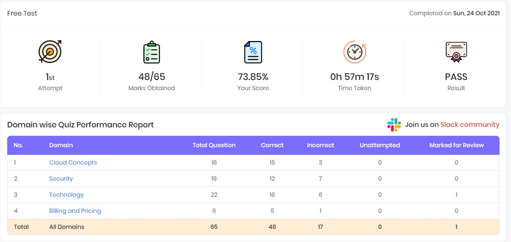

1. Which AWS service provides infrastructure security optimization recommendations?
   - **ANSWER: - AWS Trusted Advisor -**
   
   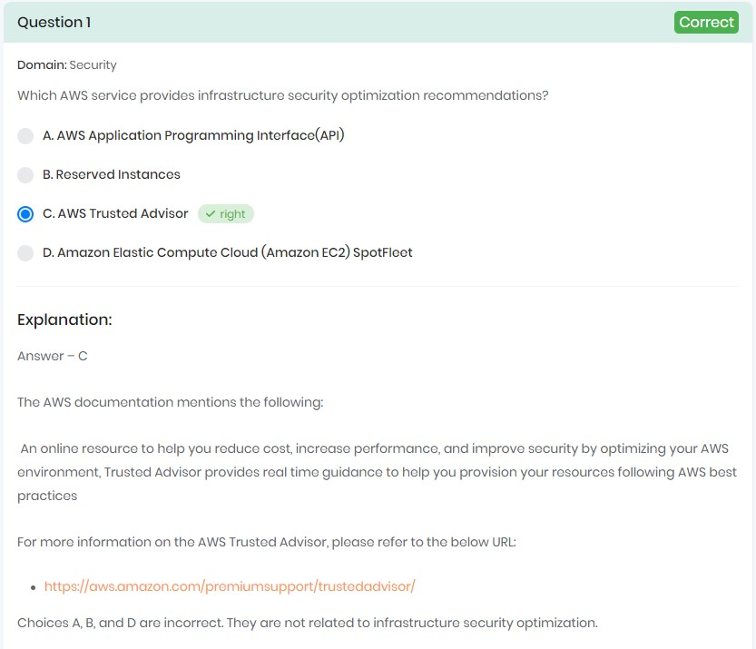

   - https://aws.amazon.com/premiumsupport/trustedadvisor/

2. A file-sharing service uses **Amazon S3** to store files uploaded by users. Files are accessed with **random frequency**. Popular ones are downloaded every day whilst others not so often and some rarely. What is the most **cost-effective** Amazon **S3 object storage class** to implement?
   - **ANSWER: - Amazon S3 Intelligent-Tiering -**

   .jpg)
   .jpg)

   - https://aws.amazon.com/about-aws/whats-new/2018/11/s3-intelligent-tiering/
   - https://aws.amazon.com/s3/storage-classes/

3. Which AWS service can be deployed to enhance read performance for applications while reading data from NoSQL database?
   - **ANSWER: - Amazon DynamoDB Accelerator (DAX) -**

   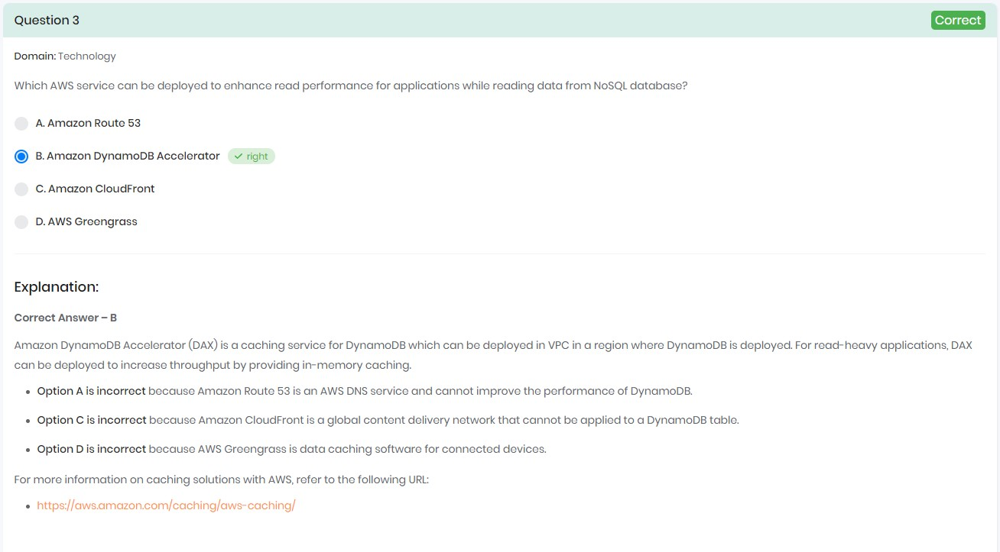

   - https://aws.amazon.com/caching/aws-caching/

4. An organization utilizes a software suite that consists of a multitude of underlying microservices hosted on the cloud. The application is frequently giving runtime errors. Which service will help in the troubleshooting process?
   - **ANSWER: - AWS X-Ray -**

   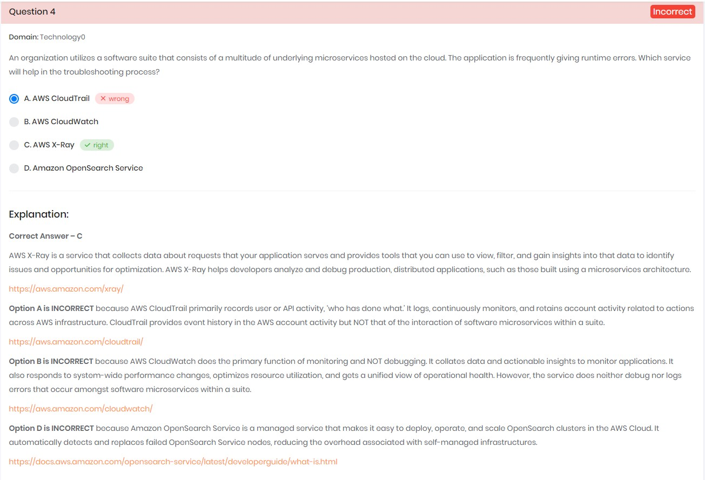

   - https://aws.amazon.com/xray/
   - https://aws.amazon.com/cloudtrail/
   - https://aws.amazon.com/cloudwatch/
   - https://docs.aws.amazon.com/opensearch-service/latest/developerguide/what-is.html

5. According to the AWS, what is the benefit of Elasticity?
   - **ANSWER: - Create systems that scale to the required capacity based on changes in demand -**

   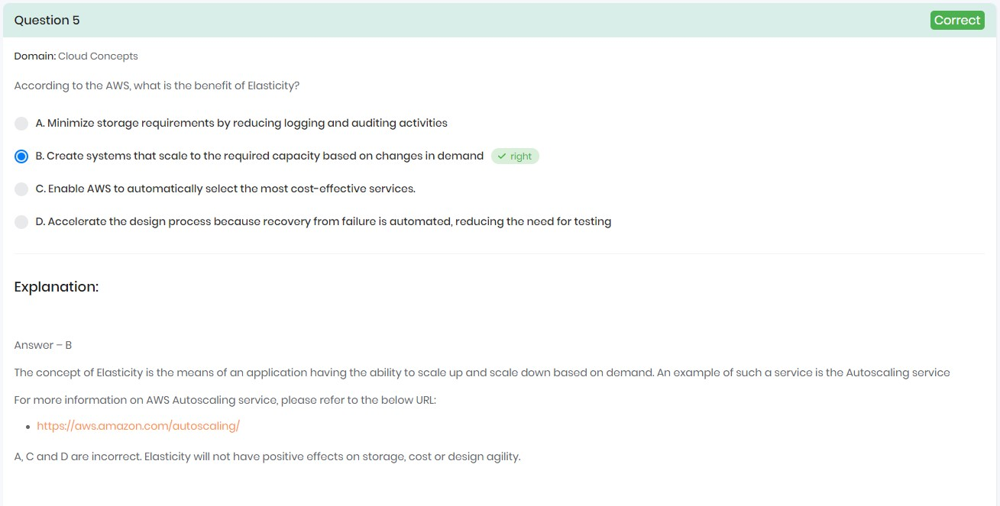

   - https://aws.amazon.com/autoscaling/

6. Which tool can you use to forecast your AWS spending?
   - **ANSWER: - AWS Cost Explorer -**

   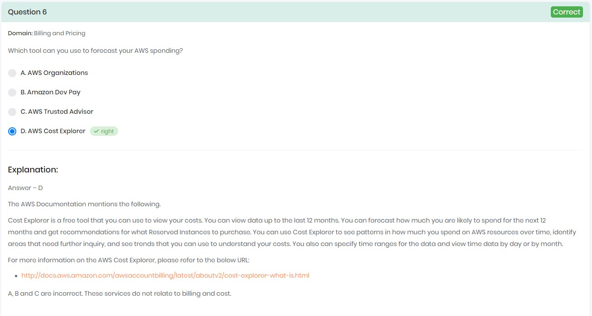

   - http://docs.aws.amazon.com/awsaccountbilling/latest/aboutv2/cost-explorer-what-is.html

7. Which of the following is an optional Security layer attached to a subnet within a VPC for controlling traffic in and out of the VPC?
   - **ANSWER: - Network ACL -**

   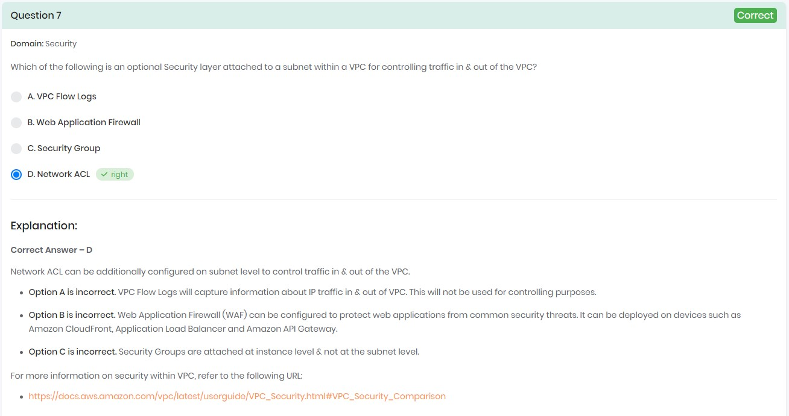

   - https://docs.aws.amazon.com/vpc/latest/userguide/VPC_Security.html#VPC_Security_Comparison

8. Which of the following is a customer responsibility under AWS Shared Responsibility Model?
   - **ANSWER: - Patching of guest OS deployed on Amazon EC2 instance. -**

   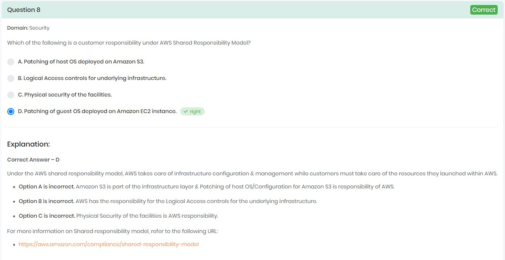

   - https://aws.amazon.com/compliance/shared-responsibility-model/

9. What is the AWS feature that enables fast, easy and secure transfer of files over long distances between your client and your Amazon S3 bucket?
   - **ANSWER: - Amazon S3 Transfer Acceleration -**

   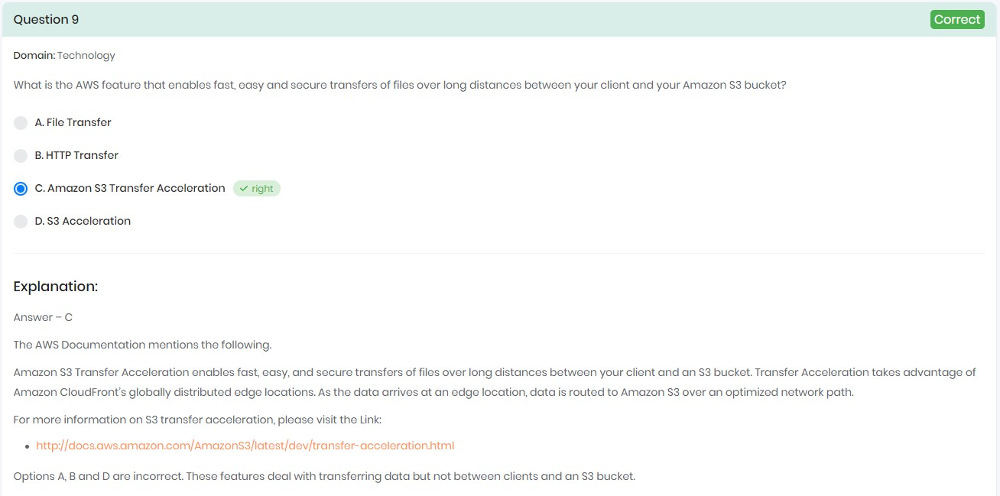

   - http://docs.aws.amazon.com/AmazonS3/latest/dev/transfer-acceleration.html

10. Which of the following services can be used to optimize performance for global users to transfer large-sized data objects to a centralized Amazon S3 bucket in us-west-1 region?
    - **ANSWER: - Enable S3 Transfer Acceleration on Amazon S3 bucket -**

    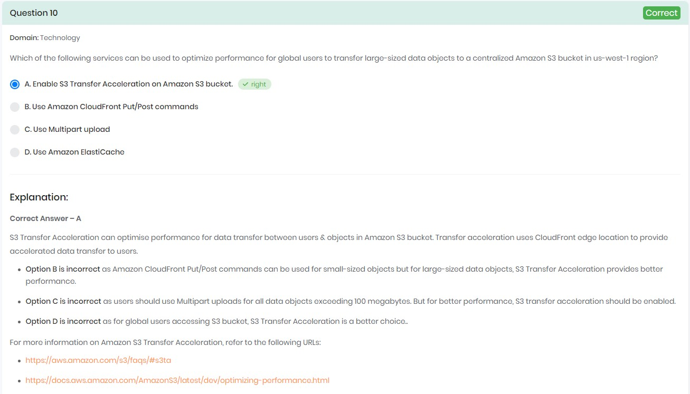

    - https://aws.amazon.com/s3/faqs/#s3ta
    - https://docs.aws.amazon.com/AmazonS3/latest/dev/optimizing-performance.html

11. There is a requirement to store objects. The objects must be downloaded via a URL. Which storage option would you choose?
    - **ANSWER: - Amazon S3 -**

    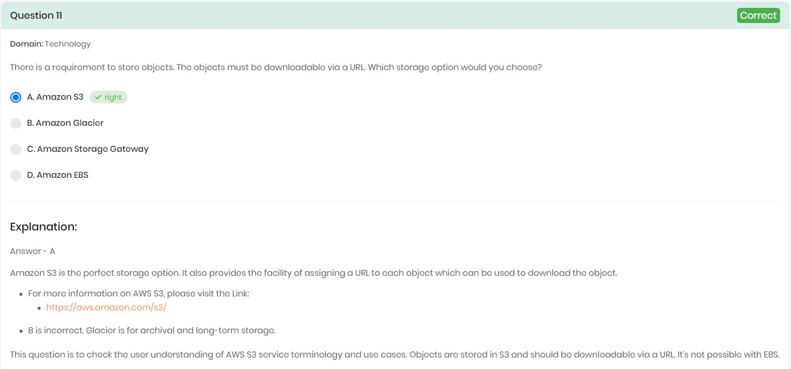

    - https://aws.amazon.com/s3/

12. There is a requirement to host a database server for a minimum period of one year. Which of the following would result in the least cost?
    - **ANSWER: - Partial Upfront costs Reserved -**
    
    .jpg)
    .jpg)

    - https://aws.amazon.com/ec2/pricing/reserved-instances/
    - https://docs.aws.amazon.com/aws-technical-content/latest/cost-optimization-reservation-models/reserved-instance-payment-options.html
    - https://docs.aws.amazon.com/AWSEC2/latest/UserGuide/ec2-reserved-instances.html

13. During an organization's information systems audit, the administrator is requested to provide a dossier of security and compliance reports and online service agreements between the organization and AWS. Which service can they utilize to acquire this information?
    - **ANSWER: - AWS Artifact -**

    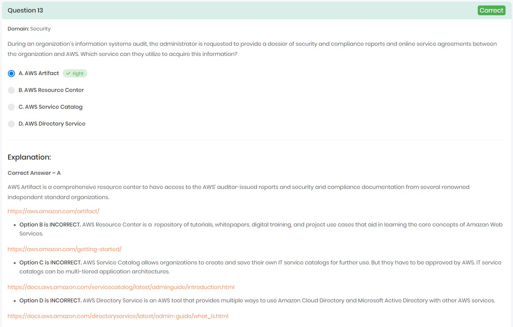

    - https://aws.amazon.com/artifact/
    - https://aws.amazon.com/getting-started/
    - https://docs.aws.amazon.com/servicecatalog/latest/adminguide/introduction.html
    - https://docs.aws.amazon.com/directoryservice/latest/admin-guide/what_is.html

14. A new department has recently joined the organization and the administrator needs to compose access permissions for the group of users. Given that they have various roles and access needs, what ius the best-practice approach when granting access?
    - **ANSWER: - The administrator should grant all users the least privilege and add more privileges to only those who need it. -**

    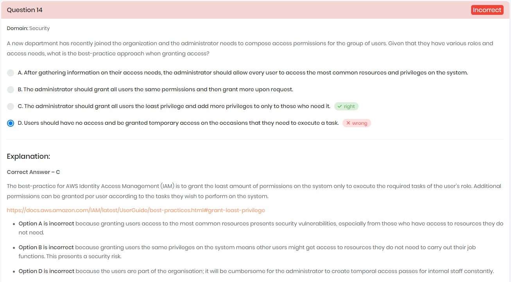

    - https://docs.aws.amazon.com/IAM/latest/UserGuide/best-practices.html#grant-least-privilege

15. There is an external audit being carried out on your company. The IT auditor needs to have a log of who made the requests to the AWS resources in the company's account. Which of the below services can assist in providing these details?
    - **ANSWER: - AWS CloudTrail -**

    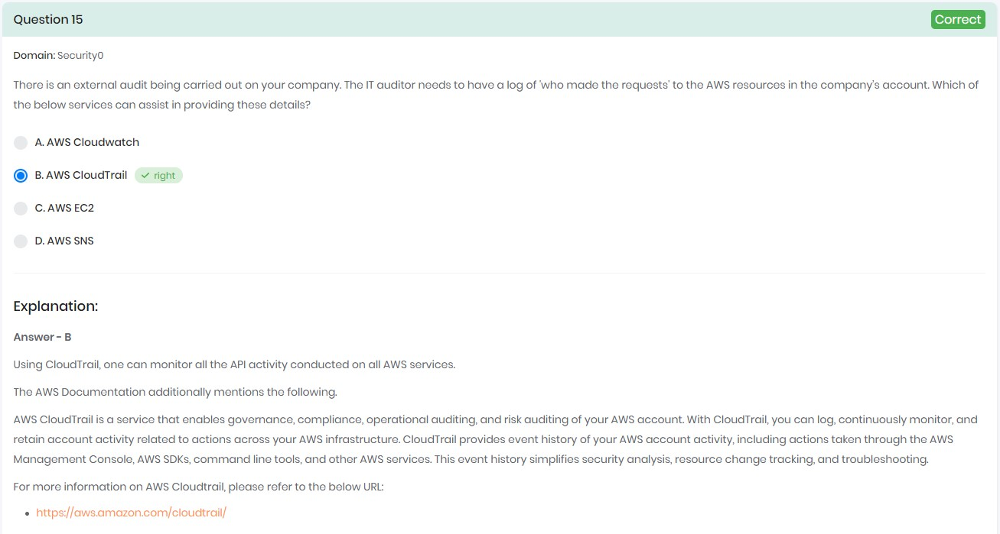

    - https://aws.amazon.com/cloudtrail/

16. Which of the following features can be used to preview changes to be made to an AWS resource which will be deployed using the AWS CloudFormation template?
    - **ANSWER: - AWS CloudFormation Change Sets -**

    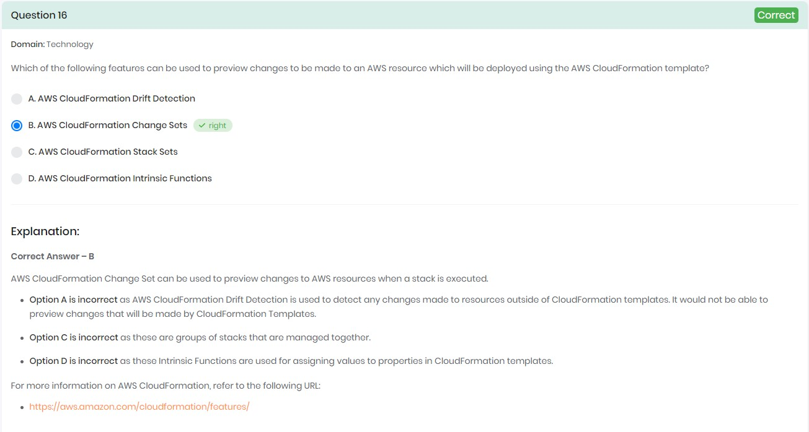

    - https://aws.amazon.com/cloudformation/features/

17. Which of the following is the responsibility of the customer to ensure the availability and backup of the EBS volumes?
    - **ANSWER: - Create EBS snapshots -**

    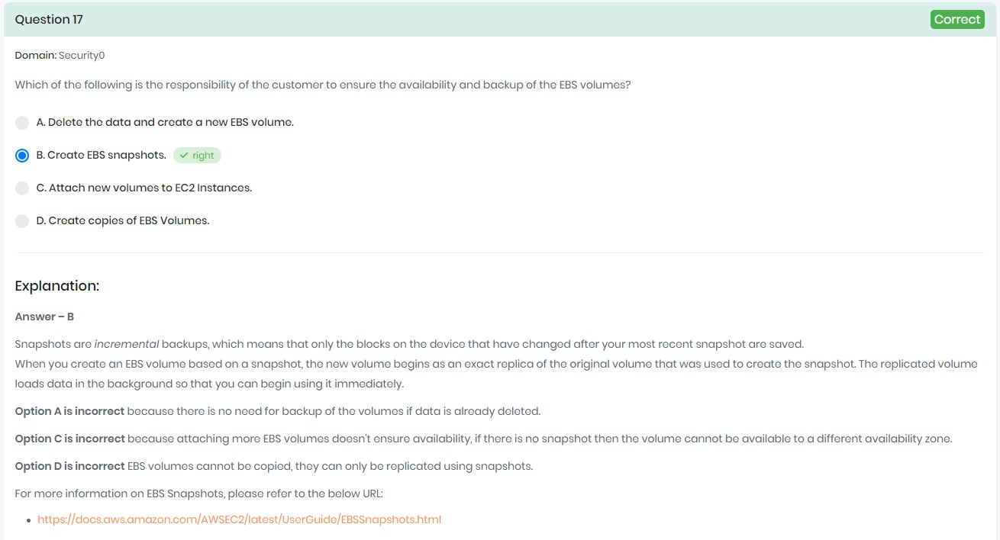

    - https://docs.aws.amazon.com/AWSEC2/latest/UserGuide/EBSSnapshots.html

18. When designing a highly available architecture, what is the difference between vertical scaling (scaling-up) and horizontal scaling (scaling-out)?
    - **ANSWER: - Scaling up adds more resources to an instance, scaling our adds more instances. -**

    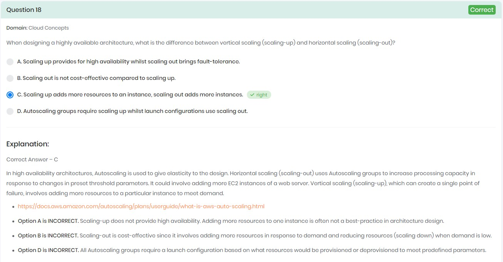
   
    - https://docs.aws.amazon.com/autoscaling/plans/userguide/what-is-aws-auto-scaling.html

19. Your company is planning to move to AWS Cloud. You need to give a presentation on the cost perspective when moving existing resources to the AWS Cloud. Considering Amazon EC2, which of the following is an advantage from the cost perspective?
    - **ANSWER: - The ability to only pay for what you use. -**

    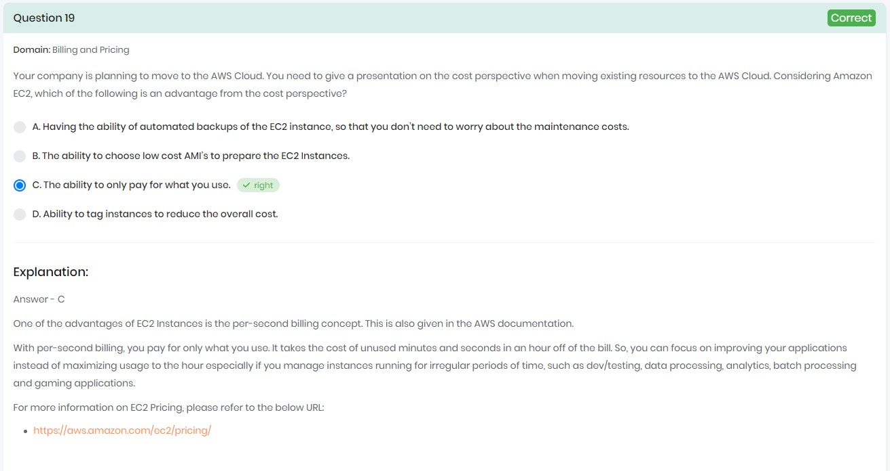

    - https://aws.amazon.com/ec2/pricing/

20. When designing a system, you use the principal of "design for failure and nothing will fail". Which of the following services/features of AWS can assist in supporting this design principle? Choose 3 answers from the options given below.
    - **ANSWERS:**
      - **- Availability Zones -**
      - **- Regions -**
      - **- Elastic Load Balancer -**

    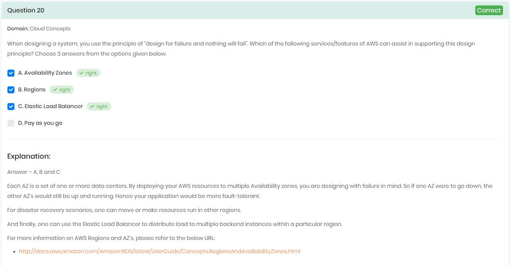

    - http://docs.aws.amazon.com/AmazonRDS/latest/UserGuide/Concepts.RegionsAndAvailabilityZones.html

21. Your design team is planning to design an application that will be hosted on the AWS Cloud. One of their main non-functional requirements is given below:
    - Reduce inter-dependencies so failures do not impact other components.  

    Which of the following concepts does the requirements relate to?
    - **ANSWER: - Decoupling -**

    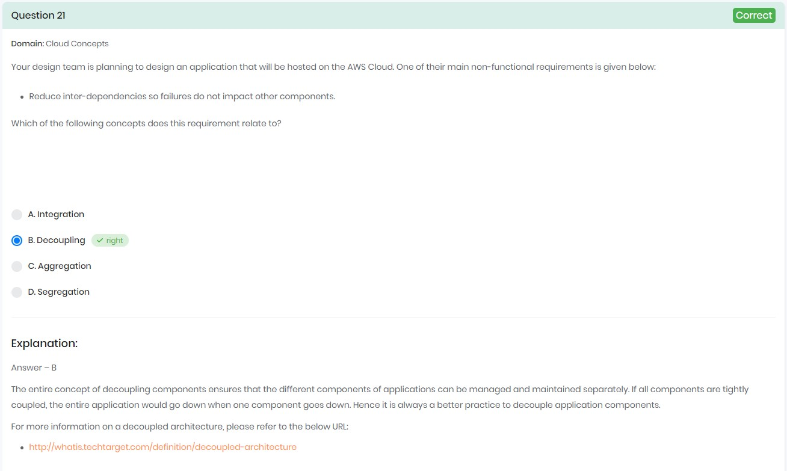

    - http://whatis.techtarget.com/definition/decoupled-architecture

22. Which of the following security requirements are managed by AWS? Select 3 answers from the options given below.
    - **ANSWERS:**
      - **- Physical security -**
      - **- Disk disposal -**
      - **- Hardware patching -**

    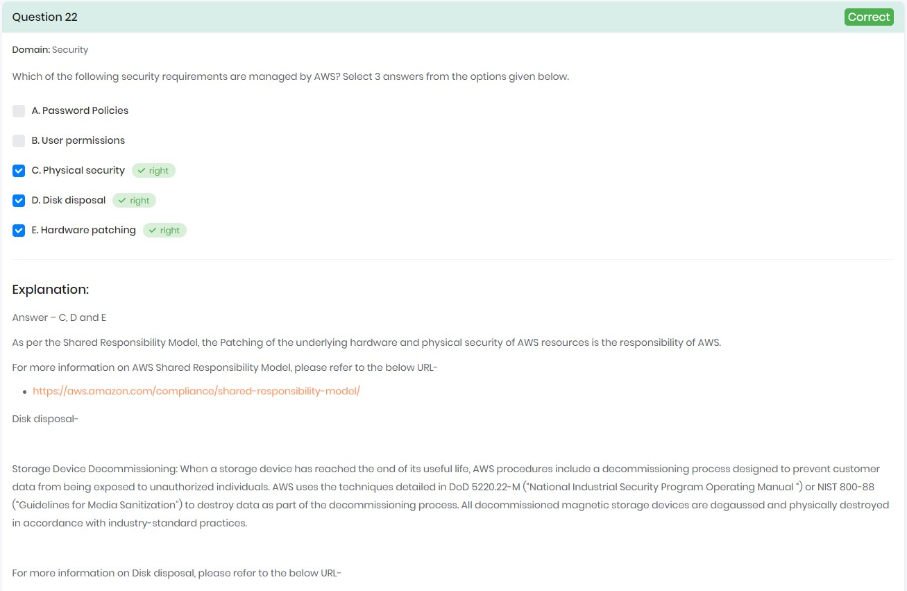

    - https://aws.amazon.com/compliance/shared-responsibility-model/
    - https://d0.awsstatic.com/whitepapers/aws-security-whitepaper.pdf

23. You are planning on deploying a video-based application onto the AWS Cloud. Users across the world will access these videos. Which of the below services can help efficiently stream the content to the users across the globe?
    - **ANSWER: - Amazon CloudFront -**

    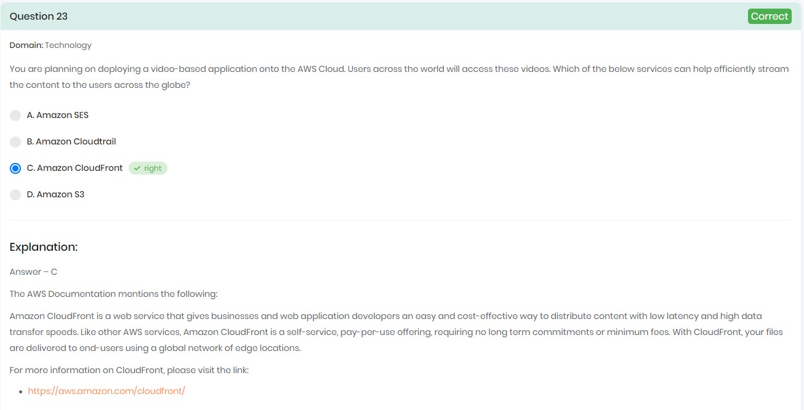

    - https://aws.amazon.com/cloudfront/

24. Which of the following AWS services can be used to retrieve configuration changes made to AWS resources causing operational issues?
    - **ANSWER: - AWS Config -**

    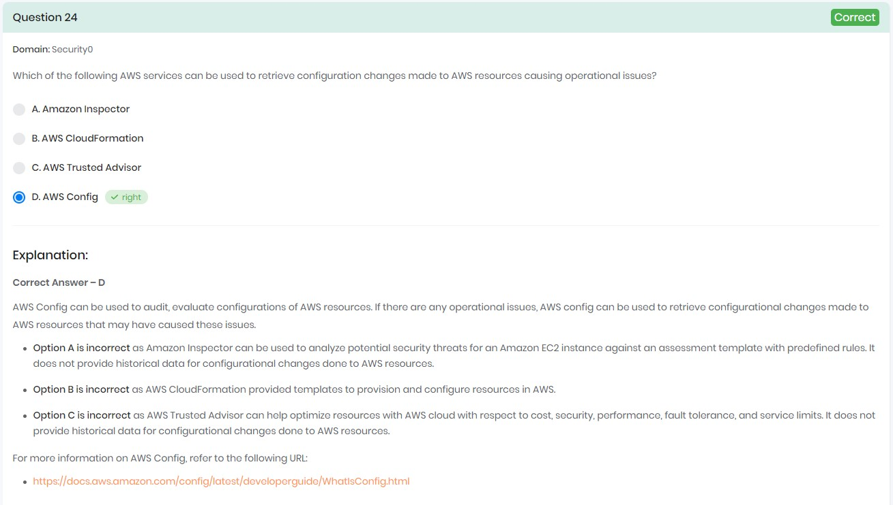

    - https://aws.amazon.com/config/faq/

25. An organization runs several EC2 instances inside a VPC using three subnets, one for Development, one for Test and one for Production. The Security team has some concerns about the VPC configuration. It requires to restrict the communication across the EC2 instances using Security Groups. Which of the following options is true for Security Groups?
    - **ANSWER: - You can change a Security Group associated to an instance if the instance state is stopped or running. -**
   
    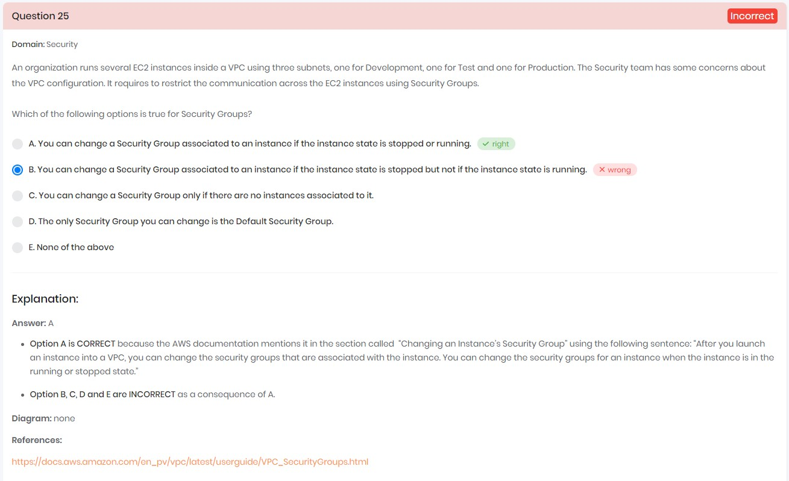

    - https://docs.aws.amazon.com/en_pv/vpc/latest/userguide/VPC_SecurityGroups.html

26. Your company is planning to pay for an AWS Support plan. The have the following requirements as far as the support plan goes:
    - 24/7 access to Cloud Support Engineers via email, chat & phone
    - Response time of less than 15 minutes for any business-critical system faults  
   
    Which of the following plans will suffice to keep in mind the above requirement?
    - **ANSWER: - Enterprise -**

    .jpg)
    .jpg)

    - https://aws.amazon.com/premiumsupport/compare-plans/

27. Your company wants to move an existing Oracle database to the AWS Cloud. Which of the following services can help facilitate this move?
    - **ANSWER: - AWS Database Migration Service (DMS) -**

    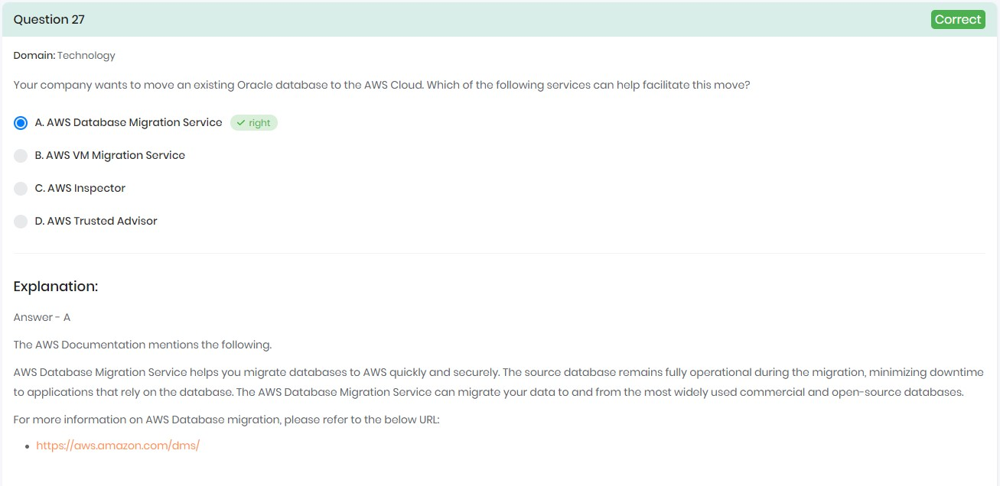

    - https://aws.amazon.com/dms/

28. On which of the following resources does Amazon Inspector perform network accessibility checks?
    - **ANSWER: - Amazon VPC -**

    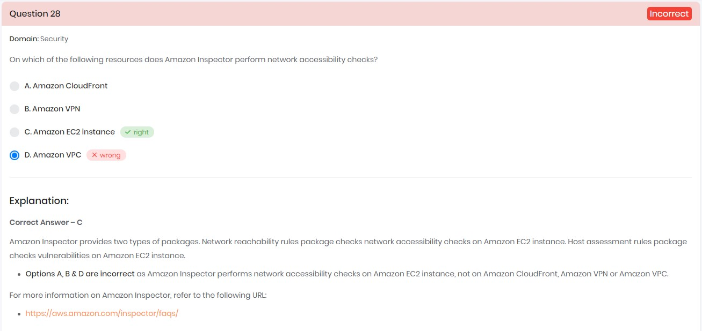

    - https://aws.amazon.com/inspector/faqs/

29. Which of the following services helps to achieve the computing elasticity in AWS?
    - **ANSWER: - AWS EC2 Auto Scaling Group -**

    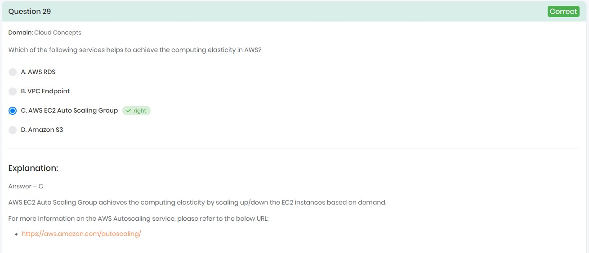

    - https://aws.amazon.com/autoscaling/

30. A live online game uses DynamoDB instances in the backend to store real-time scores of the participants as they compete against each other from various parts of the world. Which data consistency option is the most appropriate to implement?
    - **ANSWER: - Strongly consistent -**

    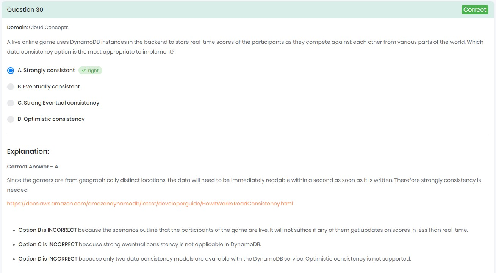

    - https://docs.aws.amazon.com/amazondynamodb/latest/developerguide/HowItWorks.ReadConsistency.html

31. Which of the following services allows you to analyze EC2 Instances against pre-defined security templates to check for vulnerabilities?
    - **ANSWER: - AWS Inspector -**

    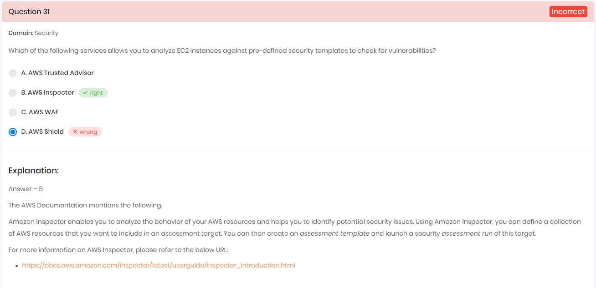

    - https://docs.aws.amazon.com/inspector/latest/userguide/inspector_introduction.html

32. You are planning to serve a web application on the AWS Platform by using EC2 Instance. Which of the below principles would you adopt to ensure that even if some of the EC2 Instances crash, you still have a working application?
    - **ANSWER: - Using a fault tolerant system -**

    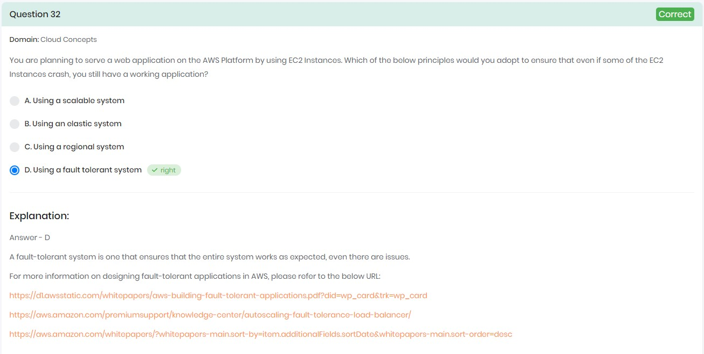

    - https://d1.awsstatic.com/whitepapers/aws-building-fault-tolerant-applications.pdf?did=wp_card&trk=wp_card
    - https://aws.amazon.com/premiumsupport/knowledge-center/autoscaling-fault-tolerance-load-balancer/
    - https://aws.amazon.com/whitepapers/?whitepapers-main.sort-by=item.additionalFields.sortDate&whitepapers-main.sort-order=desc

33. Which of the following are best practices when designing cloud-based systems? Choose 2 answers from the options below.
    - **ANSWERS:**
      - **- Build loosely-coupled components. -**
      - **- Assume everything will fail. -**

    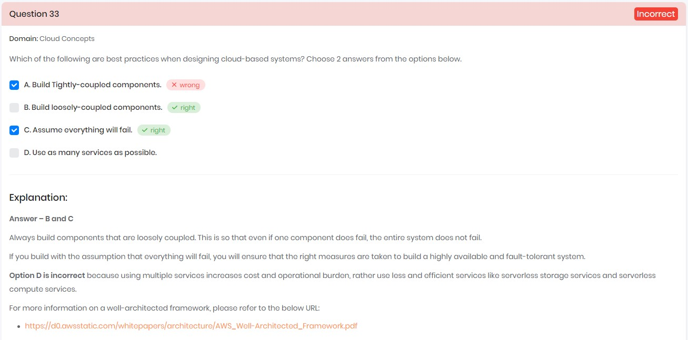

    - https://d0.awsstatic.com/whitepapers/architecture/AWS_Well-Architected_Framework.pdf

34. Which services allow the customers to retain full administrative privileges of the underlying virtual infrastructure?
    - **ANSWER: - Amazon EC2 -**

    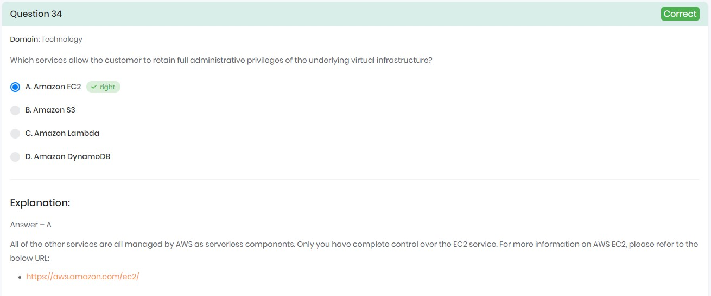

    - https://aws.amazon.com/ec2/

35. You have a mission-critical application that must be globally available at all times. If this is the case, which of the below deployment mechanisms would you employ?
    - **ANSWER: - Deployment to multiple Regions -**

    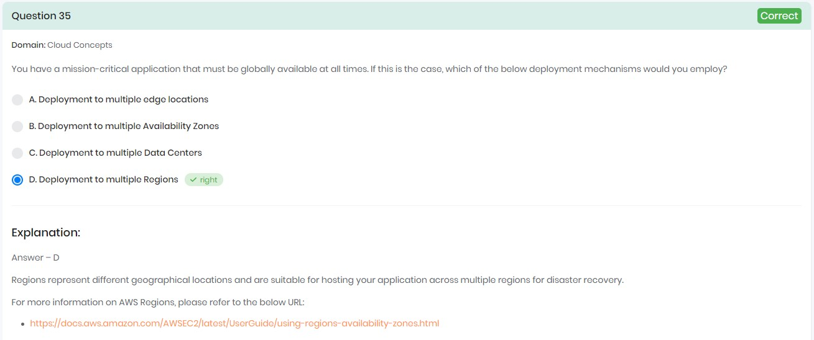

    - https://docs.aws.amazon.com/AWSEC2/latest/UserGuide/using-regions-availability-zones.html

36. Which of the following can be used to protect against DDoS attacks? Choose 2 answers from the options given below.
    - **ANSWERS:**
      - **- AWS Shield -**
      - **- AWS Shield Advanced -**

    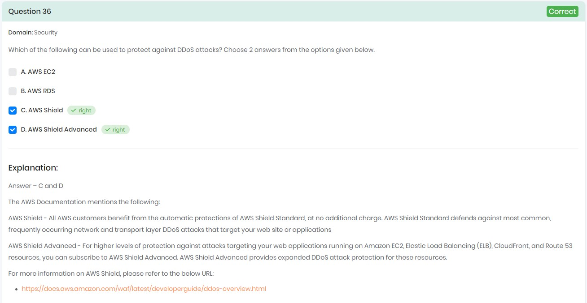

    - https://docs.aws.amazon.com/waf/latest/developerguide/ddos-overview.html

37. Which of the following is a serverless compute offering from AWS?
    - **ANSWER: - AWS Lambda -**

    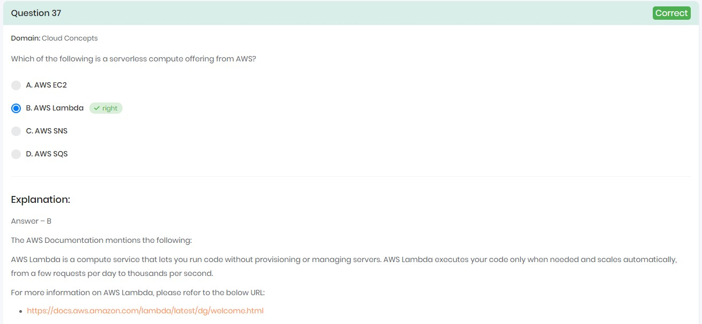

    - https://docs.aws.amazon.com/lambda/latest/dg/welcome.html

38. Which of the following security services can be used to detect users' personal credit card numbers from data stored in Amazon S3?
    - **ANSWER: - Amazon Macie -**

    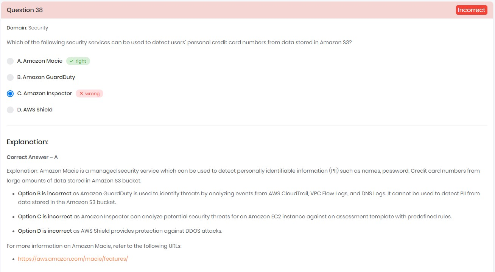

    - https://aws.amazon.com/macie/features/

39. An online streaming company is prohibited from broadcasting its content in certain countries and regions in the world. Which Amazon Route 53 routing policy would be the most suitable in guaranteeing their compliance?
    - **ANSWER: - Geolocation -**

    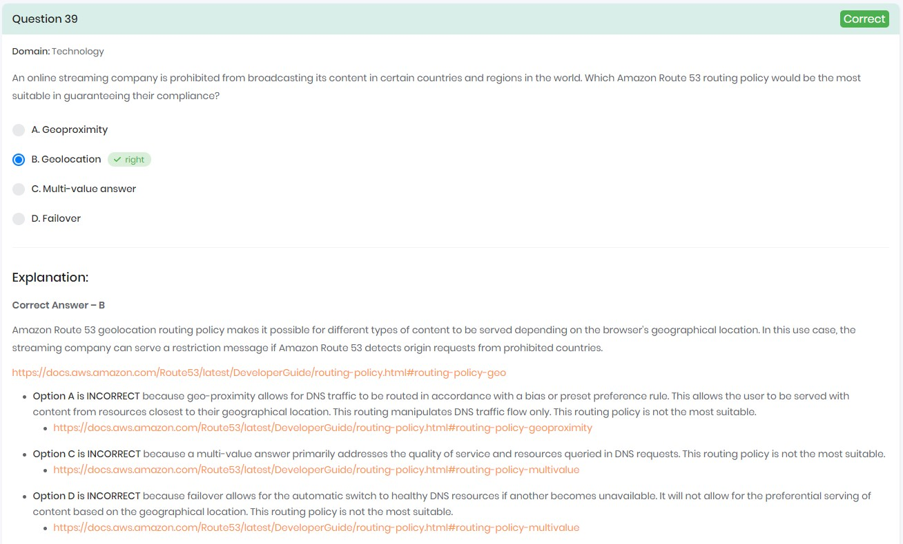

    - https://docs.aws.amazon.com/Route53/latest/DeveloperGuide/routing-policy.html#routing-policy-geo
    - https://docs.aws.amazon.com/Route53/latest/DeveloperGuide/routing-policy.html#routing-policy-geoproximity
    - https://docs.aws.amazon.com/Route53/latest/DeveloperGuide/routing-policy.html#routing-policy-multivalue

40. Which AWS service provides a fully managed NoSQL database service that provides fast and predictable performance with seamless scalability?
    - **ANSWER: - DynamoDB -**

    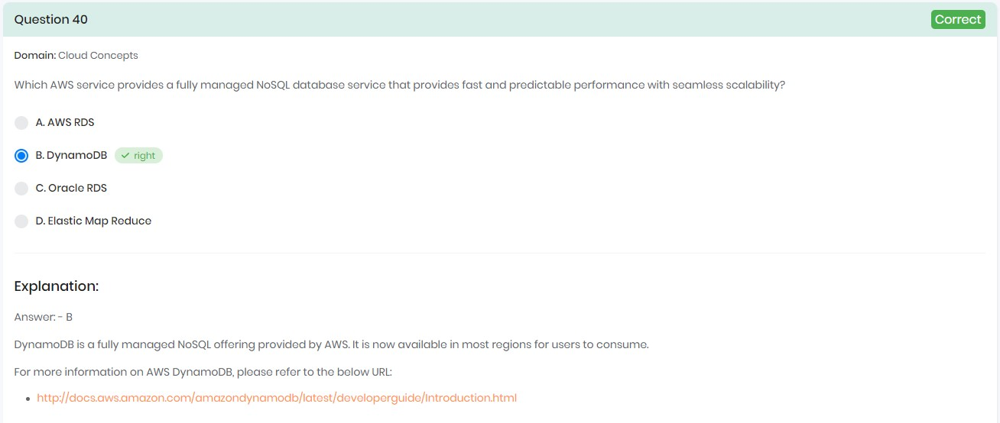

    - http://docs.aws.amazon.com/amazondynamodb/latest/developerguide/Introduction.html

41. In the AWS Billing and Management service, which tool can provide usage-based forecasts of estimated billing costs and usage for the coming months?
    - **ANSWER: - AWS Cost Explorer -**

    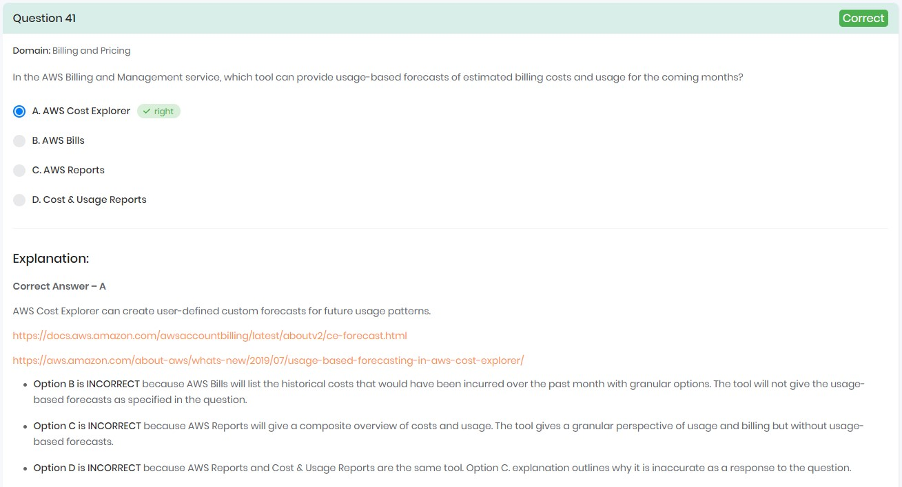

    - https://docs.aws.amazon.com/awsaccountbilling/latest/aboutv2/ce-forecast.html
    - https://aws.amazon.com/about-aws/whats-new/2019/07/usage-based-forecasting-in-aws-cost-explorer/

42. Which of the following AWS managed database service provides processing power that is up to 5x faster than a traditional MySQL database?
    - **ANSWER: - Aurora -**

    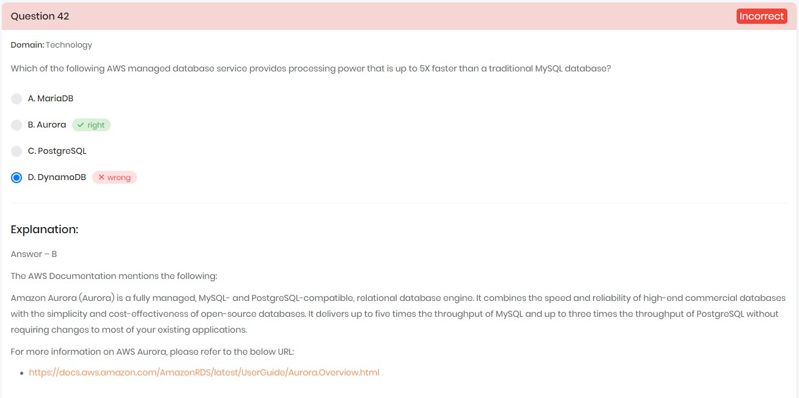

    - https://docs.aws.amazon.com/AmazonRDS/latest/UserGuide/Aurora.Overview.html

43. In the AWS Well-Architected Framework, which of the following is NOT a Security design principle to design solutions in AWS?
    - **ANSWER: - Apply Security only at the edge of the network. -**

    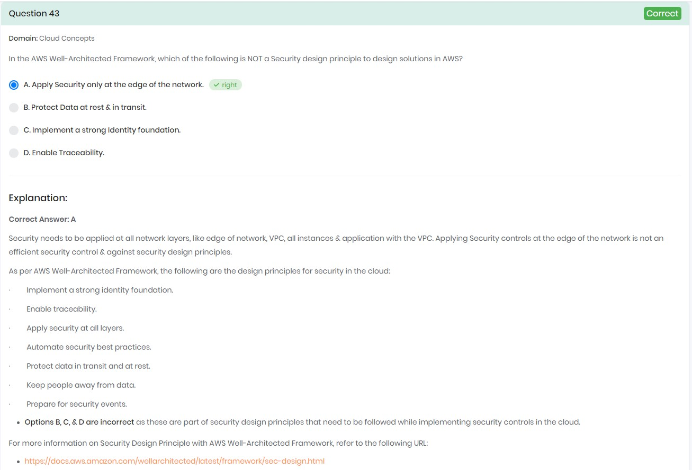

    - https://docs.aws.amazon.com/wellarchitected/latest/framework/sec-design.html

44. Which of the following options is TRUE for AWS Database Migration Service (AWS DMS)?
    - **ANSWERS:**
      - **- AWS DMS can migrate databases from on-premise to AWS. -**
      - **- AWS DMS can migrate database from AWS to on-premise. -**
      - **- AWS DMS can migrate databases from EC2 to Amazon RDS. -**
      - **- AWS DMS can have Amazon Redshift and Amazon DynamoDB as target databases. -**

    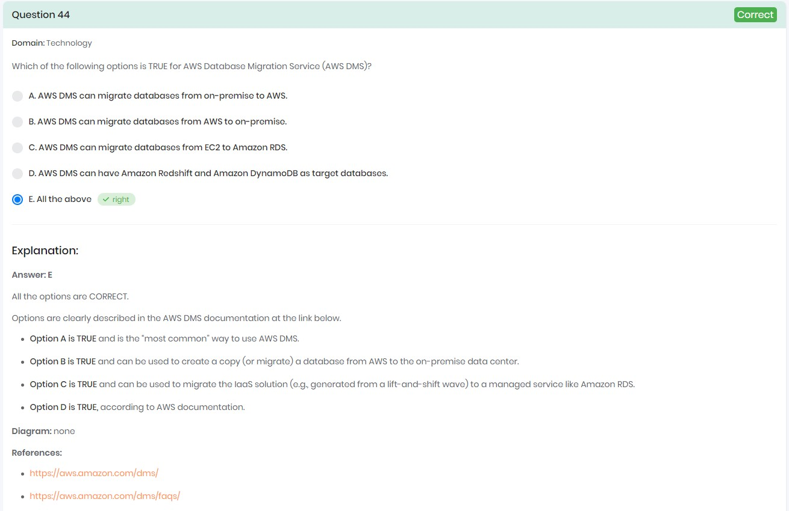

    - https://aws.amazon.com/dms/
    - https://aws.amazon.com/dms/faqs/

45. Which of the following services helps in governance, compliance, and risk auditing in AWS?
    - **ANSWER: - AWS CloudTrail -**

    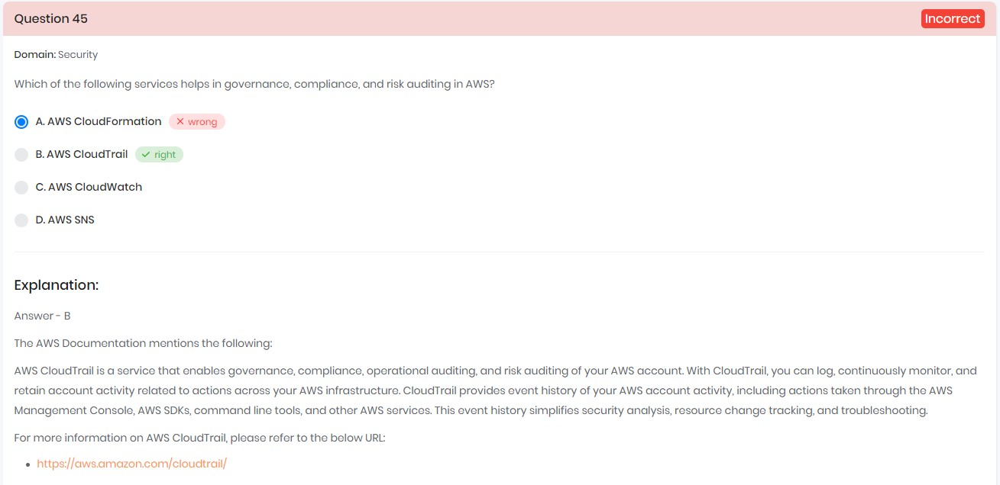

    - https://aws.amazon.com/cloudtrail/

46. Project team enhancing the security features of a banking application, requires implementing a threat detection service that continuously monitors malicious activities and unauthorized behaviors to protect AWS accounts, workloads, and data stored in Amazon S3. Which AWS service should the project team select?
    - **ANSWER: - Amazon GuardDuty -**

    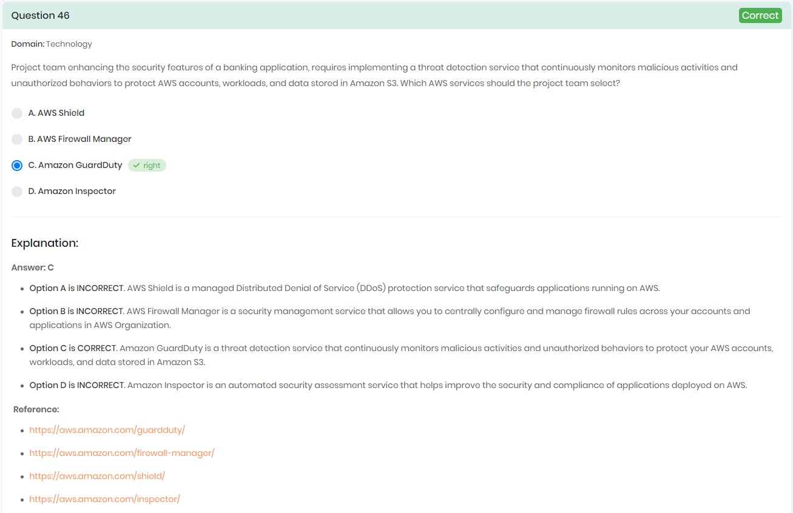

    - https://aws.amazon.com/guardduty/
    - https://aws.amazon.com/firewall-manager/
    - https://aws.amazon.com/shield/
    - https://aws.amazon.com/inspector/

47. Which of the following are benefits of the AWS's Relational Database Service (RDS)? Choose the 2 correct answers from the options below.
    - **ANSWERS:**
      - **- Automated patches and backups -**
      - **- DB owner can resize the capacity accordingly -**

    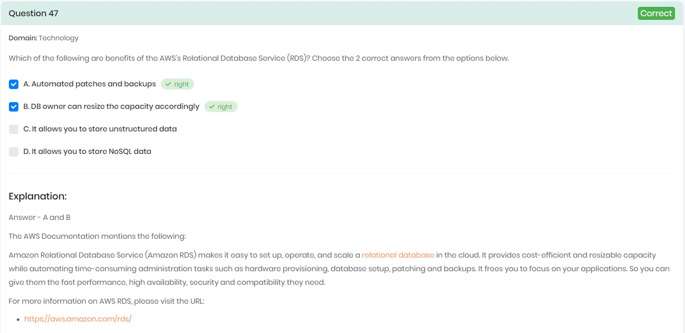

    - [Relational Database](https://aws.amazon.com/relational-database/)
    - https://aws.amazon.com/rds/

48. Which AWS product provides a unified user interface, enabling easy management of software development activities in one place along with, quick development, build, and development of applications on AWS?
    - **ANSWER: - AWS CodeStar -**

    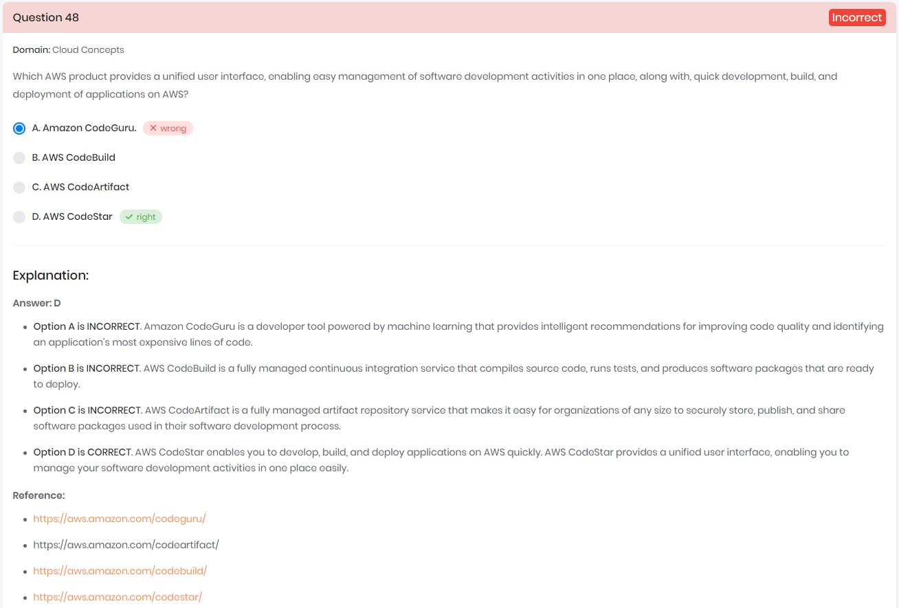

    - https://aws.amazon.com/codeguru/
    - https://aws.amazon.com/codeartifact/
    - https://aws.amazon.com/codebuild/
    - https://aws.amazon.com/codestar/?c=10&pt=8

49. If you want to take a backup of an EBS Volume, what would you do?
    - **ANSWER: - Create an EBS snapshot -**

    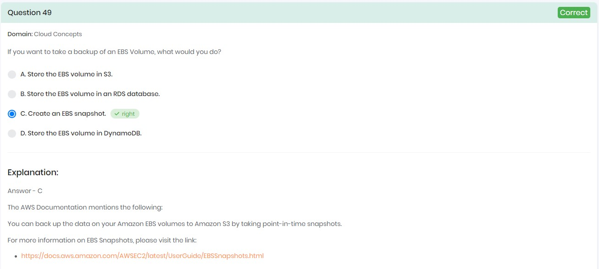

    - https://docs.aws.amazon.com/AWSEC2/latest/UserGuide/EBSSnapshots.html

50. Your Security Team has some security concerns about the application data stored on S3. The team requires you to introduce two improvements: 
    1. add "encryption at rest"
    2. give them the possibility to monitor who has accessed the data and when the data have been accessed

    Which of the following AWS solution would you adopt to satisfy the requirement?

    - **ANSWER: - Server-Side Encryption managed by KMS (SSE-KMS) with CloudTrail. -**

    .jpg)
    .jpg)

    - https://docs.aws.amazon.com/kms/latest/developerguide/services-s3.html#sse
    - https://docs.aws.amazon.com/kms/latest/developerguide/logging-using-cloudtrail.html

51. Which of the following statements regarding Amazon Athena are accurate? Select TWO.
    - **ANSWERS:**
      - **- Amazon Athena queries data directly from Amazon S3 and there are no additional data storage commitments beyond the object storage. -**
      - **- Amazon Athena is compatible with data formats such as CSV, JSON, ORC, AVRO, and Parquet -**

    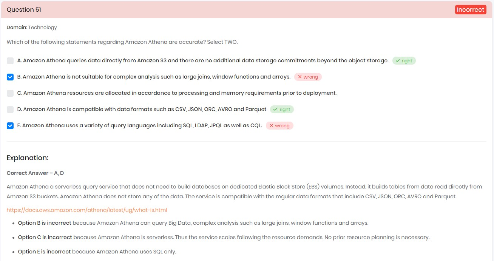

    - https://docs.aws.amazon.com/athena/latest/ug/what-is.html

52. An administrator is running a large deployment of AWS resources that are spread across several AWS Regions. They would like to keep track of configuration changes on all the resources and maintain a configuration inventory. What is the best service they can use?
    - **ANSWER: - AWS Config -**

    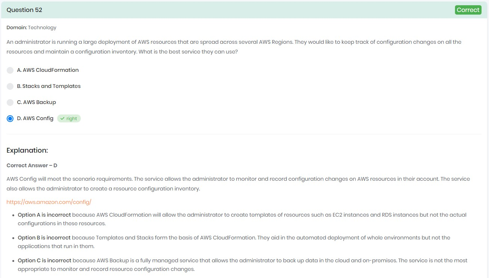

    - https://aws.amazon.com/config/

53. A company does not want to manage their database. Which of the following services is a fully managed NoSQL database provided by AWS?
    - **ANSWER: - DynamoDB -**

    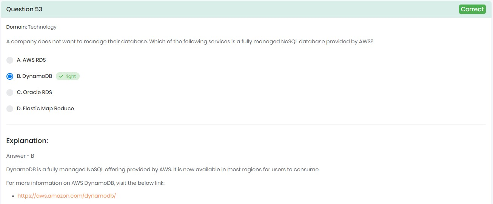

    - https://aws.amazon.com/dynamodb/

54. Whilst working on a collaborative project, an administrator would like to record the initial configuration and several authorized changes that engineers make to the route table of a VPC. What is the best method to achieve this?
    - **ANSWER: - Use of AWS Config -**

    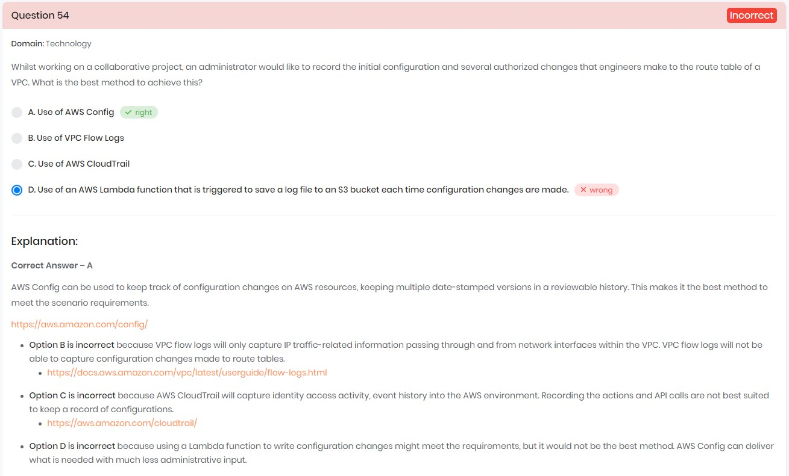

    - https://aws.amazon.com/config/
    - https://docs.aws.amazon.com/vpc/latest/userguide/flow-logs.html
    - https://aws.amazon.com/cloudtrail/

55. Which of the following is a template that contains the software configuration to launch an EC2 instance?
    - **ANSWER: - AMI (Amazon Machine Image) -**

    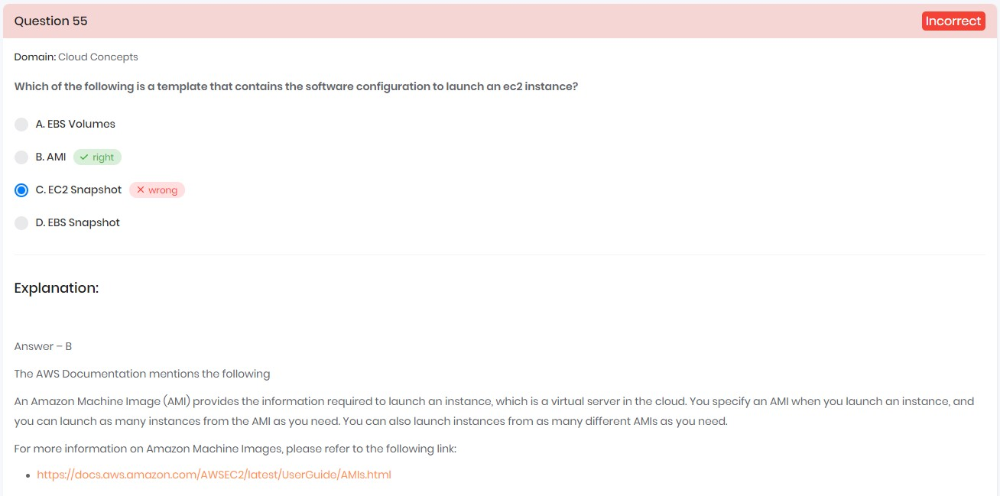

    - https://docs.aws.amazon.com/AWSEC2/latest/UserGuide/AMIs.html

56. Security and Compliance is a shared responsibility between AWS and the customer. Which amongst the below-listed options are AWS responsibilities? (Select TWO)
    - **ANSWERS:**
      - **- Security of the AWS Cloud -**
      - **- Patch management within the AWS infrastructure -**

    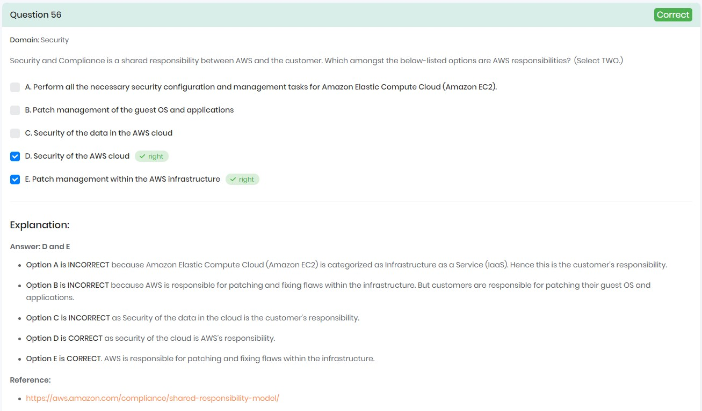

    - https://aws.amazon.com/compliance/shared-responsibility-model/

57. Which of the following tools can be used to check service limits for resources launched within AWS Cloud Infrastructure?
    - **ANSWER: - AWS Trusted Advisor -**

    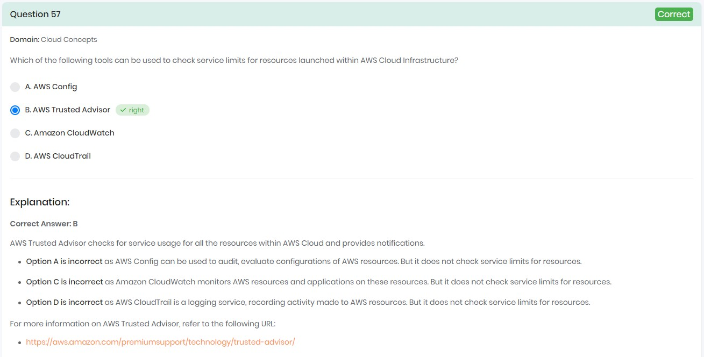

    - https://aws.amazon.com/premiumsupport/technology/trusted-advisor/

58. Which of the following accurately describes a typical use case in which the AWS CodePipeline service can be utilized?
    - **ANSWER: - To orchestrate and automate the various phases involved in the release of application updates in-line with a predefined release model. -**

    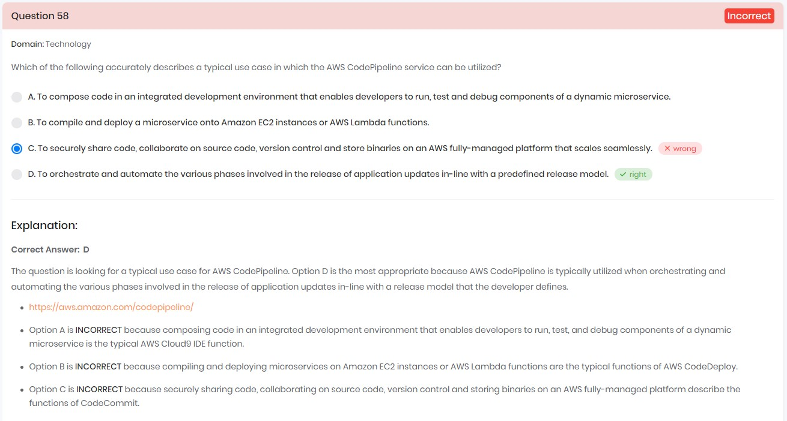

    - https://aws.amazon.com/codepipeline/

59. Your organization has planned to decommission its data centers. You have a task to migrate hundreds of TB of archived data and 22 TB of active data to S3 and EFS, as per the designed solution. Which of the below service will be best suited for this task?
    - **ANSWER: - AWS Data Sync -**

    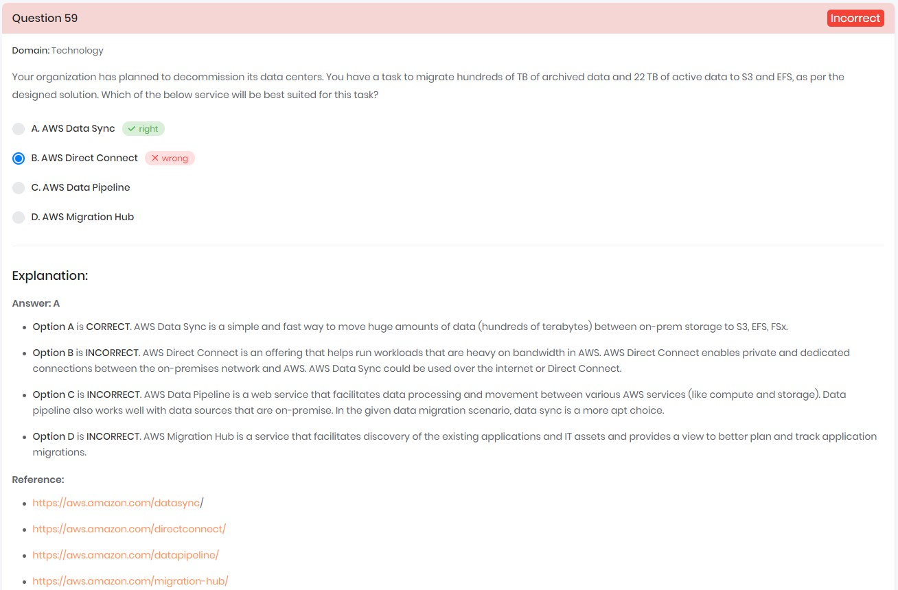

    - https://aws.amazon.com/datasync
    - https://aws.amazon.com/directconnect/
    - https://aws.amazon.com/datapipeline/
    - https://aws.amazon.com/migration-hub/

60. To maximize user satisfaction, you are asked to improve the performance of the application for local and global users. As part of this initiative, you must monitor the application endpoint health and route traffic to the most appropriate application endpoint. Which service will you prefer to use?
    - **ANSWER: - Amazon Global Accelerator -**

    .jpg)
    .jpg)

    - https://aws.amazon.com/global-accelerator/
    - https://aws.amazon.com/dynamodb/dax/
    - https://docs.aws.amazon.com/AmazonS3/latest/dev/transfer-acceleration.html
    - https://aws.amazon.com/directconnect/

61. Which AWS service offering uses machine learning and graph theory capability on automatically collecting log data to help you conduct faster and efficient security investigations?
    - **ANSWER: - Amazon Detective -**

    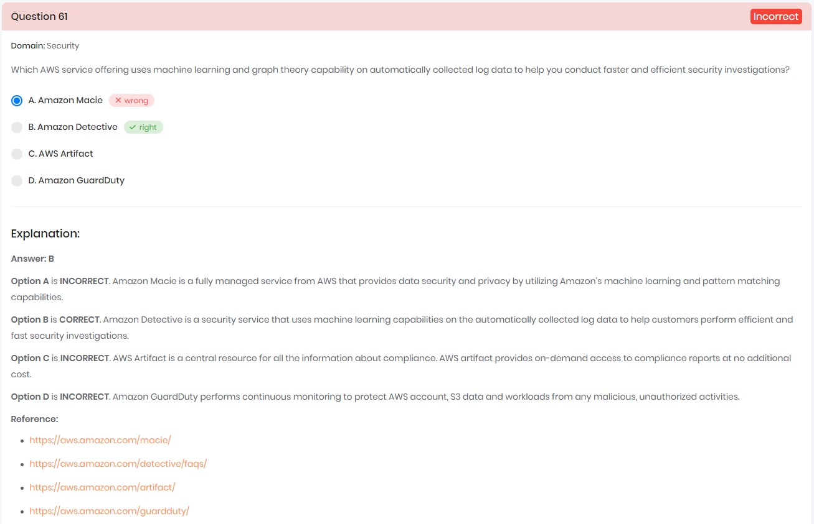

    - https://aws.amazon.com/macie/
    - https://aws.amazon.com/detective/faqs/
    - https://aws.amazon.com/artifact/
    - https://aws.amazon.com/guardduty/

62. An administrator is tasked to configure privileges for the new joiners in the department. The admin is selectively granting privileges and ensuring that not all the team members can access all the resources. Which principle is the administrator following?
    - **ANSWER: - Principle of Least Privilege -**

    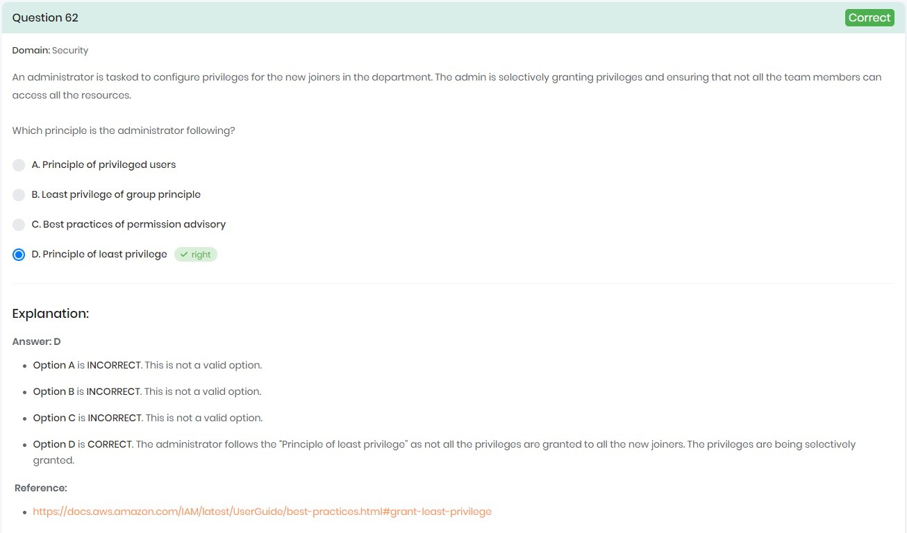

    - https://docs.aws.amazon.com/IAM/latest/UserGuide/best-practices.html#grant-least-privilege

63. You are asked to suggest an appropriate Amazon S3 storage class for "data with unknown/changing access pattern". Which one would you suggest?
    - **ANSWER: - Amazon S3 Intelligent-Tiering -**

    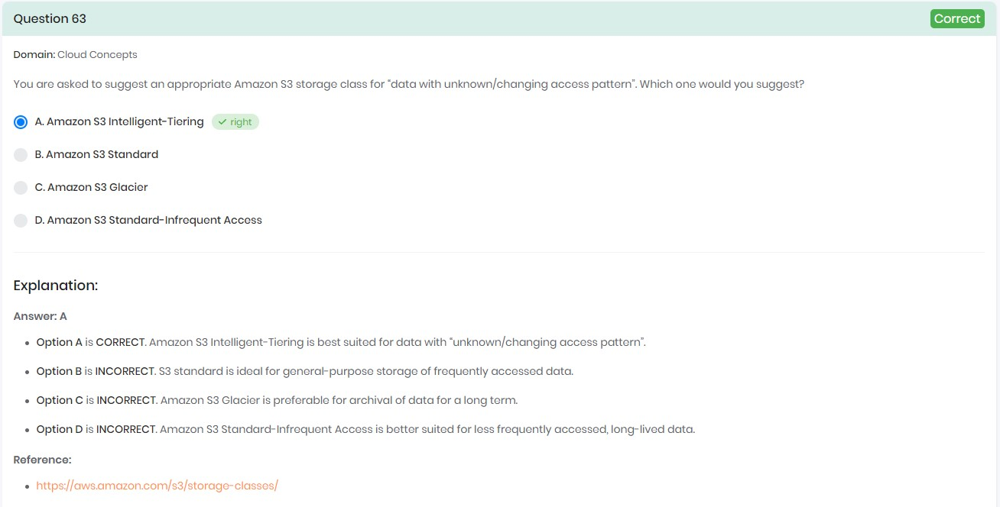

    - https://aws.amazon.com/s3/storage-classes/

64. A "Member AWS account" in an AWS Organization (using consolidated billing) wants to receive a cost breakdown report (product-wise daily report) so that the analysis of cost and usage could be done. Where can this report be configured to be delivered?
    - **ANSWER: - S3 bucket owned by the master account - **

    .jpg)
    .jpg)

    - https://docs.aws.amazon.com/cur/latest/userguide/what-is-cur.html
    - https://aws.amazon.com/athena/
    - https://aws.amazon.com/console/

65. Which AWS service allows:
    1. Running Docker containers
    2. Simple API calls to launch and stop container-based applications

    - **ANSWER: - Amazon Elastic Container Service -**

    .jpg)
    .jpg)

    - https://docs.aws.amazon.com/eks/latest/userguide/what-is-eks.html
    - https://docs.aws.amazon.com/AmazonECS/latest/developerguide/Welcome.html
    - https://aws.amazon.com/fargate/
