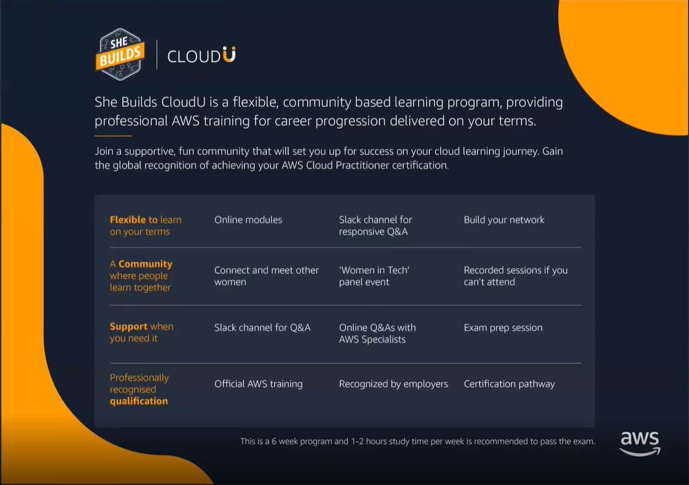
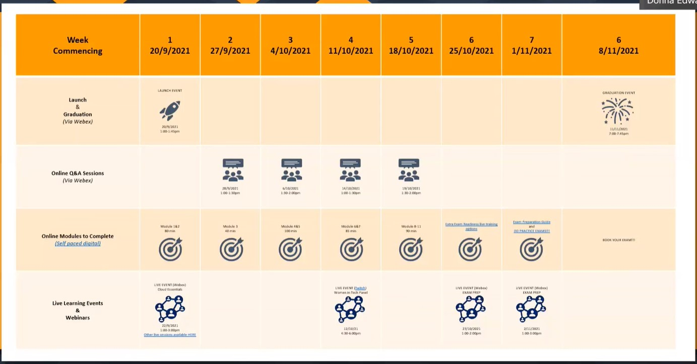
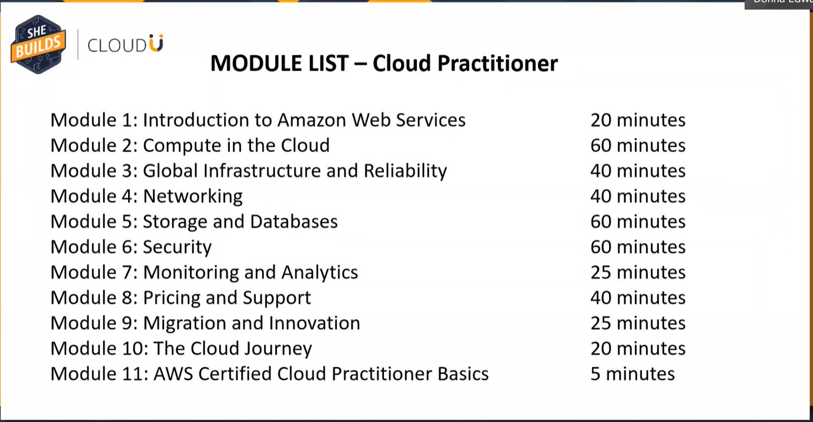

# AWS SheBuilds CloudU - Cloud Practitioner Program

**Started:** September 20, 2021 --> [Kickoff](https://mycamerapics.com/cloudu/She%20Builds%20CloudU%20Kick-off%20Event-20210920%200252-1.mp4)

**Program Leader:** Donna Edwards

**Program Sponsor:** accenture

## [Kickoff Meeting](https://mycamerapics.com/cloudu/She%20Builds%20CloudU%20Kick-off%20Event-20210920%200252-1.mp4)

### Benefits of Training
- Boosting your appeal
- Increasing your market value
- Getting you access to more jobs
- Advancing your career

### The SheBuilds CloudU Program

- A 8-week program with 1-2 hours study time per week recommended
- There are 2 courses available within the CloudU program:
  - The Cloud Practitioner (which is what we are in now)
  - The Solution Architect Solutions Associate Program (which can roll onto next if want to keep going)
    - Takes about 3-4 months to complete at a part-time pace

**Expectations / Commitments**

- For the first 5 weeks of the program, recommend at least 2 hours per week of study time - online modules + Q&A
- 2-3 weeks of exam prep sessions and extra resources + 2-3 weeks study time
- Reach out for help and motivation!!! Everyone's in the same boat and we all want each other to succeed!
- What is success?
  - Joining this program and giving it a go
  - Completing the modules

**FAQs**

- What collaboration channels are used?
  - Slack
    - #cloudpractitioner-sep2021
      - main channel for events and information about the program
  - Webex
- You do not need to attend every event
- All events are remote
- The program is FREE
- 

### How to Get Exam Voucher

- Exam vouchers are issued after you have completed all the modules and received a Certificate of Completion, and after you have done the exam preparation
- To request the voucher you email: awscloudu@amazon.com 
- Include a copy of the Certificate of Completion
- Will then send me the voucher and instructions on how to schedule the exam

### Schedule

### Additional Resources
- [She Builds CloudU - FAQ V3](She%20Builds%20CloudU%20-%20FAQ%20V3.pdf)
- [She Builds CloudU QRG](She%20Builds%20CloudU%20QRG.pdf)
- [Booking Cloud Prac exam instructions](Booking%20Cloud%20Prac%20exam%20instructions.pdf)
- [CloudU CPE Training Account Sign Up Instructions](CloudU%20CPE%20Training%20Account%20Sign%20Up%20Instructions.pdf)
- [CloudU She Builds CPE Q4 Global UTC0](CloudU%20She%20Builds%20CPE%20Q4%20Global%20UTC0.pdf)
- [Event Registration Links - She Builds CloudU v2](Event%20Registration%20Links%20-%20She%20Builds%20CloudU%20v2.pdf)
- [Practice Exams](https://www.koenig-solutions.com/AWS)

## Message Posted on Slack by Donna Edwards Sept 22, 2021
Thanks so much to everyone helping answer each others questions and pointing people to the Pinned information 😊 In the Pinned information I recommend using it the following way:
1. Look at the Quick reference guide (QRG) that Daryl posted for a step by step process.
2. THEN watch the kick off recording (if you missed it) this will answer many questions and show you what the assets look like.
3. THEN have a look at the Global Schedule to see each week mapped out and what optional events are happening each week and what digital modules we recommend you do each week.
4. THEN read the FAQ document in case anything was missed.
5. THEN Open the Event Registration doc and register for the events you wish to attend (click on the time zone link first to check and then use the Register link if you want to register) we recommend 1 Q&A per week and 1 or 2 exam preparation sessions where you will be able to ask AWS experts questions to help study.
6. THEN open the "Sign up for your Training account" document and register for your cloud practitioner modules and get started on the digital training! (Ensure pop-ups are allowed as the training will pop-up in another window - check this first and try another browser if the training does not pop-up)
7. Each Webex event you register for should send you a calendar invite so you can attend the session OR you can watch the recording which will be pinned to this channel.
8. We will be adding a US time exam preparation session to the event list shortly but you can also access free live exam prep sessions in the time zone of your choice by going [HERE](https://aws.amazon.com/training/events/?get-certified-vilt-courses-cards.sort-by=item.additionalFields.startDateSort&get-certified-vilt-courses-cards.sort-order=asc&awsf.get-certified-vilt-courses-series=series%23aws-certification-exam-readiness&awsf.get-certified-vilt-locations=location%23apac%7Clocation%23emea%7Clocation%23latam%7Clocation%23namer&awsm.page-get-certified-vilt-courses-cards=1&sc_campaign=alwayslearning2021&sc_geo=apac&sc_country=mult&sc_outcome=reg&trk=emba_alwayslearning2021&awsf.get-certified-vilt-courses-type=*all&awsf.get-certified-vilt-audience=*all&awsf.get-certified-vilt-countries=*all&awsf.get-certified-vilt-languages=*all&awsf.get-certified-vilt-courses-level=*all&awsf.get-certified-vilt-courses-tech-category=*all) (this link is also on the global schedule).
9. Exam vouchers are NOT allocated until after week 4 - to get your exam voucher you will need to email awscloudu@amazon.com with your certificate of completion from the digital modules, and confirm you have completed your exam preparation and share your linked in profile so we can verify you. You will then have a voucher allocated via email with exam booking instructions.
10. Good luck!!!  9 easy steps to get Certified :slightly_smiling_face: FYI There are a few time zone based breakout study groups happening if you want to join one or start one please post and we can assist

## Message Posted on Slack by Donna Edwards Spt 24, 2021
A few updates... and Happy Friday 😊
1.The Cloud essentials training on tonight/tomorrow (depending on your time zone) is optional only - one recoding will be posted on here but also there are similar events you can do in IST on our [EVENTS PAGE](https://aws.amazon.com/training/events/?get-certified-vilt-courses-cards.sort-by=item.additionalFields.startDateSort&get-certified-vilt-courses-cards.sort-order=asc&awsf.get-certified-vilt-courses-series=series%23aws-essential-days&awsf.get-certified-vilt-locations=location%23apac&awsm.page-get-certified-vilt-courses-cards=1?sc_channel=ba&sc_campaign=alwayslearning2021&sc_geo=apac&sc_country=mult&sc_outcome=reg&trk=emba_alwayslearning2021&awsf.get-certified-vilt-courses-type=*all&awsf.get-certified-vilt-audience=*all&awsf.get-certified-vilt-countries=*all&awsf.get-certified-vilt-languages=*all&awsf.get-certified-vilt-courses-level=*all&awsf.get-certified-vilt-courses-tech-category=*all) you can filter by location and language. The 2 sessions that are very similar are Business Essentials Day (2 hour) OR Getting started with Cloud Essentials (1.5 hours).
2. We now have some breakout study group channels if you want to network with people in your similar time zone please only join the time zone/location that you are in - we have `#eu-cloudprac-studygroup` `#nigeria-cloudprac-studygroup` `#us-east-cloudprac-studygroup` `#india-cloudprac-studygroup` `#australia-cloudprac-studygroup` so far! Please note the mentors will be on this main channel so the breakout channels wont be heavily monitored by us so you will need to come back to this main channel for updates and questions.
3. All resources have been Pinned and also Bookmarked now so hopefully easier to find. Please read the documents and watch the kick off recording when you join this channel before asking questions as you will most likely find the answers 😊 Big thanks for all those that are pointing people to this and answering questions as people join 😊 appreciated!
4. Lastly, exam vouchers wont be getting issued until at least week 4 of this program - if you have already completed the cloud practitioner training then this program is not for you - you are welcome to join the solution architect associate program instead that commences in November https://awscloudushebuildsasaq3.splashthat.com/ 

## [Cloud Essentials Event - Sept 22, 2021](https://mycamerapics.com/cloudu/Cloud%20Essentials%20-%2022%20September%202021-09-22-13-13-09.mp4)

## [Q&A Session - Sept 27, 2021](https://mycamerapics.com/cloudu/AWS_SB_APJ_CPE_Q4_Week2_Q&A.mp4)

