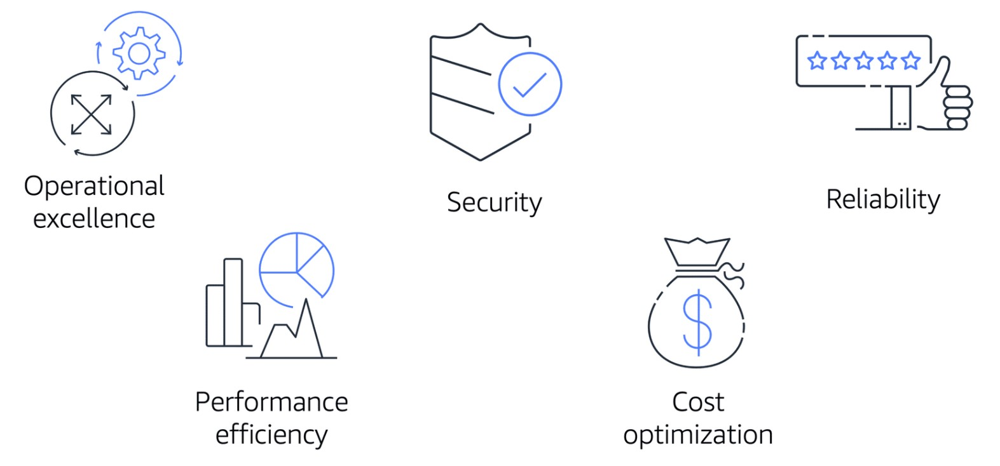

# Amazon's AWS Cloud Practitioner Essentials Course

## [Module 10: The Cloud Journey](https://dxdn3xrr0vpde.cloudfront.net/files/a/w/aws_prod1_docebosaas_com/1634706000/A4lj35p9uicwHiyWxZg9O2iOvvfmB8fBABGAzVNfm2w/tincan/9fcdd31716ade4bd2b683417d7ab62bbaa2de2ed/index.html?endpoint=https%3A%2F%2Fexplore.skillbuilder.aws%2Ftcapi%2F&auth=Basic%20L2YyZDI3MjgzLWMzNTYtNDY3ZS04NmQzLWI3M2JkM2Q1OTkyMDokMnkkMTMkNHB5Njg3aVVnSy9vbnA4WTlrSmwwZTIuWTg3bEk3c0RXbnpmOFJ1eGlDaUtvNUxacnhKRnU%3D&actor=%7B%22mbox%22%3A%22mailto%3Ajoanne-middour%40outlook.com%22%2C%22name%22%3A%22Joanne+Middour%22%7D&registration=7eb5932e-f317-4da7-a8a8-17f73f3f0422&activity_id=http%3A%2F%2FJsdOGRWZzljloSEdyFptOL7JZcTBEIYc_rise&Accept-Language=en&course_id=134&content_token=7eb5932e-f317-4da7-a8a8-17f73f3f0422&session_context=lms&course_code=DIG-BF-100-CECPEB-10-EN&course_id=134&username=f2d27283-c356-467e-86d3-b73bd3d59920&user_id=748669&hash=742480e34a02697f77a43362ebb311ab0012df6cf1e43ee8bb14788a6b80eff1#/lessons/CoqpLtyGgpriHRWghiOAuREfYscG639j)

### Introduction
In this module, you will learn how to:

- Summarize the five pillars of the Well-Architected Framework.  
- Explain the six benefits of cloud computing.

## [The AWS Well-Architected Framework](https://d1.awsstatic.com/whitepapers/architecture/AWS_Well-Architected_Framework.pdf)

- Designed to enable architects, developers, and users of AWS to build secure, high-performing, resilient, and efficient infrastructure for their applications
- Helps you understand how to design and operate reliable, secure, efficient, and cost-effective systems in the AWS Cloud
- Provides a way for you ro consistently measure your architecture against best practices and design principles
- Also helps you identify areas for improvement

The Well-Architected Framework is based on Five Pillars to ensure a consistent approach to reviewing and designing of architectures:
- **Operational Excellence**
  - Ability to run and monitor systems to deliver business value 
  - Ability to continually improve supporting processes and procedures
  - Examples:
    - Automating changes with deployment pipelines
    - Responding to events that are triggered
  - Design principles include:
    - Performing operations as code
    - Annotating documentation
    - Anticipating failure
    - Frequently making small, reversible changes

- **Security**
  - Security is priority number 1 at AWS
  - Checks integrity of data
  - Protecting systems by using encryption
  - Ability to protect information, systems, and assets while delivering business value through risk assessments and mitigation strategies
  - Best practices include:
    - Automating security best practices when possible
    - Apply security at all layers
    - Protect data in transit and at rest

- **Reliability**
  - Focuses on recovery planning
  - Examples:
    - Recovery from an Amazon DynamoDB disruption
    - Plan for an EC2 node failure
    - How you handle change to meet business and customer demand
  - Ability of a system to do the following:
    - Recover from infrastructure or service disruptions
    - Dynamically acquire computing resources to meet demand
    - Mitigate disruptions such as misconfigurations or transient network issues
  - Best practices include:
    - Testing recover procedures
    - Scaling horizontally to increase aggregate system availability
    - Automatically recovering from failure

- **Performance Efficiency**
  - Entails using IT and computing resources efficiently
  - Ability to use computing resources efficiently to meet system requirements and maintain that efficiency as demand changes and technologies evolve
  - Examples:
    - Using the right EC2 type, based on workload and memory requirements
    - Making informed decisions to maintain efficiency as business needs evolve
  - Best practices include:
    - Experimenting more often
    - Using serverless architectures
    - Designing systems to be able to go global in minutes

- **Cost Optimization**
  - Controls where money is spent
  - Ability to run systems to deliver business value at the lowest price point
  - Examples:
    - Checking if you have overestimated your EC2 server size
    - You can than lower your cost by choosing a more cost-effective size
  - Best practices include:
    - Adopting a consumption model
    - Analyzing and attributing expenditures
    - Using managed services to reduce cost of ownership

.jpg)

- It used to be that you had to have a Solutions Architect to do these checks for you, but now AWS does it for you
- AWS provides a service called "AWS Well-Architected Tool"
  - Can access via the AWS Management Console
  - Create a workload
  - Then run it against your AWS account to generate a report showing areas that should be addressed
  - It kind of looks like a traffic light system
    - Green = Everything is great
    - Orange = Some investigation is suggested, may be room for improvement
    - Red = Action really needs to happen
  - It will also present you with a plan on how to architect, using established best practices
  - You can always override these settings if the questions don't apply to your scenario, it is very customizable
  - 

### Knowledge Check

Which pillar of the AWS Well-Architected Framework focuses on the ability of a workload to consistently and correctly perform its intended functions?

- [ ] Operational Excellence

- [ ] Performance Efficiency

- [ ] Security

- [x] Reliability

> The correct response option is **Reliability**.
> 
> The other response options are incorrect because:
> 
> - The Operational Excellence pillar includes the ability to run workloads effectively, gain insights into their operations, and continuously improve supporting processes to deliver business value.
> - The Performance Efficiency pillar focuses on using computing resources efficiently to meet system requirements, and to maintain that efficiency as demand changes and technologies evolve.
> - The Security pillar includes protecting data, systems, and assets, and using cloud technologies to improve the security of your workloads.
> 
> **Learn more:**
> 
> - [Whitepaper: AWS Well-Architected Framework](https://d1.awsstatic.com/whitepapers/architecture/AWS_Well-Architected_Framework.pdf)
> 

## Benefits of the AWS Cloud

### Advantages of Cloud Computing

**Six Advantages of Cloud Computing over On-Prem or Hybrid:**
- **Trade upfront expense for variable expense**
  - Upfront expenses include:
    - Data centers
    - Physical servers
    - Staff for racking and stacking the servers
    - Other resources you would have to invest in before using computing resources
  - Instead of having to invest heavily before knowing how you're going to use them, you can pay only when you consume computing resources

- **Benefit from massive economies of scale**
  - Using Cloud Computing, you can achieve a lower variable cost than you can get on your own
  - Usage from hundreds of thousands of customers aggregates in the cloud, therefore providers such as AWS can achieve higher economies of scale
  - Economies of scale translate into lower pay-as-you-go prices
  - One reason why AWS can offer lower price scales is because they are purchasing is bulk when building data centers and therefore are receiving discounts and passing the savings onto their customers
  - AWS is also able to run their data centers more efficiently because of the scale of AWS data centers

- **Stop guessing capacity**
  - With Cloud Computing, you don't have to predict how much infrastructure capacity you will need before deploying an application
  - Instead of paying for resources that are unused or dealing with limited capacity, you can access only the capacity you need
  - You can then scale in or out in response to demand within a matter of minutes

- **Increase speed and agility**
  - The flexibility of cloud computing makes it easier for you to develop and deploy applications
  - You can spin up test environments and run experiments to help solve problems when needed, then just delete the resources when done
  - This flexibility also provides your development teams with more time to experiment and innovate

- **Stop spending money running and maintaining data centers**
  - Cloud computing in data centers often requires you to spend more money and time managing infrastructure and servers
  - A benefit of Cloud Computing is the ability to focus less on these tasks and more on your applications and customers

- **Go global in minutes**
  - The AWS Cloud global footprint enables you to quickly deploy applications to customers around the world, while providing them with low latency

### Knowledge Check

Which process is an example of benefiting from massive economies of scale?

- [ ] Deploying an application in multiple Regions around the world

- [x] Receiving lower pay-as-you-go prices as the result of AWS customers’ aggregated usage of services

- [ ] Paying for compute time as you use it instead of investing upfront costs in data centers

- [ ] Scaling your infrastructure capacity in and out to meet demand

> The correct response option is: **Receiving lower pay-as-you-go prices as the result of AWS customers’ aggregated usage of services.**
> 
> Because usage from hundreds of thousands of customers is aggregated in the cloud, providers such as AWS can achieve higher economies of scale. The economies of scale translate into lower pay-as-you-go prices. 
> 
> The other response options are incorrect because:
> 
> - Deploying an application in multiple Regions around the world: This process is an example of Go global in minutes.
> - Paying for compute time as you use it instead of investing upfront costs in data centers: This process is an example of Trade upfront expense for variable expense.
> - Scaling your infrastructure capacity in and out to meet demand: This process is an example of Stop guessing capacity.
> 
> **Learn more:**
> 
> - [Six advantages of cloud computing](https://docs.aws.amazon.com/whitepapers/latest/aws-overview/six-advantages-of-cloud-computing.html)
> 

## Module 10 Summary

n Module 10, you learned about the following concepts:

- The five pillars of the AWS Well-Architected Framework:
  - Operational excellence
  - Security
  - Reliability
  - Performance efficiency
  - Cost optimization

- Six advantages of cloud computing:
  - Trade upfront expense for variable expense.
  - Benefit from massive economies of scale.
  - Stop guessing capacity.
  - Increase speed and agility.
  - Stop spending money running and maintaining data centers.
  - Go global in minutes.

### Additional resources

- [AWS Well-Architected](https://aws.amazon.com/architecture/well-architected/)
- [Whitepaper: AWS Well-Architected Framework](https://d1.awsstatic.com/whitepapers/architecture/AWS_Well-Architected_Framework.pdf)
- [AWS Architecture Center](https://aws.amazon.com/architecture)
- [Six Advantages of Cloud Computing](https://docs.aws.amazon.com/whitepapers/latest/aws-overview/six-advantages-of-cloud-computing.html)
- [AWS Architecture Blog](https://aws.amazon.com/blogs/architecture)

## Module 10 Quiz

Which pillar of the AWS Well-Architected Framework includes the ability to run workloads effectively and gain insights into their operations?

- [ ] Cost Optimization

- [ ] Operational Excellence

- [ ] Performance Efficiency

- [ ] Reliability

> The correct response option is **Operational Excellence**.
> 
> The other response options are incorrect because:
> 
> - The Cost Optimization pillar focuses on the ability to run systems to deliver business value at the lowest price point.
> - The Performance Efficiency pillar focuses on using computing resources efficiently to meet system requirements and to maintain that efficiency as demand changes and technologies evolve.
> - The Reliability pillar focuses on the ability of a workload to consistently and correctly perform its intended functions.
> 
> **Learn more:**
> 
> - [Whitepaper: AWS Well-Architected Framework](https://d1.awsstatic.com/whitepapers/architecture/AWS_Well-Architected_Framework.pdf)
> 

What are the benefits of cloud computing? (Select TWO.)

- [x] Increase speed and agility.

- [ ] Benefit from smaller economies of scale.

- [ ] Trade variable expense for upfront expense.

- [ ] Maintain infrastructure capacity.

- [x] Stop spending money running and maintaining data centers.

> The two correct response options are: 
> 
> - **Increase speed and agility.**
> - **Stop spending money running and maintaining data centers.**
> 
> The six advantages of cloud computing are:
> 
> - Trade upfront expense for variable expense.
> - Benefit from massive economies of scale.
> - Stop guessing capacity.
> - Increase speed and agility.
> - Stop spending money running and maintaining data centers.
> - Go global in minutes.
> 
> **Learn more:**
> 
> - [Six advantages of cloud computing](https://docs.aws.amazon.com/whitepapers/latest/aws-overview/six-advantages-of-cloud-computing.html)
> 
