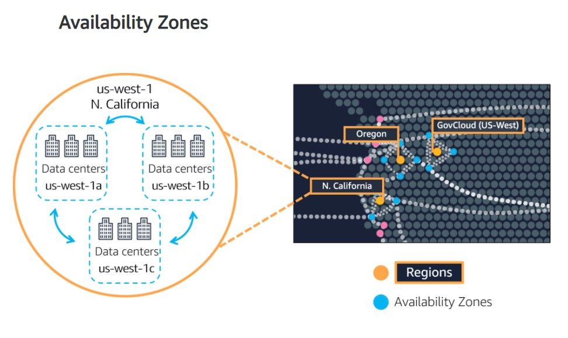
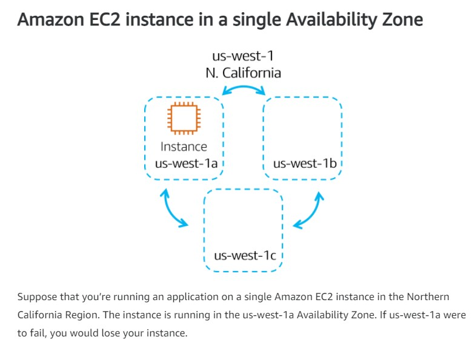
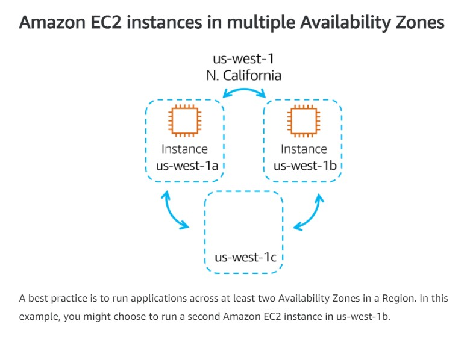
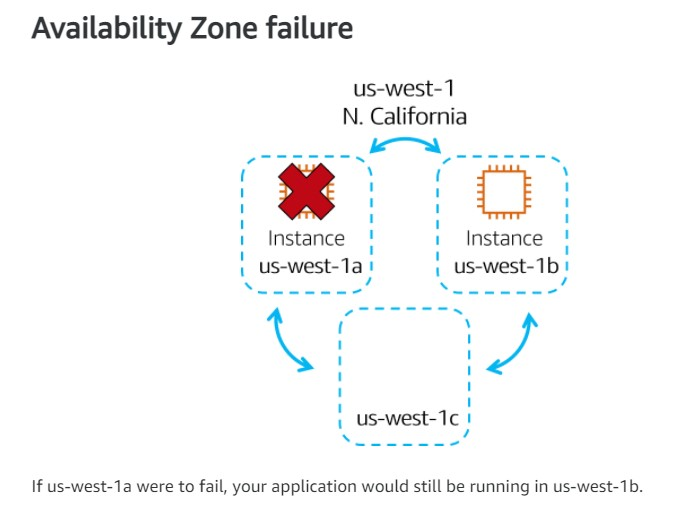
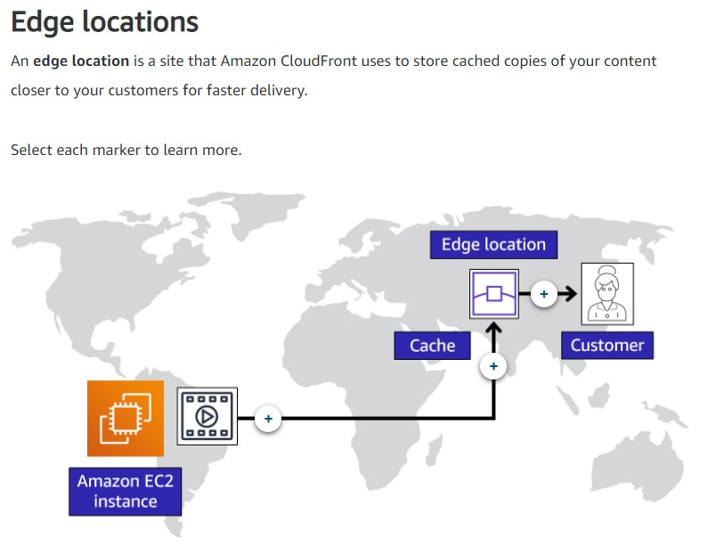
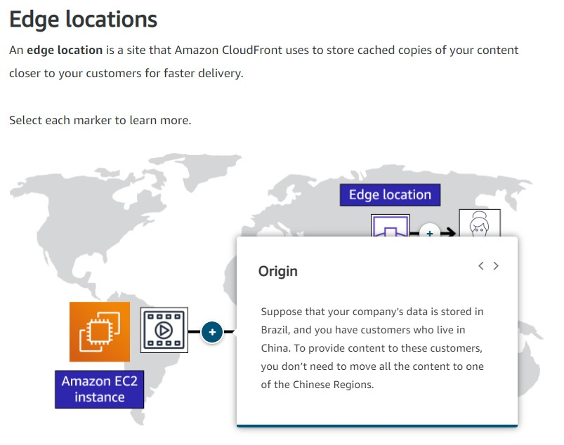
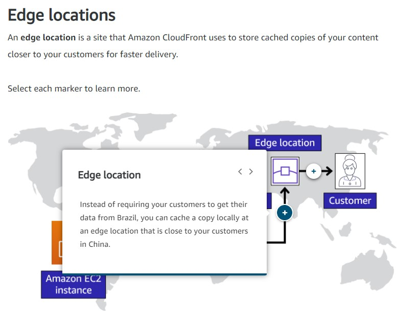
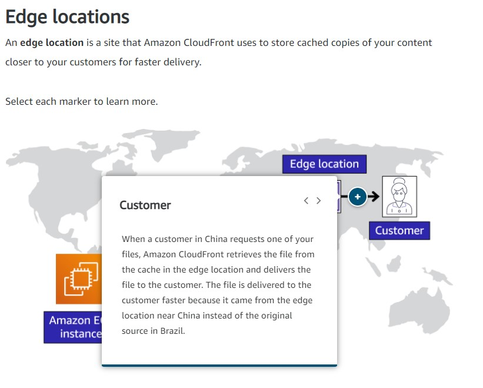

# Amazon's AWS Cloud Practitioner Essentials Course

## [Module 3: Global Infrastructure](https://content.aws.training/wbt/cecpe3/en/x8/1.0.0/index.html?endpoint=https%3a%2f%2flrs.aws.training%2fTCAPI%2f&auth=Basic%20OjAwYmVjYjM0LTFkNDYtNGFiMS05MWZhLTBlMWZmMWJhYWE0MA%3d%3d&actor=%7b%22objectType%22%3a%22Agent%22%2c%22name%22%3a%5b%22INQ5CE3B90aXZcEnqdt9gw2%22%5d%2c%22mbox%22%3a%5b%22mailto%3alms-user-INQ5CE3B90aXZcEnqdt9gw2%40amazon.com%22%5d%7d&registration=cbe1ea65-c507-4b78-9b8f-57d4f5d5abed&activity_id=http%3a%2f%2fJsdOGRWZzljloSEdyFptOL7JZcTBEIYc_rise&grouping=http%3a%2f%2fJsdOGRWZzljloSEdyFptOL7JZcTBEIYc_rise&content_token=277357c6-41a1-4399-8df5-aa0bd6b4aae0&content_endpoint=https%3a%2f%2flrs.aws.training%2fTCAPI%2fcontent%2f&externalRegistration=CompletionThresholdPercent%7c100!InstanceId%7c0!PackageId%7ccecpe3_en_x8_1.0.0!RegistrationTimestampTicks%7c16225031567556825!SaveCompletion%7c1!TranscriptId%7cLwlMtrUQsUibqhjrMdAFoQ2!UserId%7cINQ5CE3B90aXZcEnqdt9gw2&externalConfiguration=&width=988&height=724&left=466&top=0#/lessons/rFLVlAaFMIw9QsXW9yrk4i8jPGInmjnI)

## Introduction

### High Availability:  
- It is not good enough to have one giant data center where all the resources are. 
- If the power went out or some other natural disaster, all applications would go down at once. 
- Turns out it is not even good to have only 2 data centers.
- You want to have multiple locations in case something happens at one data center, the traffic can be relocated to another data center with identical resources to avoid any interruption in service.
- This is where the AWS Global Infrastructure comes into play

## AWS Global Infrastructure
AWS answers the question of "What happens when disaster strikes?" by building their data centers in large groups called "**Regions**"

### AWS Regions:
- AWS builds Regions throughout the globe closest to where the business traffic demands
- Some locations are:
  - Paris
  - Tokyo
  - Sao Paulo
  - Dublin
  - Ohio
- Inside each Region there are multiple data centers that have all the compute, storage, and other services you need to run your apps
- Each Region can be connected to other Regions through a high speed fiber network, controlled by AWS
- You get to choose which Region you want to run out of
- Each Region is isolated from every other Region, in the sense that absolutely no data goes in or out of your environment, in that Region, without you explicitly granting permission for that data to be moved
- Regional Data Sovereignty is part of the critical design of AWS Regions
- Data is subject to the local laws and statutes of the country where the Region lives
- There are 4 business factors that go into choosing a Region:
  1. Compliance
     - You must first look at your compliance requirements
     - Most business are not governed by strict compliance requirements on what Region their data needs to live in
  2. Proximity
     - How close you are to your customer base is a major factor to consider
     - The closer the proximity to your customer base the lower the latency will be
  3. Feature Availability
     - Sometimes the closest Region might not have all the AWS features you want
     - Every year AWS releases 1000s of new features and products specifically to answer customer requests and needs
     - Sometimes a lot of those brand new services take a lot of physical hardware that AWS has to build out to make the service operational
     - Sometimes that means AWS has to build the feature out one Region at a time
     - You have to use the region that is currently offering the service(s) you need
  4. Pricing
     - Even when the hardware is equal, one Region to the next, some locations are just more expensive to operate in
     - Price can be determined by many factors
     - AWS has very transparent granular pricing
     - Just know that each Region has a different price sheet
     
### AWS Availability Zones (AZs):

- Each Region has multiple data centers locate within it, one or more of these data centers are called an "**Availability Zone (AZ)**"
- Each AZ is one or more discrete data centers with redundant power, networking, and connectivity
- When you launch an EC2 instance, it launches a virtual machine on a physical hardware that is installed in an AZ
- This means each AWS Region consists of multiple isolated and physically separate AZs within a geographic Region
- AZs are not built right next to each other because if there was a nature disaster, you could lose connectivity to everything 
- If you only run one EC2 instance, it only runs in one building (one AZ)
- The obvious solution would be to run multiple identical EC2 instances as far apart as you can
- You can move they 10s of miles from each other and still not really affect the latency of your application
- This will allow your business to run without interruption should a disaster occur at one of the AZs
- AWS always recommends you run across at least 2 AZs in a Region
- Many AWS services run at the Region level, meaning they run synchronously across multiple AZs without any additional effort on your part
- Any AWS service that is listed as a "**Regionally Scoped Service**" runs on the Region level which will give you high availability with any extra effort on your part

An **Availability Zone** is a single data center or a group of data centers within a Region. Availability Zones are located tens of miles apart from each other. This is close enough to have low latency (the time between when content requested and received) between Availability Zones. However, if a disaster occurs in one part of the Region, they are distant enough to reduce the chance that multiple Availability Zones are affected.

### Knowledge Check
Which statement best describes an Availability Zone?

- [ ] A geographical area that contains AWS resources

- [x] A single data center or group of data centers within a Region

- [ ] A data center that an AWS service uses to perform service-specific operations

- [ ] A service that you can use to run AWS infrastructure within your own on-premises data center in a hybrid approach

> The correct response option is **A single data center or group of data centers within a Region**.
  > 
  > The other response options are incorrect because:
  > 
  > - A Region is a geographical area that contains AWS resources.
  > 
  > - An edge location is a data center that an AWS service uses to perform service-specific operations. Edge locations are examined in the next section of this module.
  > 
  > - AWS Outposts is a service that you can use to run AWS infrastructure, services, and tools in your own on-premises data center in a hybrid approach. AWS Outposts is explored later in this module.
  > 
  > Learn more:
  > 
  > - [AWS global infrastructure](https://aws.amazon.com/about-aws/global-infrastructure)
  > - [Regions and Availability Zones](Regions and Availability Zones)

## Edge Locations

An **edge location** is a site that Amazon CloudFront uses to store cached copies of your content closer to your customers for faster delivery.

- Caching copies of data closer to the customers all around the world uses the concept of **content delivery networks**
- **Content Delivery Networks (CDNs):** on AWS is called AWS CloudFront
- AWS CloudFront is a service that helps deliver data, video, applications, and APIs to customers around the world with low latency and high transfer speeds
- AWS CloudFront uses Edge Locations to help accelerate communication with users no matter where they are
- Edge Locations are separate from Regions
- You can push content from inside a Region to a collection of Edge locations around the world, in order to accelerate communication and content delivery
- Edge Locations also run more than just CloudFront
- They run a domain name service (DNS), known as Amazon Route 53, which helps direct customers to the correct web locations with reliably low latency
- AWS Outposts (Edge Device), AWS will basically install a fully operational mini Region, right inside your own data center
- Outpost is owned and operated by AWS, using 100% of AWS functionality, but isolated within your own building

  
This diagram shows an example of an EC2 instance with an Edge Location

  
Origin: Location where your data is stored

  
Edge Location: Caches a copy of your data closer to your customer

  
Customer: The customer received the data faster because they are close to the Edge Location where the data is cached

## How to Provision AWS Resources
In AWS, everything is an API call

- **API:** Application Programming Interface - there are pre-determined ways for you to interact with AWS services
- You can invoke/call these APIs to provision, configure, and manage your AWS resources

- Ways to interact with AWS Services:
  - AWS Management Console
    - Browser-based
    - Can manage your AWS services visually and in a way that is easy to digest
    - It is useful for building out test environments
    - You can easily view AWS bills
    - Easily view monitoring
    - Work with other non-technical resources
    - Can quickly access recently used services and search for other services by name, keyword, or acronym
    - Includes wizards and automated workflows that can simplify the process of completing tasks
    - Can also use the mobile application to perform tasks such as monitoring resources, viewing alarms, and accessing billing information
    - Multiple identities can stay logged into the mobile app at the same time

  - AWS Command Line Interface (CLI)
    - In order to create an EC2 instance on the Management Console you have to click through various screens to set all the configurations you want and then do it again when you want to set up another one
    - This can be tedious and lead to human mistakes
    - The answer to the problem is to use tools that allow you to script/program the API calls
    - This is a great reason for using the CLI
    - The CLI allows you to make API calls using the terminal on your machine
    - It makes actions scriptable and repeatable
    - You can write and run commands to launch an EC2 instance and if you want to launch another, you can just run the pre-written command again
    - You can also have these scripts run automatically like on  a schedule or triggered by another process
    - Allows you to control multiple AWS services
    - Available for users on Windows, macOS, and Linux

  - AWS Software Development Kits (SDKs)
    - Allow you to interact with AWS resources through various programming languages/platforms
    - This makes it easy for developers to create programs that use AWS without using the low level APIs
    - Also avoids the possibility for human error when manually creating
    - Enables you to use AWS services with your existing applications or create entirely new applications that will run on AWS
    - AWS provides documentation and sample code for each supporting programming language

  - Various other tools, like AWS CloudFormation

- AWS Elastic Beanstalk (a managed tool) is a service that helps you provision AWS EC2-based environments
  - You can provide your application code and desired configurations to Elastic Beanstalk
  - It then takes that information and builds out your environment for you
  - Also makes it easy to save environment configurations so they can be deployed again easily
  - Gives you the convenience of not having to provision and manage all of these pieces separately, while still giving you the visibility and control of the underlying resources
  - Helps you to focus on your application, not the infrastructure
  - Deploys the resources necessary to perform the folling tasks:
    - Adjustable capacity
    - Load balancing
    - Automatic scaling
    - Application health monitoring

- AWS CloudFormation is an infrastructure as code tool used to define a wide variety of AWS resources in a declarative way using JSON or YAML text-based documents called CloudFormation templates
  - A declarative format like this allows you to define what you want to build without specifying the details of exactly how to build it
  - Lets you define what you want and the CloudFormation engine will worry about the details on calling the APIs to get everything built out
  - Supports many AWS resources:
    - Storage
    - Database
    - Analytics
    - Machine Learning
    - and more...
  - Once you defined your resources in a CloudFormation template
  - CloudFormation will parse the template and begin provisioning all the resources you defined in parallel
  - CloudFormation manages all the calls to the backend AWS APIs for you
  - You can run the same CloudFormation template in multiple accounts or multiple Regions, and it will create identical environments across them
  - There is less room for human error as it is a totally automated process
  - Will roll back changes automatically if it detects errors

## Additional Resources:
- [Global Infrastructure](https://aws.amazon.com/about-aws/global-infrastructure/)
- [Interactive map of the AWS Global Infrastructure](https://www.infrastructure.aws/)
- [Regions and Availability Zones](https://aws.amazon.com/about-aws/global-infrastructure/regions_az)
- [AWS Networking and Content Delivery Blog](https://aws.amazon.com/blogs/networking-and-content-delivery/)
- [Tools to Build on AWS](https://aws.amazon.com/tools/)
- [AWS Customer Stories: Content Delivery](https://aws.amazon.com/solutions/case-studies/?customer-references-cards.sort-by=item.additionalFields.publishedDate&customer-references-cards.sort-order=desc&awsf.customer-references-location=*all&awsf.customer-references-segment=*all&awsf.customer-references-product=product%23vpc%7Cproduct%23api-gateway%7Cproduct%23cloudfront%7Cproduct%23route53%7Cproduct%23directconnect%7Cproduct%23elb&awsf.customer-references-category=category%23content-delivery)

### Module 3 Quiz:

1. Which statement is TRUE for the AWS global infrastructure?

    - [ ] A Region consists of a single Availability Zone.

    - [ ] An Availability Zone consists of two or more Regions.

    - [x] A Region consists of two or more Availability Zones.

    - [ ] An Availability Zone consists of a single Region.
    
    > The correct response option is **A Region consists of two or more Availability Zones.**
    >
    > For example, the South America (São Paulo) Region is sa-east-1. It includes three Availability Zones: sa-east-1a, sa-east-1b, and sa-east-1c.
    > 
    > 
    > Learn more:
    > - [AWS global infrastructure](https://aws.amazon.com/about-aws/global-infrastructure)
    > - [Regions and Availability Zones](https://aws.amazon.com/about-aws/global-infrastructure/regions_az)
    
2. Which factors should be considered when selecting a Region? (Select TWO.)

    - [x] Compliance with data governance and legal requirements

    - [x] Proximity to your customers

    - [ ] Access to 24/7 technical support

    - [ ] Ability to assign custom permissions to different users

    - [ ] Access to the AWS Command Line Interface (AWS CLI)
    
    > The correct response option are: 
    > - **Compliance with data governance and legal requirements**
    > - **Proximity to your customers**
    > 
    > Two other factors to consider when selecting a Region are pricing and the services that are available in a Region.
    >
    > The other response options are incorrect because:
    >
    > - The level of support that you choose is not determined by Region. AWS Support plans are explored later in this course.
    > 
    > - Assigning custom permissions to different users is a feature that is possible in all AWS Regions.
    > 
    > - The AWS Command Line Interface (AWS CLI) is available in all AWS Regions.
    > 
    > Learn more:
    > - [Choosing Regions and Availability Zones](https://docs.aws.amazon.com/AmazonElastiCache/latest/mem-ug/RegionsAndAZs.html)

3. Which statement best describes Amazon CloudFront?

    - [ ] A service that enables you to run infrastructure in a hybrid cloud approach
    
    - [ ] A serverless compute engine for containers
    
    - [ ] A service that enables you to send and receive messages between software components through a queue
    
    - [x] A global content delivery service

    > The correct response option is **A global content delivery service**
    > 
    > Amazon CloudFront is a content delivery service. It uses a network of edge locations to cache content and deliver content to customers all over the world. When content is cached, it is stored locally as a copy. This content might be video files, photos, webpages, and so on.
    >
    > The other response options are incorrect because:
    >
    > - AWS Outposts is a service that enables you to run infrastructure in a hybrid cloud approach.
    > 
    > - AWS Fargate is a serverless compute engine for containers.
    > 
    > - Amazon Simple Queue Service (Amazon SQS) is a service that enables you to send, store, and receive messages between software components through a queue.
   > 
   > Learn more:
   > - [Amazon CloudFront](https://aws.amazon.com/cloudfront)

4. Which site does Amazon CloudFront use to cache copies of content for faster delivery to users at any location?

    - [ ] Region
    
    - [ ] Availability Zone
    
    - [x] Edge location
    
    - [ ] Origin

    > The correct response option is **Edge location**
    >
    > The other response options are incorrect because:
    >
    > - A Region is a separate geographical location with multiple locations that are isolated from each other.
    > 
    > - An Availability Zone is a fully isolated portion of the AWS global infrastructure.
    > 
    > - An origin is the server from which CloudFront gets your files. Examples of CloudFront origins include Amazon Simple Storage Service (Amazon S3) buckets and web servers. **Note:** Amazon S3 is explored later in this course.
    >
    > Learn more:
    > - [Amazon CloudFront infrastructure](https://aws.amazon.com/cloudfront/features/?nc=sn&loc=2#Amazon_CloudFront_Infrastructure)

5. Which action can you perform with AWS Outposts?

    - [ ] Automate actions for AWS services and applications through scripts.
    
    - [ ] Access wizards and automated workflows to perform tasks in AWS services.
    
    - [ ] Develop AWS applications in supported programming languages.
    
    - [x] Extend AWS infrastructure and services to your on-premises data center.

    > The correct response option is **Extend AWS infrastructure and services to your on-premises data center**
    > 
    > The other response options are incorrect because:
    >
    > - The AWS Command Line Interface (AWS CLI) is used to automate actions for AWS services and applications through scripts.
    > 
    > - The AWS Management Console includes wizards and workflows that you can use to complete tasks in AWS services.
    > 
    > - Software development kits (SDKs) enable you to develop AWS applications in supported programming languages.
    > 
    > Learn more:
    > - [AWS Outposts](https://aws.amazon.com/outposts/)

