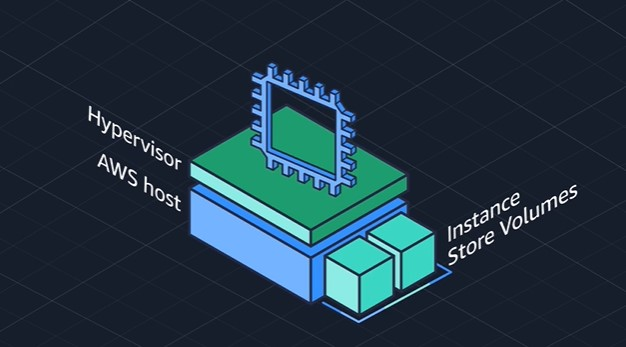
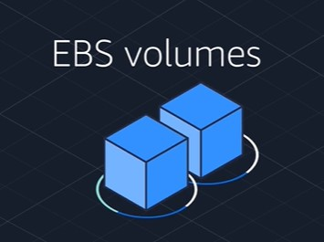
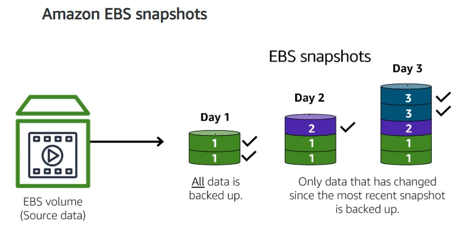
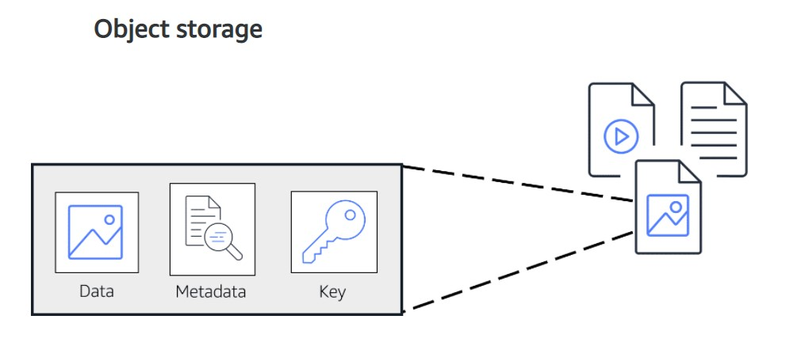
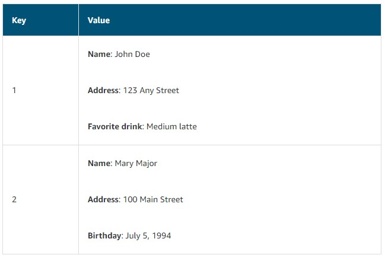

# Amazon's AWS Cloud Practitioner Essentials Course

## [Module 5: Storage and Databases](https://content.aws.training/wbt/cecpeb/en/x1/1.0.1/index.html?endpoint=https%3a%2f%2flrs.aws.training%2fTCAPI%2f&auth=Basic%20OjZlNTUzNGNlLTIyMGUtNGIyZC04NDE0LWM3MGRjYTk3N2YxZg%3d%3d&actor=%7b%22objectType%22%3a%22Agent%22%2c%22name%22%3a%5b%22INQ5CE3B90aXZcEnqdt9gw2%22%5d%2c%22mbox%22%3a%5b%22mailto%3alms-user-INQ5CE3B90aXZcEnqdt9gw2%40amazon.com%22%5d%7d&registration=a1f41fc6-1511-44e4-85a4-8e1923af7bc6&activity_id=http%3a%2f%2fJsdOGRWZzljloSEdyFptOL7JZcTBEIYc_rise&grouping=http%3a%2f%2fJsdOGRWZzljloSEdyFptOL7JZcTBEIYc_rise&content_token=761a029f-115c-4c0d-8b14-f6b93457d0fc&content_endpoint=https%3a%2f%2flrs.aws.training%2fTCAPI%2fcontent%2f&externalRegistration=CompletionThresholdPercent%7c100!InstanceId%7c0!PackageId%7ccecpeb_en_x1_1.0.1!RegistrationTimestampTicks%7c16225031567556825!SaveCompletion%7c1!TranscriptId%7cLwlMtrUQsUibqhjrMdAFoQ2!UserId%7cINQ5CE3B90aXZcEnqdt9gw2&externalConfiguration=&width=988&height=724&left=466&top=0#/lessons/0xPXSHZb74T6jrOyiqyd1B0tSK4aYtkY)

## [Instance Stores and AWS Elastic Block Store (EBS)](https://content.aws.training/wbt/cecpeb/en/x1/1.0.1/index.html?endpoint=https%3a%2f%2flrs.aws.training%2fTCAPI%2f&auth=Basic%20OjZlNTUzNGNlLTIyMGUtNGIyZC04NDE0LWM3MGRjYTk3N2YxZg%3d%3d&actor=%7b%22objectType%22%3a%22Agent%22%2c%22name%22%3a%5b%22INQ5CE3B90aXZcEnqdt9gw2%22%5d%2c%22mbox%22%3a%5b%22mailto%3alms-user-INQ5CE3B90aXZcEnqdt9gw2%40amazon.com%22%5d%7d&registration=a1f41fc6-1511-44e4-85a4-8e1923af7bc6&activity_id=http%3a%2f%2fJsdOGRWZzljloSEdyFptOL7JZcTBEIYc_rise&grouping=http%3a%2f%2fJsdOGRWZzljloSEdyFptOL7JZcTBEIYc_rise&content_token=761a029f-115c-4c0d-8b14-f6b93457d0fc&content_endpoint=https%3a%2f%2flrs.aws.training%2fTCAPI%2fcontent%2f&externalRegistration=CompletionThresholdPercent%7c100!InstanceId%7c0!PackageId%7ccecpeb_en_x1_1.0.1!RegistrationTimestampTicks%7c16225031567556825!SaveCompletion%7c1!TranscriptId%7cLwlMtrUQsUibqhjrMdAFoQ2!UserId%7cINQ5CE3B90aXZcEnqdt9gw2&externalConfiguration=&width=988&height=724&left=466&top=0#/lessons/KKifKVrSpwzJfywXist7zgF8U6icdA1a)
### Block Level Storage

- A place to store files
- A file being a series of bytes that are stored in blocks on a disc
- When a file is updated, it updates just the pieces that change
  - This makes it an efficient storage type when working with applications like databases, enterprise software, or file systems
- Just like a hard drive

### [Instance stores](https://docs.aws.amazon.com/AWSEC2/latest/UserGuide/InstanceStorage.html)

- Local block-level storage for an EC2 instance
- Physically attached to the host your EC2 instance is running on top of
- You can write to it just like a normal hard drive
- Since this volume is attached to the underlying host, if you stop or terminate your EC2 instance, all data writen to the instance store volume will be deleted
  - The reason for this is that if you start your instance from a stopped state, it is likely that instance will start up on another host where that volume does not exist
- Only useful in situations where you can loose the data being writen to the drive, such as temp files, scratch data, and data that can be easily recreated

### [Amazon Elastic Block Store (EBS)](https://aws.amazon.com/ebs)

- You can create virtual hard drives that are called *EBS volumes* that you can attach to your EC2 instances
- The data you write to an EBS volume can persist between stops and starts of an EC2 instance
- Come in all different sizes and types
- You define the size, type, and configurations of the volume, then attach it to your EC2 instance
- EBS allows you to take incremental backups of your data called ***[snapshots](https://docs.aws.amazon.com/AWSEC2/latest/UserGuide/EBSSnapshots.html)***
  
  - The first backup taken of the volume copies **all** the data
  - For subsequent backups, only the blocks of data that have changed since the most recent snapshot are saved

### Knowledge Check
In the following, match the characteristics that describe instance stores and Amazon EBS volumes to the correct services. Drag the items to sort them into the appropriate category.

| Instance Stores | Amazon EBS Volumes |
| --- | --- |
| Best for temporary data that is not kept long term | Best for data that requires retention |
| When stopping or terminating an EC2 instance, data is deleted | When stopping or terminating an EC2 instance, data remains available |

## [AWS Simple Storage Service (S3)](https://content.aws.training/wbt/cecpeb/en/x1/1.0.1/index.html?endpoint=https%3a%2f%2flrs.aws.training%2fTCAPI%2f&auth=Basic%20OjZlNTUzNGNlLTIyMGUtNGIyZC04NDE0LWM3MGRjYTk3N2YxZg%3d%3d&actor=%7b%22objectType%22%3a%22Agent%22%2c%22name%22%3a%5b%22INQ5CE3B90aXZcEnqdt9gw2%22%5d%2c%22mbox%22%3a%5b%22mailto%3alms-user-INQ5CE3B90aXZcEnqdt9gw2%40amazon.com%22%5d%7d&registration=a1f41fc6-1511-44e4-85a4-8e1923af7bc6&activity_id=http%3a%2f%2fJsdOGRWZzljloSEdyFptOL7JZcTBEIYc_rise&grouping=http%3a%2f%2fJsdOGRWZzljloSEdyFptOL7JZcTBEIYc_rise&content_token=761a029f-115c-4c0d-8b14-f6b93457d0fc&content_endpoint=https%3a%2f%2flrs.aws.training%2fTCAPI%2fcontent%2f&externalRegistration=CompletionThresholdPercent%7c100!InstanceId%7c0!PackageId%7ccecpeb_en_x1_1.0.1!RegistrationTimestampTicks%7c16225031567556825!SaveCompletion%7c1!TranscriptId%7cLwlMtrUQsUibqhjrMdAFoQ2!UserId%7cINQ5CE3B90aXZcEnqdt9gw2&externalConfiguration=&width=988&height=724&left=466&top=0#/lessons/2aY84nTxiJ35RoiHc-EFIFIXXajUjXTe)
### Object Storage
- Data is stored as objects (a file)
  
  - Each object consists of: 
    - **Data:** Can be an image, video, text document, or any other type of file
    - **Metadata:** Information about what the data is, how it is used, the object size, and so on
    - **Key:** The object's unique identifier
  - When a file in object storage is modified, the entire object is updated

### [Amazon Simple Storage Service (S3)](https://aws.amazon.com/s3/)
- A data store that allows you to store and retrieve an unlimited amount of data at any scale
- Instead of storing them in a "file directory" they are stored in "buckets"
- Upload an object up to the maximum size of 5 TB
- Can version objects to protect them from accidental deletion
  - Always maintain previous versions of an object
- Can create multiple buckets and store them across different classes or tiers of data
- You can then create permissions to limit who can see or access objects
- You can stage data between different tiers

### [Amazon S3 Storage Classes](https://aws.amazon.com/s3/storage-classes)
- **Standard:** 
  - Designed for frequently accessed data
  - Comes with 11 9's of durability
    - Object stored in Standard tier has a 99.999999999% probability that it will remain intact after a period of 1 year
  - Data is stored in a minimum of 3 AZs to ensure this durability
  - Good use cases: website hosting, content distribution, and data analytics
  - Most costly out of all the class because of availability
- **Standard-Infrequent Access (Standard-IA):**
  - Used for data that is accessed less frequently, but requires rapid access when needed
  - Has the same level of availability as Standard but cost more to retrieve the data
  - Has a lower storage price than Standard but a higher retrieval price
  - Data is stored in a minimum of 3 AZs to ensure durability
  - Perfect place to store backups, disaster recovery files, or any object that requires a long-term storage
- **One Zone-Infrequent Access (One Zone-IA):**
  - Stores data in a single AZ only
  - Has a lower storage price than Standard-IA
  - This is a good choice if both of the following apply:
    - You want to save costs on storage
    - You can easily reproduce your data in the event of an AZ failure
- **Intelligent-Tiering:**
  - Amazon monitors objects' access patterns
    - If you have not accessed an object for 30 consecutive days, automatically moves it to Standard-IA
    - If you access an object in Standard-IA, automatically moves it to Standard
  - Ideal for data with unknown or changing access patterns
  - Requires a small monthly monitoring and automation fee per object
- **Glacier:**
  - Low-cost storage designed for achieving data
  - You can simply move the data into it, or create *vaults* and populate them with archives
  - You can apply a *Glacier Vault Lock* policy if you have regulations around retaining data for a specific amount of time
    - Can specify controls such as WORM (Write Once / Read Many) which will lock the policy from future edits
    - Once locked the policy can no longer be changed
  - You have 3 options for retrieval, which range from minutes to hours
  - You also have the option of uploading directly to Glacier or using S3 Lifecycle policies
  - A good use case: retaining data for several years for auditing purposes, and it does not need to be retrieved rapidly
- **Glacier Deep Archive:**
  - Lowest-cost object storage class ideal for archiving
  - Able to retrieve objects within 12 hours

### Lifecycle Policies
- Policies you can create that move data automatically between tiers

### Knowledge Check
You want to store data that is infrequently accessed but must be immediately available when needed. Which Amazon S3 storage class should you use?

- [ ] S3 Intelligent-Tiering

- [ ] S3 Glacier Deep Archive

- [x] S3 Standard-IA

- [ ] S3 Glacier

> The correct response option is **S3 Standard-IA**.
> 
> The S3 Standard-IA storage class is ideal for data that is infrequently accessed but requires high availability when needed. Both S3 Standard and S3 Standard-IA store data in a minimum of three Availability Zones. S3 Standard-IA provides the same level of availability as S3 Standard but at a lower storage price.
> 
> The other response options are incorrect because:
> 
> - In the S3 Intelligent-Tiering storage class, Amazon S3 monitors objects’ access patterns. If you haven’t accessed an object for 30 consecutive days, Amazon S3 automatically moves it to the infrequent access tier, S3 Standard-IA. If you access an object in the infrequent access tier, Amazon S3 automatically moves it to the frequent access tier, S3 Standard.
> - S3 Glacier and S3 Glacier Deep Archive are low-cost storage classes that are ideal for data archiving. They would not be the best choice for this scenario, which requires high availability. You can retrieve objects stored in the S3 Glacier storage class within a few minutes to a few hours. By comparison, you can retrieve objects stored in the S3 Glacier Deep Archive storage class within 12 hours.
> 

### Comparing EBS and S3
| EBS | S3 |
| --- | --- |
| Block Storage | Regional Object Storage |
| Sizes up to 16 TBs | Unlimited Storage |
| Survive the termination of their EC2 instance | Individual objects up to 5 TBs |
| Solid State by default | Write Once/Read Many (WORM) |
| HDD options | 99.999999999% durable |

1. You're running a photo analysis website where users upload a photo of themselves, and your application finds the animals that look just like them. You have potentially millions of animal pictures that all need to be indexed and possibly viewed by thousands of people at once. What is the best storage option?
   > This is the perfect use case for S3. 
   > - S3 is already web-enabled
   > - Every object already has an url that you can control access rights to who can see or manage the image
   > - It is Regionally distributed, so it brings durability to the table
   > - Cost-effective over EBS
   > - Serverless, so no need for an EC2 instance

2. You have an 80-gigabyte video file that you're making edit corrections on.
   > This is the perfect use case for EBS
   > - Being block storage, if you edit just one scene, only that scene needs to be updated, verses on S3 (being object storage) the whole file would need to be updated

## [AWS Elastic File System (EFS)](https://content.aws.training/wbt/cecpeb/en/x1/1.0.1/index.html?endpoint=https%3a%2f%2flrs.aws.training%2fTCAPI%2f&auth=Basic%20OjdiMjY0ZTg5LTA2ZDYtNDJiYS1hMzE4LTg0NzFmZWFlY2QwMw%3d%3d&actor=%7b%22objectType%22%3a%22Agent%22%2c%22name%22%3a%5b%22INQ5CE3B90aXZcEnqdt9gw2%22%5d%2c%22mbox%22%3a%5b%22mailto%3alms-user-INQ5CE3B90aXZcEnqdt9gw2%40amazon.com%22%5d%7d&registration=a1f41fc6-1511-44e4-85a4-8e1923af7bc6&activity_id=http%3a%2f%2fJsdOGRWZzljloSEdyFptOL7JZcTBEIYc_rise&grouping=http%3a%2f%2fJsdOGRWZzljloSEdyFptOL7JZcTBEIYc_rise&content_token=c72fc414-a497-415b-aa57-65394e7406a3&content_endpoint=https%3a%2f%2flrs.aws.training%2fTCAPI%2fcontent%2f&externalRegistration=CompletionThresholdPercent%7c100!InstanceId%7c0!PackageId%7ccecpeb_en_x1_1.0.1!RegistrationTimestampTicks%7c16225031567556825!SaveCompletion%7c1!TranscriptId%7cLwlMtrUQsUibqhjrMdAFoQ2!UserId%7cINQ5CE3B90aXZcEnqdt9gw2&externalConfiguration=&width=988&height=724&left=466&top=0#/lessons/ucez4uxeaZpckA1nNy8iGPre9ZHN_tCJ)
### [Elastic File Storage (EFS)](https://aws.amazon.com/efs/)
- A Managed File System
- Can keep all existing files in place but let AWS do all the heavy lifting of the scaling and replication
- Allows you to have multiple instances accessing the data in the EFS at the same time
- It scales up and down as needed automatically
- It can scale on demand to petabytes without disrupting applications

### Comparing EBS and EFS
| EBS | EFS |
| --- | --- |
| Volumes attach to EC2 instances | Multiple instances reading/writing simultaneously |
| AZ level resource | Regional resource |
| Stores data in a **single** AZ | Stores data in/across **multiple** AZs |
| Need to be in the same AZ to attach EC2 instances | Any EC2 instance in the Region has access to it |
| It is a virtual hard drive | Linux file system |
| Volumes do not automatically scale | Automatically scales |
| Needs to be connected to EC2 instance for access | Can be accessed using AWS Direct Connect |

## [AWS Relational Database Service (RDS)](https://content.aws.training/wbt/cecpeb/en/x1/1.0.1/index.html?endpoint=https%3a%2f%2flrs.aws.training%2fTCAPI%2f&auth=Basic%20OjdiMjY0ZTg5LTA2ZDYtNDJiYS1hMzE4LTg0NzFmZWFlY2QwMw%3d%3d&actor=%7b%22objectType%22%3a%22Agent%22%2c%22name%22%3a%5b%22INQ5CE3B90aXZcEnqdt9gw2%22%5d%2c%22mbox%22%3a%5b%22mailto%3alms-user-INQ5CE3B90aXZcEnqdt9gw2%40amazon.com%22%5d%7d&registration=a1f41fc6-1511-44e4-85a4-8e1923af7bc6&activity_id=http%3a%2f%2fJsdOGRWZzljloSEdyFptOL7JZcTBEIYc_rise&grouping=http%3a%2f%2fJsdOGRWZzljloSEdyFptOL7JZcTBEIYc_rise&content_token=c72fc414-a497-415b-aa57-65394e7406a3&content_endpoint=https%3a%2f%2flrs.aws.training%2fTCAPI%2fcontent%2f&externalRegistration=CompletionThresholdPercent%7c100!InstanceId%7c0!PackageId%7ccecpeb_en_x1_1.0.1!RegistrationTimestampTicks%7c16225031567556825!SaveCompletion%7c1!TranscriptId%7cLwlMtrUQsUibqhjrMdAFoQ2!UserId%7cINQ5CE3B90aXZcEnqdt9gw2&externalConfiguration=&width=988&height=724&left=466&top=0#/lessons/r1_YVvN-kqaV67Gfo2igeCkFGv0y1I1b)
### Relational Databases
- Also referred to as **Relational Database Management Systems (RDBMS)**
- Data is stored in a way that relates it to other pieces of data
- Use **structured query language (SQL)** to store and query data
- This allows data to be stored in an easily understandable, consistent, and scalable way

### [AWS Relational Database Services (RDS)](https://aws.amazon.com/rds/)
- A service that enables you to run relational databases in the AWS Cloud
- A managed service that automates tasks such as hardware provisioning, database setup, patching, redundancy, failover, disaster recovery, and backups
- Can be integrated with other AWS services such as AWS Lambda to query your database from a serverless application
- Provides a number of different security options
- Many AWS RDS database engines offer ***encryption at rest*** (protecting data while it is stored) and ***encryption in transit*** (protecting data while it is being sent and received)
- **Lift-and-Shift Migration:** Move your existing database to run on an AWS EC2 instance

### AWS RDS Database Engines
RDS is available on six database engines, which optimize for memory, performance, or input/output (I/O)
- Amazon Aurora
- PostgresSQL
- MySQL
- MariaDB
- Oracle Database
- Microsoft SQL Sever

### [Amazon Aurora](https://aws.amazon.com/rds/aurora/)
- An enterprise-class relational database that is compatible with MySQL and PostgresSQL relational databases
- Cloud native - built on the cloud, never been an on-premises database engine
- Up to 5 times faster than standard MySQL databases
- Up to 3 times faster than standard PostgresSQL databases
- Helps reduce costs by reducing unnecessary input/output (I/O) operations, while ensuring that your database resources remain reliable and available
- Replicates 6 copies of your data across 3 AZs
- Up to 15 read replicas
  - Customer specifies how many they need
- Continuously backs up your data to AWS S3
- Point-in-time recovery so you can recover data from a specific period
- Great for workloads that require high availability
- Priced at 1/10th the cost of commercial databases

## [Amazon DynamoDB](https://content.aws.training/wbt/cecpeb/en/x1/1.0.1/index.html?endpoint=https%3a%2f%2flrs.aws.training%2fTCAPI%2f&auth=Basic%20OjYyYjYxM2YwLTBjYmUtNGFlOS04YjZkLWYyOWM4ZmFiMTMwMA%3d%3d&actor=%7b%22objectType%22%3a%22Agent%22%2c%22name%22%3a%5b%22INQ5CE3B90aXZcEnqdt9gw2%22%5d%2c%22mbox%22%3a%5b%22mailto%3alms-user-INQ5CE3B90aXZcEnqdt9gw2%40amazon.com%22%5d%7d&registration=a1f41fc6-1511-44e4-85a4-8e1923af7bc6&activity_id=http%3a%2f%2fJsdOGRWZzljloSEdyFptOL7JZcTBEIYc_rise&grouping=http%3a%2f%2fJsdOGRWZzljloSEdyFptOL7JZcTBEIYc_rise&content_token=741a72c0-d07b-452b-b250-31a3bec71e64&content_endpoint=https%3a%2f%2flrs.aws.training%2fTCAPI%2fcontent%2f&externalRegistration=CompletionThresholdPercent%7c100!InstanceId%7c0!PackageId%7ccecpeb_en_x1_1.0.1!RegistrationTimestampTicks%7c16225031567556825!SaveCompletion%7c1!TranscriptId%7cLwlMtrUQsUibqhjrMdAFoQ2!UserId%7cINQ5CE3B90aXZcEnqdt9gw2&externalConfiguration=&width=988&height=724&left=466&top=0#/lessons/ic9iSyj-1l8bvd1gyBQMiMDAyqPYPs-R)
### Non-relational Databases
- Is just a table, where all data is stored, verses multiple tables in a relational database
- Sometimes referred to as "NoSQL databases" because they use structures other than rows and columns to organize data
- One type of structural approach is key-value pairs
  - Data is organized into items (key) and items have attributes (values)
    
  - Every item in the table does not have to have the same number or the same type of attributes

### [Amazon DynamoDB](https://aws.amazon.com/dynamodb/)
- A fully managed key-value non-relational database service
- Purpose built; It has specific use cases and isn't the best fit for every workload out there
- Delivers single-digit millisecond performance at any scale
- Serverless; don't need to provision, patch, or manage servers
  - You also don't have to install, maintain, or operate software
- Automatic Scaling:
  - Automatically scales to adjust for changes in capacity while maintaining consistent performance
  - Suitable choice for use cases that require high performance while scaling

### Comparing Amazon RDS and Amazon DynamoDB
| RDS | DynamoDB |
| --- | --- |
| Automatic high availability | Uses key-value pairs |
| Recovery provided | Requires no advance schema |
| Customer ownership of data | Massive throughput capabilities |
| Customer ownership of the schema | Petabytes size potential |
| Customer control of the network | Granular API access |

Relational databases have been around since the moment businesses started using computers. Being able to build complex analysis of data spread across multiple tables, is the strength of any relational system. 

1. You have a sales supply chain management system that you have to analyze for weak spots. Which type of database would be the best fit?
    > The RDS (Relational Database Service) would be the best fit here because it is built for business analytics because you need to do complex relational joins.

2. Imagine you have an employee contact list: names, phone numbers, emails, employee IDs. Well, this is all single table territory. 
    > I could use a relational database for this, but the things that make relational databases great, all of that complex functionality, creates overhead and lag and expense if you're not actually using it. This is where non-relational databases, Dynamo DB, delivers the knockout punch. By eliminating all the overhead, DynamoDB allows you to build powerful, incredibly fast databases where you don't need complex joining functionality.

### Knowledge Check
What are the scenarios in which you should use Amazon Relational Database Service (Amazon RDS)? (Select TWO.)

- [ ] Running a serverless database

- [x] Using SQL to organize data

- [ ] Storing data in a key-value database

- [ ] Scaling up to 10 trillion requests per day

- [x] Storing data in an Amazon Aurora database

> The two correct response options are:
> 
> - Using SQL to organize data
> - Storing data in an Amazon Aurora database
> 
> The other three response options are scenarios in which you should use Amazon DynamoDB.

## [Amazon Redshift](https://content.aws.training/wbt/cecpeb/en/x1/1.0.1/index.html?endpoint=https%3a%2f%2flrs.aws.training%2fTCAPI%2f&auth=Basic%20OjYyYjYxM2YwLTBjYmUtNGFlOS04YjZkLWYyOWM4ZmFiMTMwMA%3d%3d&actor=%7b%22objectType%22%3a%22Agent%22%2c%22name%22%3a%5b%22INQ5CE3B90aXZcEnqdt9gw2%22%5d%2c%22mbox%22%3a%5b%22mailto%3alms-user-INQ5CE3B90aXZcEnqdt9gw2%40amazon.com%22%5d%7d&registration=a1f41fc6-1511-44e4-85a4-8e1923af7bc6&activity_id=http%3a%2f%2fJsdOGRWZzljloSEdyFptOL7JZcTBEIYc_rise&grouping=http%3a%2f%2fJsdOGRWZzljloSEdyFptOL7JZcTBEIYc_rise&content_token=741a72c0-d07b-452b-b250-31a3bec71e64&content_endpoint=https%3a%2f%2flrs.aws.training%2fTCAPI%2fcontent%2f&externalRegistration=CompletionThresholdPercent%7c100!InstanceId%7c0!PackageId%7ccecpeb_en_x1_1.0.1!RegistrationTimestampTicks%7c16225031567556825!SaveCompletion%7c1!TranscriptId%7cLwlMtrUQsUibqhjrMdAFoQ2!UserId%7cINQ5CE3B90aXZcEnqdt9gw2&externalConfiguration=&width=988&height=724&left=466&top=0#/lessons/IZFcd63Mcl04Y7e83TgSBfL8dT1H67Eq)
- Sometimes we have a business need that goes outside what is happening right now to what did happen
- This data analysis is a realm of a whole different class of databases
- Modern databases that are engineered for high speed, real time ingestion, and queries may not be the best fit
  - In order to handle the velocity of real time read/write functionality, most relational databases tend to function fabulously at certain capacities
  - The problem with historical analytics, is the data collection never stops
  - The volume of data can overwhelm even the beefiest traditional relational databases
  - Not just the volume, but the variety of data can be a problem
  - Say you want to run business intelligence (BI) projects against data coming from different data stores?
    - A single query against multiple databases sounds nice, but traditional databases don't handle them easily
- Once data becomes too complex to handle with traditional relational databases, you've entered the world of ***data warehouses***
  - **Data Warehouses:** Engineered specifically for handling big data, where you are looking at historical (happened in the past, will not change) data as opposed to operational (currently happening, can change) data

### [Amazon Redshift](https://aws.amazon.com/redshift)
- Data warehousing service that you can use for big data analytics
- Offers the ability to collect data from many sources
- Helps you understand relationships and trends across your data
- Massively scalable
- Redshift nodes in multiple petabyte sizes is very common
- In cooperation with Amazon Redshift Spectrum, you can directly run a single SQL query against exabytes of unstructured data running in data lakes
- Uses a variety of innovations that allow you to achieve up to 10 times higher performance than traditional databases, when it comes to BI workloads
- The key is that when you need big data BI solutions that Redshift allows you to get started with a single API call

## [AWS Database Migration Service](https://content.aws.training/wbt/cecpeb/en/x1/1.0.1/index.html?endpoint=https%3a%2f%2flrs.aws.training%2fTCAPI%2f&auth=Basic%20OjYyYjYxM2YwLTBjYmUtNGFlOS04YjZkLWYyOWM4ZmFiMTMwMA%3d%3d&actor=%7b%22objectType%22%3a%22Agent%22%2c%22name%22%3a%5b%22INQ5CE3B90aXZcEnqdt9gw2%22%5d%2c%22mbox%22%3a%5b%22mailto%3alms-user-INQ5CE3B90aXZcEnqdt9gw2%40amazon.com%22%5d%7d&registration=a1f41fc6-1511-44e4-85a4-8e1923af7bc6&activity_id=http%3a%2f%2fJsdOGRWZzljloSEdyFptOL7JZcTBEIYc_rise&grouping=http%3a%2f%2fJsdOGRWZzljloSEdyFptOL7JZcTBEIYc_rise&content_token=741a72c0-d07b-452b-b250-31a3bec71e64&content_endpoint=https%3a%2f%2flrs.aws.training%2fTCAPI%2fcontent%2f&externalRegistration=CompletionThresholdPercent%7c100!InstanceId%7c0!PackageId%7ccecpeb_en_x1_1.0.1!RegistrationTimestampTicks%7c16225031567556825!SaveCompletion%7c1!TranscriptId%7cLwlMtrUQsUibqhjrMdAFoQ2!UserId%7cINQ5CE3B90aXZcEnqdt9gw2&externalConfiguration=&width=988&height=724&left=466&top=0#/lessons/9p4y8NCLhhGICPnL0jodKOHVFZfE5Hzk)

### [AWS Database Migration Service (AWS DMS)](https://aws.amazon.com/dms/)
- Enables you to migrate relational databases, non-relational databases, and other types of data stores
- Offers a secure and easy way to migrate data
- You move data between a ***source database and target database***
  - The [source database and target database](https://aws.amazon.com/dms/resources) can be of the same type or different types
    - **Homogenous Databases:** The same type of databases
      - Examples:
        - MySQL --> Amazon RDS for MySQL
        - Microsoft SQL Server --> Amazon RDS for SQL Server
        - Oracle --> Amazon RDS for Oracle
      - The process is fairly straightforward since schema structures, data types, and database code is compatible between the source and target
      - The source can be:
        - On-premises
        - Running on an EC2 instance
        - Running on an Amazon RDS
      - The target can be:
        - A database running on an Amazon EC2 instance
        - A database running on Amazon RDS
    - **Heterogeneous Databases:** different types of databases
      - This is a little more complicated and is a 2-step process
        - Since the schema structures, data types, and database code is different, we first need to convert them using the ***AWS Schema Conversion Tool***
          - This will convert the source schema and code to match that of the target database
          - Then need to use DMS to migrate data from the source database to the target database
  - During migration, your source database remains operational 
    - This will reduce downtime for any applications that rely on the database

### Other Use Cases for AWS DMS
- Development and test database migrations
  - Enabling developers to test applications against production data without affecting production users
  - Would use DMS to migrate a copy of your production database to your dev or testing environment
  - It can be set up as once-off or continuously
- Database consolidation
  - Combining several databases into a single database
- Continuous replication
  - Sending ongoing copies of your data to other target sources instead of doing a one-time migration
  - Can use this for disaster recover
  - Also, can use for geographic separation

## [Additional Database Services](https://content.aws.training/wbt/cecpeb/en/x1/1.0.1/index.html?endpoint=https%3a%2f%2flrs.aws.training%2fTCAPI%2f&auth=Basic%20OjYyYjYxM2YwLTBjYmUtNGFlOS04YjZkLWYyOWM4ZmFiMTMwMA%3d%3d&actor=%7b%22objectType%22%3a%22Agent%22%2c%22name%22%3a%5b%22INQ5CE3B90aXZcEnqdt9gw2%22%5d%2c%22mbox%22%3a%5b%22mailto%3alms-user-INQ5CE3B90aXZcEnqdt9gw2%40amazon.com%22%5d%7d&registration=a1f41fc6-1511-44e4-85a4-8e1923af7bc6&activity_id=http%3a%2f%2fJsdOGRWZzljloSEdyFptOL7JZcTBEIYc_rise&grouping=http%3a%2f%2fJsdOGRWZzljloSEdyFptOL7JZcTBEIYc_rise&content_token=741a72c0-d07b-452b-b250-31a3bec71e64&content_endpoint=https%3a%2f%2flrs.aws.training%2fTCAPI%2fcontent%2f&externalRegistration=CompletionThresholdPercent%7c100!InstanceId%7c0!PackageId%7ccecpeb_en_x1_1.0.1!RegistrationTimestampTicks%7c16225031567556825!SaveCompletion%7c1!TranscriptId%7cLwlMtrUQsUibqhjrMdAFoQ2!UserId%7cINQ5CE3B90aXZcEnqdt9gw2&externalConfiguration=&width=988&height=724&left=466&top=0#/lessons/gK3FuAwnmxecwPzoEkMDYEQe_eVOmTm5)

- No matter what any database vendor may try to tell you, there is no one-size-fits-all database for all purposes

### [Amazon DocumentDB](https://aws.amazon.com/documentdb)
- Document database service that supports MongoDB (a document database program) workloads
- Great for content management, catalogs, or user profiles
- Can add more "attributes" than you can with AWS DynamoDB

### [Amazon Neptune](https://aws.amazon.com/neptune)
- A graph database service
- Can be used to build and run applications that work with highly connected datasets
  - Examples:
    - Recommendation engines
    - Fraud detection
    - Knowledge graphs
    - Social media site

### [Amazon Quantum Ledger Database (Amazon QLDB)](https://aws.amazon.com/qldb)
- A ledger database service
- An immutable system of record, where an entry can never be removed from the audits
  - Examples:
    - A supply chain - tracking with assurances that nothing is lost
    - Banking or financial records that require 100% immutability
- Can be used to review a complete history of all changes that have been made to your application

### [Amazon Managed Blockchain](https://aws.amazon.com/managed-blockchain)
- A service that you can use to create and manage blockchain networks with open-source frameworks
  - **Blockchain:** A distributed ledger system that lets multiple parties run transactions and share data without a central authority

### [Amazon ElastiCache](https://aws.amazon.com/elasticache)
- A service that adds caching layers on top of your database to help improve the read timers of common requests
- Supports two types of data stores:
  - Redis
  - Memcached

### [Amazon DynamoDB Accelerator (DAX)](https://aws.amazon.com/dynamodb/dax/)
- An in-memory cache for DynamoDB
- Helps improve response times from single-digit milliseconds to microseconds

## [Module 5 Summary](https://content.aws.training/wbt/cecpeb/en/x1/1.0.1/index.html?endpoint=https%3a%2f%2flrs.aws.training%2fTCAPI%2f&auth=Basic%20OjYyYjYxM2YwLTBjYmUtNGFlOS04YjZkLWYyOWM4ZmFiMTMwMA%3d%3d&actor=%7b%22objectType%22%3a%22Agent%22%2c%22name%22%3a%5b%22INQ5CE3B90aXZcEnqdt9gw2%22%5d%2c%22mbox%22%3a%5b%22mailto%3alms-user-INQ5CE3B90aXZcEnqdt9gw2%40amazon.com%22%5d%7d&registration=a1f41fc6-1511-44e4-85a4-8e1923af7bc6&activity_id=http%3a%2f%2fJsdOGRWZzljloSEdyFptOL7JZcTBEIYc_rise&grouping=http%3a%2f%2fJsdOGRWZzljloSEdyFptOL7JZcTBEIYc_rise&content_token=741a72c0-d07b-452b-b250-31a3bec71e64&content_endpoint=https%3a%2f%2flrs.aws.training%2fTCAPI%2fcontent%2f&externalRegistration=CompletionThresholdPercent%7c100!InstanceId%7c0!PackageId%7ccecpeb_en_x1_1.0.1!RegistrationTimestampTicks%7c16225031567556825!SaveCompletion%7c1!TranscriptId%7cLwlMtrUQsUibqhjrMdAFoQ2!UserId%7cINQ5CE3B90aXZcEnqdt9gw2&externalConfiguration=&width=988&height=724&left=466&top=0#/lessons/rIaLMeDry0dnSUscUkpq-Gk1lqSSp9YB)

### Additional Resources
- [Cloud Storage on AWS](https://aws.amazon.com/products/storage)
- [AWS Storage Blog](https://aws.amazon.com/blogs/storage/)
- [Hands-On Tutorials: Storage](https://aws.amazon.com/getting-started/hands-on/?awsf.getting-started-category=category%23storage&awsf.getting-started-content-type=content-type%23hands-on)
- [AWS Customer Stories: Storage](https://aws.amazon.com/solutions/case-studies/?customer-references-cards.sort-by=item.additionalFields.publishedDate&customer-references-cards.sort-order=desc&awsf.customer-references-location=*all&awsf.customer-references-segment=*all&awsf.customer-references-product=product%23vpc%7Cproduct%23api-gateway%7Cproduct%23cloudfront%7Cproduct%23route53%7Cproduct%23directconnect%7Cproduct%23elb&awsf.customer-references-category=category%23storage)
- [AWS Database Migration Service](https://aws.amazon.com/dms/)
- [Databases on AWS](https://aws.amazon.com/products/databases)
- [Category Deep Dive: Databases](https://aws.amazon.com/getting-started/deep-dive-databases/)
- [AWS Database Blog](https://aws.amazon.com/blogs/database/)
- [AWS Customer Stories: Databases](https://aws.amazon.com/solutions/case-studies/?customer-references-cards.sort-by=item.additionalFields.publishedDate&customer-references-cards.sort-order=desc&awsf.customer-references-location=*all&awsf.customer-references-segment=*all&awsf.customer-references-product=product%23vpc%7Cproduct%23api-gateway%7Cproduct%23cloudfront%7Cproduct%23route53%7Cproduct%23directconnect%7Cproduct%23elb&awsf.customer-references-category=category%23databases)

## [Module 5 Quiz](https://content.aws.training/wbt/cecpeb/en/x1/1.0.1/index.html?endpoint=https%3a%2f%2flrs.aws.training%2fTCAPI%2f&auth=Basic%20OjYyYjYxM2YwLTBjYmUtNGFlOS04YjZkLWYyOWM4ZmFiMTMwMA%3d%3d&actor=%7b%22objectType%22%3a%22Agent%22%2c%22name%22%3a%5b%22INQ5CE3B90aXZcEnqdt9gw2%22%5d%2c%22mbox%22%3a%5b%22mailto%3alms-user-INQ5CE3B90aXZcEnqdt9gw2%40amazon.com%22%5d%7d&registration=a1f41fc6-1511-44e4-85a4-8e1923af7bc6&activity_id=http%3a%2f%2fJsdOGRWZzljloSEdyFptOL7JZcTBEIYc_rise&grouping=http%3a%2f%2fJsdOGRWZzljloSEdyFptOL7JZcTBEIYc_rise&content_token=741a72c0-d07b-452b-b250-31a3bec71e64&content_endpoint=https%3a%2f%2flrs.aws.training%2fTCAPI%2fcontent%2f&externalRegistration=CompletionThresholdPercent%7c100!InstanceId%7c0!PackageId%7ccecpeb_en_x1_1.0.1!RegistrationTimestampTicks%7c16225031567556825!SaveCompletion%7c1!TranscriptId%7cLwlMtrUQsUibqhjrMdAFoQ2!UserId%7cINQ5CE3B90aXZcEnqdt9gw2&externalConfiguration=&width=988&height=724&left=466&top=0#/lessons/PdObCoCaMmvIM6Yfd9c_2U9Ii5cTMb1D)

Which Amazon S3 storage classes are optimized for archival data? (Select TWO.)

- [ ] S3 Standard

- [x] S3 Glacier

- [ ] S3 Intelligent-Tiering

- [ ] S3 Standard-IA

- [x] S3 Glacier Deep Archive

> The correct two response options are:
> 
> - **S3 Glacier**
> - **S3 Glacier Deep Archive**
> 
> Objects stored in the S3 Glacier storage class can be retrieved within a few minutes to a few hours. By comparison, objects that are stored in the S3 Glacier Deep Archive storage class can be retrieved within 12 hours.
> 
> The other response options are incorrect because:
> 
> - S3 Standard is a storage class that is ideal for frequently accessed data, not archival data.
> - S3 Intelligent-Tiering monitors access patterns of objects and automatically moves them between the S3 Standard and S3 Standard-IA storage classes. It is not designed for archival data.
> - S3 Standard-IA is ideal for data that is infrequently accessed but requires high availability when needed.
> 
> **Learn more:**
> 
> - [Amazon S3 storage classes](https://aws.amazon.com/s3/storage-classes/)
> 

Which statement or statements are TRUE about Amazon EBS volumes and Amazon EFS file systems?

- [x] EBS volumes store data within a single Availability Zone. Amazon EFS file systems store data across multiple Availability Zones.

- [ ] EBS volumes store data across multiple Availability Zones. Amazon EFS file systems store data within a single Availability Zone.

- [ ] EBS volumes and Amazon EFS file systems both store data within a single Availability Zone.

- [ ] EBS volumes and Amazon EFS file systems both store data across multiple Availability Zones.

> The correct response option is: **EBS volumes store data within a single Availability Zone. Amazon EFS file systems store data across multiple Availability Zones.**
> 
> An EBS volume must be located in the same Availability Zone as the Amazon EC2 instance to which it is attached.
> 
> Data in an Amazon EFS file system can be accessed concurrently from all the Availability Zones in the Region where the file system is located.
> 
> **Learn more:**
> 
> - [Amazon EBS volumes](https://docs.aws.amazon.com/AWSEC2/latest/UserGuide/ebs-volumes.html)
> - [Amazon EFS: How it works](https://docs.aws.amazon.com/efs/latest/ug/how-it-works.html)
> 

You want to store data in an object storage service. Which AWS service is best for this type of storage?

- [ ] Amazon Managed Blockchain

- [ ] Amazon Elastic File System (Amazon EFS)

- [ ] Amazon Elastic Block Store (Amazon EBS)

- [x] Amazon Simple Storage Service (Amazon S3)

> The correct response option is **Amazon Simple Storage Service (Amazon S3)**.
> 
> The other response options are incorrect because:
> 
> - Amazon Managed Blockchain is a service that you can use to create and manage blockchain networks with open-source frameworks. Blockchain is a distributed ledger system that lets multiple parties run transactions and share data without a central authority.
> - Amazon Elastic File System (Amazon EFS) is a scalable file system used with AWS Cloud services and on-premises resources. It does not store data as object storage.
> - Amazon Elastic Block Store (Amazon EBS) is a service that provides block-level storage volumes that you can use with Amazon EC2 instances.
> 
> **Learn more:**
> 
> - [Amazon S3](https://aws.amazon.com/s3)
> - [What is cloud object storage?](https://aws.amazon.com/what-is-cloud-object-storage/)
> 

Which statement best describes Amazon DynamoDB?

- [ ] A service that enables you to run relational databases in the AWS Cloud

- [x] A serverless key-value database service

- [ ] A service that you can use to migrate relational databases, nonrelational databases, and other types of data stores

- [ ] An enterprise-class relational database

> The correct response option is **A serverless key-value database service**.
> 
> Amazon DynamoDB is a key-value database service. It is serverless, which means that you do not have to provision, patch, or manage servers.
> 
> The other response options are incorrect because:
> 
> - A service that enables you to run relational databases in the AWS Cloud describes Amazon Relational Database Service (Amazon RDS).
> - A service that you can use to migrate relational databases, nonrelational databases, and other types of data stores describes AWS Database Migration Service (AWS DMS).
> - An enterprise-class relational database describes Amazon Aurora.
> 
> **Learn more:**
> 
> - [Amazon DynamoDB](https://aws.amazon.com/dynamodb)
> 

Which service is used to query and analyze data across a data warehouse?

- [x] Amazon Redshift

- [ ] Amazon Neptune

- [ ] Amazon DocumentDB

- [ ] Amazon ElastiCache

> The correct response option is **Amazon Redshift**.
> 
> Amazon Redshift is a data warehousing service that you can use for big data analytics. Use Amazon Redshift to collect data from many sources and help you understand relationships and trends across your data.
> 
> The other response options are incorrect because:
> 
> - Amazon Neptune is a graph database service. You can use Amazon Neptune to build and run applications that work with highly connected datasets, such as recommendation engines, fraud detection, and knowledge graphs.
> - Amazon DocumentDB is a document database service that supports MongoDB workloads.
> - Amazon ElastiCache is a service that adds caching layers on top of your databases to help improve the read times of common requests.
> 
> **Learn more:**
> 
> - [Amazon Redshift](https://aws.amazon.com/redshift)
> 
