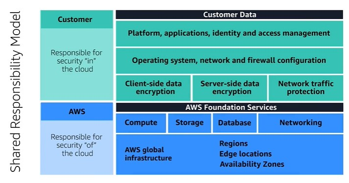
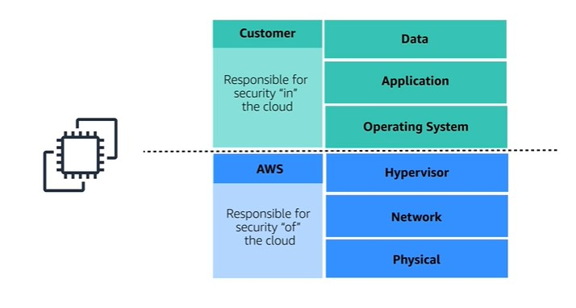
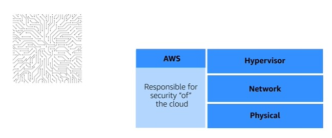
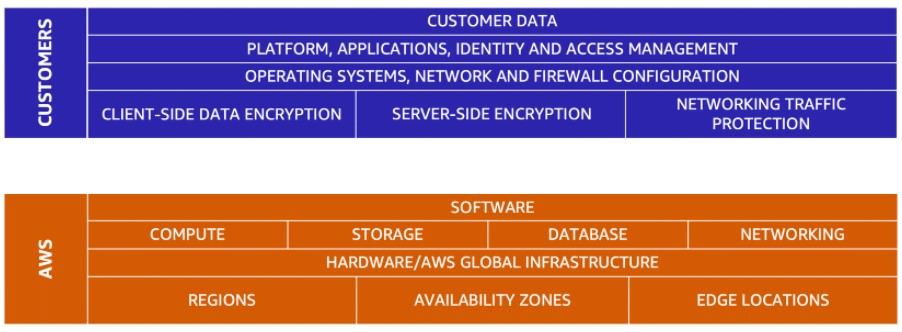

# Amazon's AWS Cloud Practitioner Essentials Course

## [Module 6: Security](https://content.aws.training/wbt/cecpeb/en/x1/1.0.1/index.html?endpoint=https%3a%2f%2flrs.aws.training%2fTCAPI%2f&auth=Basic%20Ojg0OTY0Y2JlLWY1ZjYtNDc0OC04NmVkLTg0OGY1NzNjMjIxYg%3d%3d&actor=%7b%22objectType%22%3a%22Agent%22%2c%22name%22%3a%5b%22INQ5CE3B90aXZcEnqdt9gw2%22%5d%2c%22mbox%22%3a%5b%22mailto%3alms-user-INQ5CE3B90aXZcEnqdt9gw2%40amazon.com%22%5d%7d&registration=a1f41fc6-1511-44e4-85a4-8e1923af7bc6&activity_id=http%3a%2f%2fJsdOGRWZzljloSEdyFptOL7JZcTBEIYc_rise&grouping=http%3a%2f%2fJsdOGRWZzljloSEdyFptOL7JZcTBEIYc_rise&content_token=28c38183-c397-4df9-8e8a-1625213c83c0&content_endpoint=https%3a%2f%2flrs.aws.training%2fTCAPI%2fcontent%2f&externalRegistration=CompletionThresholdPercent%7c100!InstanceId%7c0!PackageId%7ccecpeb_en_x1_1.0.1!RegistrationTimestampTicks%7c16225031567556825!SaveCompletion%7c1!TranscriptId%7cLwlMtrUQsUibqhjrMdAFoQ2!UserId%7cINQ5CE3B90aXZcEnqdt9gw2&externalConfiguration=&width=988&height=724&left=466&top=0#/lessons/VTfPk4kUj3hxvSXnS10fQQkW-cz1HDBl)

## Introduction

In this module, you will learn how to:

- Explain the benefits of the shared responsibility model.
  - AWS controls security **of** the cloud
  - Customers control security **in** the cloud
- Describe multi-factor authentication (MFA).
- Differentiate between the AWS Identity and Access Management (IAM) security levels.
- Explain the main benefits of AWS Organizations.
- Describe security policies at a basic level.
- Summarize the benefits of compliance with AWS.
- Explain additional AWS security services at a basic level.

## [Shared Responsibility Model](https://content.aws.training/wbt/cecpeb/en/x1/1.0.1/index.html?endpoint=https%3a%2f%2flrs.aws.training%2fTCAPI%2f&auth=Basic%20Ojg0OTY0Y2JlLWY1ZjYtNDc0OC04NmVkLTg0OGY1NzNjMjIxYg%3d%3d&actor=%7b%22objectType%22%3a%22Agent%22%2c%22name%22%3a%5b%22INQ5CE3B90aXZcEnqdt9gw2%22%5d%2c%22mbox%22%3a%5b%22mailto%3alms-user-INQ5CE3B90aXZcEnqdt9gw2%40amazon.com%22%5d%7d&registration=a1f41fc6-1511-44e4-85a4-8e1923af7bc6&activity_id=http%3a%2f%2fJsdOGRWZzljloSEdyFptOL7JZcTBEIYc_rise&grouping=http%3a%2f%2fJsdOGRWZzljloSEdyFptOL7JZcTBEIYc_rise&content_token=28c38183-c397-4df9-8e8a-1625213c83c0&content_endpoint=https%3a%2f%2flrs.aws.training%2fTCAPI%2fcontent%2f&externalRegistration=CompletionThresholdPercent%7c100!InstanceId%7c0!PackageId%7ccecpeb_en_x1_1.0.1!RegistrationTimestampTicks%7c16225031567556825!SaveCompletion%7c1!TranscriptId%7cLwlMtrUQsUibqhjrMdAFoQ2!UserId%7cINQ5CE3B90aXZcEnqdt9gw2&externalConfiguration=&width=988&height=724&left=466&top=0#/lessons/nwHXMtSGTpGX-P5D7N1S44Jm8wTXFTii)

### [The AWS Shared Responsibility Model](https://aws.amazon.com/compliance/shared-responsibility-model/)
- Both AWS and Customer are responsible for security
  - AWS is responsible for the **physical** parts
  - Customer is responsible for the **virtual** parts
- An example of an EC2 instance and who is responsible for what:
  
- Think of it like the relationship between a home builder and its customer
  - In this scenario, AWS is the home builder
    - The builder constructs the home with all the doors, locks, and walls and ensures they are all solid
        
      - AWS handles the security of the physical buildings where the servers live
      - AWS handles the security of the physical network
      - AWS handles the security of the physical hypervisor
    - The builder then gives the customer the key when the job is done and it is the customer's responsibility to close and lock the doors; The builder no longer has access to the home
      - Customer chooses the operating system and this is your operating system, AWS does not have a "key" (encryption key) to get into your OS
        - This means that the customer must handle any security patches and updates to ensure their OS stays secure
        - If AWS discovers there are some new vulnerabilities in your version of OS, they may notify your account owner but they can not deploy a patch
        - **HINT:** NO ONE from AWS will every call and ask you for your OS key!
      - Customers also choose what application(s) to run; you own them and maintain them
      - Customers store their data and chooses who and what can access their data

| AWS | Customer |
| --- | ---- |
| Security ***OF*** the Could | Security ***IN*** the Cloud |
| Physical Building where servers live | Maintain complete control over content |
| Hardware and Software infrastructure | OS security patches and firewalls |
| Network infrastructure | Controls access rights |
| Virtualization infrastructure | Data encryption and access |

### Knowledge Check

Which tasks are the responsibilities of customers? (Select TWO.)

- [ ] Maintaining network infrastructure

- [x] Patching software on Amazon EC2 instances

- [ ] Implementing physical security controls at data centers

- [x] Setting permissions for Amazon S3 objects

- [ ] Maintaining servers that run Amazon EC2 instances

> The correct two response options are:
> 
> - **Patching software on Amazon EC2 instances**
> - **Setting permissions for Amazon S3 objects**
> 
> The other three response options are tasks that are the responsibility of AWS.
> 
> **Learn more:**
> 
> - [AWS shared responsibility model](https://aws.amazon.com/compliance/shared-responsibility-model/)
> 

## [User Permissions and Access]()

## [AWS Organizations]()

## [Compliance]()

## [Denial-of-Service Attacks]()

## [Additional Security Services]()

## [Module 6 Summary]()

## [Module 6 Quiz]()
