# Amazon's AWS Cloud Practitioner Essentials Course

## [Module 6: Security](https://content.aws.training/wbt/cecpeb/en/x1/1.0.1/index.html?endpoint=https%3a%2f%2flrs.aws.training%2fTCAPI%2f&auth=Basic%20Ojg0OTY0Y2JlLWY1ZjYtNDc0OC04NmVkLTg0OGY1NzNjMjIxYg%3d%3d&actor=%7b%22objectType%22%3a%22Agent%22%2c%22name%22%3a%5b%22INQ5CE3B90aXZcEnqdt9gw2%22%5d%2c%22mbox%22%3a%5b%22mailto%3alms-user-INQ5CE3B90aXZcEnqdt9gw2%40amazon.com%22%5d%7d&registration=a1f41fc6-1511-44e4-85a4-8e1923af7bc6&activity_id=http%3a%2f%2fJsdOGRWZzljloSEdyFptOL7JZcTBEIYc_rise&grouping=http%3a%2f%2fJsdOGRWZzljloSEdyFptOL7JZcTBEIYc_rise&content_token=28c38183-c397-4df9-8e8a-1625213c83c0&content_endpoint=https%3a%2f%2flrs.aws.training%2fTCAPI%2fcontent%2f&externalRegistration=CompletionThresholdPercent%7c100!InstanceId%7c0!PackageId%7ccecpeb_en_x1_1.0.1!RegistrationTimestampTicks%7c16225031567556825!SaveCompletion%7c1!TranscriptId%7cLwlMtrUQsUibqhjrMdAFoQ2!UserId%7cINQ5CE3B90aXZcEnqdt9gw2&externalConfiguration=&width=988&height=724&left=466&top=0#/lessons/VTfPk4kUj3hxvSXnS10fQQkW-cz1HDBl)

## Introduction

In this module, you will learn how to:

- Explain the benefits of the shared responsibility model.
  - AWS controls security **of** the cloud
  - Customers control security **in** the cloud
- Describe multi-factor authentication (MFA).
- Differentiate between the AWS Identity and Access Management (IAM) security levels.
- Explain the main benefits of AWS Organizations.
- Describe security policies at a basic level.
- Summarize the benefits of compliance with AWS.
- Explain additional AWS security services at a basic level.

## [Shared Responsibility Model](https://content.aws.training/wbt/cecpeb/en/x1/1.0.1/index.html?endpoint=https%3a%2f%2flrs.aws.training%2fTCAPI%2f&auth=Basic%20Ojg0OTY0Y2JlLWY1ZjYtNDc0OC04NmVkLTg0OGY1NzNjMjIxYg%3d%3d&actor=%7b%22objectType%22%3a%22Agent%22%2c%22name%22%3a%5b%22INQ5CE3B90aXZcEnqdt9gw2%22%5d%2c%22mbox%22%3a%5b%22mailto%3alms-user-INQ5CE3B90aXZcEnqdt9gw2%40amazon.com%22%5d%7d&registration=a1f41fc6-1511-44e4-85a4-8e1923af7bc6&activity_id=http%3a%2f%2fJsdOGRWZzljloSEdyFptOL7JZcTBEIYc_rise&grouping=http%3a%2f%2fJsdOGRWZzljloSEdyFptOL7JZcTBEIYc_rise&content_token=28c38183-c397-4df9-8e8a-1625213c83c0&content_endpoint=https%3a%2f%2flrs.aws.training%2fTCAPI%2fcontent%2f&externalRegistration=CompletionThresholdPercent%7c100!InstanceId%7c0!PackageId%7ccecpeb_en_x1_1.0.1!RegistrationTimestampTicks%7c16225031567556825!SaveCompletion%7c1!TranscriptId%7cLwlMtrUQsUibqhjrMdAFoQ2!UserId%7cINQ5CE3B90aXZcEnqdt9gw2&externalConfiguration=&width=988&height=724&left=466&top=0#/lessons/nwHXMtSGTpGX-P5D7N1S44Jm8wTXFTii)

### [The AWS Shared Responsibility Model](https://aws.amazon.com/compliance/shared-responsibility-model/)
- Both AWS and Customer are responsible for security
  - AWS is responsible for the **physical** parts
  - Customer is responsible for the **virtual** parts
- An example of an EC2 instance and who is responsible for what:
  
- Think of it like the relationship between a home builder and its customer
  - In this scenario, AWS is the home builder
    - The builder constructs the home with all the doors, locks, and walls and ensures they are all solid
        
      - AWS handles the security of the physical buildings where the servers live
      - AWS handles the security of the physical network
      - AWS handles the security of the physical hypervisor
    - The builder then gives the customer the key when the job is done and it is the customer's responsibility to close and lock the doors; The builder no longer has access to the home
      - Customer chooses the operating system and this is your operating system, AWS does not have a "key" (encryption key) to get into your OS
        - This means that the customer must handle any security patches and updates to ensure their OS stays secure
        - If AWS discovers there are some new vulnerabilities in your version of OS, they may notify your account owner but they can not deploy a patch
        - **HINT:** NO ONE from AWS will every call and ask you for your OS key!
      - Customers also choose what application(s) to run; you own them and maintain them
      - Customers store their data and chooses who and what can access their data

| AWS | Customer |
| --- | ---- |
| Security ***OF*** the Could | Security ***IN*** the Cloud |
| Physical Building where servers live | Maintain complete control over content |
| Hardware and Software infrastructure | OS security patches and firewalls |
| Network infrastructure | Controls access rights |
| Virtualization infrastructure | Data encryption and access |

### Knowledge Check

Which tasks are the responsibilities of customers? (Select TWO.)

- [ ] Maintaining network infrastructure

- [x] Patching software on Amazon EC2 instances

- [ ] Implementing physical security controls at data centers

- [x] Setting permissions for Amazon S3 objects

- [ ] Maintaining servers that run Amazon EC2 instances

> The correct two response options are:
> 
> - **Patching software on Amazon EC2 instances**
> - **Setting permissions for Amazon S3 objects**
> 
> The other three response options are tasks that are the responsibility of AWS.
> 
> **Learn more:**
> 
> - [AWS shared responsibility model](https://aws.amazon.com/compliance/shared-responsibility-model/)
> 

## [User Permissions and Access](https://content.aws.training/wbt/cecpeb/en/x1/1.0.1/index.html?endpoint=https%3a%2f%2flrs.aws.training%2fTCAPI%2f&auth=Basic%20Ojg0OTY0Y2JlLWY1ZjYtNDc0OC04NmVkLTg0OGY1NzNjMjIxYg%3d%3d&actor=%7b%22objectType%22%3a%22Agent%22%2c%22name%22%3a%5b%22INQ5CE3B90aXZcEnqdt9gw2%22%5d%2c%22mbox%22%3a%5b%22mailto%3alms-user-INQ5CE3B90aXZcEnqdt9gw2%40amazon.com%22%5d%7d&registration=a1f41fc6-1511-44e4-85a4-8e1923af7bc6&activity_id=http%3a%2f%2fJsdOGRWZzljloSEdyFptOL7JZcTBEIYc_rise&grouping=http%3a%2f%2fJsdOGRWZzljloSEdyFptOL7JZcTBEIYc_rise&content_token=28c38183-c397-4df9-8e8a-1625213c83c0&content_endpoint=https%3a%2f%2flrs.aws.training%2fTCAPI%2fcontent%2f&externalRegistration=CompletionThresholdPercent%7c100!InstanceId%7c0!PackageId%7ccecpeb_en_x1_1.0.1!RegistrationTimestampTicks%7c16225031567556825!SaveCompletion%7c1!TranscriptId%7cLwlMtrUQsUibqhjrMdAFoQ2!UserId%7cINQ5CE3B90aXZcEnqdt9gw2&externalConfiguration=&width=988&height=724&left=466&top=0#/lessons/xz0tTSNzf7mhV-D2Um36ld3NAup1ieHi)

### [AWS Identity and Access Management (IAM)](https://aws.amazon.com/iam/)
- Enables you to manage access to AWS services and resources securely
- Gives you flexibility to configure access based on your company's specific operational and security needs

### [AWS account root user](https://docs.aws.amazon.com/IAM/latest/UserGuide/id_root-user.html)
- The main "owner" of the AWS account
- This account has complete access to ALL AWS services and resources in the account
  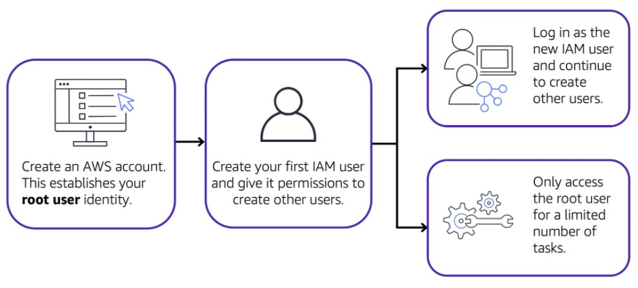
- **Best Practice:**
  - Do **NOT** use the root user for everyday tasks
  - Use the root user to create your first IAM user and assign it permission to create other users
  - Use IAM user identities to perform regular tasks throughout AWS
  - Only use root user if you have to perform a task that is only available to the root user
    - Examples: changing root user email address and changing AWS support plan

### IAM users
- Represents the person or application that interacts with AWS service or resources
- Consists of a name and credentials
- By default, when created, it has no permissions associated with it
  - At first the IAM user can not even login to the account
  - You must grant the user with the necessary permissions
- You can actually avoid creating IAM users for every person in your organization by ***federating*** users into your account
  - This means that they could use their regular corporate credentials to log into AWS by mapping their corporate identities to IAM roles
- **Best Practices:**
  - Recommended to create individual IAM users for each person who needs to access AWS
  - Even if you have multiple employees who require the same level of access, this provides additional security

### IAM policies
- A JSON document that allows or denies permissions to AWS services and resources
- Enables you to customize users' levels of access to resources
- There are only two options for the `"Effect"` setting; `"Allow"` or `"Deny"`
- For the `"Action"` setting you can list any AWS API call
- For the `"Resource"` setting you would list what AWS resource the API call is for
- **Best Practices:**
  - Follow the security principle of **least privilege** when granting permissions
    - **Least Privilege Principle:** A user is granted access only to what they need
    - This helps prevent users or roles from having more permissions than needed to perform their tasks
  - You can always add on to the policy as the need arises in the future

### [IAM groups](https://docs.aws.amazon.com/IAM/latest/UserGuide/id_groups.html)
- A collection of IAM users
- When assigning an IAM policy to a group, all users in the group are granted the same permissions in that policy
- This will save time, instead of having to add the same policy to multiple IAM users, you can just add them to the group
- This will also ensure that if an employee changes permissions and you move them to a different group, they will only have the permission for the current group they are in

### [IAM roles](https://docs.aws.amazon.com/IAM/latest/UserGuide/id_roles.html)
- They have associated permissions that allow or deny specific actions
- These roles can be assumed for temporary amounts of time
- It is similar to a user, but has no username or password
- It is an identity that you can assume to gain temporary access to permissions
- When someone assumes an IAM role they abandon all previous permissions they had under the previous role and assume the permissions of the new role
- Before an IAM user, application, or service can assume an IAM role, they must be grated permissions to switch to the role
- **Best Practices:**
  - Roles are ideal for situations in which access to services or resources need to be granted temporarily, instead of long-term

### [Multi-factor authentication (MFA)](https://aws.amazon.com/iam/features/mfa/)
- It is a recommendation to set this up on your root user account as soon as you create it, before doing anything else
- This just provides an extra layer of security for your AWS account
- It is also best practices to set this up on all IAM user accounts too

## [AWS Organizations](https://content.aws.training/wbt/cecpeb/en/x1/1.0.1/index.html?endpoint=https%3a%2f%2flrs.aws.training%2fTCAPI%2f&auth=Basic%20Ojg0OTY0Y2JlLWY1ZjYtNDc0OC04NmVkLTg0OGY1NzNjMjIxYg%3d%3d&actor=%7b%22objectType%22%3a%22Agent%22%2c%22name%22%3a%5b%22INQ5CE3B90aXZcEnqdt9gw2%22%5d%2c%22mbox%22%3a%5b%22mailto%3alms-user-INQ5CE3B90aXZcEnqdt9gw2%40amazon.com%22%5d%7d&registration=a1f41fc6-1511-44e4-85a4-8e1923af7bc6&activity_id=http%3a%2f%2fJsdOGRWZzljloSEdyFptOL7JZcTBEIYc_rise&grouping=http%3a%2f%2fJsdOGRWZzljloSEdyFptOL7JZcTBEIYc_rise&content_token=28c38183-c397-4df9-8e8a-1625213c83c0&content_endpoint=https%3a%2f%2flrs.aws.training%2fTCAPI%2fcontent%2f&externalRegistration=CompletionThresholdPercent%7c100!InstanceId%7c0!PackageId%7ccecpeb_en_x1_1.0.1!RegistrationTimestampTicks%7c16225031567556825!SaveCompletion%7c1!TranscriptId%7cLwlMtrUQsUibqhjrMdAFoQ2!UserId%7cINQ5CE3B90aXZcEnqdt9gw2&externalConfiguration=&width=988&height=724&left=466&top=0#/lessons/sNWLa_KEh1YyIJq6IaFUi3PkIVcNNdI0)

### [AWS Organizations](https://aws.amazon.com/organizations)
- A central location to manage multiple AWS accounts
- Used to consolidate and manage multiple AWS accounts within a central location
- When you create an organization, AWS Organizations automatically creates a **root** (parent container for all the accounts in your organization)
- **[Service Control Policies (SCPs)](https://docs.aws.amazon.com/organizations/latest/userguide/orgs_manage_policies_scps.html):**
  - Used to centrally control permissions for accounts within your organization
  - Enables you to place restrictions on AWS services, resources, and individual API actions that users and roles in each account can access
- Offers ***Consolidated Billing*** (will learn more about later)
  - You can use the primary account of your organization to consolidate and pay for all member accounts
  - This means that the organization may be able to take advantage of ***bulk discounts***
- You can do the following across your AWS accounts:
  - Manage billing
  - Control access
  - Control compliance
  - Control security
  - Share resources
- Main features of AWS Organizations:
  - Centralized Management of all your AWS accounts
  - Consolidated Billing for all member accounts
  - Can implement Hierarchical Groupings of Accounts to meet security, compliance, or budgetary needs using Organizational Units (OUs)
  - AWS Service and API Actions access control using SPCs

### Organizational Units (OUs)
- Groups of accounts to make it easier to manage accounts with similar business and/or security requirements
- All accounts in the OU automatically inherit the permissions specified in the policy for that OU
- You can more easily isolate workloads or applications that have specific security requirements
- You do not have to place all accounts in the organization into an OU, only if they share similar business and/or security requirements with another account

### Knowledge Check

You are configuring service control policies (SCPs) in AWS Organizations. Which identities and resources can SCPs be applied to? (Select TWO.)

- [ ] IAM users

- [ ] IAM groups

- [x] An individual member account

- [ ] IAM roles

- [x] An organizational unit (OU)

> The correct two response options are:
> 
> - **An individual member account**
> - **An organizational unit (OU)**
> 
> In AWS Organizations, you can apply service control policies (SCPs) to the organization root, an individual member account, or an OU. An SCP affects all IAM users, groups, and roles within an account, including the AWS account root user.
> 
> You can apply IAM policies to IAM users, groups, or roles. You cannot apply an IAM policy to the AWS account root user.
> 
> **Learn more:**
> 
> - [AWS Organizations](https://aws.amazon.com/organizations)
> - [Service control policies](https://docs.aws.amazon.com/organizations/latest/userguide/orgs_manage_policies_scps.html)
> - [Attaching SCPs](https://docs.aws.amazon.com/organizations/latest/userguide/orgs_manage_policies_scps_attach.html)
> 

## [Compliance](https://content.aws.training/wbt/cecpeb/en/x1/1.0.1/index.html?endpoint=https%3a%2f%2flrs.aws.training%2fTCAPI%2f&auth=Basic%20OjM0YzViZTJjLWFiODEtNDY3NC05Njk0LTc0ZTEyNTQxYjRhNg%3d%3d&actor=%7b%22objectType%22%3a%22Agent%22%2c%22name%22%3a%5b%22INQ5CE3B90aXZcEnqdt9gw2%22%5d%2c%22mbox%22%3a%5b%22mailto%3alms-user-INQ5CE3B90aXZcEnqdt9gw2%40amazon.com%22%5d%7d&registration=a1f41fc6-1511-44e4-85a4-8e1923af7bc6&activity_id=http%3a%2f%2fJsdOGRWZzljloSEdyFptOL7JZcTBEIYc_rise&grouping=http%3a%2f%2fJsdOGRWZzljloSEdyFptOL7JZcTBEIYc_rise&content_token=cf7d9b18-53b2-4403-90a2-04b078a79bd5&content_endpoint=https%3a%2f%2flrs.aws.training%2fTCAPI%2fcontent%2f&externalRegistration=CompletionThresholdPercent%7c100!InstanceId%7c0!PackageId%7ccecpeb_en_x1_1.0.1!RegistrationTimestampTicks%7c16225031567556825!SaveCompletion%7c1!TranscriptId%7cLwlMtrUQsUibqhjrMdAFoQ2!UserId%7cINQ5CE3B90aXZcEnqdt9gw2&externalConfiguration=&width=988&height=724&left=466&top=0#/lessons/yBehOjUHkU_Lalgf9t61A_cWgInMVJ4y)

- For every industry, there are specific standards that need to be upheld, and you will be audited or inspected to ensure that you have met those standards
- You rely on documentation, records and inspections to pass audits and compliance checks as they come along
- If you run software that deals with consumer data in the EU, you would need to make sure that you're in compliance with General Data Protection Regulation (GDPR)
- If you run healthcare applications in the US you will need to design your architectures to meet Health Insurance Portability and Accountability Act (HIPAA) compliance requirements
- Whatever your compliance need is, you'll need some tools to be able to collect documents, records and inspect your AWS environment to check if you meet the compliance regulations that you're under
- AWS complies with a long list of assurance programs that you can find online
  - This means that segments of your compliance have already been completed, and you can focus on meeting compliance within your own architectures that you build on top of AWS
- The Region you choose to operate out of, might help you meet compliance regulations
  - If you can only legally store data in the country that the data is from, you can choose a Region that makes sense for you and AWS will not automatically replicate data across Regions
- For a lot of services, enabling data protection is a configuration setting on the resource

### [AWS Artifact](https://aws.amazon.com/artifact)
- Provides on-demand access to AWS security and compliance reports and select online agreements
- Consist of 2 main sections:
  - AWS Artifact Agreements:
    - Used if your company needs to sign an agreement with AWS regarding your use of certain types of information throughout AWS services
    - You can review, accept, and manage agreements for an individual account and for all your accounts in AWS Organizations
    - Different types of agreements are offered to address the needs of customers who are subject to specific regulations, such as the Health Insurance Portability and Accountability Act (HIPAA)
  - AWS Artifact Reports:
    - Used if a member of your company’s development team is building an application and needs more information about their responsibility for complying with certain regulatory standards
    - Provides compliance reports from third-party auditors
    - These auditors have tested and verified that AWS is compliant with a variety of global, regional, and industry-specific security standards and regulations
    - Remain up to date with the latest reports released
    - You can provide the AWS audit artifacts to your auditors or regulators as evidence of AWS security controls
    - The following are some compliance reports and regulations that you can find within AWS Artifact:
      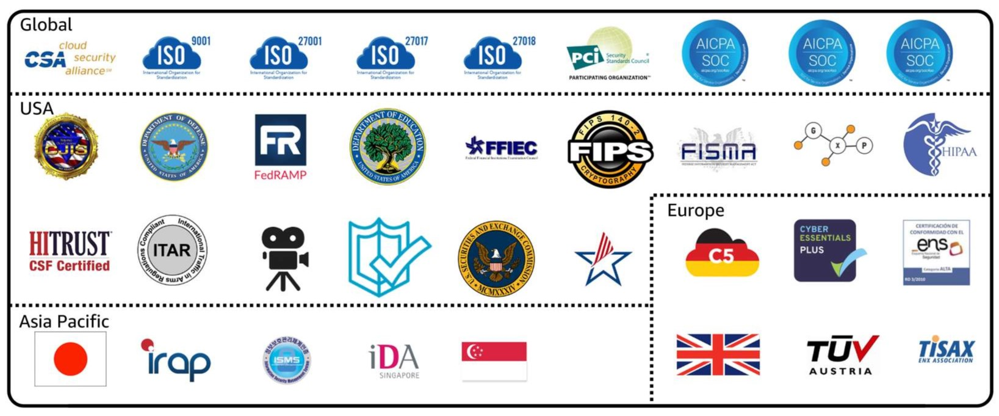

### [Customer Compliance Center](https://aws.amazon.com/compliance/customer-center/)
- Contains resources to help you learn more about AWS compliance
- Can read customer compliance stories to discover how companies in regulated industries have solved various compliance, governance, and audit challenges
- You can also access compliance whitepapers and documentation on topics such as:
  - AWS answers to key compliance questions
  - An overview of AWS risk and compliance
  - An auditing security checklist
- Includes an auditor learning path
  - This learning path is designed for individuals in auditing, compliance, and legal roles who want to learn more about how their internal operations can demonstrate compliance using the AWS Cloud

### Knowledge Check

Which tasks can you complete in AWS Artifact? (Select TWO.)

- [x] Access AWS compliance reports on-demand.

- [ ] Consolidate and manage multiple AWS accounts within a central location.

- [ ] Create users to enable people and applications to interact with AWS services and resources.

- [ ] Set permissions for accounts by configuring service control policies (SCPs).

- [x] Review, accept, and manage agreements with AWS.

> The correct two response options are:
> 
> - **Access AWS compliance reports on-demand.**
> - **Review, accept, and manage agreements with AWS.**
> 
> The other response options are incorrect because:
> 
> - Consolidate and manage multiple AWS accounts within a central location- This task can be completed in AWS Organizations.
> - Create users to enable people and applications to interact with AWS services and resources- This task can be completed in AWS Identity and Access Management (IAM).
> - Set permissions for accounts by configuring service control policies (SCPs)- This task can be completed in AWS Organizations.
> 
> **Learn more:**
> 
> - [AWS Artifact](https://aws.amazon.com/artifact)
> 

## [Denial-of-Service Attacks](https://content.aws.training/wbt/cecpeb/en/x1/1.0.1/index.html?endpoint=https%3a%2f%2flrs.aws.training%2fTCAPI%2f&auth=Basic%20OjM0YzViZTJjLWFiODEtNDY3NC05Njk0LTc0ZTEyNTQxYjRhNg%3d%3d&actor=%7b%22objectType%22%3a%22Agent%22%2c%22name%22%3a%5b%22INQ5CE3B90aXZcEnqdt9gw2%22%5d%2c%22mbox%22%3a%5b%22mailto%3alms-user-INQ5CE3B90aXZcEnqdt9gw2%40amazon.com%22%5d%7d&registration=a1f41fc6-1511-44e4-85a4-8e1923af7bc6&activity_id=http%3a%2f%2fJsdOGRWZzljloSEdyFptOL7JZcTBEIYc_rise&grouping=http%3a%2f%2fJsdOGRWZzljloSEdyFptOL7JZcTBEIYc_rise&content_token=cf7d9b18-53b2-4403-90a2-04b078a79bd5&content_endpoint=https%3a%2f%2flrs.aws.training%2fTCAPI%2fcontent%2f&externalRegistration=CompletionThresholdPercent%7c100!InstanceId%7c0!PackageId%7ccecpeb_en_x1_1.0.1!RegistrationTimestampTicks%7c16225031567556825!SaveCompletion%7c1!TranscriptId%7cLwlMtrUQsUibqhjrMdAFoQ2!UserId%7cINQ5CE3B90aXZcEnqdt9gw2&externalConfiguration=&width=988&height=724&left=466&top=0#/lessons/-iYLeKJ2acqjyo9TdfT36xi2T70xBCIJ)

### Denial-of-service attacks (DoS)
- A deliberate attempt to make a website or application unavailable to users
  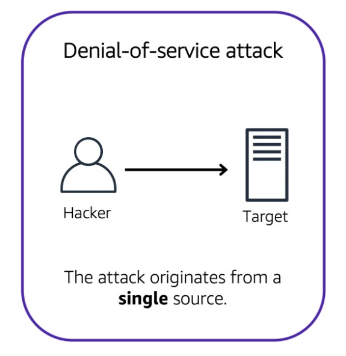
- For example, an attacker might flood a website or application with excessive network traffic until the targeted website or application becomes overloaded and is no longer able to respond
  - If the website or application becomes unavailable, this denies service to users who are trying to make legitimate requests.

### Distributed denial-of-service attacks (DDoS)
- Now, suppose that the prankster has enlisted the help of friends. 
- The objective is to shut down your application's ability to function by overwhelming the system to the point it can no longer operate
- Multiple sources are used to start an attack that aims to make a website or application unavailable
  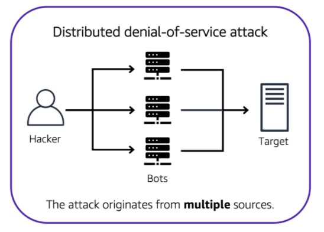
  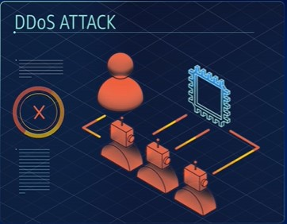
- This can come from a group of attackers, or even a single attacker
- The single attacker can use multiple infected computers (also known as “bots”) to send excessive traffic to a website or application
- There are several kinds of DDoS Attacks:
  - UDP Flood:
    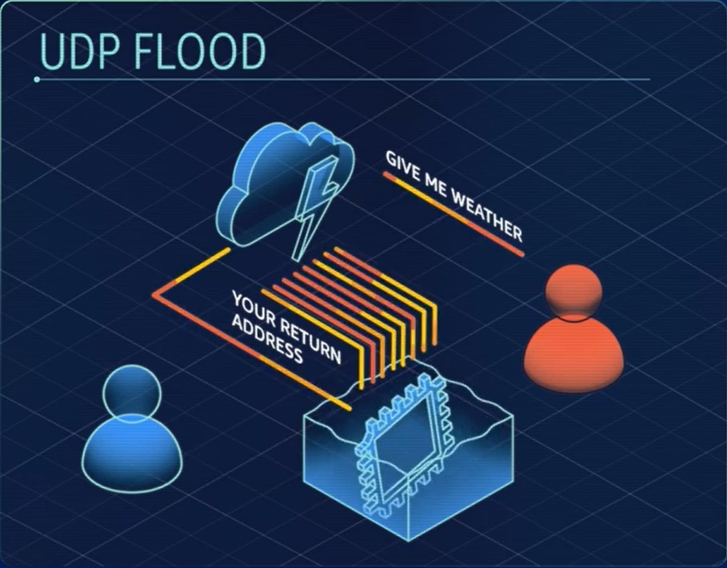
    - Based on the helpful parts of the internet, like the national weather service
    - Anyone can send a small request to the Weather Service, and ask, "Give me weather," and in return, the Weather Service's fleet of machines will send back a massive amount of weather telemetry, forecasts, updates, lots of stuff
    - The attack here is simple:
      - The bad actor sends a simple request, "give me weather"
      - Gives a fake return address on the request, your return address
      - Now the Weather Service very happily floods your server with megabytes of rain forecasts, and your system could be brought to a standstill, just sorting through the information it never wanted in the first place
    - This is just one example of half a dozen low-level, brute force attacks, all designed to exhaust your network
    - AWS solution for this type of attack: **Security Groups**
      - Security groups only allow in proper request traffic
      - Things like weather reports use an entirely different protocol than the ones your customers use
      - Not on the list, you don't get to talk to the server
      - Operate at the AWS network level, not at the EC2 instance level, like an operating system firewall might
      - So massive attacks like UDP floods or reflection attacks just get shrugged off by the scale of the entire AWS Regions capacity, not your individual EC2's capacity
  - HTTP Level Attacks:
    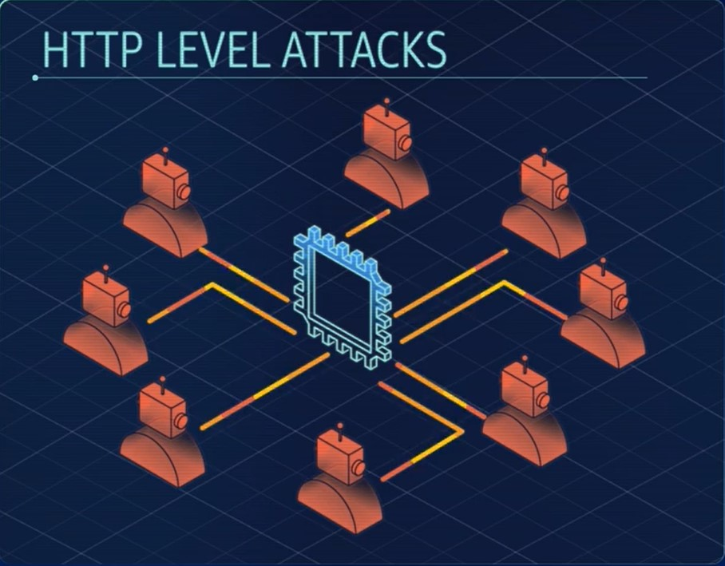
    - Much more sophisticated than the UDP Flood
    - Looks like normal customers asking for normal things like complicated product searches over and over and over, all coming from an army of zombified bot machines
    - They ask for so much attention that regular customers can't get in
  - Slowloris Attack:
    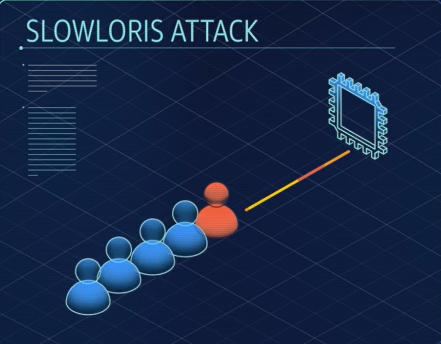
    - Instead of a normal connection, the attacker pretends to have a terribly slow connection
    - Meanwhile, your production servers are standing there waiting for the customer to finish their request so they can dash off and return the result
    - Until they get the entire packet, they can't move on to the next thread (the next customer)
    - A few Slowloris attackers can exhaust the capacity of your entire front end with almost no effort at all
    - AWS solution for this type of attack: **Elastic Load Balancer (ELB)**
      - ELB handles the http traffic request first, so it waits until the entire message, no matter how fast or slow, is complete before sending it over to the front end web server
      - Sure, you can try to overwhelm it, but remember the ELB is scalable and it runs at the region level
      - To overwhelm ELB, you would have to overwhelm the entire AWS region
        - It's not theoretically impossible, but too massively expensive for anyone to pull off
- For the sharpest, most sophisticated attacks, AWS also offers specialized defense tools called ***AWS Shield*** with ***AWS WAF***
  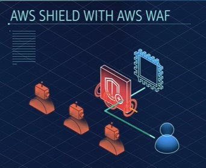
  - **AWS WAF** uses a web application firewall to filter incoming traffic for the signatures of bad actors
  - It has extensive machine learning capabilities, and can recognize new threats as they evolve
  - It proactively helps defend your system against an ever-growing list of destructive vectors

### [AWS Shield](https://aws.amazon.com/shield)
- Protects applications against DoS and DDoS attacks
- Provides two levels of protection:
  - AWS Shield Standard:
    - Automatically protects all AWS customers at no cost
    - Protects your AWS resources from the most common, frequently occurring types of DDoS attacks
    - As network traffic comes into your applications, AWS Shield Standard uses a variety of analysis techniques to detect malicious traffic in real time and automatically mitigates it
  - AWS Shield Advanced:
    - A paid service that provides detailed attack diagnostics and the ability to detect and mitigate sophisticated DDoS attacks
    - It also integrates with other services such as Amazon CloudFront, Amazon Route 53, and Elastic Load Balancing
    - You can integrate AWS Shield with AWS WAF by writing custom rules to mitigate complex DDoS attacks

## [Additional Security Services](https://content.aws.training/wbt/cecpeb/en/x1/1.0.1/index.html?endpoint=https%3a%2f%2flrs.aws.training%2fTCAPI%2f&auth=Basic%20OjM0YzViZTJjLWFiODEtNDY3NC05Njk0LTc0ZTEyNTQxYjRhNg%3d%3d&actor=%7b%22objectType%22%3a%22Agent%22%2c%22name%22%3a%5b%22INQ5CE3B90aXZcEnqdt9gw2%22%5d%2c%22mbox%22%3a%5b%22mailto%3alms-user-INQ5CE3B90aXZcEnqdt9gw2%40amazon.com%22%5d%7d&registration=a1f41fc6-1511-44e4-85a4-8e1923af7bc6&activity_id=http%3a%2f%2fJsdOGRWZzljloSEdyFptOL7JZcTBEIYc_rise&grouping=http%3a%2f%2fJsdOGRWZzljloSEdyFptOL7JZcTBEIYc_rise&content_token=cf7d9b18-53b2-4403-90a2-04b078a79bd5&content_endpoint=https%3a%2f%2flrs.aws.training%2fTCAPI%2fcontent%2f&externalRegistration=CompletionThresholdPercent%7c100!InstanceId%7c0!PackageId%7ccecpeb_en_x1_1.0.1!RegistrationTimestampTicks%7c16225031567556825!SaveCompletion%7c1!TranscriptId%7cLwlMtrUQsUibqhjrMdAFoQ2!UserId%7cINQ5CE3B90aXZcEnqdt9gw2&externalConfiguration=&width=988&height=724&left=466&top=0#/lessons/4gZuQD46epLuvnO_soPfLp5QdH4VZ1Di)

- **Encryption:** Securing a message or data in a way that can only be accessed by authorized parties
  - Non-authorized parties are therefore less likely to be able to access the message or not able to access it at all
- At AWS, encryption comes in two variations:
  - Encryption at Rest: when your data is idle
    - Your data is just being stored and not moving anywhere
    - Server-side encryption at rest is enabled on all DynamoDB table data
      - This helps prevent unauthorized access
      - DynamoDB's encryption at rest also integrates with AWS KMS, or Key Management Service, for managing the encryption key that is used to encrypt your tables
      - This is the "key" that unlocks the "door" to your data, so make sure to store it in a safe place, because without it, you can not access your data
  - Encryption in Transit: when your data is traveling between locations
    - Example:
      - We have a Redshift instance running and we want to connect it with a SQL client
      - We use secure sockets layer, or SSL connections to encrypt data, and we can use service certificates to validate, and authorize a client
        - This means that data is protected when passing between Redshift, and our client
    - This functionality exists in numerous other AWS services such as SQS, S3, RDS, and many more

### [AWS Key Management Service (AWS KMS)](https://aws.amazon.com/kms)
- Enables you to perform encryption operations through the use of **cryptographic keys**
  - **Cryptographic Key** is a random string of digits used for locking (encrypting) and unlocking (decrypting) data
- You can use AWS KMS to create, manage, and use cryptographic keys
- You can also control the use of keys across a wide range of services and in your applications
- Can choose the specific levels of access control that you need for your keys
- Can specify which IAM users and roles are able to manage keys
- Can temporarily disable keys so that they are no longer in use by anyone
- Your keys never leave AWS KMS, and you are always in control of them

### [AWS WAF](https://aws.amazon.com/waf)
- A web application firewall that lets you monitor network requests that come into your web applications
- Works together with Amazon CloudFront and an Application Load Balancer
- AWS WAF works in a similar way as a Network access Control List (NaCL) to block or allow traffic
- However, it does this by using a [web access control list (ACL)](https://docs.aws.amazon.com/waf/latest/developerguide/web-acl.html) to protect your AWS resources
- Example of how you can use AWS WAF to allow and block specific requests:
  - You want to prevent malicious network requests from several IP addresses from continuing to access your application, but you also want to ensure that legitimate users can still access it
  - You configure the web ACL to allow all requests except those from the IP addresses that you have specified
  - 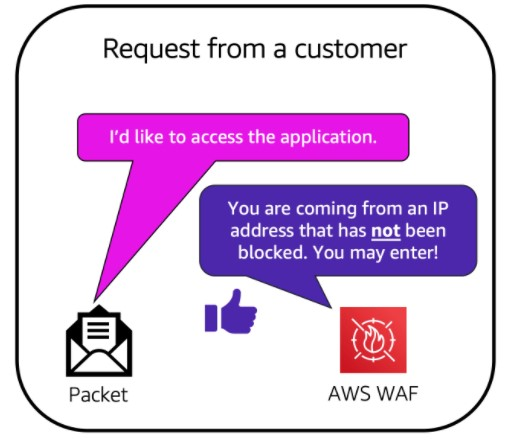
    - When a request comes into AWS WAF, it checks against the list of rules that you have configured in the web ACL
    - If a request did not come from one of the blocked IP addresses, it allows access to the application 
  - 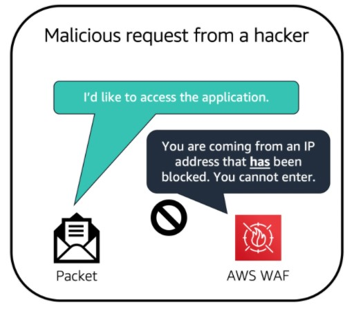
    - If a request came from one of the blocked IP addresses that you have specified in the web ACL, it is denied access

### [Amazon Inspector](https://aws.amazon.com/inspector/)
- Helps to improve the security and compliance of your AWS deployed applications by running automated security assessments against your infrastructure
- Checks applications for security vulnerabilities and deviations from security best practices
- Checks for things such as open access to Amazon EC2 instances and installations of vulnerable software versions
- After it has performed an assessment, it provides you with a list of security findings
  - The list prioritizes by severity level, including a detailed description of each security issue and a recommendation for how to fix it
  - AWS does not guarantee that following the provided recommendations resolves every potential security issue
  - Under the shared responsibility model, customers are responsible for the security of their applications, processes, and tools that run on AWS services
- This service consists of 3 parts:
  - Network Configuration Reachability Piece
  - Amazon Agent
    - Can be installed on EC2 instances
  - Security Assessment Service

### [Amazon GuardDuty](https://aws.amazon.com/guardduty)
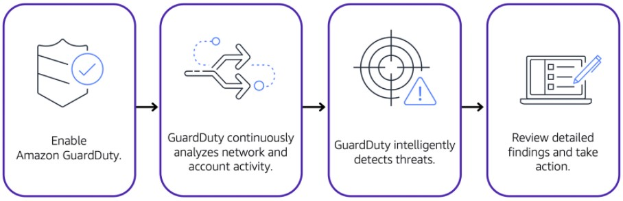
- Provides intelligent threat detection for your AWS infrastructure and resources
- It identifies threats by continuously monitoring the network activity and account behavior within your AWS environment
- After enabling GuardDuty for your AWS account, it begins monitoring your network and account activity
- You do not have to deploy or manage any additional security software
- continuously analyzes data from multiple AWS sources, including VPC Flow Logs and DNS logs
- If it detects any threats, you can review detailed findings about them from the AWS Management Console
  - Findings include recommended steps for remediation
  - Can also configure AWS Lambda functions to take remediation steps automatically in response to security findings
- It runs independently from your other AWS services, so it won't affect performance or availability of your existing infrastructure and workloads

## [Module 6 Summary]()

## [Module 6 Quiz]()
