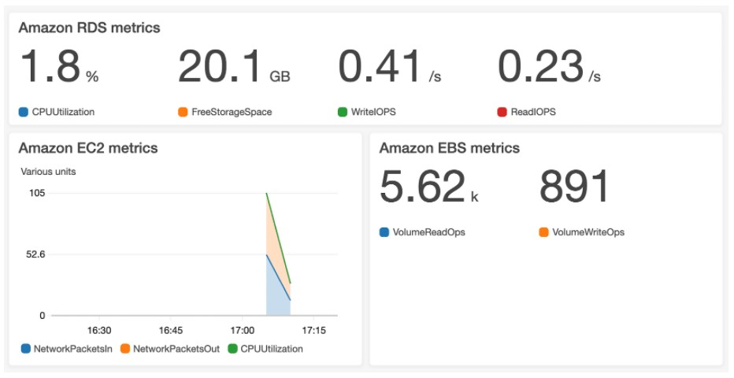
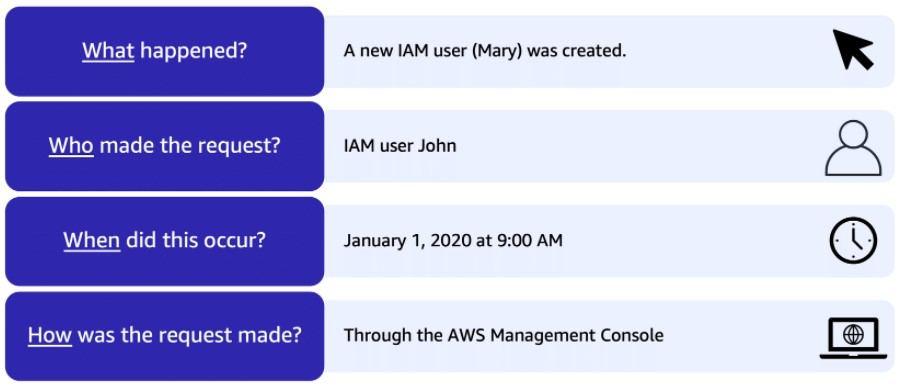
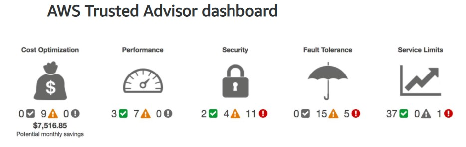

# Amazon's AWS Cloud Practitioner Essentials Course

## [Module 7: Monitoring and Analytics](https://content.aws.training/wbt/cecpeb/en/x1/1.0.1/index.html?endpoint=https%3a%2f%2flrs.aws.training%2fTCAPI%2f&auth=Basic%20OjBiMGI4Y2UzLThjOTMtNDc5OS1hYjc5LWEyZTRiOTY1YWRjNw%3d%3d&actor=%7b%22objectType%22%3a%22Agent%22%2c%22name%22%3a%5b%22INQ5CE3B90aXZcEnqdt9gw2%22%5d%2c%22mbox%22%3a%5b%22mailto%3alms-user-INQ5CE3B90aXZcEnqdt9gw2%40amazon.com%22%5d%7d&registration=a1f41fc6-1511-44e4-85a4-8e1923af7bc6&activity_id=http%3a%2f%2fJsdOGRWZzljloSEdyFptOL7JZcTBEIYc_rise&grouping=http%3a%2f%2fJsdOGRWZzljloSEdyFptOL7JZcTBEIYc_rise&content_token=f1d42faf-a210-4c2d-b42a-9fe2b337f828&content_endpoint=https%3a%2f%2flrs.aws.training%2fTCAPI%2fcontent%2f&externalRegistration=CompletionThresholdPercent%7c100!InstanceId%7c0!PackageId%7ccecpeb_en_x1_1.0.1!RegistrationTimestampTicks%7c16225031567556825!SaveCompletion%7c1!TranscriptId%7cLwlMtrUQsUibqhjrMdAFoQ2!UserId%7cINQ5CE3B90aXZcEnqdt9gw2&externalConfiguration=&width=988&height=724&left=466&top=0#/lessons/GwADM4l5JFtOp2XqnlpTH4IwLdOBnY8l)

### Introduction
In this module, you will learn how to:

- Summarize approaches to monitoring your AWS environment.
- Describe the benefits of Amazon CloudWatch.
- Describe the benefits of AWS CloudTrail.
- Describe the benefits of AWS Trusted Advisor.

**Monitoring:** Observing systems, collecting metrics, and then using data to make decisions
- It is important to set up monitoring in the Cloud
- With the elastic nature of AWS services that dynamically scale up and down, you'll want to keep a close pulse on your AWS resources to ensure that your systems are running as expected

## [Amazon CloudWatch](https://content.aws.training/wbt/cecpeb/en/x1/1.0.1/index.html?endpoint=https%3a%2f%2flrs.aws.training%2fTCAPI%2f&auth=Basic%20OjBiMGI4Y2UzLThjOTMtNDc5OS1hYjc5LWEyZTRiOTY1YWRjNw%3d%3d&actor=%7b%22objectType%22%3a%22Agent%22%2c%22name%22%3a%5b%22INQ5CE3B90aXZcEnqdt9gw2%22%5d%2c%22mbox%22%3a%5b%22mailto%3alms-user-INQ5CE3B90aXZcEnqdt9gw2%40amazon.com%22%5d%7d&registration=a1f41fc6-1511-44e4-85a4-8e1923af7bc6&activity_id=http%3a%2f%2fJsdOGRWZzljloSEdyFptOL7JZcTBEIYc_rise&grouping=http%3a%2f%2fJsdOGRWZzljloSEdyFptOL7JZcTBEIYc_rise&content_token=f1d42faf-a210-4c2d-b42a-9fe2b337f828&content_endpoint=https%3a%2f%2flrs.aws.training%2fTCAPI%2fcontent%2f&externalRegistration=CompletionThresholdPercent%7c100!InstanceId%7c0!PackageId%7ccecpeb_en_x1_1.0.1!RegistrationTimestampTicks%7c16225031567556825!SaveCompletion%7c1!TranscriptId%7cLwlMtrUQsUibqhjrMdAFoQ2!UserId%7cINQ5CE3B90aXZcEnqdt9gw2&externalConfiguration=&width=988&height=724&left=466&top=0#/lessons/7oYJFedK7hg7HXPCgep7RHMt6STtbeVE)

As a business owner, you need visibility into the state of your systems to ensure everything is running as it should

### [Amazon CloudWatch](https://aws.amazon.com/cloudwatch/)
- A web service that enables you to monitor and manage various metrics and configure alarm actions based on data from those metrics
- Works in real-time
- Uses [metrics](https://docs.aws.amazon.com/AmazonCloudWatch/latest/monitoring/working_with_metrics.html) (variables) to represent the data points for your resources
- AWS services send metrics to CloudWatch
- CloudWatch then uses these metrics to create graphs automatically that show how performance has changed over time
- Benefits of using CloudWatch:
  - Access all of your metrics from a central location
    - Enables you to collect metrics and logs from all your AWS resources, applications, and services that run on AWS and on-premises service
    - Helps you to break down silos so that you can easily gain system-wide visibility
  - Gain visibility into your applications, infrastructure, and services
    - You gain insights across your distributed stack, so you can correlate and visualize metrics and logs to quickly pinpoint and resolve issues
  - Reduce Mean Time to Resolution (MTTR) and improve Total Cost of Ownership (TCO)
    - This means freeing up important resources, like developers, to focus on adding business value
  - Drive insights to optimize applications and operational resources
    - By, for example, aggregating usage across an entire fleet of EC2 instances to derive operational and utilization insights

### [CloudWatch Alarms](https://docs.aws.amazon.com/AmazonCloudWatch/latest/monitoring/AlarmThatSendsEmail.html)
- Automatically perform actions if the value of your metric has gone above or below a predefined threshold
- Example:
  - Your company’s developers use Amazon EC2 instances for application development or testing purposes
  - If the developers occasionally forget to stop the instances, the instances will continue to run and incur charges
  - You could create a CloudWatch alarm that automatically stops an Amazon EC2 instance when the CPU utilization percentage has remained below a certain threshold for a specified period
- When configuring the alarm, you can specify to receive a notification (SNS) whenever this alarm is triggered

### [CloudWatch Dashboard](https://docs.aws.amazon.com/AmazonCloudWatch/latest/monitoring/CloudWatch_Dashboards.html)

- Enables you to access all the metrics for your resources from a single location in near real-time
- Can be used to monitor the CPU utilization of an Amazon EC2 instance
- Can be used to monitor the total number of requests made to an Amazon S3 bucket
- You can even customize separate dashboards for different business purposes, applications, or resources
- The dashboard auto-refreshes when it is opened to get the most recent metrics on your resources

## [AWS CloudTrail](https://content.aws.training/wbt/cecpeb/en/x1/1.0.1/index.html?endpoint=https%3a%2f%2flrs.aws.training%2fTCAPI%2f&auth=Basic%20OjBiMGI4Y2UzLThjOTMtNDc5OS1hYjc5LWEyZTRiOTY1YWRjNw%3d%3d&actor=%7b%22objectType%22%3a%22Agent%22%2c%22name%22%3a%5b%22INQ5CE3B90aXZcEnqdt9gw2%22%5d%2c%22mbox%22%3a%5b%22mailto%3alms-user-INQ5CE3B90aXZcEnqdt9gw2%40amazon.com%22%5d%7d&registration=a1f41fc6-1511-44e4-85a4-8e1923af7bc6&activity_id=http%3a%2f%2fJsdOGRWZzljloSEdyFptOL7JZcTBEIYc_rise&grouping=http%3a%2f%2fJsdOGRWZzljloSEdyFptOL7JZcTBEIYc_rise&content_token=f1d42faf-a210-4c2d-b42a-9fe2b337f828&content_endpoint=https%3a%2f%2flrs.aws.training%2fTCAPI%2fcontent%2f&externalRegistration=CompletionThresholdPercent%7c100!InstanceId%7c0!PackageId%7ccecpeb_en_x1_1.0.1!RegistrationTimestampTicks%7c16225031567556825!SaveCompletion%7c1!TranscriptId%7cLwlMtrUQsUibqhjrMdAFoQ2!UserId%7cINQ5CE3B90aXZcEnqdt9gw2&externalConfiguration=&width=988&height=724&left=466&top=0#/lessons/I91h-X-iy0nX_j5r5sPmtgW6-_TWTi_P)

- [AWS CloudTrail](https://aws.amazon.com/cloudtrail/) a comprehensive API auditing tool that records API calls for your account
- **Every** request gets logged in the CloudTrail engine
- CloudTrail can save logs indefinitely in secure S3 buckets
- The recorded information includes:
  - The identity of the API caller
  - The time of the API call
  - The source IP address of the API caller
  - And more...
- Think of CloudTrail as a “trail” of breadcrumbs (or a log of actions) that someone has left behind them
- You can view a complete history of user activity and API calls for your applications and resources
- Events are typically updated within 15 minutes after an API call
- You can filter events by:
  - Specifying the time and date that an API call occurred
  - The user who requested the action
  - The type of resource that was involved in the API call
  - And more...
- Example: AWS CloudTrail event: Suppose that the coffee shop owner is browsing through the AWS Identity and Access Management (IAM) section of the AWS Management Console. They discover that a new IAM user named Mary was created, but they do not know who, when, or which method created the user. To answer these questions, the owner navigates to AWS CloudTrail.
  
  - In the CloudTrail Event History section, the owner applies a filter to display only the events for the “CreateUser” API action in IAM
  - The owner locates the event for the API call that created an IAM user for Mary
  - This event record provides complete details about what occurred: 
    > On January 1, 2020 at 9:00 AM, IAM user John created a new IAM user (Mary) through the AWS Management Console.

### [CloudTrail Insights](https://docs.aws.amazon.com/awscloudtrail/latest/userguide/logging-insights-events-with-cloudtrail.html)
- This optional feature allows CloudTrail to automatically detect unusual API activities in your AWS account
- For example, CloudTrail Insights might detect that a higher number of Amazon EC2 instances than usual have recently launched in your account
  - You can then review the full event details to determine which actions you need to take next

### Knowledge Check

Which tasks can you perform using AWS CloudTrail? (Select TWO.)

- [ ] Monitor your AWS infrastructure and resources in real time

- [x] Track user activities and API requests throughout your AWS infrastructure

- [ ] View metrics and graphs to monitor the performance of resources

- [x] Filter logs to assist with operational analysis and troubleshooting

- [ ] Configure automatic actions and alerts in response to metrics

> The correct two response options are:
> 
> - **Track user activities and API requests throughout your AWS infrastructure**
> - **Filter logs to assist with operational analysis and troubleshooting**
> 
> The other response options are tasks that you can perform in Amazon CloudWatch.
> 
> **Learn more:**
> 
> - [AWS CloudTrail](https://aws.amazon.com/cloudtrail)
> 

## [AWS Trusted Advisor](https://content.aws.training/wbt/cecpeb/en/x1/1.0.1/index.html?endpoint=https%3a%2f%2flrs.aws.training%2fTCAPI%2f&auth=Basic%20OjBiMGI4Y2UzLThjOTMtNDc5OS1hYjc5LWEyZTRiOTY1YWRjNw%3d%3d&actor=%7b%22objectType%22%3a%22Agent%22%2c%22name%22%3a%5b%22INQ5CE3B90aXZcEnqdt9gw2%22%5d%2c%22mbox%22%3a%5b%22mailto%3alms-user-INQ5CE3B90aXZcEnqdt9gw2%40amazon.com%22%5d%7d&registration=a1f41fc6-1511-44e4-85a4-8e1923af7bc6&activity_id=http%3a%2f%2fJsdOGRWZzljloSEdyFptOL7JZcTBEIYc_rise&grouping=http%3a%2f%2fJsdOGRWZzljloSEdyFptOL7JZcTBEIYc_rise&content_token=f1d42faf-a210-4c2d-b42a-9fe2b337f828&content_endpoint=https%3a%2f%2flrs.aws.training%2fTCAPI%2fcontent%2f&externalRegistration=CompletionThresholdPercent%7c100!InstanceId%7c0!PackageId%7ccecpeb_en_x1_1.0.1!RegistrationTimestampTicks%7c16225031567556825!SaveCompletion%7c1!TranscriptId%7cLwlMtrUQsUibqhjrMdAFoQ2!UserId%7cINQ5CE3B90aXZcEnqdt9gw2&externalConfiguration=&width=988&height=724&left=466&top=0#/lessons/8zQlS1_8fIqpfQ3ZXFJW--7eA9J8MNOf)

- [AWS Trusted Advisor](https://aws.amazon.com/premiumsupport/technology/trusted-advisor/) is a web service that inspects your AWS environment and provides real-time recommendations in accordance with AWS best practices
- A service that you can use in your AWS account that will evaluate your resources against five pillars:
  - Cost Optimization
    - Checks on the utilization of the services you are currently using to determine if you are getting the most for your money
    - Will alert you if a service is being under or over utilized, so you can investigate and determine if the service needs to be scaled up or down or needs to be stopped
  - Performance
    - Checks to ensure that all services are performing at their optimal performance level
  - Security 
    - Checks for security issues that could result in unauthorized access
    - Some things that it may check for is:
      - IAM Password Policies
      - MFA on Root Account
      - Security Groups
      - IAM Access keys
  - Fault Tolerance
    - Checks to ensure that services are backed up to avoid any data loses
    - Some things it may check for:
      - EBS Snapshot age
      - EC2 AZ balance
      - RDS in multiple AZs
  - Service Limits
    - Checks if you are approaching or hitting AWS service limits
    - A lot of service limits are "soft limits" meaning that they can be lifted to some degree
    - It is good to know when you are approaching one of those limits and when it is time to turn in a support ticket with AWS to get them changed
- Trusted Advisor, in real-time, runs through a series of checks for each pillar in your account, based on AWS best practices, and it compiles categorized items for you to look into, and you can view them directly in the AWS console
- Some checks are free and are included in your AWS account
- Other checks are available depending on the level of your support plan
- Need to make sure that you have Trusted Advisor turned on in your AWS account

### AWS Trusted Advisor dashboard

When you access the Trusted Advisor dashboard on the AWS Management Console, you can review completed checks for cost optimization, performance, security, fault tolerance, and service limits

For each category:

- The **green check** indicates the number of items for which it detected **no problems**.

- The **orange triangle** represents the number of **recommended investigations**.

- The **red circle** represents the number of **recommended actions**.

## [Module 7 Summary]()

## [Module 7 Quiz]()

