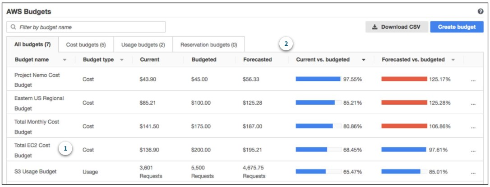
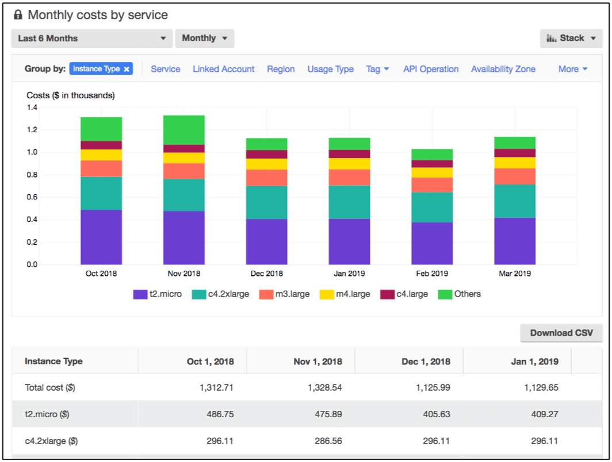

# Amazon's AWS Cloud Practitioner Essentials Course

## [Module 8: Pricing and Support](https://content.aws.training/wbt/cecpeb/en/x1/1.0.1/index.html?endpoint=https%3a%2f%2flrs.aws.training%2fTCAPI%2f&auth=Basic%20OjBiMGI4Y2UzLThjOTMtNDc5OS1hYjc5LWEyZTRiOTY1YWRjNw%3d%3d&actor=%7b%22objectType%22%3a%22Agent%22%2c%22name%22%3a%5b%22INQ5CE3B90aXZcEnqdt9gw2%22%5d%2c%22mbox%22%3a%5b%22mailto%3alms-user-INQ5CE3B90aXZcEnqdt9gw2%40amazon.com%22%5d%7d&registration=a1f41fc6-1511-44e4-85a4-8e1923af7bc6&activity_id=http%3a%2f%2fJsdOGRWZzljloSEdyFptOL7JZcTBEIYc_rise&grouping=http%3a%2f%2fJsdOGRWZzljloSEdyFptOL7JZcTBEIYc_rise&content_token=f1d42faf-a210-4c2d-b42a-9fe2b337f828&content_endpoint=https%3a%2f%2flrs.aws.training%2fTCAPI%2fcontent%2f&externalRegistration=CompletionThresholdPercent%7c100!InstanceId%7c0!PackageId%7ccecpeb_en_x1_1.0.1!RegistrationTimestampTicks%7c16225031567556825!SaveCompletion%7c1!TranscriptId%7cLwlMtrUQsUibqhjrMdAFoQ2!UserId%7cINQ5CE3B90aXZcEnqdt9gw2&externalConfiguration=&width=988&height=724&left=466&top=0#/lessons/15VXVAnJqTLIarXGuKjg20dkQrMdMfyK)

### Introduction
In this module, you will learn how to:

- Describe AWS pricing and support models.
- Describe the AWS Free Tier.
- Describe key benefits of AWS Organizations and consolidated billing.
- Explain the benefits of AWS Budgets.
- Explain the benefits of AWS Cost Explorer.
- Explain the primary benefits of the AWS Pricing Calculator.
- Distinguish between the various AWS Support Plans.
- Describe the benefits of AWS Marketplace.

## [AWS Free Tier](https://content.aws.training/wbt/cecpeb/en/x1/1.0.1/index.html?endpoint=https%3a%2f%2flrs.aws.training%2fTCAPI%2f&auth=Basic%20OjBiMGI4Y2UzLThjOTMtNDc5OS1hYjc5LWEyZTRiOTY1YWRjNw%3d%3d&actor=%7b%22objectType%22%3a%22Agent%22%2c%22name%22%3a%5b%22INQ5CE3B90aXZcEnqdt9gw2%22%5d%2c%22mbox%22%3a%5b%22mailto%3alms-user-INQ5CE3B90aXZcEnqdt9gw2%40amazon.com%22%5d%7d&registration=a1f41fc6-1511-44e4-85a4-8e1923af7bc6&activity_id=http%3a%2f%2fJsdOGRWZzljloSEdyFptOL7JZcTBEIYc_rise&grouping=http%3a%2f%2fJsdOGRWZzljloSEdyFptOL7JZcTBEIYc_rise&content_token=f1d42faf-a210-4c2d-b42a-9fe2b337f828&content_endpoint=https%3a%2f%2flrs.aws.training%2fTCAPI%2fcontent%2f&externalRegistration=CompletionThresholdPercent%7c100!InstanceId%7c0!PackageId%7ccecpeb_en_x1_1.0.1!RegistrationTimestampTicks%7c16225031567556825!SaveCompletion%7c1!TranscriptId%7cLwlMtrUQsUibqhjrMdAFoQ2!UserId%7cINQ5CE3B90aXZcEnqdt9gw2&externalConfiguration=&width=988&height=724&left=466&top=0#/lessons/l7u9w6ibbP7jgqgz3J5Qb6Jel2rGoG1f)

The [AWS Free Tier](https://aws.amazon.com/free/) enables you to begin using certain services without having to worry about incurring costs for the specified period. 

Three types of offers are available: 

- Always Free
  - These offers do not expire and are available to all AWS customers
  - Examples:
    - AWS Lambda allows 1 million free requests and up to 3.2 million seconds of compute time per month
    - Amazon DynamoDB allows 25 GB of free storage per month
- 12 Months Free
  - These offers are free for 12 months following your initial sign-up date to AWS
  - Examples:
    - Specific amounts of Amazon S3 Standard Storage
      - Standard is free for 12 months for up to 5 GB of storage
    - Thresholds for monthly hours of Amazon EC2 compute time
    - Amounts of Amazon CloudFront data transfer out
- Trials
  - Short-term free trial offers start from the date you activate a particular service
  - The length of each trial might vary by number of days or the amount of usage in the service
  - Examples:
    - Amazon Inspector offers a 90-day free trial
    - Amazon Lightsail (a service that enables you to run virtual private servers where you can deploy ready-made application stacks) offers 750 free hours of usage over a 30-day period

### Knowledge Check

The AWS Free Tier includes offers that are available to new AWS customers for a certain period of time following their AWS sign-up date. What is the duration of this period?

- [ ] 3 months

- [ ] 6 months

- [ ] 9 months

- [x] 12 months

> The correct response option is **12 months**.
> 
> The AWS Free Tier consists of three types of offers that allow customers to use AWS services without incurring costs: Always free, 12 months free, and Trials.
> 
> For 12 months after you first sign up for an AWS account, you can take advantage of offers in the **12 Months Free category**. Examples of offers in this category include specific amounts of Amazon S3 Standard Storage, thresholds for monthly hours of Amazon EC2 compute time, and amounts of Amazon CloudFront data transfer out.
> 
> **Learn more:**
> 
> - [AWS Free Tier](https://aws.amazon.com/free/)
> 

## [AWS Pricing Concepts](https://content.aws.training/wbt/cecpeb/en/x1/1.0.1/index.html?endpoint=https%3a%2f%2flrs.aws.training%2fTCAPI%2f&auth=Basic%20OjBiMGI4Y2UzLThjOTMtNDc5OS1hYjc5LWEyZTRiOTY1YWRjNw%3d%3d&actor=%7b%22objectType%22%3a%22Agent%22%2c%22name%22%3a%5b%22INQ5CE3B90aXZcEnqdt9gw2%22%5d%2c%22mbox%22%3a%5b%22mailto%3alms-user-INQ5CE3B90aXZcEnqdt9gw2%40amazon.com%22%5d%7d&registration=a1f41fc6-1511-44e4-85a4-8e1923af7bc6&activity_id=http%3a%2f%2fJsdOGRWZzljloSEdyFptOL7JZcTBEIYc_rise&grouping=http%3a%2f%2fJsdOGRWZzljloSEdyFptOL7JZcTBEIYc_rise&content_token=f1d42faf-a210-4c2d-b42a-9fe2b337f828&content_endpoint=https%3a%2f%2flrs.aws.training%2fTCAPI%2fcontent%2f&externalRegistration=CompletionThresholdPercent%7c100!InstanceId%7c0!PackageId%7ccecpeb_en_x1_1.0.1!RegistrationTimestampTicks%7c16225031567556825!SaveCompletion%7c1!TranscriptId%7cLwlMtrUQsUibqhjrMdAFoQ2!UserId%7cINQ5CE3B90aXZcEnqdt9gw2&externalConfiguration=&width=988&height=724&left=466&top=0#/lessons/pX3rCwlzVBekgdkGmQEwZeRQT4aV4SoS)

### How AWS pricing works
AWS offers a range of cloud computing services with pay-as-you-go pricing.

- Pay For What You Use:
  - For each service, you pay for exactly the amount of resources that you actually use, without requiring long-term contracts or complex licensing
- Pay Less When You Reserve:
  - Some services offer reservation options that provide a significant discount compared to On-Demand Instance pricing
  - Example: Your company is using Amazon EC2 instances for a workload that needs to run continuously
    - You might choose to run this workload on Amazon EC2 Instance Savings Plans, because the plan allows you to save up to 72% over the equivalent On-Demand Instance capacity
- Pay Less with Volume-Based Discounts When You Use More
  - Some services offer tiered pricing, so the per-unit cost is incrementally lower with increased usage
  - Example: The more Amazon S3 storage space you use, the less you pay for it per GB

### [AWS Pricing Calculator](https://calculator.aws/#/)

- Lets you explore AWS services and create an estimate for the cost of your use cases on AWS
- Can organize your AWS estimates by groups that you define
- A group can reflect how your company is organized, such as providing estimates by cost center
- When you have created an estimate, you can save it and generate a link to share it with others
- Example: Suppose that your company is interested in using Amazon EC2 but not sure which Region or instance type would be the most cost-efficient
  - You can enter details such as:
    - The kind of operating system you need
    - Memory requirements
    - Input/Output (I/O) requirements
  - Then you can review an estimated comparison of different EC2 instance types across AWS Regions

### AWS Pricing Examples

- **[AWS Lambda Pricing](https://aws.amazon.com/lambda/pricing/)**
  - You are charged based on the number of requests for your functions and the time that it takes for them to run
  - Allows 1 million free requests and up to 3.2 million seconds of compute time per month
  - You can save on AWS Lambda costs by signing up for Compute Savings Plans
    - Compute Savings Plans offer lower compute costs in exchange for committing to a consistent amount of usage over a 1-year or 3-year term
    - This is an example of **paying less when you reserve**
  - Example:
    

- **[Amazon EC2 Pricing](https://aws.amazon.com/ec2/pricing/)**
  - You pay for only the compute time that you use while your instances are running
  - You can significantly reduce Amazon EC2 costs by using Spot Instances and save up to 90%
  - You can find additional cost savings for Amazon EC2 by considering Savings Plans and Reserved Instances
  - Example:
    

- **[Amazon S3 pricing](https://aws.amazon.com/s3/pricing/)**
  
  - You need to consider the following cost components:
    - Storage
      - You pay for only the storage that you use
      - You are charged the rate to store objects in your Amazon S3 buckets based on your objects’ sizes, storage classes, and how long you have stored each object during the month
    - Requests and data retrievals
      - You pay for requests made to your Amazon S3 objects and buckets
      - Suppose that you are storing photo files in Amazon S3 buckets and hosting them on a website
        - Every time a visitor requests the website that includes these photo files, this counts towards requests you must pay for
    - Data transfer
      - There is no cost to transfer data between different Amazon S3 buckets or from Amazon S3 to other services within the same AWS Region
      - You do pay for data that you transfer into and out of Amazon S3, with a few exceptions
      - There is no cost for data transferred into Amazon S3 from the internet or out to Amazon CloudFront
      - There is also no cost for data transferred out to an Amazon EC2 instance in the same AWS Region as the Amazon S3 bucket
    - Management and replication
      - You pay for the storage management features that you have enabled on your account’s Amazon S3 buckets
      - These features include: 
        - Amazon S3 inventory
        - Analytics
        - Object tagging

## [Billing Dashboard](https://content.aws.training/wbt/cecpeb/en/x1/1.0.1/index.html?endpoint=https%3a%2f%2flrs.aws.training%2fTCAPI%2f&auth=Basic%20OjBiMGI4Y2UzLThjOTMtNDc5OS1hYjc5LWEyZTRiOTY1YWRjNw%3d%3d&actor=%7b%22objectType%22%3a%22Agent%22%2c%22name%22%3a%5b%22INQ5CE3B90aXZcEnqdt9gw2%22%5d%2c%22mbox%22%3a%5b%22mailto%3alms-user-INQ5CE3B90aXZcEnqdt9gw2%40amazon.com%22%5d%7d&registration=a1f41fc6-1511-44e4-85a4-8e1923af7bc6&activity_id=http%3a%2f%2fJsdOGRWZzljloSEdyFptOL7JZcTBEIYc_rise&grouping=http%3a%2f%2fJsdOGRWZzljloSEdyFptOL7JZcTBEIYc_rise&content_token=f1d42faf-a210-4c2d-b42a-9fe2b337f828&content_endpoint=https%3a%2f%2flrs.aws.training%2fTCAPI%2fcontent%2f&externalRegistration=CompletionThresholdPercent%7c100!InstanceId%7c0!PackageId%7ccecpeb_en_x1_1.0.1!RegistrationTimestampTicks%7c16225031567556825!SaveCompletion%7c1!TranscriptId%7cLwlMtrUQsUibqhjrMdAFoQ2!UserId%7cINQ5CE3B90aXZcEnqdt9gw2&externalConfiguration=&width=988&height=724&left=466&top=0#/lessons/i01_7Y6KMTulsh1A-6DmnenJ71W24ONb)

- Use the [AWS Billing & Cost Management dashboard](https://docs.aws.amazon.com/awsaccountbilling/latest/aboutv2/billing-what-is.html) to pay your AWS bill, monitor your usage, and analyze and control your costs.
  - Compare your current month-to-date balance with the previous month, and get a forecast of the next month based on current usage
  - View month-to-date spend by service
  - View Free Tier usage by service
  - Access Cost Explorer and create budgets
  - Purchase and manage Savings Plans
  - Publish [AWS Cost and Usage Reports](https://docs.aws.amazon.com/cur/latest/userguide/what-is-cur.html)

## [Consolidate Billing](https://content.aws.training/wbt/cecpeb/en/x1/1.0.1/index.html?endpoint=https%3a%2f%2flrs.aws.training%2fTCAPI%2f&auth=Basic%20OmQyMGVlZjlmLTQzNGItNDQxMC05MDhhLWQ3MGQ2YzZkZjI2OQ%3d%3d&actor=%7b%22objectType%22%3a%22Agent%22%2c%22name%22%3a%5b%22INQ5CE3B90aXZcEnqdt9gw2%22%5d%2c%22mbox%22%3a%5b%22mailto%3alms-user-INQ5CE3B90aXZcEnqdt9gw2%40amazon.com%22%5d%7d&registration=a1f41fc6-1511-44e4-85a4-8e1923af7bc6&activity_id=http%3a%2f%2fJsdOGRWZzljloSEdyFptOL7JZcTBEIYc_rise&grouping=http%3a%2f%2fJsdOGRWZzljloSEdyFptOL7JZcTBEIYc_rise&content_token=680a7c7b-45ba-43dd-bab6-749f919f133b&content_endpoint=https%3a%2f%2flrs.aws.training%2fTCAPI%2fcontent%2f&externalRegistration=CompletionThresholdPercent%7c100!InstanceId%7c0!PackageId%7ccecpeb_en_x1_1.0.1!RegistrationTimestampTicks%7c16225031567556825!SaveCompletion%7c1!TranscriptId%7cLwlMtrUQsUibqhjrMdAFoQ2!UserId%7cINQ5CE3B90aXZcEnqdt9gw2&externalConfiguration=&width=988&height=724&left=466&top=0#/lessons/O0GvjneHc3yFtKjmWMM3LYUuNB9NblFb)

In an earlier module, you learned about AWS Organizations, a service that enables you to manage multiple AWS accounts from a central location. AWS Organizations also provides the option for [consolidated billing](https://docs.aws.amazon.com/awsaccountbilling/latest/aboutv2/consolidated-billing.html). 

- The consolidated billing feature of AWS Organizations enables you to receive a single bill for all AWS accounts in your organization
- By consolidating, you can easily track the combined costs of all the linked accounts in your organization
- The default maximum number of accounts allowed for an organization is 4, but you can contact AWS Support to increase your quota, if needed
- You can review itemized charges incurred by each account on your monthly bill
- Another benefit of consolidated billing is the ability to share bulk discount pricing, Savings Plans, and Reserved Instances across the accounts in your organization
- It is a Free feature, no additional costs

## [AWS Budgets](https://aws.amazon.com/aws-cost-management/aws-budgets)

- You can create budgets to plan your service usage, service costs, and instance reservations
- The information updates 3 times a day
  - This helps to accurately determine how close your usage is to your budgeted amounts or the Free Tier limits
- You can set custom alerts when your usage exceeds, or is forecasted to, the monthly budgeted amount
- How to set up a budget:
  - Navigate to the billing section on your AWS Management Console
  - Click on "Budgets" in the panel, on the left side, under "Cost Management"
  - In the top right corner, click the "Create budget" blue button
  - Choose a budget type
  - On the next page, fill in your requirements, then click "Configure alerts"
  - On this page, we will set up the alert(s) we want to receive
    - We can set up one or many alerts on this page
  - Click on "Confirm budget"
  - Then you will see a summary page of your budget; make sure to click the "Create" button to complete the creation of the budget

### Example:

1. In this sample budget, you can review the following important details:
   - The current amount you have incurred for EC2 so far this month ($136.90)
   - The amount that you are forecasted to spend for the month ($195.21), based on your usage patterns

2. You can also review comparisons of your current vs budgeted usage, and forecasted vs budgeted usage
   - Example:
     - In the top row of this sample, the forecasted vs budgeted bar is at 125.17%
       - The reason for the increase is that the forecasted amount ($56.33) exceeds the amount that had been budgeted for that item for the month ($45)
- Let's look at the EC2 instance; you want to ensure your company's usage does not exceed $200 for the month
- You could set a custom budget to notify you when your usage has reached half of this amount ($100)
  - With this setting you would receive an alert and then you can decide how to proceed with your continued use of the EC2

## [AWS Cost Explorer](https://aws.amazon.com/aws-cost-management/aws-cost-explorer/)

- A tool that enables you to visualize, understand, and manage your AWS costs and usage over time
- A console-based service that allows you to visually see and analyze how you are spending money with AWS
- Includes a default report of the costs and usage for your top five cost-accruing AWS services
- Gives you up to 12 months of historical data
- You can apply custom filters and groups to analyze your data
  - One that is really useful, is to group by a ***Tag***
  - **Tag:** User-defined key-value pairs
    - Useful for tagging a service with a specific project name for better organization
- Allows you to create custom reports and save them for later use

### Example

This example of the Cost Explorer Dashboard displays monthly costs for EC2 instances over a 6-month period
- The bar for each month separates the costs for different EC2 instance types (such as t2.micro or m3.large)
- By analyzing your AWS costs over time, you can make informed decisions about future costs and how to plan your budgets

## [AWS Support Plans](https://aws.amazon.com/premiumsupport/plans/)

- AWS offers 4 Support Plans to help you troubleshoot issues, lower costs, and efficiently use AWS services:

  - Basic:
    - Free for all AWS customers
    - 24/7 customer support access
    - Includes access to whitepapers, documentation, and support communities
    - You can contact AWS for billing questions and service limit increases
    - You have access to a limited selection of AWS Trusted Advisor checks (7 core checks)
    - You can use the AWS Personal Health Dashboard (a tool that provides alerts and remediation guidance when AWS is experiencing events that may affect you)

  - Developer:
    - Includes all the benefits of the Basic Support Plan
    - Business hours email access to Cloud Support Associates
    - Ability to open an unrestricted number of technical support cases through only 1 primary contact person
    - Response time of 12 hours (system impaired) to 24 hours (general guidance)
    - Pay-by-the-month pricing, in addition to normal AWS service charges, and requires no long-term contract
    - The lowest priced plan out of the paid plans @ $29 or 3% of monthly AWS usage (whichever is greater) per month
    - Best practice guidance
    - Client-side diagnostic tools
    - Building-block architecture support, which consists of guidance for how to use AWS offerings, features, and services together

  - Business:
    - Includes all the benefits of the Basic and Developer Support Plans
    - 24/7 phone, email, and chat access to Cloud Support Engineers
    - Ability to open an unrestricted number of technical support cases by unlimited number of IAM users
    - Response time of 1 hour (production system down) to 24 hours (general guidance)
    - Pay-by-the-month pricing, in addition to normal AWS service charges, and requires no long-term contract
    - Still affordable @ $100 or 3% - 10% of monthly AWS usage (whichever is greater) per month
    - Use-case guidance to identify AWS offerings, features, and services that can best support your specific needs
    - All AWS Trusted Advisor checks
    - Limited support for third-party software, such as common operating systems and application stack components

  - Enterprise:
    - Includes all the benefits of the Basic, Developer, and Business Support Plans
    - Response time of 15 minutes (business-critical system down) to 24 hours (general guidance)
    - The most expensive Support Plan @ $15,000 or 3% - 10% or monthly AWS usage (whichever is greater) per month
    - Application architecture guidance, which is a consultative relationship to support your company's specific use cases and applications
    - Infrastructure event management: A short-term engagement with AWS Support that helps your company gain a better understanding of your use cases
      - This also provides your company with architectural and scaling guidance
    - A **Technical Account Manager (TAM)**
      - Your primary point of contact at AWS
      - Provides guidance, architectural reviews, and ongoing communication with your company as you plan, deploy, and optimize your applications
        - Five Pillars of a Well-Architected Framework:
          - Operational Excellence
          - Security
          - Reliability
          - Performance Efficiency
          - Cost Optimization
      - Provides expertise across the full range of AWS services
      - Help you design solutions that efficiently use multiple services together through an integrated approach
    - Access to online self-paced training labs
    - Concierge Support Team (TAM is included in this team)

### Knowledge Check

Which Support plan includes all AWS Trusted Advisor checks at the lowest cost?

- [ ] Basic

- [ ] Developer

- [x] Business

- [ ] Enterprise

> The correct response option is **Business**. 
> 
> Only the Business and Enterprise Support plans include all AWS Trusted Advisor checks. Of these two Support plans, the Business Support plan has a lower cost.
> 
> **Learn more:**
> 
> - [Compare AWS Support plans](https://aws.amazon.com/premiumsupport/plans/)
> 

## AWS Marketplace

## Module 8 Summary

## Module 8 Quiz

