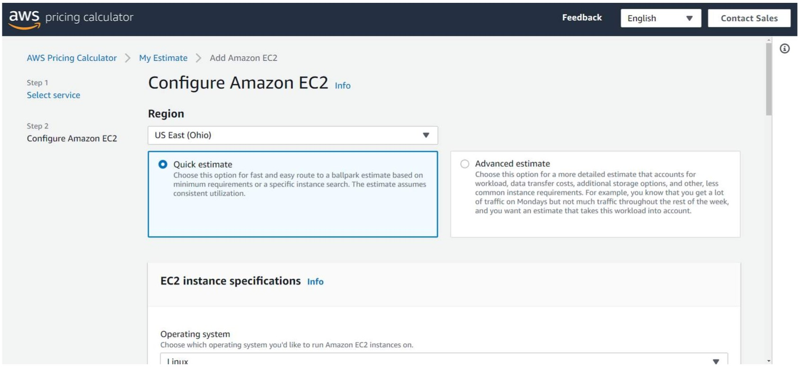
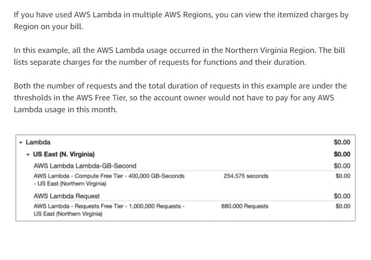
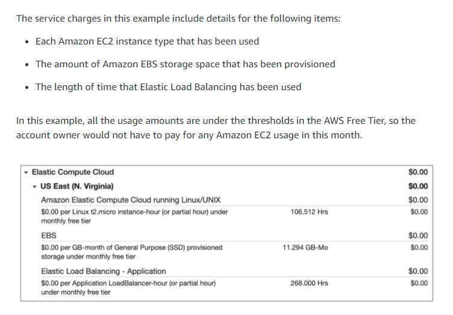
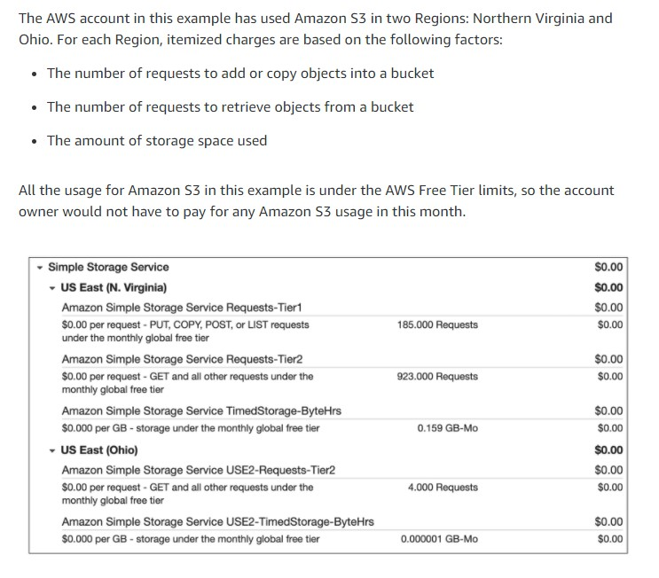

# Amazon's AWS Cloud Practitioner Essentials Course

## [Module 8: Pricing and Support](https://content.aws.training/wbt/cecpeb/en/x1/1.0.1/index.html?endpoint=https%3a%2f%2flrs.aws.training%2fTCAPI%2f&auth=Basic%20OjBiMGI4Y2UzLThjOTMtNDc5OS1hYjc5LWEyZTRiOTY1YWRjNw%3d%3d&actor=%7b%22objectType%22%3a%22Agent%22%2c%22name%22%3a%5b%22INQ5CE3B90aXZcEnqdt9gw2%22%5d%2c%22mbox%22%3a%5b%22mailto%3alms-user-INQ5CE3B90aXZcEnqdt9gw2%40amazon.com%22%5d%7d&registration=a1f41fc6-1511-44e4-85a4-8e1923af7bc6&activity_id=http%3a%2f%2fJsdOGRWZzljloSEdyFptOL7JZcTBEIYc_rise&grouping=http%3a%2f%2fJsdOGRWZzljloSEdyFptOL7JZcTBEIYc_rise&content_token=f1d42faf-a210-4c2d-b42a-9fe2b337f828&content_endpoint=https%3a%2f%2flrs.aws.training%2fTCAPI%2fcontent%2f&externalRegistration=CompletionThresholdPercent%7c100!InstanceId%7c0!PackageId%7ccecpeb_en_x1_1.0.1!RegistrationTimestampTicks%7c16225031567556825!SaveCompletion%7c1!TranscriptId%7cLwlMtrUQsUibqhjrMdAFoQ2!UserId%7cINQ5CE3B90aXZcEnqdt9gw2&externalConfiguration=&width=988&height=724&left=466&top=0#/lessons/15VXVAnJqTLIarXGuKjg20dkQrMdMfyK)

### Introduction
In this module, you will learn how to:

- Describe AWS pricing and support models.
- Describe the AWS Free Tier.
- Describe key benefits of AWS Organizations and consolidated billing.
- Explain the benefits of AWS Budgets.
- Explain the benefits of AWS Cost Explorer.
- Explain the primary benefits of the AWS Pricing Calculator.
- Distinguish between the various AWS Support Plans.
- Describe the benefits of AWS Marketplace.

## [AWS Free Tier](https://content.aws.training/wbt/cecpeb/en/x1/1.0.1/index.html?endpoint=https%3a%2f%2flrs.aws.training%2fTCAPI%2f&auth=Basic%20OjBiMGI4Y2UzLThjOTMtNDc5OS1hYjc5LWEyZTRiOTY1YWRjNw%3d%3d&actor=%7b%22objectType%22%3a%22Agent%22%2c%22name%22%3a%5b%22INQ5CE3B90aXZcEnqdt9gw2%22%5d%2c%22mbox%22%3a%5b%22mailto%3alms-user-INQ5CE3B90aXZcEnqdt9gw2%40amazon.com%22%5d%7d&registration=a1f41fc6-1511-44e4-85a4-8e1923af7bc6&activity_id=http%3a%2f%2fJsdOGRWZzljloSEdyFptOL7JZcTBEIYc_rise&grouping=http%3a%2f%2fJsdOGRWZzljloSEdyFptOL7JZcTBEIYc_rise&content_token=f1d42faf-a210-4c2d-b42a-9fe2b337f828&content_endpoint=https%3a%2f%2flrs.aws.training%2fTCAPI%2fcontent%2f&externalRegistration=CompletionThresholdPercent%7c100!InstanceId%7c0!PackageId%7ccecpeb_en_x1_1.0.1!RegistrationTimestampTicks%7c16225031567556825!SaveCompletion%7c1!TranscriptId%7cLwlMtrUQsUibqhjrMdAFoQ2!UserId%7cINQ5CE3B90aXZcEnqdt9gw2&externalConfiguration=&width=988&height=724&left=466&top=0#/lessons/l7u9w6ibbP7jgqgz3J5Qb6Jel2rGoG1f)

The [AWS Free Tier](https://aws.amazon.com/free/) enables you to begin using certain services without having to worry about incurring costs for the specified period. 

Three types of offers are available: 

- Always Free
  - These offers do not expire and are available to all AWS customers
  - Examples:
    - AWS Lambda allows 1 million free requests and up to 3.2 million seconds of compute time per month
    - Amazon DynamoDB allows 25 GB of free storage per month
- 12 Months Free
  - These offers are free for 12 months following your initial sign-up date to AWS
  - Examples:
    - Specific amounts of Amazon S3 Standard Storage
      - Standard is free for 12 months for up to 5 GB of storage
    - Thresholds for monthly hours of Amazon EC2 compute time
    - Amounts of Amazon CloudFront data transfer out
- Trials
  - Short-term free trial offers start from the date you activate a particular service
  - The length of each trial might vary by number of days or the amount of usage in the service
  - Examples:
    - Amazon Inspector offers a 90-day free trial
    - Amazon Lightsail (a service that enables you to run virtual private servers where you can deploy ready-made application stacks) offers 750 free hours of usage over a 30-day period

### Knowledge Check

The AWS Free Tier includes offers that are available to new AWS customers for a certain period of time following their AWS sign-up date. What is the duration of this period?

- [ ] 3 months

- [ ] 6 months

- [ ] 9 months

- [x] 12 months

> The correct response option is **12 months**.
> 
> The AWS Free Tier consists of three types of offers that allow customers to use AWS services without incurring costs: Always free, 12 months free, and Trials.
> 
> For 12 months after you first sign up for an AWS account, you can take advantage of offers in the **12 Months Free category**. Examples of offers in this category include specific amounts of Amazon S3 Standard Storage, thresholds for monthly hours of Amazon EC2 compute time, and amounts of Amazon CloudFront data transfer out.
> 
> **Learn more:**
> 
> - [AWS Free Tier](https://aws.amazon.com/free/)
> 

## [AWS Pricing Concepts](https://content.aws.training/wbt/cecpeb/en/x1/1.0.1/index.html?endpoint=https%3a%2f%2flrs.aws.training%2fTCAPI%2f&auth=Basic%20OjBiMGI4Y2UzLThjOTMtNDc5OS1hYjc5LWEyZTRiOTY1YWRjNw%3d%3d&actor=%7b%22objectType%22%3a%22Agent%22%2c%22name%22%3a%5b%22INQ5CE3B90aXZcEnqdt9gw2%22%5d%2c%22mbox%22%3a%5b%22mailto%3alms-user-INQ5CE3B90aXZcEnqdt9gw2%40amazon.com%22%5d%7d&registration=a1f41fc6-1511-44e4-85a4-8e1923af7bc6&activity_id=http%3a%2f%2fJsdOGRWZzljloSEdyFptOL7JZcTBEIYc_rise&grouping=http%3a%2f%2fJsdOGRWZzljloSEdyFptOL7JZcTBEIYc_rise&content_token=f1d42faf-a210-4c2d-b42a-9fe2b337f828&content_endpoint=https%3a%2f%2flrs.aws.training%2fTCAPI%2fcontent%2f&externalRegistration=CompletionThresholdPercent%7c100!InstanceId%7c0!PackageId%7ccecpeb_en_x1_1.0.1!RegistrationTimestampTicks%7c16225031567556825!SaveCompletion%7c1!TranscriptId%7cLwlMtrUQsUibqhjrMdAFoQ2!UserId%7cINQ5CE3B90aXZcEnqdt9gw2&externalConfiguration=&width=988&height=724&left=466&top=0#/lessons/pX3rCwlzVBekgdkGmQEwZeRQT4aV4SoS)

### How AWS pricing works
AWS offers a range of cloud computing services with pay-as-you-go pricing.

- Pay For What You Use:
  - For each service, you pay for exactly the amount of resources that you actually use, without requiring long-term contracts or complex licensing
- Pay Less When You Reserve:
  - Some services offer reservation options that provide a significant discount compared to On-Demand Instance pricing
  - Example: Your company is using Amazon EC2 instances for a workload that needs to run continuously
    - You might choose to run this workload on Amazon EC2 Instance Savings Plans, because the plan allows you to save up to 72% over the equivalent On-Demand Instance capacity
- Pay Less with Volume-Based Discounts When You Use More
  - Some services offer tiered pricing, so the per-unit cost is incrementally lower with increased usage
  - Example: The more Amazon S3 storage space you use, the less you pay for it per GB

### [AWS Pricing Calculator](https://calculator.aws/#/)

- Lets you explore AWS services and create an estimate for the cost of your use cases on AWS
- Can organize your AWS estimates by groups that you define
- A group can reflect how your company is organized, such as providing estimates by cost center
- When you have created an estimate, you can save it and generate a link to share it with others
- Example: Suppose that your company is interested in using Amazon EC2 but not sure which Region or instance type would be the most cost-efficient
  - You can enter details such as:
    - The kind of operating system you need
    - Memory requirements
    - Input/Output (I/O) requirements
  - Then you can review an estimated comparison of different EC2 instance types across AWS Regions

### AWS Pricing Examples

- **[AWS Lambda Pricing](https://aws.amazon.com/lambda/pricing/)**
  - You are charged based on the number of requests for your functions and the time that it takes for them to run
  - Allows 1 million free requests and up to 3.2 million seconds of compute time per month
  - You can save on AWS Lambda costs by signing up for Compute Savings Plans
    - Compute Savings Plans offer lower compute costs in exchange for committing to a consistent amount of usage over a 1-year or 3-year term
    - This is an example of **paying less when you reserve**
  - Example:
    

- **[Amazon EC2 Pricing](https://aws.amazon.com/ec2/pricing/)**
  - You pay for only the compute time that you use while your instances are running
  - You can significantly reduce Amazon EC2 costs by using Spot Instances and save up to 90%
  - You can find additional cost savings for Amazon EC2 by considering Savings Plans and Reserved Instances
  - Example:
    

- **[Amazon S3 pricing](https://aws.amazon.com/s3/pricing/)**
  
  - You need to consider the following cost components:
    - Storage
      - You pay for only the storage that you use
      - You are charged the rate to store objects in your Amazon S3 buckets based on your objects’ sizes, storage classes, and how long you have stored each object during the month
    - Requests and data retrievals
      - You pay for requests made to your Amazon S3 objects and buckets
      - Suppose that you are storing photo files in Amazon S3 buckets and hosting them on a website
        - Every time a visitor requests the website that includes these photo files, this counts towards requests you must pay for
    - Data transfer
      - There is no cost to transfer data between different Amazon S3 buckets or from Amazon S3 to other services within the same AWS Region
      - You do pay for data that you transfer into and out of Amazon S3, with a few exceptions
      - There is no cost for data transferred into Amazon S3 from the internet or out to Amazon CloudFront
      - There is also no cost for data transferred out to an Amazon EC2 instance in the same AWS Region as the Amazon S3 bucket
    - Management and replication
      - You pay for the storage management features that you have enabled on your account’s Amazon S3 buckets
      - These features include: 
        - Amazon S3 inventory
        - Analytics
        - Object tagging

## [Billing Dashboard]()

## [Consolidate Billing]()

## [AWS Budgets]()

## [AWS Cost Explorer]()

## [AWS Support Plans]()

## [AWS Marketplace]()

## [Module 8 Summary]()

## [Module 8 Quiz]()

