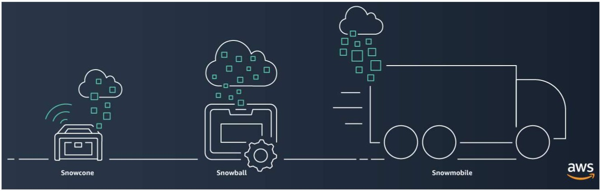

# Amazon's AWS Cloud Practitioner Essentials Course

## [Module 9: Migration and Innovation](https://dxdn3xrr0vpde.cloudfront.net/files/a/w/aws_prod1_docebosaas_com/1634677200/BGJ-01y7gHt_YkbwkyJJH3xmEkRHBg2l7kHPDYQPsl0/tincan/9fcdd31716ade4bd2b683417d7ab62bbaa2de2ed/index.html?endpoint=https%3A%2F%2Fexplore.skillbuilder.aws%2Ftcapi%2F&auth=Basic%20L2YyZDI3MjgzLWMzNTYtNDY3ZS04NmQzLWI3M2JkM2Q1OTkyMDokMnkkMTMkNHB5Njg3aVVnSy9vbnA4WTlrSmwwZTIuWTg3bEk3c0RXbnpmOFJ1eGlDaUtvNUxacnhKRnU%3D&actor=%7B%22mbox%22%3A%22mailto%3Ajoanne-middour%40outlook.com%22%2C%22name%22%3A%22Joanne+Middour%22%7D&registration=7eb5932e-f317-4da7-a8a8-17f73f3f0422&activity_id=http%3A%2F%2FJsdOGRWZzljloSEdyFptOL7JZcTBEIYc_rise&Accept-Language=en&course_id=134&content_token=7eb5932e-f317-4da7-a8a8-17f73f3f0422&session_context=lms&course_code=DIG-BF-100-CECPEB-10-EN&course_id=134&username=f2d27283-c356-467e-86d3-b73bd3d59920&user_id=748669&hash=742480e34a02697f77a43362ebb311ab0012df6cf1e43ee8bb14788a6b80eff1#/lessons/5ZqVAO27PRTdR3TlZ8HUhrnZshv1PN07)

### Introduction
In this module, you will learn how to:

- Understand migration and innovation in the AWS Cloud.
- Summarize the AWS Cloud Adoption Framework (AWS CAF). 
- Summarize the six key factors of a cloud migration strategy.
- Describe the benefits of AWS data migration solutions, such as AWS Snowcone, AWS Snowball, and AWS Snowmobile.
- Summarize the broad scope of innovative solutions that AWS offers.

## [AWS Cloud Adoption Framework (AWS CAF)](https://d1.awsstatic.com/whitepapers/aws_cloud_adoption_framework.pdf)

- Migrating to the cloud is a process
- What position you hold in your organization will impact the things that you need to know or help with for your migration
- You want to also ensure that you have the right talent to help support your migration
- The **Cloud Adoption Framework (AWS CAF)** exists to help provide advice to your company to enable a quick and smooth migration to AWS
- The framework organizes guidance into six areas focused on the different types of people that you'll need to involve for your migration
- Each perspective covers distinct responsibilities covered by different groups
- Each perspective is used to uncover gaps in your skills and processes, which are then recorded as ***inputs***
- These ***inputs*** are then used as the basis for creating what is called an ***AWS Cloud Adoption Framework Action Plan***
  - **AWS CAF Action Plan:** Helps guide your organization for cloud migration
- Having an action plan that makes sense for your organization can help keep you on track

Six Core Perspectives of the Cloud Adoption Framework
1. Business Perspective - Business Capabilities
   - Ensures that IT aligns with business needs and that IT investments link to key business results
   - Use the Business Perspective to create a strong business case for cloud adoption and prioritize cloud adoption initiatives
   - Ensure that your business strategies and goals align with your IT strategies and goals
   - Common roles in the Business Perspective include:
     - Business Managers
     - Finance Managers
     - Budget Owners
     - Strategy Stakeholders

2. People Perspective - Business Capabilities
   - Supports development of an organization-wide change management strategy for successful cloud adoption
   - Used to evaluate organizational structures and roles, new skill and process requirements, and identify gaps
     - This helps prioritize training, staffing, and organizational changes
   - Common roles in the People Perspective include:
     - Human Resources
     - Staffing
     - People Managers

3. Governance Perspective - Business Capabilities
   - Focuses on the skills and processes to align IT strategy with business strategy
     - This ensures that you maximize the business value and minimize risks
   - Used to understand how to update the staff skills and processes necessary to ensure business governance in the cloud
   - Manage and measure cloud investments to evaluate business outcomes
   - Common roles in the Governance Perspective include:
     - Chief Information Officer (CIO)
     - Program Managers
     - Enterprise Architects
     - Business Analysts
     - Portfolio Managers

4. Platform Perspective - Technical Capabilities
   - Includes principles and patterns for implementing new solutions on the cloud, and migrating on-premises workloads to the cloud
   - Use a variety of architectural models to understand and communicate the structure of IT systems and their relationships
   - Describe the architecture of the target state environment in detail
   - Common roles in the Platform Perspective include:
     - Chief Technology Officer (CTO)
     - IT Managers
     - Solution Architects

5. Security Perspective - Technical Capabilities
   - Ensures that the organization meets security objectives for visibility, auditability, control, and agility
   - Used to structure the selection and implementation of security controls that meet the organization's needs
   - Common roles in the Security Perspective include:
     - Chief Information Security Officer (CISO)
     - IT Security Managers
     - IT Security Analysts

6. Operations Perspective - Technical Capabilities
   - Helps you to enable, run, use, operate, and recover IT workloads to the level agreed upon with your business stakeholders
   - Define how day-to-day, quarter-to-quarter, and year-to-year business is conducted
   - Align with and support the operations of the business
   - The AWS CAF helps these stakeholders define current operating procedures and identify the process changes and training needed to implement successful cloud adoption
   - Common roles in the Operations Perspective include:
     - IT Operations Managers
     - IT Support Managers

### Knowledge Check

Which Perspective of the AWS Cloud Adoption Framework helps you design, implement, and optimize your AWS infrastructure based on your business goals and perspectives?

- [ ] Business Perspective

- [x] Platform Perspective

- [ ] Operations Perspective

- [ ] People Perspective

> The correct response option is **Platform Perspective**.
> 
> The Platform Perspective of the AWS Cloud Adoption Framework also includes principles for implementing new solutions and migrating on-premises workloads to the cloud.
> 
> The other response options are incorrect because:
> 
> - The Business Perspective helps you to move from a model that separates business and IT strategies into a business model that integrates IT strategy.
> - The Operations Perspective focuses on operating and recovering IT workloads to meet the requirements of your business stakeholders.
> - The People Perspective helps Human Resources (HR) employees prepare their teams for cloud adoption by updating organizational processes and staff skills to include cloud-based competencies.
> 
> **Learn more:**
> 
> - [Whitepaper: An Overview of the AWS Cloud Adoption Framework](https://d1.awsstatic.com/whitepapers/aws_cloud_adoption_framework.pdf)
> 

## [Migration Strategies](https://aws.amazon.com/blogs/enterprise-strategy/6-strategies-for-migrating-applications-to-the-cloud/)

- Every application (or application group, if they are tightly coupled) will have six possible options when it comes to your enterprise migration
- We call these "The 6 R's"
  - Once you've gone through the discovery phase and know exactly what you have in your existing environment, you decide which option is the best fit based on time, cost, priority, and criticality

**Six (R's) Strategies for Migration:**
- **Re-hosting: (AKA "lift-and-shift")**
  - Involves moving applications without changes
  - This is the easiest option to do, since you are not making any changes right away
  - Some companies have found that even though they many not be getting total optimization, they were still able to save up to 30% of their total cost just by re-hosting
  - We have found that it is often times easier to optimize applications once they already live in the cloud
  - In the scenario of a large legacy migration, in which the company is looking to implement its migration and scale quickly, the majority of applications are re-hosted

- **Re-platforming: (AKA "lift, tinker, and shift")**
  - Involves making a few cloud optimizations to realize a tangible benefit
  - Optimization is achieved without changing the core architecture of the application

- **Re-factoring: (AKA Re-architecting)**
  - Involves reimagining how an application is architected and developed by using cloud-native features
  - Driven by a strong business need to add features, scale, or performance that would otherwise be difficult to achieve in the application's existing environment
  - Dramatic changes to your architecture can be very beneficial to your enterprise but this will come at the highest initial cost in terms of planning and human effort

- **Repurchasing:**
  - Involves moving from a traditional license to a software-as-a-service (SaaS) model
  - Good for companies looking to abandon legacy software vendors and get a fresh start as part of migration
  - Just remember, you will now be dealing with a new software package and some are easy to implement, some take time
    - The total upfront expense of this step therefore goes up, but the potential benefits could be substantial
  - Example: A business might choose to implement the repurchasing strategy by migrating from a customer relationship management (CRM) system to Salesforce.com

- **Retaining:**
  - Consists of keeping applications that are critical for the business in the source environment
  - This might include:
    - Applications that require major refactoring before they can be migrated
    - Work that can be postponed until a later time
    - Applications that are about to be deprecated, but not just yet
      - You could migrate these but does not make much sense
      - Then you can just deprecate them where they live when the time comes
  - You should only migrate what makes sense for your business

- **Retiring:**
  - The process of removing applications that are no longer needed
  - We've found that as much as 10% to 20% of companies application portfolios include applications that are no longer being used or already have replacements live and functional
  - Using the AWS migration plan as the opportunity to actually end-of-life these applications can save significant cost and effort for your team
  - Sometimes you just have to turn off the lights

### Knowledge Check

Which migration strategy involves moving to a different product?

- [ ] Refactoring

- [ ] Retiring

- [ ] Replatforming

- [x] Repurchasing

> The correct response option is **Repurchasing**.
> 
> Repurchasing involves replacing an existing application with a cloud-based version, such as software found in AWS Marketplace.
> 
> The other response options are incorrect because:
> 
> - Refactoring involves changing how an application is architected and developed, typically by using cloud-native features.
> - Retiring involves removing an application that is no longer used or that can be turned off.
> - Replatforming involves selectively optimizing aspects of an application to achieve benefits in the cloud without changing the core architecture of the application. It is also known as “lift, tinker, and shift.”
> 
> **Learn more:**
> 
> - [6 Strategies for Migrating Applications to the Cloud](https://aws.amazon.com/blogs/enterprise-strategy/6-strategies-for-migrating-applications-to-the-cloud/)
> 

## [AWS Snow Family](https://aws.amazon.com/snow)

- Theoretically --> A network with 1 Gbps (gigabyte per second) speed moves 1 PB (petabyte) of data in about **100 days**
  - In the real world it would be likely longer and at a higher cost
  - This is the reason AWS came up with the Snow Family of device; to shorten the time and reduce the expense of transfering large amounts of data to the Cloud
- These devices offer different capacity points
- Most include built-in computing capabilities
- AWS owns and manages the Snow Family devices
- They integrate with AWS security, monitoring, storage management, and computing capabilities
- To obtain any of these devices:
  - You place an order via tne AWS Management Console
  - AWS ships the device to you
  - You plug in the device
  - You copy your data to the device
  - You ship the device back to AWS
  - Once AWS receives the device, they copy the data into your account, usually an S3 bucket that you own

### AWS Snow Family Members

The AWS Snow Family is a collection of physical devices that help to physically transport up to exabytes of data into and out of AWS
- All Snow Family devices are designed to be secure and tamper-resistant while on-site or in-transit
- The hardware and software is cryptographically signed
- All data stored is automatically encrypted using 256-bit encryption keys, owned and managed by the customer
- You can use AWS Key Management Service to generate and manage keys

**AWS Snow Family is composed of:**
- **AWS Snowcone:**
  - A small, rugged, and secure edge computing and data transfer device
  - Features:
    - 2 CPUs
    - 4 GB of memory
    - up to 8 TB of usable storage
    - Contains Edge computing
      - Edge computing options are: EC2 instances and AWS IoT Greengrass

- **AWS Snowball:**
  - Fits into existing server racks
  - Can be clustered for greater computing needs
  - Once plugged into your infrastructure, you can run AWS Lambda functions, EC2-compatible AMIs, or IoT Greengrass to perform simple processing of data right then and there
  - Offers two types of devices:
    - **Snowball Edge Storage Optimized:**
      - Well suited for large-scale data migrations and recurring transfer workflows, in addition to local computing with higher capacity needs
      - Features:
        - Storage:
          - 80 TB of hard disk drive (HDD) capacity for block volumes and AWS S3 compatible object storage
          - 1 TB SATA solid state drive (SSD) for block volumes
        - Compute:
          - 40 vCPUs
          - 80 GiB of memory to support AWS EC2 sbe1 instances (equivalent to C5)

    - **Snowball Edge Compute Optimized:**
      - Provides powerful computing resources for use cases such as machine learning, full motion video analysis, analytics, and local computing stacks
      - Features:
        - Storage:
          - 42 TB usable HDD capacity for AWS S3 compatible object storage or AWS EBS compatible block volumes
          - 7.68 TB of usable NVMe SSD capacity for AWS EBS compatible block volumes
        - Compute:
          - 52 vCPUs
          - 208 GiB of memory
          - (Optional) NVIDIA Tesla V100 GPU
          - Runs AWS EC2 sbe-c and sbe-g instances, which are equivalent to C5, M5a, G3, and P3 instances

- **AWS Snowmobile:**
  - An exabyte-scale data transfer service used to move large amounts of data to AWS
  - Can transfer up to 100 petabytes of data per Snowmobile
  - It is a 45-foot-long rugged shipping container, pulled by a semi-trailer truck
  - Ideal for the largest migrations and even data center shutdowns
  - AWS drives the truck to the designated location
  - They plug it in
  - Then it appears as a network attached storage device
  - Features: 
    - Tamper resistant
    - Waterproof
    - Temperature controlled
    - Fire suppression
    - GPS tracking
    - 24/7 video surveillance with a dedicated security team
    - Escort security vehicle during transit

### Knowledge Check

What is the storage capacity of Snowball Edge Storage Optimized?

- [ ] 40 TB

- [ ] 60 TB

- [x] 80 TB

- [ ] 100 TB

> The correct response option is **80 TB**.
> 
> Snowball Edge Storage Optimized is a device that enables you to transfer large amounts of data into and out of AWS. It provides 80 TB of usable HDD storage.
> 
> **Learn more:**
> 
> - [AWS Snow Family](https://aws.amazon.com/snow/)
> 

## Innovation with AWS

- The same VMWare based infrastructure that you use on prem can, in many cases, just be lifted and dropped onto AWS via VMWare Cloud on AWS
- 

When examining how to use AWS services, it is important to focus on the desired outcomes. You are properly equipped to drive innovation in the cloud if you can clearly articulate the following conditions:
- The current state
- The desired state
- The problems you are trying to solve

Consider some paths you might explore in the future as you continue on your cloud journey.

- **Serverless Applications:**
  - **Serverless:** Refers to applications that don't require you to provision, maintain, or administer servers
  - Don't need to worry about fault tolerance or availability
    - AWS handles these capabilities for you
  - AWS Lambda is an example
    - If you design your architecture to trigger Lambda functions to run your code, you can bypass the need to manage a fleet of servers

- **Artificial Intelligence:**
  - AWS offers a variety of services powered by AI
  - One of the services AWS offers is Amazon Augmented AI (Amazon A2I)
    - Provides a machine learning platform that any business can build upon without needing PhD level expertise in-house
  - Another is Textract:
    - Extract text and data from documents to make them more usable for your enterprise
  - Some task you can perform include:
    - Convert speech to text with Amazon Transcribe
    - Discover patterns in text with Amazon Comprehend
    - Identify potential fraudulent online activities with Amazon Fraud Detector
    - Build voice and text chat bots with Amazon Lex

- **Machine Learning:**
  - Traditional ML development is complex, expensive, time-consuming, and error-prone
  - AWS offers Amazon SageMaker to remove the difficult work from the process
    - You can use ML to analyze data, solve complex problems, and predict outcomes before they happen
    - Can build custom models with support for all the popular open-source frameworks
  - AWS offers another service called AWS Deepracer
    - A chance for your developers to experiment with reinforcement learning; all while having fun in a racing environment
    - One of the newest branches of ML algorithms

### Knowledge Check

Which service enables you to quickly build, train, and deploy machine learning models?

- [ ] Amazon Textract

- [ ] Amazon Lex

- [ ] AWS DeepRacer

- [x] Amazon SageMaker

> The correct response option is **Amazon SageMaker**.
> 
> With Amazon SageMaker, you can quickly and easily begin working on machine learning projects. You do not need to follow the traditional process of manually bringing together separate tools and workflows.
> 
> The other response options are incorrect because:
> 
> - Amazon Textract is a machine learning service that automatically extracts text and data from scanned documents.
> - Amazon Lex is a service that enables you to build conversational interfaces using voice and text.
> - AWS DeepRacer is an autonomous 1/18 scale race car that you can use to test reinforcement learning models.
> 
> **Learn more:**
> 
> - [Amazon SageMaker](https://aws.amazon.com/sagemaker)
> 

## Module 9 Summary

## Module 9 Quiz

