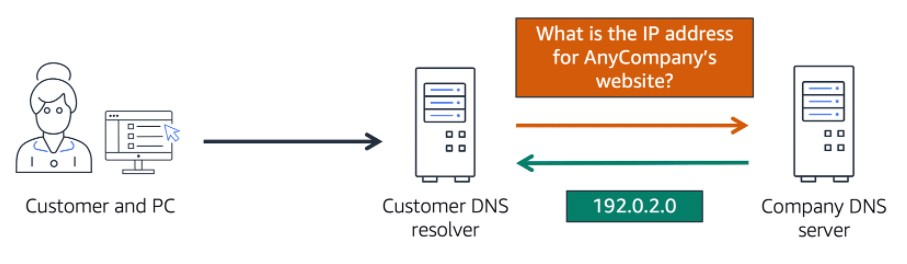
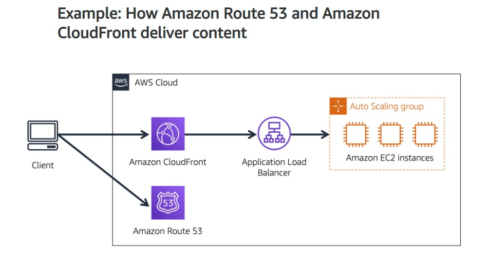

# Amazon's AWS Cloud Practitioner Essentials Course

## [Module 4: Networking](https://content.aws.training/wbt/cecpeb/en/x1/1.0.1/index.html?endpoint=https%3a%2f%2flrs.aws.training%2fTCAPI%2f&auth=Basic%20OjllODM4N2VhLWJjZjUtNDRiOC1hZmRhLTYwZmNiYWU5OGRhMg%3d%3d&actor=%7b%22objectType%22%3a%22Agent%22%2c%22name%22%3a%5b%22INQ5CE3B90aXZcEnqdt9gw2%22%5d%2c%22mbox%22%3a%5b%22mailto%3alms-user-INQ5CE3B90aXZcEnqdt9gw2%40amazon.com%22%5d%7d&registration=a1f41fc6-1511-44e4-85a4-8e1923af7bc6&activity_id=http%3a%2f%2fJsdOGRWZzljloSEdyFptOL7JZcTBEIYc_rise&grouping=http%3a%2f%2fJsdOGRWZzljloSEdyFptOL7JZcTBEIYc_rise&content_token=28cf10f0-d8f1-470c-b0e1-a0b12e2088e2&content_endpoint=https%3a%2f%2flrs.aws.training%2fTCAPI%2fcontent%2f&externalRegistration=CompletionThresholdPercent%7c100!InstanceId%7c0!PackageId%7ccecpeb_en_x1_1.0.1!RegistrationTimestampTicks%7c16225031567556825!SaveCompletion%7c1!TranscriptId%7cLwlMtrUQsUibqhjrMdAFoQ2!UserId%7cINQ5CE3B90aXZcEnqdt9gw2&externalConfiguration=&width=988&height=724&left=466&top=0#/lessons/-aXULPtknHtullIaMsHxd4Nq9-lORECG)

## Introduction

Amazon Virtual Private Cloud (VPC):
- Lets you provision a logically isolated section of the AWS Cloud where you can launch AWS resources in a virtual network that you define
- Resources can be public or private facing
- The public and private grouping of resources is known as ***subnets***

## [Connectivity to AWS](https://content.aws.training/wbt/cecpeb/en/x1/1.0.1/index.html?endpoint=https%3a%2f%2flrs.aws.training%2fTCAPI%2f&auth=Basic%20OjllODM4N2VhLWJjZjUtNDRiOC1hZmRhLTYwZmNiYWU5OGRhMg%3d%3d&actor=%7b%22objectType%22%3a%22Agent%22%2c%22name%22%3a%5b%22INQ5CE3B90aXZcEnqdt9gw2%22%5d%2c%22mbox%22%3a%5b%22mailto%3alms-user-INQ5CE3B90aXZcEnqdt9gw2%40amazon.com%22%5d%7d&registration=a1f41fc6-1511-44e4-85a4-8e1923af7bc6&activity_id=http%3a%2f%2fJsdOGRWZzljloSEdyFptOL7JZcTBEIYc_rise&grouping=http%3a%2f%2fJsdOGRWZzljloSEdyFptOL7JZcTBEIYc_rise&content_token=28cf10f0-d8f1-470c-b0e1-a0b12e2088e2&content_endpoint=https%3a%2f%2flrs.aws.training%2fTCAPI%2fcontent%2f&externalRegistration=CompletionThresholdPercent%7c100!InstanceId%7c0!PackageId%7ccecpeb_en_x1_1.0.1!RegistrationTimestampTicks%7c16225031567556825!SaveCompletion%7c1!TranscriptId%7cLwlMtrUQsUibqhjrMdAFoQ2!UserId%7cINQ5CE3B90aXZcEnqdt9gw2&externalConfiguration=&width=988&height=724&left=466&top=0#/lessons/5sOH9IhCsnNdwPY2Yl_s7xzXVr6NyAgh)

[AWS Virtual Private Cloud (VPC)](https://aws.amazon.com/vpc/):
- Your own private network on AWS
- Allows you to define your private IP ranges for your AWS resources
- Place things like your EC2 instances and ELBs inside your VPC
- You will place your resources into different ***subnets*** within your VPC
- **Subnet:** Chunks of IP address in your VPC that allow you to group resources together
  - Along with ***networking rules*** (will cover later), control whether resources are publicly or privately available
- **Public Facing Resources:**
  - In order to allow traffic from the public internet to flow in and out of your VPC, you must attach an ***internet gateway (IGW)*** to your VPC
    - **Internet Gateway (IGW):** Like a doorway that is open to the public, similar to the front door of our coffee shop
      
      - Without an IGW, no one can reach the resources placed inside your VPC
- **Private Resources:**
  - We don't want anyone to be able to access these resources, so we need a ***private gateway*** that only allows people in if they are coming from an approved network
    - **Virtual Private Gateway:** a private "doorway" to the resources in our VPC
      
      - Allows you to create a VPN connection between a private network (like your on-premises data center) and your VPC
      - Allows traffic into the VPC only if it is coming from an approved network
      - Is an encrypted connection, but still using a regular internet connection
- **[AWS Direct Connect:](https://aws.amazon.com/directconnect/)**
  
  - Allows you to establish a completely private, dedicated fiber connection from your data center to AWS
  - You work with a Direct Connect partner in your area to establish this connection
  - Provides a physical line that connects your network to your AWS VPC
  - This can help you meet high regulatory and compliance needs as well as sidestep any potential bandwidth issues
  - Helps to reduce network costs and increase the amount of bandwidth that can travel through your network
- One VPC can have multiple gateways attached for multiple types of resources
- All would be residing in the same VPC, just in different subnets

## [Subnets and Network Access Control Lists](https://content.aws.training/wbt/cecpeb/en/x1/1.0.1/index.html?endpoint=https%3a%2f%2flrs.aws.training%2fTCAPI%2f&auth=Basic%20OjllODM4N2VhLWJjZjUtNDRiOC1hZmRhLTYwZmNiYWU5OGRhMg%3d%3d&actor=%7b%22objectType%22%3a%22Agent%22%2c%22name%22%3a%5b%22INQ5CE3B90aXZcEnqdt9gw2%22%5d%2c%22mbox%22%3a%5b%22mailto%3alms-user-INQ5CE3B90aXZcEnqdt9gw2%40amazon.com%22%5d%7d&registration=a1f41fc6-1511-44e4-85a4-8e1923af7bc6&activity_id=http%3a%2f%2fJsdOGRWZzljloSEdyFptOL7JZcTBEIYc_rise&grouping=http%3a%2f%2fJsdOGRWZzljloSEdyFptOL7JZcTBEIYc_rise&content_token=28cf10f0-d8f1-470c-b0e1-a0b12e2088e2&content_endpoint=https%3a%2f%2flrs.aws.training%2fTCAPI%2fcontent%2f&externalRegistration=CompletionThresholdPercent%7c100!InstanceId%7c0!PackageId%7ccecpeb_en_x1_1.0.1!RegistrationTimestampTicks%7c16225031567556825!SaveCompletion%7c1!TranscriptId%7cLwlMtrUQsUibqhjrMdAFoQ2!UserId%7cINQ5CE3B90aXZcEnqdt9gw2&externalConfiguration=&width=988&height=724&left=466&top=0#/lessons/iAnICBDYofsMOD7HZlQxsrTJvWOcK6vu)

- You can think of your VPC like a hardened fortress where nothing goes in or out without explict permission
- The IGW (internet gateway) only covers the parameter of your VPC

AWS has a wide range of tools that cover every layer of security:

- Network Hardening:
  - The only technical reason to use subnets inside a VPC is to control access to the gateways
  - The ***public subnet*** has access to the internet gateway but the ***private subnet*** does not
    
    - **Public Subnets** contain resources that need to be accessible by the public, such as an online store's website
    - **Private Subnets** contain resources that should be accessible only through your private network, such as a database that contains customers' personal information nd order histories
    - In a VPC, subnets can communicate with each other
  - Subnets can also control traffic permissions
    - **Packets:** Messages from the internet; a unit of data sent over the internet or a network
    - Every packet that crosses the subnet boundaries gets checked against the ***Network Access Control List (network ACL)***
      - **[Network Access Control List (Network ACL):](https://docs.aws.amazon.com/vpc/latest/userguide/vpc-network-acls.html)** Like passport control officers; a virtual firewall that controls inbound and outbound traffic at the subnet level
        - Checks traffic going into and leaving a subnet
        - Each AWS account includes a default Network ACL
        - You can use the default or create custom NACLs
        - By default, your NACL allows all inbound and outbound traffic, but you can modify it by adding your own rules
        - For custom NACLs, all inbound and outbound traffic is denied until you add rules to specify which traffic is allowed
        - Just because you were let in, doesn't mean they're going to let you out
        - Does not evaluate if a packet can reach a specific EC2 instance or not
        - Checks to see if the packet has permissions to either leave or enter the subnet based on who it was sent from and how it's trying to communicate
        - If you are on the approved list, you get through
        - If you're not on the list or you're explictitly on the do-not-enter list, then you get blocked
        - NACL is ***stateless*** (remembers nothing and checks every single packet that crosses its border regardless of any circumstances)
          - Being *stateless* means that there is no memory of the packet going in or out, so the packet must be checked at every crossing of the "border", whether incoming or outgoing
            
  - Sometimes you will have multiple EC2 instances in the same subnet, which might have different rules on who can send them messages or what ports those messages are allowed to be sent to
  - This is why we need instance level network security as well
  - **[Security Groups:](https://docs.aws.amazon.com/vpc/latest/userguide/VPC_SecurityGroups.html)** Instance level network security; a virtual firewall that controls inbound and outbound traffic for an AWS EC2 instance
    
    - Every instance, when it is launched, automatically comes with a security group
    - By default, the security group does not allow any traffic into the instance at all
    - You can modify the security group to accept a specific type of traffic
    - In the case of a website, you want web-based traffic (HTTPS) to be accepted
    - If you have multiple EC2 instances within a subnet, you can associate them with the same security group or use different security groups for each instance
    - Security groups only check incoming traffic, not outgoing, like the NACL does
    - Security group is ***stateful*** (has some kind of a memory when it comes to who to allow in or out)
      - Being *stateful* means that it will remember that the packet was okay to come in, so no need to check it on the way out
        
- Application Security:
- User Identity:
- Authentication and Authorization:
- Distributed Denial of Service (DDoS) Prevention:
- Data Integrity:
- Encryption:

### Knowledge Check

Which statement best describes an AWS account’s default network access control list?

- [ ] It is stateless and denies all inbound and outbound traffic.

- [ ] It is stateful and allows all inbound and outbound traffic.

- [x] It is stateless and allows all inbound and outbound traffic.

- [ ] It is stateful and denies all inbound and outbound traffic

> The correct response option is **It is stateless and allows all inbound and outbound traffic.**
> 
> Network access control lists (ACLs) perform **stateless** packet filtering. They remember nothing and check packets that cross the subnet border each way: inbound and outbound.
> 
> Each AWS account includes a default network ACL. When configuring your VPC, you can use your account’s default network ACL or create custom network ACLs.
> 
> By default, your account’s default network ACL allows all inbound and outbound traffic, but you can modify it by adding your own rules. For custom network ACLs, all inbound and outbound traffic is denied until you add rules to specify which traffic should be allowed. Additionally, all network ACLs have an explicit deny rule. This rule ensures that if a packet doesn’t match any of the other rules on the list, the packet is denied.
> 
> Learn more:
> 
> - [Network ACLs](https://docs.aws.amazon.com/vpc/latest/userguide/vpc-network-acls.html)

## [Global Networking](https://content.aws.training/wbt/cecpeb/en/x1/1.0.1/index.html?endpoint=https%3a%2f%2flrs.aws.training%2fTCAPI%2f&auth=Basic%20OjhhYzY1YjQ5LTU1MmEtNDBlZS05MWNhLWIxZDk0ZGY0MWZkNA%3d%3d&actor=%7b%22objectType%22%3a%22Agent%22%2c%22name%22%3a%5b%22INQ5CE3B90aXZcEnqdt9gw2%22%5d%2c%22mbox%22%3a%5b%22mailto%3alms-user-INQ5CE3B90aXZcEnqdt9gw2%40amazon.com%22%5d%7d&registration=a1f41fc6-1511-44e4-85a4-8e1923af7bc6&activity_id=http%3a%2f%2fJsdOGRWZzljloSEdyFptOL7JZcTBEIYc_rise&grouping=http%3a%2f%2fJsdOGRWZzljloSEdyFptOL7JZcTBEIYc_rise&content_token=50c2c029-fb73-4126-ae9f-721f5ab5ee96&content_endpoint=https%3a%2f%2flrs.aws.training%2fTCAPI%2fcontent%2f&externalRegistration=CompletionThresholdPercent%7c100!InstanceId%7c0!PackageId%7ccecpeb_en_x1_1.0.1!RegistrationTimestampTicks%7c16225031567556825!SaveCompletion%7c1!TranscriptId%7cLwlMtrUQsUibqhjrMdAFoQ2!UserId%7cINQ5CE3B90aXZcEnqdt9gw2&externalConfiguration=&width=988&height=724&left=466&top=0#/lessons/umOnFgzyxiwc5edjMMyIWc5LXvBuzj1S)

### [Route 53](https://aws.amazon.com/route53): AWS's Domain Name Service (DNS)
  
- Highly available and scalable
- DNS is a translation service, it translates website names into IP (Internet Protocol) addresses that computers can read
- Can direct traffic to different endpoints using several different routing policies, such as: 
  - **Latency-based routing:** If you have resources in multiple AWS Regions, routes traffic to the Region that provides the best latency with less round-trip time
  - **Geolocation DNS:** Directs traffic based on where the customer is located
  - **Geoproximity routing:** Routes traffic based on the location of your resources and, optionally, shift traffic from resources in one location to resources in another
  - **Weighted round-robin:** Route traffic to multiple resources in proportions that you specify
- Can use Route 53 to buy and register your own domain name

1. A customer requests data from the application by going to anycompany's website
2. AWS Route 53 uses DNS resolution to identify anycompany.com's corresponding IP address (192.0.2.0), this information is sent back to the customer
3. The customer's request is sent to the nearest edge location through AWS CloudFront
4. AWS CloudFront connects to the Application Load Balancer, which sends the incoming packet to an AWS EC2 instance

### Knowledge Check

Which statement best describes DNS resolution?

- [ ] Launching resources in a virtual network that you define

- [ ] Storing local copies of content at edge locations around the world

- [ ] Connecting a VPC to the internet

- [x] Translating a domain name to an IP address

> The correct response option is **Translating a domain name to an IP address.**
> 
> For example, if you want to visit AnyCompany’s website, you enter the domain name into your PC and this request is sent to a DNS server. Next, the DNS server asks the web server for the IP address that corresponds to AnyCompany’s website. The web server responds by providing the IP address for AnyCompany’s website, 192.0.2.0.
> 
> **Learn more:**
> 
> - [Amazon Route 53](https://aws.amazon.com/route53/)

## [Module 4 Summary](https://content.aws.training/wbt/cecpeb/en/x1/1.0.1/index.html?endpoint=https%3a%2f%2flrs.aws.training%2fTCAPI%2f&auth=Basic%20OjZlNTUzNGNlLTIyMGUtNGIyZC04NDE0LWM3MGRjYTk3N2YxZg%3d%3d&actor=%7b%22objectType%22%3a%22Agent%22%2c%22name%22%3a%5b%22INQ5CE3B90aXZcEnqdt9gw2%22%5d%2c%22mbox%22%3a%5b%22mailto%3alms-user-INQ5CE3B90aXZcEnqdt9gw2%40amazon.com%22%5d%7d&registration=a1f41fc6-1511-44e4-85a4-8e1923af7bc6&activity_id=http%3a%2f%2fJsdOGRWZzljloSEdyFptOL7JZcTBEIYc_rise&grouping=http%3a%2f%2fJsdOGRWZzljloSEdyFptOL7JZcTBEIYc_rise&content_token=761a029f-115c-4c0d-8b14-f6b93457d0fc&content_endpoint=https%3a%2f%2flrs.aws.training%2fTCAPI%2fcontent%2f&externalRegistration=CompletionThresholdPercent%7c100!InstanceId%7c0!PackageId%7ccecpeb_en_x1_1.0.1!RegistrationTimestampTicks%7c16225031567556825!SaveCompletion%7c1!TranscriptId%7cLwlMtrUQsUibqhjrMdAFoQ2!UserId%7cINQ5CE3B90aXZcEnqdt9gw2&externalConfiguration=&width=988&height=724&left=466&top=0#/lessons/OpwVgVEn9BrV0GLurGwYowV_OS2QSaIa)

### Additional resources

To learn more about the concepts that were explored in Module 4, review these resources.

- [Networking and Content Delivery on AWS](https://aws.amazon.com/products/networking)
- [AWS Networking & Content Delivery Blog](https://aws.amazon.com/blogs/networking-and-content-delivery/)
- [Amazon Virtual Private Cloud](https://aws.amazon.com/vpc)
- [What is Amazon VPC?](https://docs.aws.amazon.com/vpc/latest/userguide/what-is-amazon-vpc.html)
- [How Amazon VPC works](https://docs.aws.amazon.com/vpc/latest/userguide/how-it-works.html)

## [Module 4 Quiz](https://content.aws.training/wbt/cecpeb/en/x1/1.0.1/index.html?endpoint=https%3a%2f%2flrs.aws.training%2fTCAPI%2f&auth=Basic%20OjZlNTUzNGNlLTIyMGUtNGIyZC04NDE0LWM3MGRjYTk3N2YxZg%3d%3d&actor=%7b%22objectType%22%3a%22Agent%22%2c%22name%22%3a%5b%22INQ5CE3B90aXZcEnqdt9gw2%22%5d%2c%22mbox%22%3a%5b%22mailto%3alms-user-INQ5CE3B90aXZcEnqdt9gw2%40amazon.com%22%5d%7d&registration=a1f41fc6-1511-44e4-85a4-8e1923af7bc6&activity_id=http%3a%2f%2fJsdOGRWZzljloSEdyFptOL7JZcTBEIYc_rise&grouping=http%3a%2f%2fJsdOGRWZzljloSEdyFptOL7JZcTBEIYc_rise&content_token=761a029f-115c-4c0d-8b14-f6b93457d0fc&content_endpoint=https%3a%2f%2flrs.aws.training%2fTCAPI%2fcontent%2f&externalRegistration=CompletionThresholdPercent%7c100!InstanceId%7c0!PackageId%7ccecpeb_en_x1_1.0.1!RegistrationTimestampTicks%7c16225031567556825!SaveCompletion%7c1!TranscriptId%7cLwlMtrUQsUibqhjrMdAFoQ2!UserId%7cINQ5CE3B90aXZcEnqdt9gw2&externalConfiguration=&width=988&height=724&left=466&top=0#/lessons/kGLata5VSujSmb7nDKQ40bPVWqSLrs-X)

Your company has an application that uses Amazon EC2 instances to run the customer-facing website and Amazon RDS database instances to store customers’ personal information. How should the developer configure the VPC according to best practices?

- [ ] Place the Amazon EC2 instances in a private subnet and the Amazon RDS database instances in a public subnet.

- [x] Place the Amazon EC2 instances in a public subnet and the Amazon RDS database instances in a private subnet.

- [ ] Place the Amazon EC2 instances and the Amazon RDS database instances in a public subnet.

- [ ] Place the Amazon EC2 instances and the Amazon RDS database instances in a private subnet.

> The correct response option is **Place the Amazon EC2 instances in a public subnet and the Amazon RDS databases instances in a private subnet.**
> 
> A **subnet** is a section of a VPC in which you can group resources based on security or operational needs. Subnets can be public or private.
> 
> Public subnets contain resources that need to be accessible by the public, such as an online store’s website.
> 
> Private subnets contain resources that should be accessible only through your private network, such as a database that contains customers’ personal information and order histories.
> 
> **Learn more:**
> 
> - [Amazon VPC](https://aws.amazon.com/vpc)
> - [VPCs and subnets](https://docs.aws.amazon.com/vpc/latest/userguide/VPC_Subnets.html)

Which component or service can be used to establish a private dedicated connection between your company’s data center and AWS?

- [ ] Private subnet

- [ ] DNS

- [x] AWS Direct Connect

- [ ] Amazon CloudFront

> The correct response option is **AWS Direct Connect**.
> 
> The other response options are incorrect because:
> 
> - A private subnet is a section of a VPC in which you can group resources that should be accessed only through your private network. Although it is private, it is not used for establishing a connection between a data center and AWS.
> - DNS stands for Domain Name System, which is a directory used for matching domain names to IP addresses.
> - Amazon CloudFront is a content delivery service. You can use CloudFront to store cached copies of your content at edge locations that are close to your customers.
> 
> **Learn more:**
> 
> - [AWS Direct Connect](https://aws.amazon.com/directconnect)

Which statement best describes security groups?

- [x] They are stateful and deny all inbound traffic by default.

- [ ] They are stateful and allow all inbound traffic by default.

- [ ] They are stateless and deny all inbound traffic by default.

- [ ] They are stateless and allow all inbound traffic by default.

> The correct response option is **Security groups are stateful and deny all inbound traffic by default.**
> 
> Security groups are stateful. This means that they use previous traffic patterns and flows when evaluating new requests for an instance.
> 
> By default, security groups deny all inbound traffic, but you can add custom rules to fit your operational and security needs.
> 
> **Learn more:**
> 
> - [Security groups for your VPC](https://docs.aws.amazon.com/vpc/latest/userguide/VPC_SecurityGroups.html)

Which component is used to connect a VPC to the internet?

- [ ] Public subnet

- [ ] Edge location

- [ ] Security group

- [x] Internet gateway

> The correct response option is **Internet gateway**.
> 
> The other response options are incorrect because:
> 
> - A public subnet is a section of a VPC that contains public-facing resources.
> - An edge location is a site that Amazon CloudFront uses to store cached copies of your content for faster delivery to customers.
> - A security group is a virtual firewall that controls inbound and outbound traffic for an Amazon EC2 instance.
> 
> **Learn more:**
> 
> - [Internet gateways](https://docs.aws.amazon.com/vpc/latest/userguide/VPC_Internet_Gateway.html)

Which service is used to manage the DNS records for domain names?

- [ ] Amazon Virtual Private Cloud

- [ ] AWS Direct Connect

- [ ] Amazon CloudFront

- [x] Amazon Route 53

> The correct response option is **Amazon Route 53**.
> 
> Amazon Route 53 is a DNS web service. It gives developers and businesses a reliable way to route end users to internet applications that host in AWS.
> 
> Another feature of Route 53 is the ability to manage the DNS records for domain names. You can transfer DNS records for existing domain names managed by other domain registrars. You can also register new domain names directly in Route 53.
> 
> The other response options are incorrect because:
> 
> - Amazon Virtual Private Cloud (Amazon VPC) is a service that enables you to provision an isolated section of the AWS Cloud. In this isolated section, you can launch resources in a virtual network that you define.
> - AWS Direct Connect is a service that enables you to establish a dedicated private connection between your data center and VPC.  
> - Amazon CloudFront is a content delivery service. It uses a network of edge locations to cache content and deliver content to customers all over the world.
> 
> **Learn more:**
> 
> - [Amazon Route 53](https://aws.amazon.com/route53)
