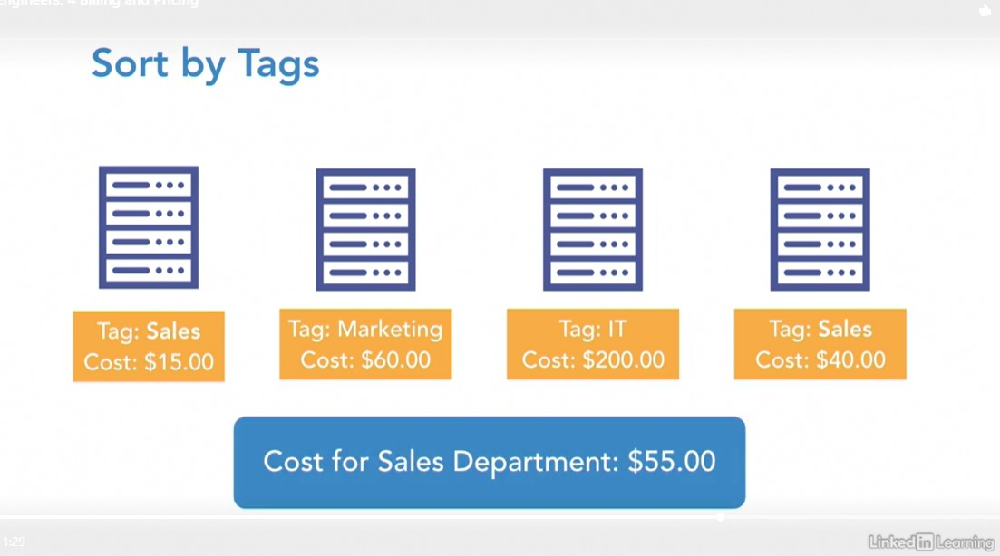
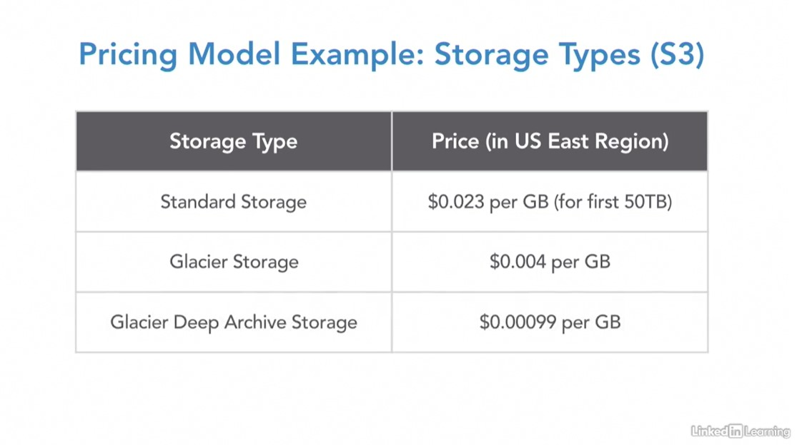
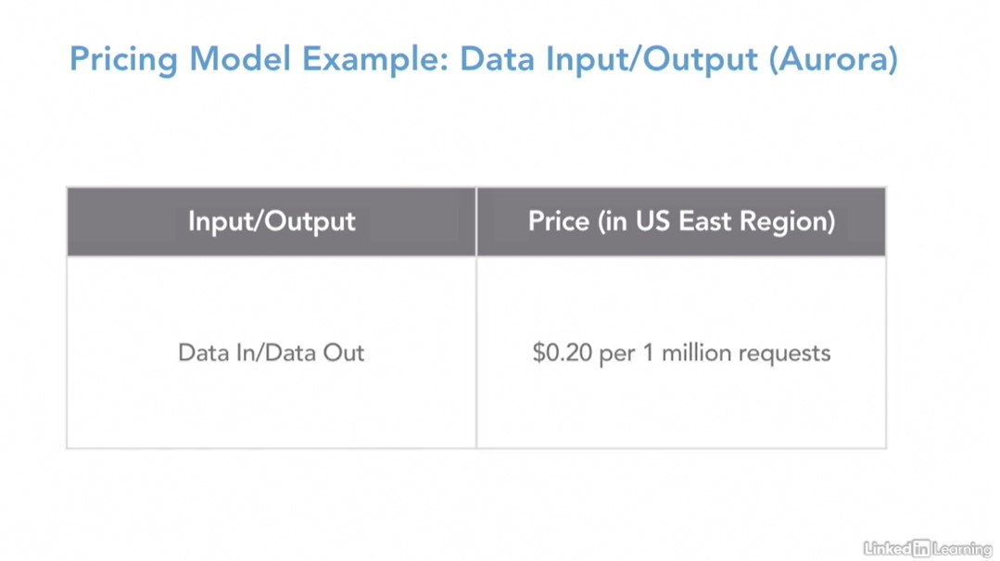
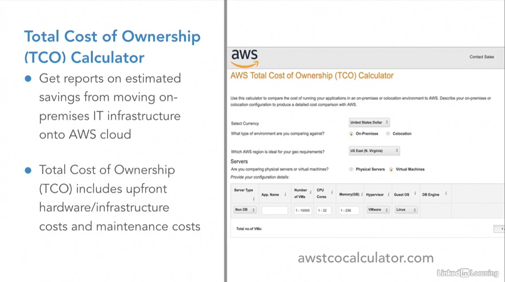
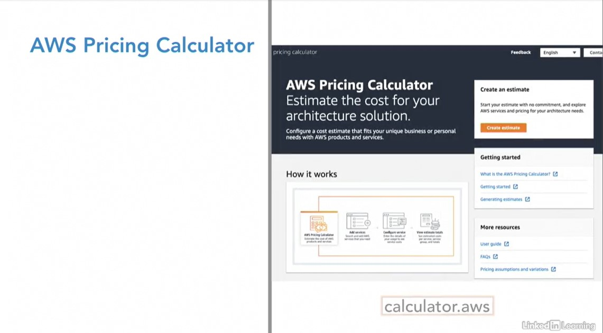
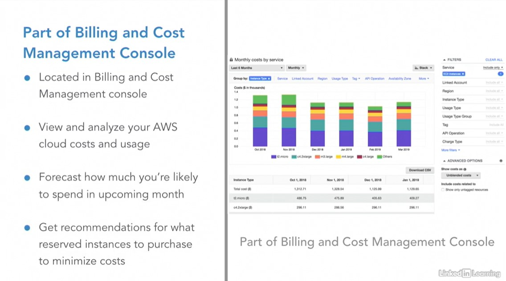

# Prepare for the AWS Certified Cloud Practitioner Exam

## [Introduction to AWS for Non-Engineers: 4 Billing and Pricing](https://www.linkedin.com/learning/introduction-to-aws-for-non-engineers-4-billing-and-pricing-2?contextUrn=urn%3Ali%3AlyndaLearningPath%3Aember8982)

## [Making Sense of the Price Tags](https://www.linkedin.com/learning/introduction-to-aws-for-non-engineers-4-billing-and-pricing-2/making-sense-of-the-price-tags-2?contextUrn=urn%3Ali%3AlyndaLearningPath%3Aember8982)

## [AWS Certified Cloud Practitioner Exam](https://www.linkedin.com/learning/introduction-to-aws-for-non-engineers-4-billing-and-pricing-2/aws-certified-cloud-practitioner-exam-2?contextUrn=urn%3Ali%3AlyndaLearningPath%3Aember8982)

## [Billing and Pricing Domain](https://www.linkedin.com/learning/introduction-to-aws-for-non-engineers-4-billing-and-pricing-2/billing-and-pricing-domain-2?contextUrn=urn%3Ali%3AlyndaLearningPath%3Aember8982)
- Makes up the smallest portion of the certification exam
- You need to be able to compare and contrast various pricing models for AWS
- Recognize the various account structures in relation to AWS billing and pricing 
- Identify resources available for billing support
- There are 4 different support plans available with fees separate from monthly usage fees and the monthly usage fees range from free to starting at $15,000 per month
- Support plan types are:
  - Basic
  - Developer
  - Business
  - Enterprise
- Different types of charges that occur when utilizing AWS
- Main charges: 
  - Compute
  - Storage
  - Data Out
- There are ways to save money as a multi-account organization (consolidated billing)

## [Billing Dashboard](https://www.linkedin.com/learning/introduction-to-aws-for-non-engineers-4-billing-and-pricing-2/billing-dashboard-2?contextUrn=urn%3Ali%3AlyndaLearningPath%3Aember8982)
### Billing and Cost Management Dashboard
- Allows you to estimate and plan your AWS costs
- Through a service called **Consolidated Billing** you can simplify your accounting if you have multiple AWS accounts within your organization
- Receive alerts for service usage thresholds, which could help keep you from spending more money than anticipated
- Use **Cost Explorer** to view costs as graphs, filtering results by values, like AZ, AWS Services, EC2 instance types, Region, usage types, and much more
- You can also see a forecast of potential costs based on historical usage data
  
- You can even have AWS generate billing reports with a breakdown of your costs by the hour or month, by product, or by tags for your organizations billing needs

## [Types of Charges](https://www.linkedin.com/learning/introduction-to-aws-for-non-engineers-4-billing-and-pricing-2/types-of-charges-2?contextUrn=urn%3Ali%3AlyndaLearningPath%3Aember8982)
### Pay-As-You-Go Model of Cloud Computing
- One of the biggest allures of cloud computing platforms
- No huge upfront costs
- Billed only for the resources consumed
- Easily scale resources up or down to suit business needs

### Fundamental Drivers of Cost
1. Compute 
   - Pay hourly from the time you launch the resource until the time you terminate it
   - Example: EC2 (virtual server): Pay for the length of time the server is up and running
2. Storage
   - Pay per GB of storage used
   - Example: S3 (storage service): Upload photos into an app and pay for the storage used
   - You pay more if there are more users uploading images because you are using more space
3. Outbound Data Transfer
   - In most cases, there are no charges for **inbound** data transfers or data transfers between AWS services within the same Region
     - Example: Your social media app, saving the profile images to the storage service, once the user clicks upload inside the app
   - Pay to transfer data **out** of AWS

### Pricing Model Example: Storage Types (S3):

- Standard Storage:
  - Most expensive because it boasts high availability and extremely low chances of data corruption
  - You can retrieve the data immediately
  - Well suited for objects that you will often use, like images used on a website
- Glacier Storage:
  - Substantially cheaper, but for the much lower price you must wait longer for the data to be retrieved
  - The availability is not as high
  - Better suited for backups of data for safekeeping

### Pricing Model Example: Data Input/Output (Aurora):

- Aurora, AWS's database service, charges for storage and data input and output

## [Consolidated Billing](https://www.linkedin.com/learning/introduction-to-aws-for-non-engineers-4-billing-and-pricing-2/consolidated-billing-2?contextUrn=urn%3Ali%3AlyndaLearningPath%3Aember8982)
Why have multiple AWS accounts?
- Maybe the development team wants to split up their production and test environments so there won't be any accidental deployments
- Maybe the marketing team wants their own instance for the company website
- Other times it just might make sense for different projects to open different accounts to keep their billing responsibilities apparent

Whatever the reason may be, having multiple AWS accounts is likely a huge headache for the accounting team, when they need to keep track of all the accounts and numbers.

### AWS Consolidated Billing:
- Allows an organization to create a payer AWS account to view and pay combined billing charges for all linked accounts in an organization
- Strictly an accounting and billing account and can not use any other services, but it is still an independent account
- Can not deploy services into the linked accounts
- Comes with a great perk of all the resource usage being considered part of one large organization
- So even though they may be in separate accounts, the organization may be eligible for volume discounts for the combined usage
- This is a free service

## [Cost Calculators](https://www.linkedin.com/learning/introduction-to-aws-for-non-engineers-4-billing-and-pricing-2/cost-calculators-2?contextUrn=urn%3Ali%3AlyndaLearningPath%3Aember8982)
### AWS Total Cost of Ownership (TCO) Calculator:

- When considering if it makes sense to keep your on-premises infrastructure or to move it over to AWS Cloud, you can plug your specific requirements in the AWS Total Cost of Ownership Calculator
- You can get detailed reports of estimated cost savings by modifying some assumptions to match your infrastructure
- The TCO can be reduced by moving to the cloud because you no longer need to invest in large capital expenditures by purchasing all the hardware and infrastructure up front
- You will be utilizing a Pay-As-You-Go model that allows you to invest capital, both financial and human, only when your business has a need for it
- You can visit the AWS TCO calculator by searching in your favorite search engine or by going directly to https://awstcocalculator.com

### AWS Pricing Calculator:

- Used to be the simple monthly calculator
- Can find this calculator at https://calculator.aws
- Helps you estimate the cost of a cloud infrastructure solution you are looking to build
- You would add services and configurations to the calculator, which would then provide a report with estimated totals per service, service group, and total infrastructure
- Can utilize this service to compare service costs per Region, reduce your EC2 spend, find the right EC2 instance for your needs, or estimate your overall AWS cloud spend

### Cost Explorer:

- Enables you to view and analyze cost in usage
- Forecast how much you'd likely spend
- Get recommendations for what reserved instances to purchase to minimize costs
- Located in the Billing and Cost Management console

## [AWS Free Tier](https://www.linkedin.com/learning/introduction-to-aws-for-non-engineers-4-billing-and-pricing-2/aws-free-tier-2?contextUrn=urn%3Ali%3AlyndaLearningPath%3Aember8982)
Can find everything offered in the Free Tier at https://aws.amazon.com/free

- Allows potential customers to test out and become comfortable with many services offered by AWS Cloud for free
- Most of the offers expire after 12 months, at which point you'll be charged for the services you consume at regular rates
- As you near the expiration data of the Free Tier, you'll get a notification from AWS
- You are then responsible for turning down and/or deleting the services for which you don't want to be charged for
- AWS has over 60 services available for use separated into 3 different types of offers
  - Always Free
    - Show services that are always free to use up to a certain point
    - There are generally usage limits
    - Then you must pay to use these services
  - 12 Months Free
    - Free for use for 12 months after your initial sign-up date
    - Generally up to a certain usage limit
    - Some common usage limitations:
      - Use time
      - Number of requests
      - Amount of storage
      - Number of characters
      - Number of actions per month
    - Once you go over the usage limits, you will be charged for the service you use, even if you are still within the first 12-months
  - Trials
    - Most are for less than 12 months
    - Most have stricter usage limits
    - Common limitations:
      - Use time
      - Use of space
      - Number of requests
  - The Free Tier is a great opportunity to test out and learn about many of the core services that power the AWS Cloud

## [Study Break: Billing and Pricing](https://www.linkedin.com/learning/introduction-to-aws-for-non-engineers-4-billing-and-pricing-2/study-break-billing-and-pricing-domain-2?contextUrn=urn%3Ali%3AlyndaLearningPath%3Aember8982)
### AWS Billing and Cost Management Console
- Plan your AWS spending
- Simplify accounting through consolidated billing
- Receive alerts for service usage thresholds
- Cost Explorer: generate billing reports of AWS costs and usage
- Other Resources:
  - AWS Pricing Calculator
  - AWS Total Cost of Ownership (TCO) Calculator

### Types of AWS Charges
- The 3 fundamental charges:
  - Compute
  - Storage
  - Outbound Data Transfer
- Different services charge differently
- The more you do something (compute, store, transfer data), the cheaper per unit the action becomes
- There are more ways AWS charges customers for usage - make sure to check how a service charges before utilizing it

### Consolidated Billing
- Way to save money if you have a lot of resources running in many AWS accounts in your organization
- Create a billing-only payer account that views and pays combined billing charges for **all** linked AWS accounts
- All resources used within the linked AWS accounts are considered part of one large organization
- This means that the organization as a whole may be eligible for volume discounts

## [Basic Support Plan](https://www.linkedin.com/learning/introduction-to-aws-for-non-engineers-4-billing-and-pricing-2/basic-2?contextUrn=urn%3Ali%3AlyndaLearningPath%3Aember8982)
- The ***cheapest*** AWS support plan
- 100% free, only pay for services used
- Perfect for users who are learning about AWS, who might be spending some time testing the services and functions out
- Pairs very well with the AWS Free Tier
- What this support plan offers:
  - No tech support
  - Customer service is limited to accounting and billing questions only
  - Provides access to the AWS community forums, where you can ask technical questions to other AWS users and engineers
  - You have access to the Seven Core Trusted Advisor Checks
  - You also get **AWS Personal Health Dashboard** a personalized view of the health of AWS Services and receive alerts when your resources are impacted

## [Developer Support Plan](https://www.linkedin.com/learning/introduction-to-aws-for-non-engineers-4-billing-and-pricing-2/developer-2?contextUrn=urn%3Ali%3AlyndaLearningPath%3Aember8982)
- Next step up from the Basic Support Plan
- Starts at $29 per month and scales with use
- Scaling is the concept that an infrastructure grows and shrinks with your projects or needs
- This plan may start at $29 a month, but scales up with different bells and whistles added to fit your specific needs
- AWS will charge you either $29 per month or 3% of your AWS use cost, whichever is larger
- Perfect for people and organizations experimenting with AWS at a higher intensity than those using the basic level support plan, and may require a bit more technical assistance
- One person in the organization is specified at the primary contact and they can ask technical questions through the support portal
- Unlimited number of cases
- Technicians will respond during business hours via email
- The **Service-Level Agreement (SLA) for response:** defines the amount of time it will take before a technician will respond to a support case
- For the Developer Support Plan, AWS commits to a technician following up within 12 hours for an impaired system or 24 hours for general guidance
- Who Uses the Developer Support Plan?:
  - Trying out features, deploying prototypes
  - Assessing the viability of AWS within their IT infrastructure - need for tech support
  - Not fully committed to AWS yet, so don't want to pay full support price yet
- Not ideal for production use of resources where service failures could have severe business impact

## [Business Support Plan](https://www.linkedin.com/learning/introduction-to-aws-for-non-engineers-4-billing-and-pricing-2/business-2?contextUrn=urn%3Ali%3AlyndaLearningPath%3Aember8982)
- Ideal plan for those who AWS in production
- The fees begin at $100 per month and scale up with use
- AWS charges $100 per month or 3-10% of monthly AWS usage bill, whichever is higher
- You can find out more at https://aws.amazon.com/premiumsupport/plans
- An unlimited number of contacts can open an unlimited number of support cases at the support center
- You have access to the AWS Support API for support case automation
- With support API access, your developer team can retrieve detailed information about support operations and data types in JSON format
- Access to the full suite of AWS Trusted Advisor Checks, instead of just the 7 core checks that come with the basic and developer plan
- Trusted Advisor Checks, whether basic or full suite, help you optimize you IT infrastructure hosted on AWS Cloud
- Can also retrieve a lists of checks, check results, and refresh status checks using AWS Support API
- For an additional fee, you also get access to Infrastructure Event Management, which helps you plan for large-scale events, ranging from mobile app launches to IT infrastructure migrations into AWS Cloud
- AWS provides planning assistance and real-time support during your event, so you can proceed with confidence
- Support for common third-party application stack components, operating systems, and platforms
- Provides guidance, configuration support, and troubleshooting of AWS interoperability with many other third-party software
- Service Level Agreement (SLA) for tickets in the business plan is 24/7 support via phone, email, and chat
- They strive to provide one-hour response time for urgent support cases when a production system is down

## [Enterprise Support Plan](https://www.linkedin.com/learning/introduction-to-aws-for-non-engineers-4-billing-and-pricing-2/enterprise-2?contextUrn=urn%3Ali%3AlyndaLearningPath%3Aember8982)
- Ideal plan for those with mission-critical use of AWS
- Service Level Agreement (SLA) for tickets in the business plan is 24/7 support via phone, email, and chat
- 15-minute response time for business-critical support cases with priority
- Unlimited number of contacts can open unlimited number of support cases
- Has everything the Business Support Plan does:
  - Full set of Trusted Advisor Checks
  - AWS Support API access
  - Third-party software support
- The only tier that provides access to: 
  - **Technical Account Manager (TAM):** proactive best-practice guidance, which helps you to develop and run your AWS infrastructure efficiently
    - Including proactively monitoring your infrastructure and helping you optimize it
  - **Support Concierge:** provides account and billing analysis to save money
- Provides various proactive programs:
  - **Infrastructure Event Management:** 
    - Was for an additional fee in the Business Support Plan
    - Complimentary with this support plan
  - **Well-Architected Reviews:**
    - Detailed reviews of your architecture to guide you on how to best design your systems
  - **Architecture Support:**
    - Helps you to better align your infrastructure with AWS
  - **Operations Support:**
    - Provide reviews of your operations and provide advice for optimization
  - Provide training through self-paced online labs provided through an AWS training provider
- The price for this Support Plan starts at $15,000 a month and this does not include the usage charges for the AWS services that are being utilized
- AWS will charge either $15,000 a month or 3 - 10% of your AWS monthly usage bill, whichever is higher
- Great for big organizations with mission-critical use of AWS who can not afford to have long-standing downtime

## [Which One's Best for You?](https://www.linkedin.com/learning/introduction-to-aws-for-non-engineers-4-billing-and-pricing-2/which-one-s-best-for-you-2?contextUrn=urn%3Ali%3AlyndaLearningPath%3Aember8982)
This is a question that will probably come on the exam with an example business, and you have to choose the right support plan for that business.
- When facing this type of exam question, you need to balance the support needs with the potential funding available

### Sample Question
> Company Y is a mid-sized company looking to migrate their IT infrastructure into the cloud. They are shopping around for the right fit, and testing different cloud computing platforms. 
> 
> They have a deadline in choosing the platform, so they would like to test things out efficiently, but without spending too much money. Which support plan should they choose?
>
> > **ANSWER:** Developer Support Plan
> >
> > They are just in the testing phase and don't want to spend a lot of money, but they also don't want to spend too much time poking around and figuring things out, so they would like some level of technical support for questions. The Developer Support Plan gives you 12 to 24 hour SLA for one technical contact to open as many tickets as they want for just $29 a month.

## [Study Break: Reviewing AWS Support Plans](https://www.linkedin.com/learning/introduction-to-aws-for-non-engineers-4-billing-and-pricing-2/study-break-reviewing-aws-support-plans-2?contextUrn=urn%3Ali%3AlyndaLearningPath%3Aember8982)

## [Study Break: Exam Tips and Resources](https://www.linkedin.com/learning/introduction-to-aws-for-non-engineers-4-billing-and-pricing-2/study-break-exam-tips-and-resources-2?contextUrn=urn%3Ali%3AlyndaLearningPath%3Aember8982)
- The billing and pricing domain has the smallest amount of content at only 12% of the exam
- The multiple choice questions for this domain require you to know the concepts inside and out
- Especially important is the ability to compare and contrast the different support plans

1. Compare and Contrast the Various Pricing Models for AWS
   - Different ways AWS charges for resource usage
     - Main ways: 
       - Compute
       - Storage
       - Data Transfer Out
   - Need to realize that for many AWS services, the more you do something, such as storage or compute, the cheaper per unit the action becomes

2. Account Structures for Billing and Pricing
   - **Consolidated Billing:** Link all AWS accounts in an organization to simplify accounting and potentially receive volume discounts for resource use
   - Compare and contrast support plans and identify the most suitable support plan for a situation

3. Support Plans
   - There are 4 support plans available:
     - Basic
       - Monthly Fee: Free
       - No Tech Support; access to forum only where question may or may not get answered
       - Use Case: Testing with time to explore
     - Developer
       - Monthly Fee: $29 or 3% of monthly usage
       - Tech Support via email only during business hours
       - Response within 12 (critical) - 24 (general) hours
       - Use Case: Experimentation with little tech support
     - Business
       - Monthly Fee: $100 or 3% - 10% of monthly usage
       - Tech Support via email, phone, chat 24/7
       - Response within 1 hour (critical)
       - Use Case: Production
     - Enterprise
       - Monthly Fee: $15,000 or 3% - 10% of monthly usage
       - Tech Support via email, phone, chat, Support API 24/7
       - Response within 15 mins (critical)
       - Use Case: Very large company with mission-critical AWS usage
   - The monthly fees **DO NOT** include the resource usage fees which are billed separately

4. Identify Resources Available for Billing Support
   - Could be in the form of white papers, knowledge bases, contacting AWS Billing Support, or utilizing calculators like AWS Cost Explorer, AWS Total Cost of Ownership (TCO), or the AWS Simple Monthly Calculator
