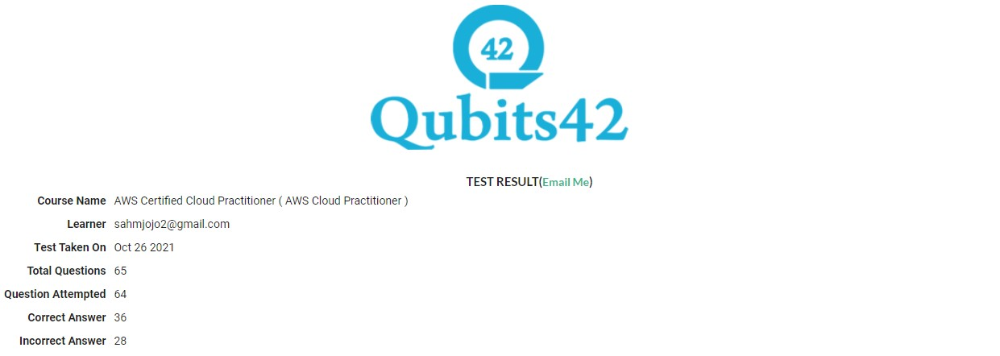

# Attempt 1 - 10/26/2021

### Score = 36 / 64 (56%) Correct

1. You need to migrate an existing on-premise application on AWS. It is a legacy-based application with little development support. Which of the following would be the best way to host this service in AWS?

   **Correct Answer :**
     - **EC2 instances with EBS backed volumes**

2. You’ve been asked to migrate 300 PB of data in one week. Which of the following solutions would you consider?

    **Correct Answer :** 
      - **Use multiple snowball devices**

3. Your company has just started using the resources on the AWS Cloud. They want to get an idea of the costs being incurred so far for the resources being used. How can this be achieved?

    **Correct Answer :**
      - **By using the AWS Cost and Usage reports Explorer. Here you can see the running and forecast costs**

4. A company is storing an access key (access key ID and secret access key) in a text file on a custom AMI. The company uses the access key to access DynamoDB tables from instances created from the AMI. The security team has mandated a more secure solution. Which solution will meet the security team’s mandate?

    **Correct Answer :** 
      - **Create an IAM role with permissions to access the table, and launch all instances with the new role**

5. An application running on EC2 instances processes sensitive information stored on Amazon S3. The information is accessed over the Internet. The security team is concerned that the Internet connectivity to Amazon S3 is a security risk. Which solution will resolve the security concern?

    **Correct Answer :** 
      - **Access the data through a VPC endpoint for Amazon S3**

6. A Solutions Architect is designing an online shopping application running in a VPC on EC2 instances behind an ELB Application Load Balancer. The instances run in an Auto Scaling group across multiple Availability Zones. The application tier must read and write data to a customer-managed database cluster. There should be no access to the database from the Internet, but the cluster must be able to obtain software patches from the Internet. Which VPC design meets these requirements?

    **Correct Answer :** 
      - **Public subnets for the application tier and NAT Gateway, and private subnets for the database cluster**

7. An administrator runs a highly available application in AWS. A file storage layer is needed that can share between EC2 instances and scale the platform more easily. Which AWS service can perform this action?

    **Correct Answer :** 
      - **EFS**

8. A Solutions Architect is developing a document-sharing application and needs a storage layer. The storage should provide automatic support for versioning so that users can easily roll back to a previous version or recover a deleted account. Which AWS service will meet the above requirements?

    **Correct Answer :** 
      - **Amazon S3**

    **My Answer :** 
      - **Amazon EFS**

9. Which of the following services are included at no additional cost with the use of the AWS platform? (Choose two)

    **Correct Answer :** 
      - **Cloudformation,Auto Scaling**

    **My Answer :** 
      - **Elastic Load Balancing,Auto Scaling**

10. Select the memory-optimized instance families.

    **Correct Answer :** 
       - **X, R**

11. You need to migrate an existing on-premise application on AWS. It is a legacy-based application with little development support. Which of the following would be the best way to host this service in AWS?

    **Correct Answer :** 
       - **EC2 instances with EBS backed volumes**

12. Which compute service is available at Cloudfront’s edge locations?

    **Correct Answer :** 
       - **Lambda**

    **My Answer :** 
       - **EC2**

13. Your company is planning to host resources in the AWS Cloud. They want to use services that can be used to decouple resources hosted on the cloud. Which of the following services can help fulfill this requirement?

    **Correct Answer :** 
       - **AWS SQS**

14. Currently, your organization has an operational team that takes care of ID management in their on-premise data center. They now also need to manage users and groups created in AWS. Which of the following AWS tools would they need to use for performing this management function?

    **Correct Answer :** 
       **AWS Identity and Access Management (IAM)**

15. Your company has just started using the resources on the AWS Cloud. They want to get an idea of the costs being incurred so far for the resources being used. How can this be achieved?

    **Correct Answer :** 
       - **By using the AWS Cost and Usage reports Explorer. Here you can see the running and forecast costs**

16. A company is developing a highly available web application using stateless web servers. Which services are suitable for storing session state data? (Select two)

    **Correct Answers :** 
       - **DynamoDB**
       - **ElastiCache**

17. An application requires a highly available relational database with an initial storage capacity of 8 TB. The database will grow by 8 GB every day. To support expected traffic, at least eight read replicas will be required to handle database reads. Which option will meet these requirements?

    **Correct Answer :** 
       - **Amazon Aurora**

    **My Answer :** 
       - **Amazon Redshift**

18. A web application allows customers to upload orders to an S3 bucket. The resulting Amazon S3events trigger a Lambda function that inserts a message to an SQS queue. A single EC2 instance reads messages from the queue, processes them, and stores them in a DynamoDB table partitioned by a unique order ID. Next month traffic is expected to increase by a factor of 10 and a SolutionsArchitect is reviewing the architecture for possible scaling problems. Which component is most likely to need re-architecting to be able to scale to accommodate the new traffic?

    **Correct Answer :** 
       - **EC2 instance**

19. A Solutions Architect is designing an online shopping application running in a VPC on EC2 instances behind an ELB Application Load Balancer. The instances run in an Auto Scaling group across multiple Availability Zones. The application tier must read and write data to a customer-managed database cluster. There should be no access to the database from the Internet, but the cluster must be able to obtain software patches from the Internet. Which VPC design meets these requirements?

    **Correct Answers :** 
       - **Public subnets for the application tier and NAT Gateway, and private subnets for the database cluster**

20. For which of the following workloads should a Solutions Architect consider using Elastic Beanstalk? (Choose two)

    **Correct Answer :** 
       - **Web app using RDS,Long running worker process**

21. An application with a 150 GB relational database runs on an EC2 Instance. While the application is used infrequently with small peaks in the morning and evening, what is the most cost-effective storage type among the options below?

    **Correct Answer :** 
       - **GP2**

    **My Answer :** 
       - **ST1**

22. Which AWS service provides the ability to detect inadvertent data leaks of personally identifiable information (PII) and user credential data?

    **Correct Answer :** 
       - **Amazon Macie**

    **My Answer :** 
       - **Amazon Inspector**

23. What credential components are required to gain programmatic access to an AWS account? (Choose two)

    **Correct Answers :** 
       - **An access key ID**
       - **Secret access key**

    **My Answers :** 
       - **A primary key**
       - **Secret access key**

24. Which AWS hybrid storage service enables a user’s on-premises applications to seamlessly use AWS Cloud storage?

    **Correct Answer :** 
       - **AWS Storage Gateway**

    **My Answer :** 
       - **AWS Direct Connect**

25. What is the best resource for a user to find compliance-related information and reports about AWS?

    **Correct Answer :** 
       - **AWS Artifact**

26. Which Amazon S3 storage class is optimized to provide access to data with lower resiliency requirements, but rapid access when needed such as duplicate backups?

    **Correct Answer :** 
       - **Amazon S3 One Zone-Infrequent Access**

27. Which AWS service enables users to create copies of resources across AWS Regions?

    **Correct Answer :** 
       - **AWS CloudFormation**

28. AWS Trusted Advisor provides recommendations on which of the following? (Choose two)

    **Correct Answers :** 
       - **Performance**
       - **Scalability**

    **My Answers :** 
       - **Cost optimization**
       - **Performance**

29. Which of the following AWS services is serverless? (Choose two)

    **Correct Answers :** 
       - **AWS Lambda**
       - **Amazon DynamoDB**

    **My Answer :** 
       - **AWS Lambda**
       - **Amazon Elasticsearch Service**

30. What AWS benefit refers to a customer’s ability to deploy applications that scale up and down to meet variable demand?

    **Correct Answer :**
       - **Scalability**

    **My Answer :** 
       - **Elasticity**

31. What does fault tolerance refer to?

    **Correct Answer :**
       - **How well and how quickly an application’s environment can have lost data restored**

    **My Answer :** 
       - **The built-in redundancy of an application’s components**

32. A company operating in the AWS Cloud requires separate invoices for specific environments, such as development, testing, and production. How can this be achieved?

    **Correct Answer :** 
       - **Use resource tagging**

    **My Answer :** 
       - **Use multiple AWS accounts**

33. Which AWS service can be used to track unauthorized API calls?

    **Correct Answer :** 
       - **AWS CloudTrail**

34. A user needs to automatically discover, classify, and protect sensitive data stored in Amazon S3. Which AWS service can meet these requirements?

    **Correct Answer :** 
       - **Amazon Macie**

35. Which components are required to build a successful site-to-site VPN connection on AWS? (Choose two)

    **Correct Answers :** 
       - **Customer gateway**
       - **Transit gateway**

    **My Answers :** 
       - **Internet gateway**
       - **NAT gateway**

36. Which Amazon EC2 pricing option is best suited for applications with short-term, spiky, or unpredictable workloads that cannot be interrupted?

    **Correct Answer :** 
       - **On-Demand Instances**

37. Which actions represent best practices for using AWS IAM? (Choose two)

    **Correct Answers :** 
       - **Configure a strong password policy**
       - **Rotate access keys on a regular basis**

38. A company wants to use an AWS service to monitor the health of application endpoints, with the ability to route traffic to healthy regional endpoints to improve application availability. Which service will support these requirements?

    **Correct Answer :** 
       - **AWS Global Accelerator**

    **My Answer :** 
       - **Amazon CloudFront**

39. According to the AWS Well-Architected Framework, what change management steps should be taken to achieve reliability in the AWS Cloud? (Choose two)

    **Correct Answers :** 
       - **Use AWS Config to generate an inventory of AWS resources**
       - **Use AWS CloudTrail to record AWS API calls into an auditable log file**

    **My Answers :** 
       - **Use AWS Config to generate an inventory of AWS resources**
       - **Use AWS Certificate Manager to whitelist approved AWS resources and services**

40. Which service can be used to monitor and receive alerts for AWS account root user AWS Management Console sign-in events?

    **Correct Answer :** 
       - **Amazon CloudWatch**

41. Which design principle should be considered when architecting in the AWS Cloud?

    **Correct Answer :** 
       - **Design loosely coupled components**

42. Each department within a company has its independent AWS account and its payment method. New company leadership wants to centralize departmental governance and consolidate payments. How can this be achieved using AWS services or features?

    **Correct Answer :** 
       - **Create a new AWS account. Then configure AWS Organizations and invite all existing accounts to join.**

    **My Answer :** 
       - **Configure AWS Organizations in each of the existing accounts. Then link all accounts together.**

43. Amazon Route 53 enables users to________.

    **Correct Answer :** 
       - **Register DNS domain names**

44. Which AWS service will help users determine if an application running on an Amazon EC2 instance has sufficient CPU capacity?

    **Correct Answer :** 
       - **Amazon CloudWatch**

    **My Answer :** 
        - **AWS Config**

45. Which AWS Cloud best practice uses the elasticity and agility of cloud computing?

    **Correct Answer :** 
       - **Dynamically and predictively scale to meet usage demands**

    **My Answer :** 
       - **Break apart the application into loosely coupled components**

46. Which AWS service is used to automate configuration management using Chef and Puppet?

    **Correct Answer :** 
       - **AWS OpsWorks**

    **My Answer :** 
       - **AWS Config**

47. Which AWS services can be used to provide network connectivity between an on-premises network and a VPC? (Choose two)

    **Correct Answers :** 
       - **AWS Direct Connect**
       - **AWS VPN**

    **My Answers :** 
       - **AWS Direct Connect**

48. Which AWS service is suitable for an event-driven workload?

    **Correct Answer :** 
       - **AWS Lambda**

49. A company is planning to migrate from on-premises to the AWS Cloud. Which AWS tool or service provides detailed reports on estimated cost savings after migration?

    **Correct Answer :** 
       - **AWS Total Cost of Ownership (TCO) Calculator**

    **My Answer :** 
       - **AWS Migration Hub**

50. Which Amazon VPC feature enables users to capture information about the IP traffic that reaches Amazon EC2 instances?

    **Correct Answer :** 
       - **VPC Flow Logs**

    **My Answer :** 
       - **Security groups**

51. Which AWS service can be used to automatically scale an application up and down without making capacity planning decisions?

    **Correct Answer :** 
       - **AWS Lambda**

    **My Answer :** 
       - **Amazon AutoScaling**

52. A company wants to migrate a MySQL database to AWS but does not have the budget for Database Administrators to handle routine tasks including provisioning, patching, and performing backups. Which AWS service will support this use case?

    **Correct Answer :** 
       - **Amazon RDS**

53. Using AWS Config to record, audit, and evaluate changes to AWS resources to enable traceability is an example of which AWS Well-Architected Framework pillar?

    **Correct Answer :** 
       - **Security**

    **My Answer :** 
       - **Operational excellence**

54. Which design principle is achieved by following the reliability pillar of the AWS Well-Architected Framework?

    **Correct Answer :** 
       - **Testing recovery procedures**

55. What is a characteristic of Convertible Reserved Instances (RIs)?

    **Correct Answer :** 
       - **Users can exchange Convertible RIs for other Convertible RIs from a different instance family**

56. The user is fully responsible for which action when running workloads on AWS?

    **Correct Answer :** 
       - **Implementing controls to route application traffic**

    **My Answer :** 
       - **Patching the infrastructure components**

57. Using AWS Identity and Access Management (IAM), what can be attached to an Amazon EC2 instance to make service requests?

    **Correct Answer :** 
       - **Role**

58. A security officer wants to enable IPsec communications to securely connect users from on-premises networks to AWS. Which AWS service or feature should the officer use?

    **Correct Answer :** 
       - **AWS VPN**

59. A company wants to try a third-party e-commerce solution before deciding to use it long-term. Which AWS service or tool will support this effort?

    **Correct Answer :** 
       - **AWS Marketplace**

60. Which actions represent best practices for using AWS IAM? (Choose two)

    **Correct Answers :** 
      - **Configure a strong password policy**
      - **Rotate access keys on a regular basis**

61. A company wants to use an AWS service to monitor the health of application endpoints, with the ability to route traffic to healthy regional endpoints to improve application availability. Which service will support these requirements?

    **Correct Answer :** 
       - **AWS Global Accelerator**

    **My Answer :** 
       - **Amazon Inspector**

62. Which tool is best suited for combining the billing of AWS accounts that were previously independent of one another?

    **Correct Answer :** 
       - **Consolidated billing**

63. What is an Availability Zone in AWS?

    **Correct Answer :** 
       - **One or more physical data centers**

    **My Answer :** 
       - **A completely isolated geographic location**

64. A user needs to automatically discover, classify, and protect sensitive data stored in Amazon S3. Which AWS service can meet these requirements?

    **Correct Answer :** 
       - **Amazon Macie**
