# Practice Test I - Taken 11/12/2021

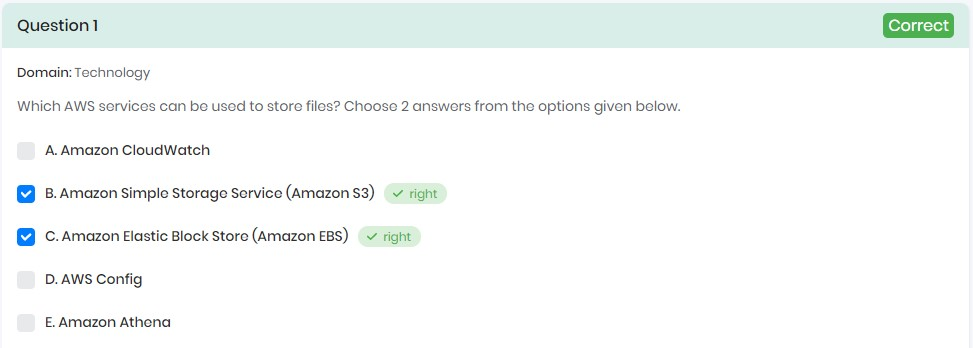

Which AWS services can be used to store files? Choose 2 answers from the options given below.

- B. Amazon Simple Storage Service (Amazon S3)

- C. Amazon Elastic Block Storage (Amazon EBS)

  > Amazon S3 is object storage built to store and retrieve any amount of data from anywhere - web sites and mobile apps, corporate applications and data from IoT sensors or devices. It is designed to deliver 99.999999999% durability. It stores data for millions of applications used by market leaders in every industry.
  > 
  > - [Simple Storage Service Documentation](https://aws.amazon.com/s3/)
  > 
  > Amazon Elastic Block Storage (Amazon EBS) provides persistent block storage volumes for use with Amazon EC2 instances in the AWS Cloud. Each Amazon EBS volume is automatically replicated within its Availability Zone to protect you from component failure, offering high availability and durability.
  > 
  > - [Amazon Elastic Block Storage Documentation](https://aws.amazon.com/ebs/)
  > 
  > **A is incorrect:** Amazon CloudWatch is used for performance monitoring.
  > 
  > **D is incorrect:** AWS Config is used to audit and monitor configurations changes.
  > 
  > **E is incorrect:** Amazon Athena is a serverless query service used to analyze BigData stored in S3.
  > 

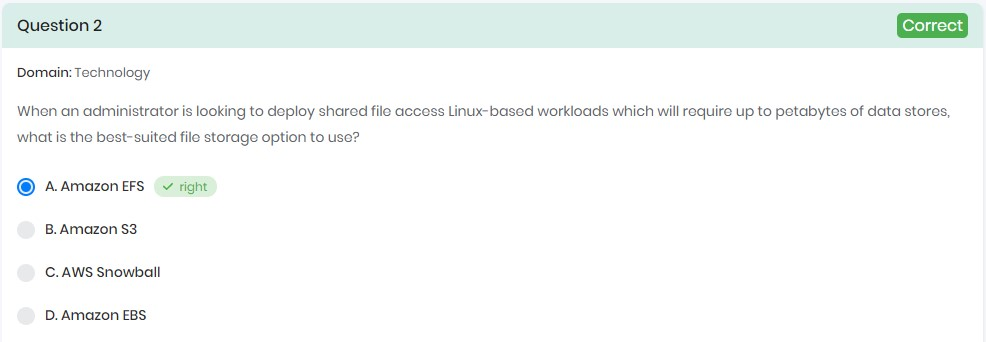

When an administrator is looking to deploy shared file access Linux-based workloads which will require up to petabytes of data stores, what is the best-suited file storage option to use?

- A. Amazon EFS

  > Amazon Elastic File Storage (EFS) is the best-suited file storage option for the described scenario. It is designed for shared file access and scaling to petabyte data store.
  > 
  > - [When to Choose EFS](https://aws.amazon.com/efs/when-to-choose-efs/)
  > 
  > **B is incorrect:** Amazon S3 is an object data store which is not suitable for deploying Linux-based workloads as the scenario outlines.
  > 
  > **C is incorrect:** AWS Snowball is a data transport solution and data migration which is not suitable for deploying shared file access builds.
  > 
  > - [AWS Snowball Documentation](https://aws.amazon.com/snowball/)
  > 
  > **D is incorrect:** Amazon Elastic Block Storage is block storage service for access by an EC2 instance but without the capability of a share file access. Applications that utilize persistent o dedicated block storage for a single instance can use Amazon EBS storage.
  > 

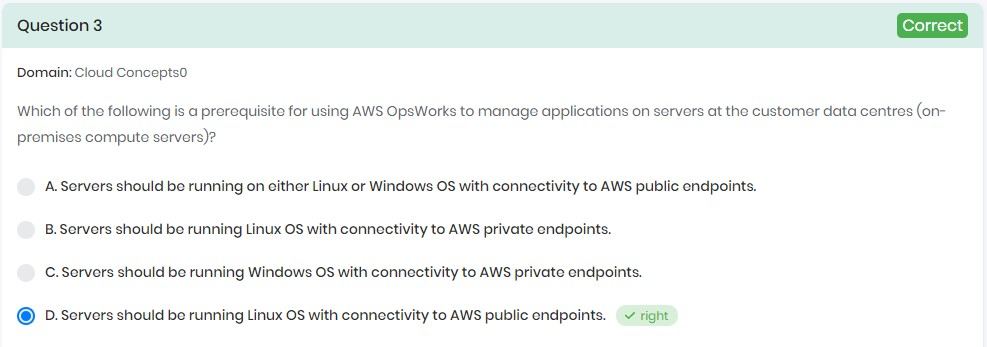

Which of the following is a prerequisite for using AWS OpsWorks to manager applications on servers at the customer data centers (on-premises compute servers)?

- D. Servers should be running Linux OS with connectivity to AWS public endpoints.

  > You can use AWS OpsWorks Stacks to configure and manage both Linux and Windows EC2 instances. But there is no need for EC2 instance, the question focuses on compute servers on the data centers means outside AWS. A VPC endpoint enables private connections between your VPC and supported AWS services and VPC endpoint services powered by AWS PrivateLink. VPC endpoints are virtual devices.
  > 
  > To use AWS OpsWork for servers in customer data centers, the servers should have Linux operating systems with an OpsWork Stacks agent installed and connectivity to AWS Public endpoints.
  > 
  > Using AWS OpsWorks Stacks to create Amazon EC2 instances, you can also register instances with a Linux stack that were created outside of AWS OpsWorks Stacks. However, they must be running one of the supported Linux distributions. **You cannot register Amazon EC2 or on-premises Windows instances.**
  > 
  > **A is incorrect:** Servers deployed at customer data centers only support Linux OS, not both.
  > 
  > **B is incorrect:** Servers deployed at customer data centers should have connectivity to AWS public endpoints instead of private endpoints.
  > 
  > **C is incorrect:** On-premises servers should have Linux OS instead of Windows OS.
  > 
  > For more information on AWS OpsWorks:
  > 
  > - https://aws.amazon.com/opsworks/stacks/features/
  > 
  > - https://docs.aws.amazon.com/opsworks/latest/userguide/workinginstances-os.html
  > 
  > - https://docs.aws.amazon.com/vpc/latest/privatelink/vpc-endpoints.html
  > 

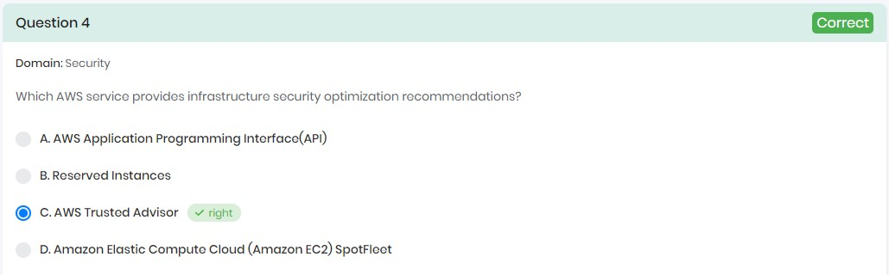

Which AWS service provides infrastructure security optimization recommendations?

- C. AWS Trusted Advisor

  > An online resource to help you reduce cost, increase performance, and improve security by optimizing your AWS environment, Trusted Advisor provides real time guidance to help you provision your resources following AWS best practices
  > 
  > [Trusted Advisor Documentation](https://aws.amazon.com/premiumsupport/trustedadvisor/)
  > 
  > **A, B, and D are incorrect:** They are not related to infrastructure security optimization.
  > 

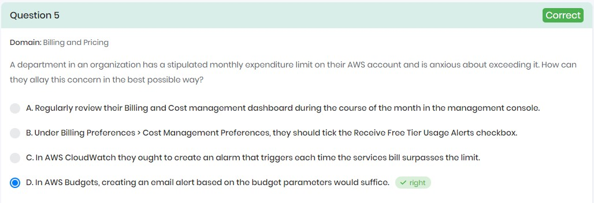

A department in an organization has a stipulated monthly expenditure limit on their AWS account and is anxious about exceeding it. How can they allay this concern in the best possible way?

- D. In AWS Budgets, creating an email alert based on the budget parameters would suffice.

  > AWS Budgets provides a useful feature of setting custom budgets that prompt users when their costs or usage are forecasted to exceed. The forecast aspect gives a buffer period in advance when alerting the user. Budgets can be tracked monthly, quarterly, or yearly, and have customizable start and end dates. Alerts can be sent via email and/or Amazon Simple Notification Service (SNS) topic.
  > 
  > - [AWS Budgets Documentation](https://aws.amazon.com/aws-cost-management/aws-budgets/)
  > 
  > **A is incorrect:** The regular review will not stop or alert the department if their service bill exceeds their stipulated budget.
  > 
  > - https://docs.aws.amazon.com/account-billing/index.html
  > 
  > **B is incorrect:** Selecting the Receive Free Tier Usage Alerts checkbox would notify the department each time their service bills go out of the free-tier range only, not when it approaches the limit.
  > 
  > - https://aws.amazon.com/about-aws/whats-new/2017/12/aws-free-tier-usage-alerts-automatically-notify-you-when-you-are-forecasted-to-exceed-your-aws-service-usage-limits/
  > 
  > **C is incorrect:** Configuring an alarm in AWS CloudWatch that triggers after exceeding the bill will not meet the requirements of staying within the desired budget. The alarm triggers when the account billing exceeds the threshold specified. It triggers only when actual billing exceeds the threshold. It does not use projections based on the usage so far as in the month.
  > 
  > - https://docs.aws.amazon.com/AmazonCloudWatch/latest/monitoring/monitor_estimated_charges_with_cloudwatch.html
  > 

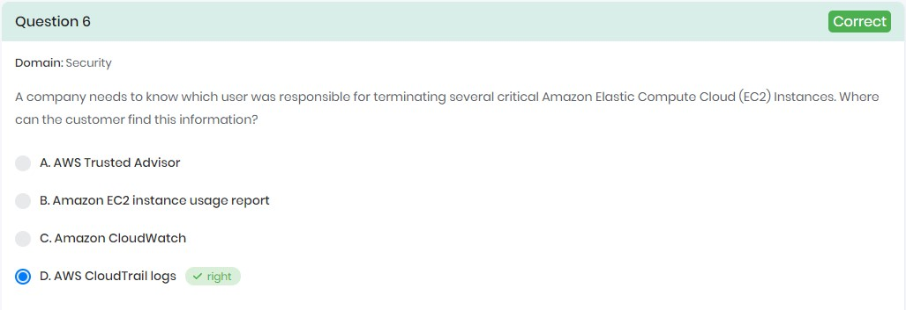

A company needs to know which user was responsible for terminating several critical Amazon Elastic Compute Cloud (EC2) instances. Where can the customer find this information?

- D. AWS CloudTrail Logs

  > Using CloudTrail, one can monitor all the API activity conducted on all AWS services.
  > 
  > AWS CloudTrail is a service that enables governance, compliance, operational auditing, and risk auditing of your AWS account. With CloudTrail, you can log, continuously monitor, and retain account activity related to actions across your AWS infrastructure. CloudTrail provides event history of your AWS account activity, including actions taken through the AWS Management Console, AWS SDKs, command line tools, and other AWS services. This event history simplifies security analysis, resource change tracking, and troubleshooting.
  > 
  > - [AWS CloudTrail Documentation](https://aws.amazon.com/cloudtrail/)
  > 
  > **A, B, and C are incorrect:** CloudTrail is the most appropriate place to monitor activity in AWS.

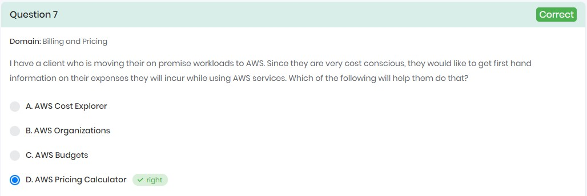

I have a client who is moving their on premise workloads to AWS. Since they are very cost conscious, they would like to get first hand information on their expenses they will incur while using AWS services. Which of the following will them do that?

- D. AWS Pricing Calculator

  > Through AWS Pricing Calculator a client can estimate costs that he will incur for various AWS services that he wishes to use. The pricing calculator guides the user through a set of well defined service parameters e.g. if S3 is planned to be used for a static website then parameters like "Standard storage per month"; "PUT, COPY, LIST, POST" requests to S3 standard could be relevant for determining the cost of using S3 on a monthly basis.
  > 
  > **A is incorrect:** Cost Explorer helps users to view graph displays of cost of your billing data and analyze them and get a forecast for likely spends for the next 12 months. The scenario is more to do with clients getting a cost estimate of different AWS services before they move to AWS cloud.
  > 
  > **B is incorrect:** AWS Organizations allows clients to consolidate multiple AWS accounts that they may own into an Organization that they can centrally control many parameters like Account billing, IAM permissions, etc. AWS Organizations provides a feature called consolidated billing that provides a single bill for multiple accounts.
  > 
  > **C is incorrect:** AWS Budgets helps clients to plan their service usage, service costs and get information alerts when the costs reach a certain threshold.
  > 
  > **References:**
  > 
  > - https://docs.aws.amazon.com/pricing-calculator/latest/userguide/what-is-pricing-calculator.html
  > 
  > - https://youtu.be/JWz4eCczCkQ
  > 

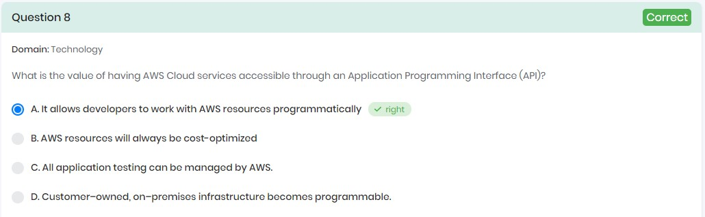

What is the value of having AWS Cloud services accessible through an Application Programming Interface (API)?

- A. It allows developers to work with AWS resources programmatically

  > It allows developers to easily work with the various AWS resources programmatically.
  > 
  > - [Various programming tools available for AWS](https://aws.amazon.com/tools/)
  > 
  > **B is incorrect:** The AWS API does not reduce cost.
  > 
  > **C is incorrect:** API allows the customer's developers to work with resources, not AWS
  > 
  > **D is incorrect:** The AWS API only allows the customer to manage AWS resources, not on-premise.

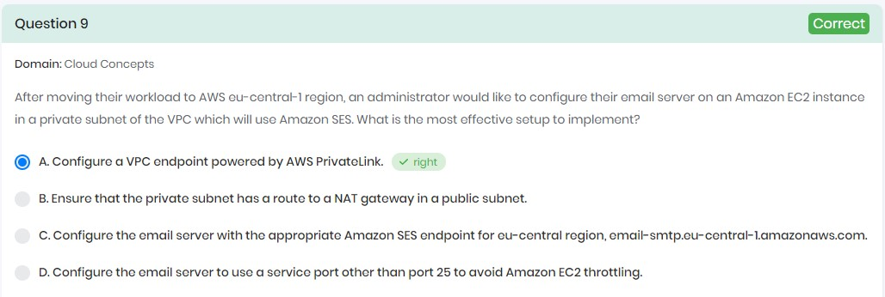

After moving their workload to AWS eu-central-1 region, an administrator would like to configure their email server on an Amazon EC2 instance in a private subnet of the VPC which will use Amazon SES. What is the most effective setup to implement?

- A. Configure a VPC endpoint powered by AWS PrivateLink.

  > As of April 29, 2020, AWS announced the addition of Amazon SES as a service available over VPC endpoint powered by AWS PrivateLink. This makes it possible to configure a VPC endpoint which the email server will reach within the VPC without the need for internet access. This is the most effective setup to implement.
  > 
  > - https://aws.amazon.com/about-aws/whats-new/2020/04/amazon-ses-now-offers-vpc-endpoint-support-for-smtp-endpoints/
  > 
  > **B is incorrect:** Ensuring that the private subnet has a route to a NAT gateway in a public subnet is feasible but would mean that the traffic would traverse the internet to get to the Amazon SES endpoints. This is not the most effective setup to implement.
  > 
  > **C is incorrect:** Configuring the email server with the appropriate Amazon SES endpoint would not work since Amazon EC2 instance is in a private subnet and does not have internet access to reach it.
  > 
  > **D is incorrect:** Configuring the email server to use a service port other than port 25 is recommended but does not address the requirement of how the email server will reach the Amazon SES endpoint.

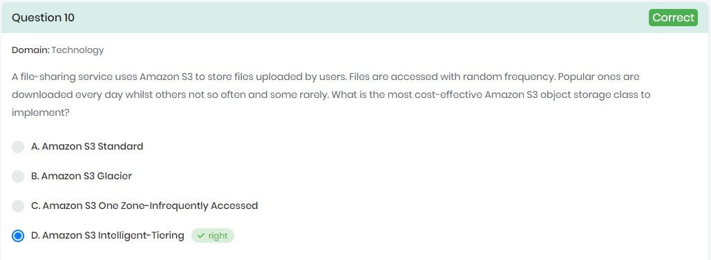

A file-sharing service uses Amazon S3 to store files uploaded by users. Files are accessed with random frequency. Popular ones are downloaded every day whilst others not so often and some rarely. What is the most cost-effective Amazon S3 object storage class to implement?

- D. Amazon S3 Intelligent-Tiering

  > S3 Intelligent-Tiering is a new Amazon S3 storage class designed for customers who want to optimize storage costs automatically when data access patterns change, without performance impact or operational overhead. S3 Intelligent-Tiering is the first cloud object storage class that delivers automatic cost savings by moving data between two access tiers -- frequent access and infrequent access -- when access patterns change, and is ideal for data with unknown or changing access patterns.
  > 
  > S3 Intelligent-Tiering stores objects in two access tiers: one tier optimized for frequent access and another lower-cost tier optimized for infrequent access. For a small monthly monitoring and automation fee per object, S3 Intelligent-Tiering monitors access patterns and moves objects that have not been accessed for 30 consecutive days to the infrequent access tier. There are no retrieval fees in S3 Intelligent-Tiering. If an object in the infrequent access tier is accessed later, it is automatically moved back to the frequent access tier. No additional tiering fees apply when objects are moved between access tiers within the S3 Intelligent-Tiering storage class. S3 Intelligent-Tiering is designed for 99.9% availability and 99.999999999% durability, and offers the same low latency and high throughput performance of S3 Standard.
  > 
  > - [S3 Intelligent-Tiering Documentation](https://aws.amazon.com/about-aws/whats-new/2018/11/s3-intelligent-tiering/)
  > 
  > **A is incorrect:** Amazon S3 Standard would be an inefficient class for storing those objects that will be accessed rarely.
  > 
  > **B is incorrect:** Storing objects that are frequently accessed in Amazon S3 Glacier would present operational bottlenecks since these objects would not be available instantly.
  > 
  > - [S3 Storage Classes](https://aws.amazon.com/s3/storage-classes/)
  > 
  > **C is incorrect:** Storing those objects that are rarely accessed and those that would be accessed frequently in Amazon S3 One Zone-Infrequently Accessed would be inefficient.
  > 

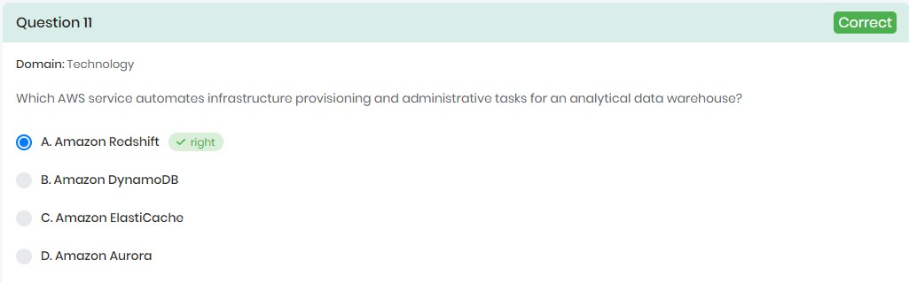

Which AWS service automates infrastructure provisioning and administrative tasks for an analytical data warehouse?

- A. Amazon Redshift

  > Amazon Redshift is a fully managed, petabyte-scale data warehouse service in the cloud. You can start with just a few hundred gigabytes of data and scale to a petabyte or more. This enables you to use your data to acquire new insights for your business and customers.
  > 
  > - [More Information on AWS Redshift](http://docs.aws.amazon.com/redshift/latest/mgmt/welcome.html) 
  > 
  > **B, C, and D are incorrect:** Amazon Redshift is the only data warehousing service out of all the choices.

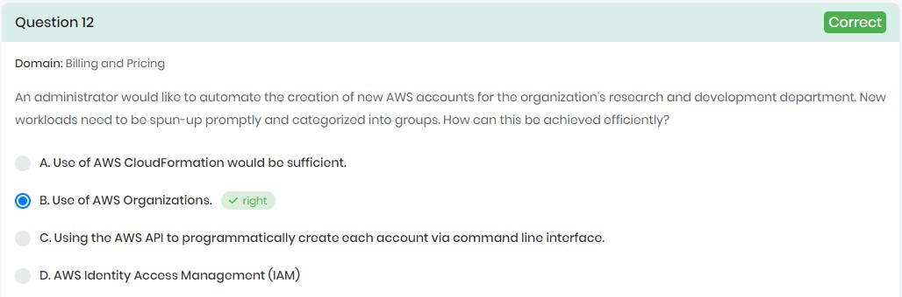

An administrator would like to automate the creation of new AWS accounts for the organization's research and development department. New workloads need to be spun-up promptly and categorized into groups. How can this be achieved efficiently?

- B. Use of AWS Organizations.

  > AWS Organizations allows the user to automate the creation of new AWS accounts when they need to launch new workloads quickly. The administrator can add these new accounts to user-defined groups in an organization for easy categorization. For example, you can create separate groups to categorize development and production accounts. Then you can apply a Service Control Policy (SCP) to the production group allowing only access to AWS services required by production workloads.
  > 
  > - [AWS Organizations Documentation](https://aws.amazon.com/organizations/)
  > 
  > **A is incorrect:** AWS CloudFormation does not aid in the automated AWS account creation. AWS CloudFormation provides a common language for the administrator to describe and provision all the infrastructure resources in their cloud environment. CloudFormation allows the administrator to use a simple text file to model and provision all the resources needed for applications across all regions and accounts. This file serves as a single source of truth for your cloud environment.
  > 
  > - [CloudFormation Documentation](https://aws.amazon.com/cloudformation/)
  > 
  > **C is incorrect:** Using AWS API to programmatically create each account via command-line interface is feasible but inefficient.
  > 
  > The AWS Command Line Interface (CLI) is a unified tool to manage your AWS services. With just one tool to download and configure, you can control multiple AWS services from the command line and automate them through scripts.
  > 
  > - [AWS Command Line Interface (CLI) Documentation](https://aws.amazon.com/cli/)
  > 
  > **D is incorrect:** Using AWS Identity Access Management (IAM) to fulfill the task is inefficient and tedious. AWS Identity and Access Management (IAM) enables you to manage access to AWS services and resources securely. Using IAM, you can create and manage AWS users and groups. You can use permissions to allow and deny their access to AWS resources. IAM iss a feature of your AWS account offered at no additional charge. You will be charged only for the use of other AWS services by your users.
  > 
  > - [AWS Identity Access and Management (IAM) Documentation](https://aws.amazon.com/iam/)
  > 

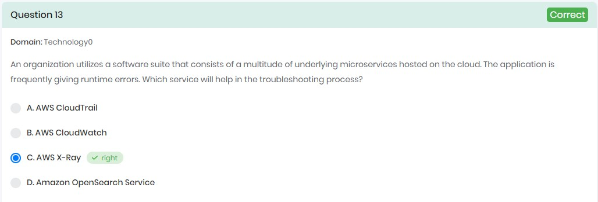

An organization utilizes a software suite that consists of a multitude of underlying microservices hosted on the cloud. The application is frequently giving runtime errors. Which service will help in the troubleshooting process?

- C. AWS X-Ray

  > AWS X-Ray is a service that collects data about requests that your application serves and provides tools that you can use to view, filter, and gain insights into that data to identify issues and opportunities for optimization. AWS X-Ray helps developers analyze and debug production, distributed applications, such as those built using a microservices' architecture.
  > 
  > - [AWS X-Ray Documentation](https://aws.amazon.com/xray/)
  > 
  > **A is incorrect:** AWS CloudTrail primarily records user or API activity, "who has done what". It logs, continuously monitors, and retains account activity related to actions across AWS infrastructure. CloudTrail provides event history in the AWS account activity but NOT that of the interaction of software microservices within a suite.
  > 
  > - [AWS CloudTrail Documentation](https://aws.amazon.com/cloudtrail/)
  > 
  > **B is incorrect:** AWS CloudWatch does the primary function of monitoring and NOT debugging. It collates data and actionable insights to monitor applications. It also responds to system-wide performance changes, optimizes resource utilization, and gets a unified view of operational health. However, the service does neither debug nor logs errors that occur amongst software microservices within a suite.
  > 
  > - [AWS CloudWatch Documentation](https://aws.amazon.com/cloudwatch/)
  > 
  > **D is incorrect:** Amazon OpenSearch Service is a managed service that makes it easy to deploy, operate, and scale OpenSearch clusters in the AWS Cloud. It automatically detects and replaces failed OpenSearch Service nodes, reducing the overhead associated with self-managed infrastructures.
  > 
  > - [Amazon OpenSearch Service Documentation](https://docs.aws.amazon.com/opensearch-service/latest/developerguide/what-is.html)
  > 

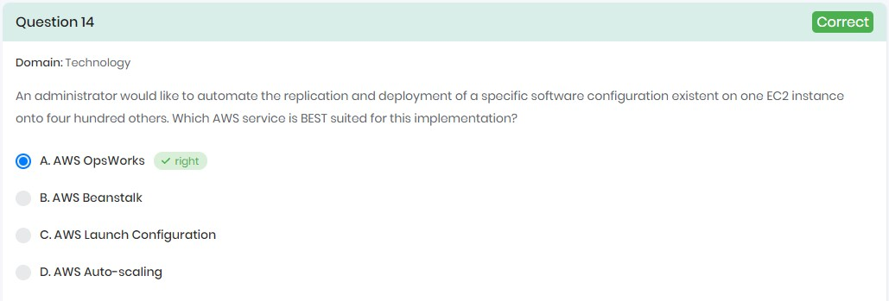

An administrator would like to automate the replication and deployment of a specific software configuration existent on one EC2 instance onto four hundred others. Which AWS service is BEST suited for this implementation?

- A. AWS OpsWorks

  > AWS OpsWorks provides a fully managed configuration automation and management service of Chef and Puppet. These platforms will allow for the use of code to automate the configurations of EC2 instances, including replication, as stated in the scenario. With Chef and Puppet, OpsWorks will allow for the automation of how servers are configured, deployed and managed across Amazon EC2 instances or on-premises compute environments.
  > 
  > **B is incorrect:** AWS Elastic Beanstalk is a service for deploying and scaling web applications and services developed with Java, .NET, PHP, Node.js, Python, Ruby, Go,  and Docker on familiar services such as Apache, Nginx, Passenger, and IIS. It will not replicate a specific software service configuration onto a multitude of EC2 instances autonomously.
  > 
  > - [AWS Elastic Beanstalk Documentation](https://aws.amazon.com/elasticbeanstalk/) 
  > 
  > **C is incorrect:** A Launch Configuration is primarily an instance configuration template that an Auto Scaling group uses to launch EC2 instances. It is the blueprint of the Auto Scaling group. It also determines the configuration output of each instance.
  > 
  > - [Launch Configuration Documentation](https://docs.aws.amazon.com/autoscaling/ec2/userguide/LaunchConfiguration.html)
  > 
  > **D is incorrect:** Auto-scaling is responsive to preset threshold levels in a deployment environment. It does not offer a fully managed functionality that allows for the mass replication of a specific configuration, as the scenario outlines
  > 
  > - [Auto-scaling Documentation](https://aws.amazon.com/autoscaling/)
  > 

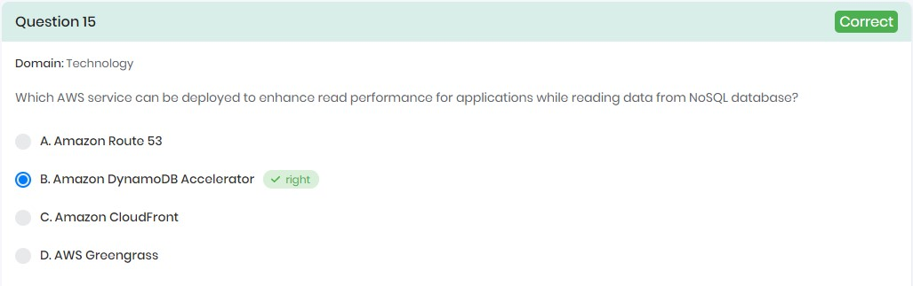

Which AWS service can be deployed to enhance read performance for applications while reading data from NoSQL database?

- B. Amazon DynamoDB Accelerator

  > Amazon DynamoDB Accelerator (DAX) is a caching service for DynamoDB which can be deployed in VPC in a region where DynamoDB is deployed. For read-heavy applications, DAX can be deployed to increase throughput by providing in-memory caching.
  > 
  > **A is incorrect:** Amazon Route 53 is an AWS DNS service and cannot improve the performance of DynamoDB.
  > 
  > **C is incorrect:** Amazon CloudFront is a global content delivery network that cannot be applied to a DynamoDB table.
  > 
  > **D is incorrect:** AWS Greengrass is data caching software for connected devices.
  > 
  > - [More Information on Caching Solutions with AWS](https://aws.amazon.com/caching/aws-caching/)
  > 

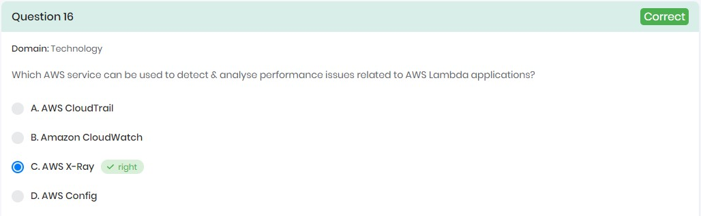

Which AWS service can be used to detect & analyse performance issues related to AWS Lambda applications?

- C.AWS X-Ray

  > AWS X-Ray can be used to detect performance issues for AWS Lambda applications. AWS Lambda sends traces to X-Ray which is further analysed to generate a performance report.
  > 
  > **A is incorrect:** AWS CloudTrail will capture API calls made by AWS Lambda.
  > 
  > **B is incorrect:** Amazon CloudWatch will track the number of requests, execution time request & error generated, but it won't help in analysing end-to-end application performance.
  > 
  > **D is incorrect:** AWS Config will not help to detect performance issues with AWS Lambda. AWS Config can audit configuration of AWS resources.
  > 
  > [More Information on Debugging AWS Lambda Application Performance](https://docs.aws.amazon.com/lambda/latest/dg/lambda-monitoring.html)
  > 

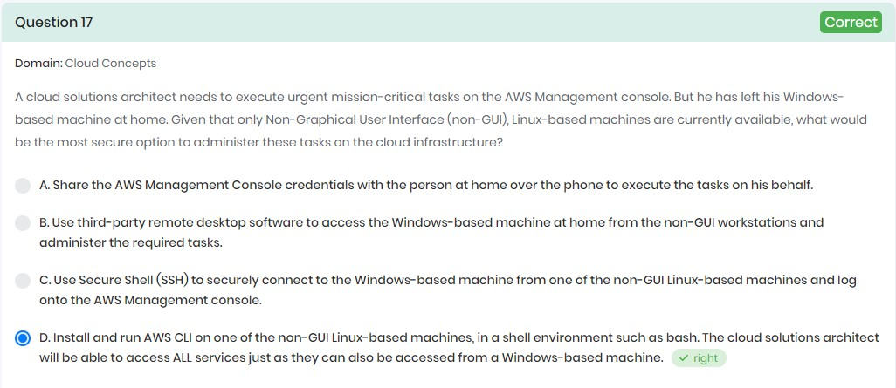

A cloud solutions architect needs to execute urgent mission-critical tasks on the AWS Management Console. But he has left his Windows-based machine at home. Given that only Non-Graphical User Interface (non-GUI), Linux-based machines are currently available, what would be the most secure option to administer these tasks on the cloud infrastructure?

- D. Install and run AWS CLI on one of the non-GUI Linux-based machines, in a shell environment such as bash. The cloud solutions architect will be able to access ALL services just as they can also be accessed from a Windows-based machine.

  > AWS Command Line Interface (AWS CLI) is an open-source tool that enables access and interaction with AWS services using commands in the command-line shell. With minimal configuration, the cloud solution architect would start using the functionality equivalent to that provided by the browser-based AWS Management Console from the command prompt in a terminal program such as bash.
  > 
  > - https://docs.aws.amazon.com/cli/latest/userguide/cli-chap-welcome.html
  > 
  > **A is incorrect:** Sharing AWS Management Console credentials is a bad-practice and poses a high-security risk.
  > 
  > - https://aws.amazon.com/iam/details/managing-user-credentials/
  > 
  > **B is incorrect:** Accessing the AWS Management Console via third-party remote desktop software is insecure since the remote machine can be compromised.
  > 
  > **C is incorrect:** It is rather cumbersome in comparison. The secure option is the direct access method of AWS CLI.
  > 

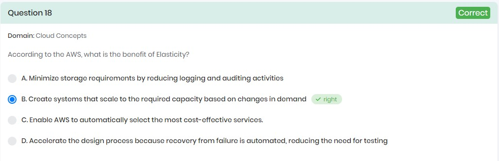

According to the AWS, what is the benefit of Elasticity?

- B. Create systems that scale to the required capacity based on changes in demand.

  > The concept of Elasticity is the means of an application having the ability to scale up and scale down based on demand. An example of such a service is the Autoscaling service.
  > 
  > - [AWS Autoscaling Documentation](https://aws.amazon.com/autoscaling/)
  > 
  > **A, C, and D are incorrect:** Elasticity will not have positive effects on storage, cost, or design agility.
  > 

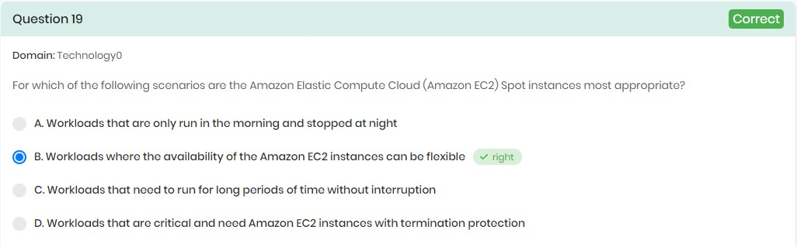

For which of the following scenarios are the Amazon Elastic Compute Cloud (EC2) Spot Instances most appropriate?

- B. Workloads where the availability of the Amazon EC2 instance can be flexible.

  > Spot Instances are a cost-effective choice if you can be flexible about when your applications run and if your applications can be interrupted. For example, Spot Instances are well-suited for data analysis, batch jobs, background processing, and optional tasks.
  > 
  > [More Information on AWS Spot Instances](http://docs.aws.amazon.com/AWSEC2/latest/UserGuide/using-spot-instances.html)
  > 
  > **A, C, and D are incorrect:** Since Spot Instances can be terminated by Amazon depending on market prices, they cannot be guaranteed to run during a specific period of time. It will impact the workloads especially when they are critical.
  > 

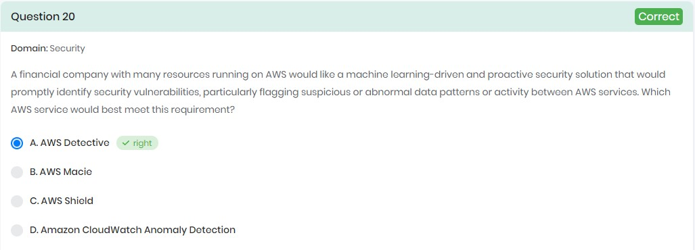

A financial company with many resources running on AWS would like a machine learning-driven and proactive security solution that would promptly identify security vulnerabilities, particularly flagging suspicious or abnormal data patterns or activity between AWS services. Which AWS service would best meet this requirement?

- A. AWS Detective

  > AWS Detective is a persistent machine learning-driven service that automatically collates log data from all AWS resources. This log data is than applied into machine learning algorithms to derive data patterns between AWS services and resources, graph theory and statical analysis. This information allows the user to proactively visualize their AWS environment from a security standpoint, thereby allowing them to quickly and efficiently conduct security investigations when they occur.
  > 
  > - [What is Detective?](https://docs.aws.amazon.com/detective/latest/adminguide/what-is-detective.html)
  >
  > **B is incorrect:** AWS Macie primarily matches and discovers sensitive data such as personally identifiable information (PII) but does not have the capability to keep track of data behaviors between AWS services to detect anomalies. Therefore the service does not meet the requirement.
  > 
  > **C is incorrect:** AWS Shield is a Distributed Denial of Service (DDoS) protection service that applies to applications running in the AWS environment. The service does not have machine learning capabillity to keep track of data behaviors between AWS services.
  > 
  > **D is incorrect:** Amazon CloudWatch Anomaly Detection is a machine learning feature limited to Amazon CloudWatch metrics. It does not extend to all the AWS services, so it does not meet the requirement.
  >

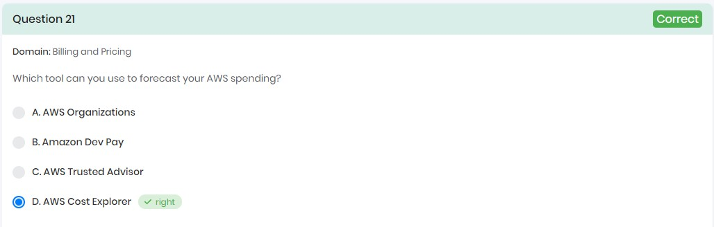

Which tool can you use to forecast your AWS spending?

- D. AWS Cost Explorer

  > Cost Explorer is a free tool that you can use to view your costs. You can view data up to the last 12 months. You can forecast how much you are likely to spend for the next 12 months and get recommendations for what Reserved instances to purchase. You can use Cost Explorer to see patterns in how much you spend on AWS resources over time, identify areas that need further inquiry, and see trends that you can use to understand your costs. You also can specify time ranges for the data and view time data by day or by month.
  > 
  > - [More Information on AWS Cost Explorer](http://docs.aws.amazon.com/awsaccountbilling/latest/aboutv2/cost-explorer-what-is.html)
  > 
  > **A, B, and C are incorrect:** These services do not relate to billing and cost.
  > 

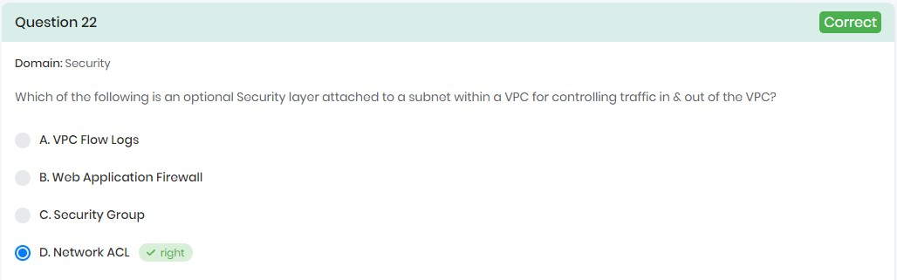

Which of the following is an optional Security layer attached to a subnet within a VPC for controlling traffic in and out of the VPC?

- D. Network ACL

  > Network ACL can be additionally configured on subnet level to control traffic in and out of the VPC.
  > 
  > **A is incorrect:** VPC Flow Logs will capture information about IP traffic in and out of the VPC. This will not be used for controlling purposes.
  > 
  > **B is incorrect:** Web Application Firewall (WAF) can be configured to protect web applications from common security threats. It can be deployed on devices such as Amazon CloudFront, Application Load Balancer and Amazon API Gateway.
  > 
  > **C is incorrect:** Security Groups are attached at instance level and not at the subnet level.
  > 
  > - [More Information on Security within VPC](https://docs.aws.amazon.com/vpc/latest/userguide/VPC_Security.html#VPC_Security_Comparison)
  > 

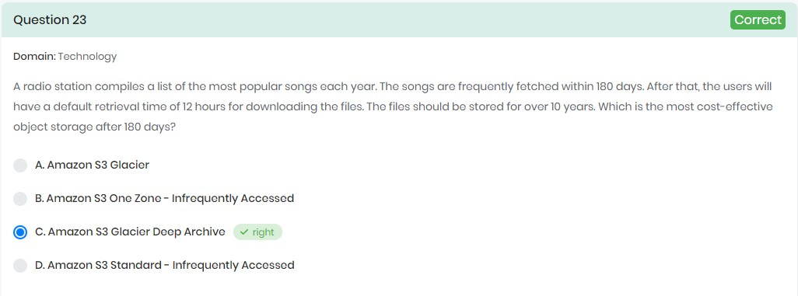

A radio station compiles a list of the most popular songs each year. The songs are frequently fetched within 180 days. After that, the users will have a default retrieval time of 12 hours for downloading the files. The files should be stored for over 10 years. Which is the most cost-effective object storage after 180 days?

- C. Amazon Ss3 Glacier Deep Archive

  > Amazon S3 Glacier Deep Archive is the most cost-effective object storage to implement because the information will be rarely accessed and when it is accessed, its retrieval period will not be instant.
  > 
  > - [Amazon S3 Glacier Deep Archive Documentation](https://aws.amazon.com/s3/faqs/#Amazon_S3_Glacier_Deep_Archive)
  > 

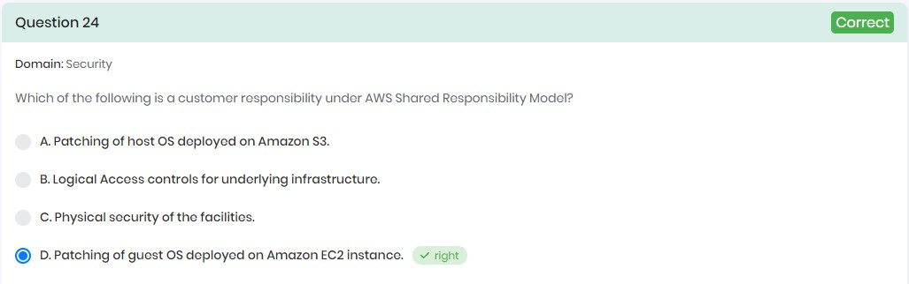

Which of the following is a customer responsibility under AWS Shared Responsibility Model?

- D. Patching of guest OS deployed on Amazon EC2 instance.

  > Under the AWS shared responsibility model, AWS takes care of infrastructure configuration and management while customers must take care of ther resources they launched within AWS.
  > 
  > - [AWS Shared Responsibility Model Documentation](https://aws.amazon.com/compliance/shared-responsibility-model/)
  > 

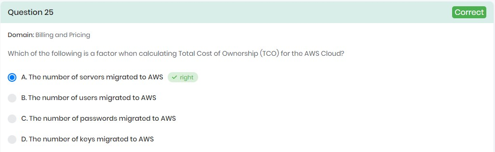

Which of the following is a factor when calculating Total Cost of Ownership (TCO) for the AWS Cloud?

- A. The number of servers migrated to AWS 

  > Running servers will incur costs. The number of running servers is one factor of Server Costs - a key component of AWS's Total Cost of Ownership (TCO).
  > 
  > - [To Estimate the Cost for your AWS Architecture Solution](https://calculator.aws/#/)
  > 

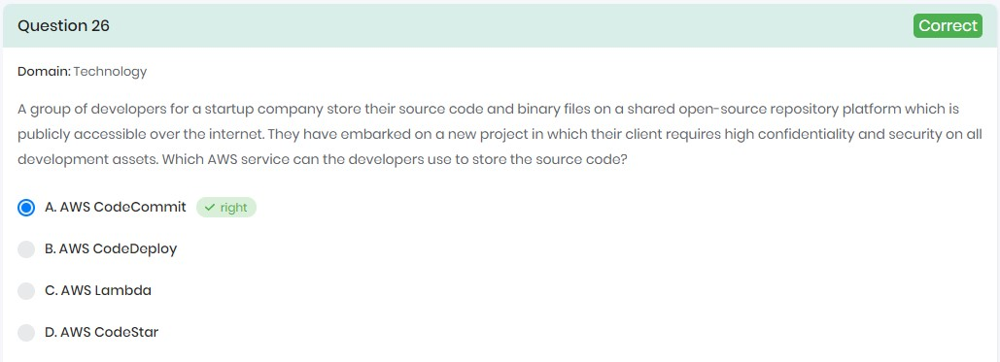

A group of developers for a startup company store their source code and binary files on a shared open-source repository platform which is publicly accessible over the internet. They have embarked on a new project in which their client requires high confidentiality and security on all development assets. Which AWS service can the developers use to store the source code?

- A. AWS CodeCommit

  > AWS CodeCommit is a managed source control service. It can be used as a data store to store source code, binaries, scripts, HTML pages, and images which are accessible over the internet. CodeCommit encrypts files in transit and at rest, which fulfills the additional client requirement (high confidentiality and security) mentioned in the question. Also, CodeCommit works well with Git tools and other existing CI/CD tools.
  > 
  > - [AWS CodeCommit Documentation](https://aws.amazon.com/codecommit/)
  > 
  > **B is incorrect:** AWS CodeDeploy is a deployment service that automates application deployments to Amazon EC2 instances, on-premises instances, serverless Lambda functions, or Amazon ECS services.
  > 
  > - [AWS CodeDeploy Documentation](https://docs.aws.amazon.com/codedeploy/latest/userguide/welcome.html)
  > 
  > **C is incorrect:** AWS Lambda will allow the developers in the scenario to run code without provisioning or managing servers. The company would pay only for the compute time consumed. There would be no charge when your code is not running.
  >
  > - [AWS Lambda Documentation](https://aws.amazon.com/lambda/)
  > 
  > **D is incorrect:** AWS CodeStar provides a unified user interface, enabling you to manage your software development activities in one place easily. With AWS CodeStar, you can set up your entire continuous delivery toolchain in minutes, allowing you to start releasing code faster. AWS CodeStar makes it easy for your whole team to work together securely, allowing you to manage access and add owners, contributors, and viewers to your projects easily. However, this question asks for the service to store the source code. AWS CodeStar is improper because it is a software development management tool rather than a source control service.
  >
  > - [AWS CodeStar Documentation](https://aws.amazon.com/codestar/)
  > 

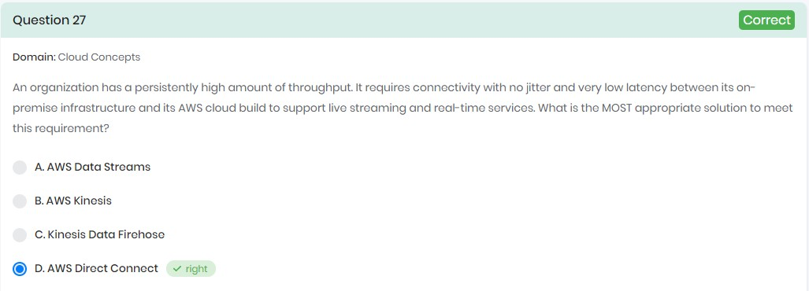

An organization has a persistently high amount of throughput. It requires connectivity with no jitter and very low latency between its on-premises infrastructure and its AWS cloud build to support live streaming and real-time services. What is the MOST appropriate solution to meet this requirement?

- D. AWS Direct Connect

  > AWS Direct Connect is a cloud service solution that makes it easy to establish a dedicated network connection from the organization's premises to AWS. The service provides a dedicated network connection with one of the AWS Direct Connect locations. It makes it possible to guaranteed high bandwidth and very low latency connectivity.
  > 
  > - [AWS Direct Connect Documentation](https://aws.amazon.com/directconnect/)
  > 
  > **A is incorrect:** The scenarios require a connectivity option. But Amazon Kinesis Data Streams (KDS) is a massively scalable and durable real-time data streaming service. It does not guarantee the quality of connectivity between the organizations on-premise infrastructure and the AWS cloud build. The data KDS collects is available in milliseconds to enable real-time analytics use cases such as real-time dashboards, real-time anomaly detection, dynamic pricing, and more.
  > 
  > - [Amazon Kinesis Data Streams (KDS) Documentation](https://aws.amazon.com/kinesis/data-streams/)
  > 
  > **B is incorrect:** The organization requires a connectivity solution and not an application service. Amazon Kinesis makes it easy to collect, process, and analyze real-time, streaming data to get timely insights and react quickly to new information.
  > 
  > - [Amazon Kinesis Documentation](https://aws.amazon.com/kinesis/)
  > 
  > **C is incorrect:** Amazon Kinesis Data Firehouse is used to load streaming stat into various destinations like data lakes, data stores, and analytics tools. However, the service does not guarantee link quality between the organization's on-premise infrastructure and the AWS cloud.
  > 
  > - [Amazon Kinesis Data Firehouse Documentation](https://aws.amazon.com/kinesis/data-firehose/)

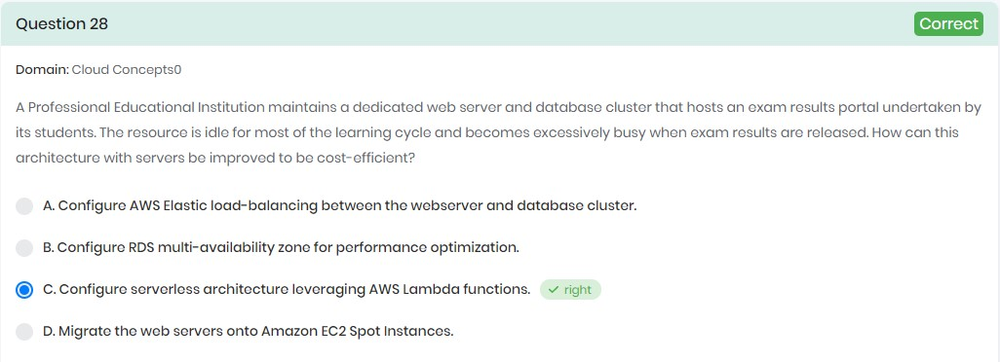

A Professional Education Institution maintains a dedicated web server and database cluster that hosts an exam results portal undertaken by its students. The resource is idle for most of the learning cycle and becomes excessively busy when exam results are released. How can this architecture with servers be improved to be cost-efficient?

- C. Configure serverless architecture leveraging AWS Lambda functions.

  > Leveraging AWS Lambda functions will remove the need to run a dedicated web server for the organization. During periods of high requests to the database cluster, AWS Lambda back-end infrastructure will automatically scale out resources to meet the demand adequately. AWS Lambda provides a platform to run code without provisioning or managing any servers. The organization pays only for the compute time they consume. There is no charge when your code is not running. Lambda functions can reduce the cost significantly.
  > 
  > - [AWS Lambda Documentation](https://aws.amazon.com/lambda/)
  > 
  > **A is incorrect:** The premise of the scenario is about cost-efficiency more than load and server responsiveness. The addition of Elastic load balancing will increase the cost based on the number of instances. So this option is not cheaper.
  > 
  > - [Elastic Load Balancing Documentation](https://aws.amazon.com/elasticloadbalancing/)
  > 
  > **B is incorrect:** RDS Multi-AZ helps with disaster recovery, enhanced availability, and durability. However, the scenario requires a solution that reduces the cost of maintaining the organization's infrastructure.
  > 
  > - [RDS Multi-AZ Documentation](https://aws.amazon.com/rds/details/multi-az/)
  > 
  > **D is incorrect:** Migrating to Amazon EC2 Spot Instances may negatively impact the service during periods of high traffic. Instances could be terminated mid-transaction that would have adverse effects on the overall user experience. This would not be a cost-effective solution. Spot instances let you take advantage of unused EC2 capacity in the AWS cloud. Spot Instances are available at up to a 90% discount compared to On-Demand prices. Spot Instances can reclaim the capacity back with two minutes notice.
  > 
  > - [EC2 Spot Instances Documentation](https://aws.amazon.com/ec2/spot/)
  > 

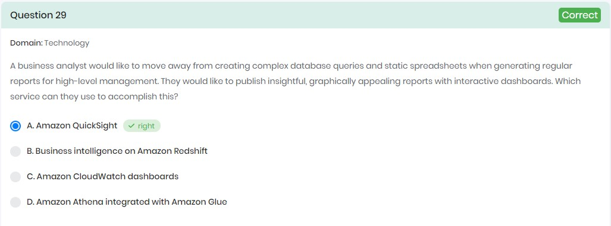

A business analyst would like to move away from creating complex database queries and static spreadsheets when generating regular reports for high-level management. They would like to publish insightful, graphically appealing reports with interactive dashboards. Which service can they use to accomplish this?

- A. Amazon QuickSight

  > Amazon QuickSight is the most appropriate service in the scenario. It is a fully-managed service that allows for insightful business intelligence reporting with creative data delivery methods, including graphical and interactive dashboards. QuickSight includes machine learning that allows users to discover inconspicuous trends and patterns on their datasets.
  > 
  > - [Amazon QuickSight](https://aws.amazon.com/quicksight/)
  > 

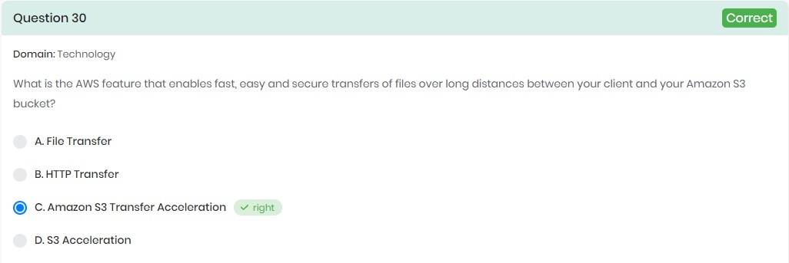

What is the AWS feature that enables fast, easy and secure transfers of files over long distances between your client and your Amazon S3 bucket? 

- C. Amazon S3 Transfer Acceleration

  > Amazon S3 Transfer Acceleration enables fast, easy, and secure transfers of files over long distances between your client and an S3 bucket. Transfer Acceleration takes advantage of Amazon CloudFront's globally distributed edge locations. As the data arrives at an edge location, data is routed to Amazon S3 over an optimized network path.
  > 
  > - [S3 Transfer Acceleration Documentation](http://docs.aws.amazon.com/AmazonS3/latest/dev/transfer-acceleration.html)
  > 

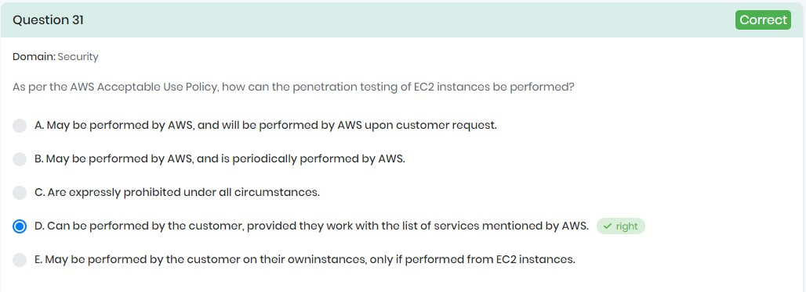

As per the AWS Acceptable Use Policy, how can the penetration testing of EC2 instances be performed?

- D. Can be performed by the customer, provided they work with the llist of services mentioned by AWS.

  > You do not need to take prior authorization from AWS before doing a penetration test on EC2 instances.
  > 
  > - [Penetration Testing Documentation](https://aws.amazon.com/security/penetration-testing/)
  > 
  > **Permitted Services:** You're welcome to conduct security assessments against AWS resources that you own if they make use of the services listed below.
  > 
  > - Amazon EC2 instances, NAT Gateways, and Elastic Load Balancers
  > - Amazon RDS
  > - Amazon CloudFront
  > - Amazon Aurora
  > - Amazon API Gateways
  > - AWS Lambda and Lambda Edge functions
  > - Amazon Lightsail resources
  > - Amazon Elastic Beanstalk environments
  > 

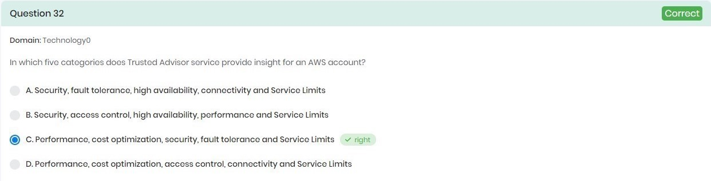

In which five categories does Trusted Advisor service provide insight for an AWS account?

- C. Performance, Cost Optimization, Security, Fault Tolerance, and Service Limits

  

  > What the Trusted Advisor Dashboard offers:
  > 
  > - **Cost Optimization:**  
  >   It helps to save cost, such as recommending you to delete unused resources or use reserved capacity.
  > 
  > - **Performance:**  
  >   It can improve the performance of the services by ensuring to take advantage of provisioned throughput, and monitoring for overutilized Amazon EC2 instances.
  > 
  > - **Security:**
  >   It can improve the security of the application by recommending you to enable AWS security features, and review your permissions.
  > 
  > - **Fault Tolerance:**
  >   It can increase the availability of the AWS application by recommending to take advantage of auto-scaling, health checks, multi-AZ Regions, and backup capabilities.
  > 
  > - **Service Limits:**
  >   Service Quotas also referred to as Service Limits, are the maximum number of service resources or operations that apply to an account or a Region. Trusted Advisor can notify you if you use more than 80% of a service quota.
  > 
  > For more information on the Trusted Advisor:
  > 
  > - https://aws.amazon.com/premiumsupport/trustedadvisor/
  > 
  > - https://docs.aws.amazon.com/awssupport/latest/user/trusted-advisor-check-reference.html
  > 

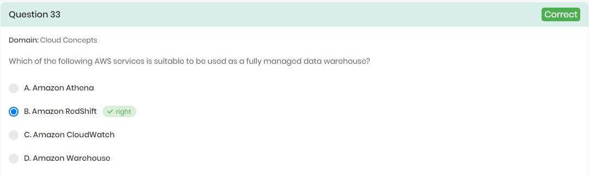

Which of the following AWS services is suitable to be used as a fully managed data warehouse?

- B. Amazon Redshift

  > Amazon Redshift is a fully managed, petabyte-scale data warehouse service.
  > 
  > - [Amazon Redshift Documentation](https://docs.aws.amazon.com/redshift/latest/gsg/getting-started.html)
  > 
  > **A is incorrect:** Amazon Athena is used to query data and analyze big data in S3.
  > 
  > **B is incorrect:** Amazon CloudWatch is used to monitor AWS resources, collect metrics, configure alarms, etc.
  > 
  > **D is incorrect:** Amazon Warehouse does not exist.
  > 

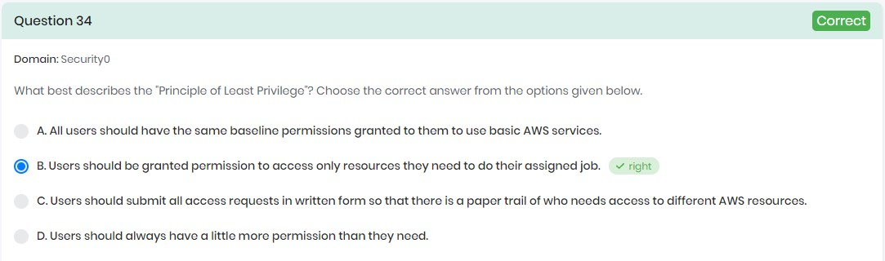

What best describes the "Principal of Least Privilege"? 

- B. Users should be granted permission to access only resources they need to do their assigned job.

  > The principle means giving a user account only those privileges which are essential to perform its intended function. For example, a user account for the sole purpose of creating backups does not need to install the software. Hence, it has rights only to run backup and backup-related applications.
  > 
  > - [Principle of Least Privilege Documentation](https://en.wikipedia.org/wiki/Principle_of_least_privilege)
  > 

A developer would like to automate the installation by updating a set of applications on a series of EC2 instances and on-premises servers. Which is the most appropriate service to use to achieve this requirement?

- C. AWS CodeDeploy

  > AWS CodeDeploy is a deployment service that allows developers to automate the installation of applications to hosts, Amazon EC2 instances, Amazon ECS instances, serverless Lambda functions, or even on-premises servers. AWS CodeDeploy can enable the update of those applications
  > 
  > - [AWS CodeDeploy Documentation](https://docs.aws.amazon.com/codedeploy/latest/userguide/welcome.html)
  > 
  > **A is incorrect:** AWS CodeBuild is a fully managed service that primarily compiles source code and runs unit tests with the output being artifacts ready for deployment.
  > 
  > - [AWS CodeBuild Documentation](https://docs.aws.amazon.com/codebuild/latest/userguide/welcome.html)
  > 
  > **B is incorrect:** AWS CodeCommit service primarily serves to control software build versions and private storage for software development assets such as binary files, source code, and related documentation.
  > 
  > - [AWS CodeCommit Documentation](https://docs.aws.amazon.com/codecommit/latest/userguide/welcome.html)
  > 
  > **D is incorrect:** AWS CloudFormation will not be able to run deployments of applications onto on-premises infrastructure. Furthermore, AWS CloudFormation automates the deployment of AWS resources but not applications and code onto hosts.
  > 

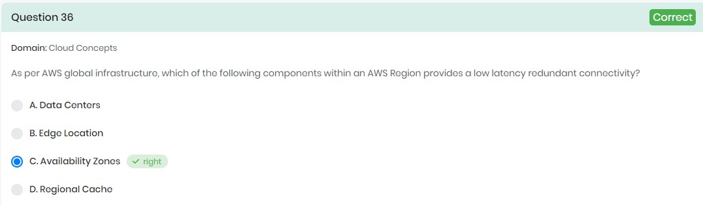

As per the AWS global infrastructure, which of the following components within an AWS Region provides a low latency redundant connectivity?

- C. Availability Zones

  > Regions consist of 2 or more Availability Zones within a specific geographical area. These Availability Zones are physically isolated and connected via a low latency redundant link.
  > 
  > - [More Information on AWS Regions and Availability Zones](https://aws.amazon.com/about-aws/global-infrastructure/regions_az/?p=ngi&loc=2)
  > 

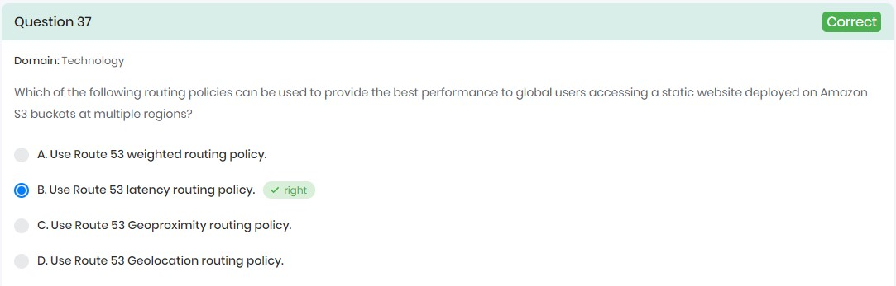

Which of the following routing policies can be used to provide the best performance to global users accessing a static website deployed on Amazon S3 buckets at multiple regions?

- B. Use Route 53 Latency routing policy.

  > Route 53 latency routing policy can be used to provide the least latency when resources are deployed in multiple regions. This policy routes users' requests to the nearest resource based upon latency.
  > 
  > **A is incorrect:** Route 53 Weighted Routing Policy is used to distribute requests between multiple resources based upon weight of each.
  > 
  > **C is incorrect:** Route 53 Geoproximity Routing Policy can be used to route traffic based upon the location of the resource.
  > 
  > **D is incorrect:** Route 53 Geolocation Routing Policy can be used to route traffic based upon user location.
  > 
  > - [Amazon Route 53 Routing Policies Documentation](https://docs.aws.amazon.com/Route53/latest/DeveloperGuide/routing-policy.html)
  > 

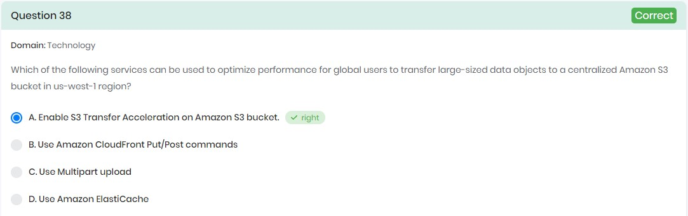

Which of the following services can be used to optimize performance for global users to transfer large-sized data objects to a centralized Amazon S3 bucket in us-west-1 region?

- A. Enable S3 Transfer Acceleration on Amazon S3 bucket.

  > S3 Transfer Acceleration can optimise performance for data transfer between users & objects in Amazon S3 bucket. Transfer acceleration uses CloudFront edge location to provide accelerated data transfer to users.
  > 
  > **B is incorrect:** Amazon CloudFront Put/Post commands can be used for small-sized objects but for large-sized data objects, S3 Transfer Acceleration provides better performance.
  > 
  > **C is incorrect:** Users should use Multipart uploads for all data objects exceeding 100 megabytes. But for better performance, S3 Transfer Acceleration should be enabled.
  > 
  > **D is incorrect:** For global users accessing S3 bucket, S3 Transfer Acceleration is a better choice.
  > 
  > For more information on Amazon S3 Transfer Acceleration:
  > 
  > - https://aws.amazon.com/s3/faqs/#s3ta
  > 
  > - https://docs.aws.amazon.com/AmazonS3/latest/dev/optimizing-performance.html
  > 

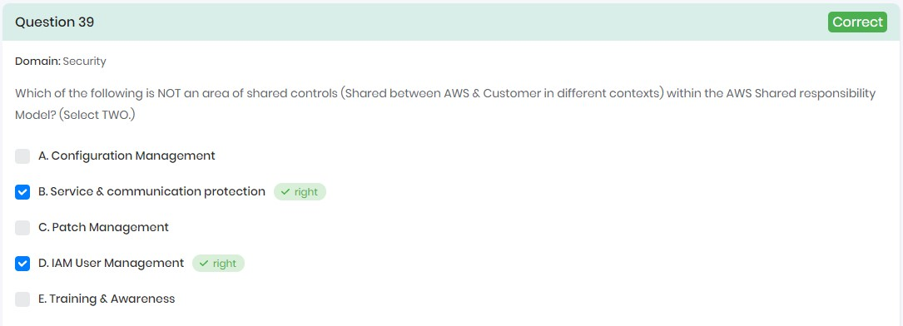

Which of the following is NOT an area of shared controls (Shared between AWS and Customer in different contexts) within the AWS Shared Responsibility Model? (Select TWO)

- B. Service and communication protection

- D. IAM User Management

  > Shared controls are applicable in both the infrastructure and customer layers but in completely separate contexts. Under shared controls, AWS provides requirements for infrastructure while customers must provide their own control implementation for the AWS services that they use.
  > 
  > Services communication may be subject to data zoning and protection within specific security environments. This is primarily to responsibility of the customer and AWS does not play any role in this. This may take the form of configuring NACL's, Security Groups, Data encryption, etc.
  > 
  > IAM and user management refers to security "in" the cloud and are best managed by the customer.
  > 
  > **A is incorrect:** Configuration management has shared controls. AWS is responsible for configuring infrastructure devices while the customer is responsible for configuring their guest OS and applications
  > 
  > **C is incorrect:** AWS is responsible for detecting and patching flaws within the infrastructure while the customer is responsible for patching their guest OS and applications.
  > 
  > **E is incorrect:** AWS trains its own employees while customers need to train their own employees.
  > 
  > - [AWS Shared Responsibility Model](https://aws.amazon.com/compliance/shared-responsibility-model/)
  > 

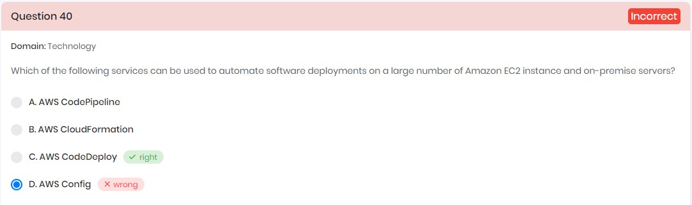

Which of the following services can be used to automate software deployments on a large number of Amazon EC2 instance and on-premise servers?

- C. AWS CodeDeploy

  > AWS CodeDeploy is a managed service that automates software deployment on a large scale to EC2 instances and on-premise servers.
  > 
  > **A is incorrect:** AWS CodePipeline is a managed service for automation of delivery pipeline for application updates.
  > 
  > **B is incorrect:** AWS CloudFormation is used to automate infrastructure provisioning and updates.
  > 
  > **D is incorrect:** AWS Config is used to audit configurations of AWS resources.
  > 
  > - [AWS CodeDeploy Documentation](https://aws.amazon.com/codedeploy/features/?nc=sn&loc=2)
  > 

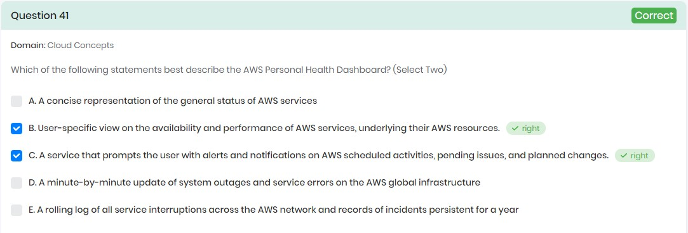

  > 
  > 
  > 
  > - 
  > 
  > 

