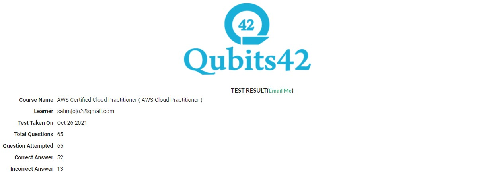

# Attempt 2 - 10/26/2021

### Score = 52 / 65 (80%) Correct

1. Your company has just started using the resources on the AWS Cloud. They want to get an idea of the costs being incurred so far for the resources being used. How can this be achieved?

   **Correct Answer :**  
   - **By using the AWS Cost and Usage reports Explorer. Here you can see the running and forecast costs**

2. An application running on EC2 instances processes sensitive information stored on Amazon S3. The information is accessed over the Internet. The security team is concerned that the Internet connectivity to Amazon S3 is a security risk. Which solution will resolve the security concern?

   **Correct Answer :**  
    - **Access the data through a VPC endpoint for Amazon S3**

   **My Answer :**  
    - **Access the data through a NAT Gateway**

3. A Solutions Architect is designing an online shopping application running in a VPC on EC2 instances behind an ELB Application Load Balancer. The instances run in an Auto Scaling group across multiple Availability Zones. The application tier must read and write data to a customer-managed database cluster. There should be no access to the database from the Internet, but the cluster must be able to obtain software patches from the Internet. Which VPC design meets these requirements?

   **Correct Answer :**  
    - **Public subnets for the application tier and NAT Gateway, and private subnets for the database cluster**

4. Which of the following services are included at no additional cost with the use of the AWS platform? (Choose two)

   **Correct Answers :**  
    - **Cloudformation**  
    - **Auto Scaling**

5. Select the correct option for AWS Service/feature and its scope.

   **Correct Answer :** 
    - S3 Bucket - Region | EBS - AZ | Subnet - AZ | AMI – Region

6. Select the memory-optimized instance families.

   **Correct Answer :** 
    - **X, R**

7. An organization deployed its static website on Amazon S3. Now, the Developer has a requirement to serve dynamic content using a serverless solution. Which combination of services should be used to implement a serverless application for the dynamic content? Select 2 answers from the options given below.

   **Correct Answers :** 
    - **API Gateway**
    - **Lambda**

   **My Answers :** 
    - **ECS**
    - **Lambda**

8. Which compute service is available at Cloudfront’s edge locations?

   **Correct Answer :** 
    - **Lambda**

   **My Answer :** 
    - **ECS**

9. Your company is planning to host resources in the AWS Cloud. They want to use services that can be used to decouple resources hosted on the cloud. Which of the following services can help fulfill this requirement?

   **Correct Answer :** 
    - **AWS SQS**

10. Your company is planning on moving to the AWS Cloud. Once the move to the Cloud is complete, they want to ensure that the right security settings are put in place. Which of the below tools can assist with Security compliance. Choose 2 answers from the options given below.

    **Correct Answers :**
    - **AWS Inspector**
    - **AWS Trusted Advisor**

11. You’ve been asked to migrate a static website onto AWS. You have been told that the solution should be cost-effective. Which of the following solutions would you consider?

    **Correct Answer :** 
    - **Create a website using S3 static website hosting**

12. A company is developing a highly available web application using stateless web servers. Which services are suitable for storing session state data? (Select two)

    **Correct Answers :** 
    - **DynamoDB**
    - **ElastiCache**

    **My Answers :** 
    - **CloudWatch**
    - **DynamoDB**

13. A Solutions Architect is designing a critical business application with a relational database that runs on an EC2 instance. It requires a single EBS volume that can support up to 16,000 IOPS. Which Amazon EBS volume type can meet the performance requirements of this application?

    **Correct Answer :**
    - **EBS Provisioned IOPS SSD**

14. A web application allows customers to upload orders to an S3 bucket. The resulting Amazon S3events trigger a Lambda function that inserts a message to an SQS queue. A single EC2 instance reads messages from the queue, processes them, and stores them in a DynamoDB table partitioned by a unique order ID. Next month traffic is expected to increase by a factor of 10 and a SolutionsArchitect is reviewing the architecture for possible scaling problems. Which component is most likely to need re-architecting to be able to scale to accommodate the new traffic?

    **Correct Answer :** 
    - **EC2 instance**

15. A Solutions Architect is designing an online shopping application running in a VPC on EC2 instances behind an ELB Application Load Balancer. The instances run in an Auto Scaling group across multiple Availability Zones. The application tier must read and write data to a customer-managed database cluster. There should be no access to the database from the Internet, but the cluster must be able to obtain software patches from the Internet. Which VPC design meets these requirements?

    **Correct Answer :** 
    - **Public subnets for the application tier and NAT Gateway, and private subnets for the database cluster**

16. For which of the following workloads should a Solutions Architect consider using Elastic Beanstalk? (Choose two)

    **Correct Answers :** 
    - **Web app using RDS**
    - **Long running worker process**

17. An application with a 150 GB relational database runs on an EC2 Instance. While the application is used infrequently with small peaks in the morning and evening, what is the most cost-effective storage type among the options below?

    **Correct Answer :** 
    - **GP2**

18. Which AWS service provides the ability to detect inadvertent data leaks of personally identifiable information (PII) and user credential data?

    **Correct Answer :** 
    - **Amazon Macie**

19. What credential components are required to gain programmatic access to an AWS account? (Choose two)

    **Correct Answers :** 
    - **An access key ID**
    - **Secret access key**

20. Which AWS hybrid storage service enables a user’s on-premises applications to seamlessly use AWS Cloud storage?

    **Correct Answer :** 
    - **AWS Storage Gateway**

21. Which AWS service enables users to create copies of resources across AWS Regions?

    **Correct Answer :** 
    - **AWS CloudFormation**

22. AWS Trusted Advisor provides recommendations on which of the following? (Choose two)

    **Correct Answers :** 
    - **Performance**
    - **Scalability**

23. Which of the following AWS services is serverless? (Choose two)

    **Correct Answers :** 
    - **AWS Lambda**
    - **Amazon DynamoDB**

24. What AWS benefit refers to a customer’s ability to deploy applications that scale up and down to meet variable demand?

    **Correct Answer :** 
    - **Scalability**

25. Which of the following allows AWS users to manage cost allocations for billing?

    **Correct Answer :** 
    - **Tagging resources**

26. A company has a 500 TB image repository that needs to be transported to AWS for processing. Which AWS service can import this data MOST cost-effectively?

    **Correct Answer :** 
    - **Amazon S3**

    **My Answer :** 
    - **AWS Snowball**

27. What does fault tolerance refer to?

    **Correct Answer :** 
    - **How well and how quickly an application’s environment can have lost data restored**

28. A company operating in the AWS Cloud requires separate invoices for specific environments, such as development, testing, and production. How can this be achieved?

    **Correct Answer :** 
    - **Use resource tagging**

29. Which AWS service can be used to track unauthorized API calls?

    **Correct Answer :** 
    - **AWS CloudTrail**

30. Which components are required to build a successful site-to-site VPN connection on AWS? (Choose two)

    **Correct Answers :** 
    - **Customer gateway**
    - **Transit gateway**

    **My Answers :** 
    - **Internet gateway**
    - **Customer gateway**

31. Performing operations as code is a design principle that supports which pillar of the AWS Well-Architected Framework?

    **Correct Answer :** 
    - **Operational excellence**

32. The AWS Total Cost of Ownership (TCO) Calculator is used to_________.

    **Correct Answer :** 
    - **Estimate savings when comparing the AWS Cloud to an on-premises environment**

33. A company wants to try a third-party e-commerce solution before deciding to use it long-term. Which AWS service or tool will support this effort?

    **Correct Answer :** 
    - **AWS Marketplace**

34. Which AWS service is a managed NoSQL database?

    **Correct Answer :** 
    - **Amazon DynamoDB**

35. Which actions represent best practices for using AWS IAM? (Choose two)

    **Correct Answer :** 
    - **Configure a strong password policy,Rotate access keys on a regular basis**

36. A company wants to use an AWS service to monitor the health of application endpoints, with the ability to route traffic to healthy regional endpoints to improve application availability. Which service will support these requirements?

    **Correct Answer :** 
    - **AWS Global Accelerator**

37. According to the AWS Well-Architected Framework, what change management steps should be taken to achieve reliability in the AWS Cloud? (Choose two)

    **Correct Answers :** 
    - **Use AWS Config to generate an inventory of AWS resources**
    - **Use AWS CloudTrail to record AWS API calls into an auditable log file**

    **My Answers :** 
    - **Use AWS CloudTrail to record AWS API calls into an auditable log file**
    - **Use AWS Certificate Manager to whitelist approved AWS resources and services**

38. Which service can be used to monitor and receive alerts for AWS account root user AWS Management Console sign-in events?

    **Correct Answer :**
    - **Amazon CloudWatch**

39. Which design principle should be considered when architecting in the AWS Cloud?

    **Correct Answer :** 
    - **Design loosely coupled components**

40. Which AWS services can be used to move data from on-premises data centers to AWS? (Choose two)

    **Correct Answers :** 
    - **AWS Snowball**
    - **AWS Database Migration Service (AWS DMS)**

    **My Answers :** 
    - **AWS Database Migration Service (AWS DMS)**

41. Each department within a company has its independent AWS account and its payment method. New company leadership wants to centralize departmental governance and consolidate payments. How can this be achieved using AWS services or features?

    **Correct Answer :** 
    - **Create a new AWS account. Then configure AWS Organizations and invite all existing accounts to join.**

42. Amazon Route 53 enables users to________.

    **Correct Answer :** 
    - **Register DNS domain names**

43. Which AWS service will help users determine if an application running on an Amazon EC2 instance has sufficient CPU capacity?

    **Correct Answer :** 
    - **Amazon CloudWatch**

    **My Answer :** 
    - **Amazon Inspector**

44. Why is it beneficial to use Elastic Load Balancers with applications?

    **Correct Answer :** 
    - **They are capable of handling constant changes in network traffic patterns**

    **My Answer :** 
    - **They automatically adjust capacity**

45. Which AWS service is used to automate configuration management using Chef and Puppet?

    **Correct Answer :** 
    - **AWS OpsWorks**

46. Which AWS services can be used to provide network connectivity between an on-premises network and a VPC? (Choose two)

    **Correct Answers :** 
    - **AWS Direct Connect**
    - **AWS VPN**

47. A company is planning to migrate from on-premises to the AWS Cloud. Which AWS tool or service provides detailed reports on estimated cost savings after migration?

    **Correct Answer :** 
    - **AWS Total Cost of Ownership (TCO) Calculator**

48. Which Amazon VPC feature enables users to capture information about the IP traffic that reaches Amazon EC2 instances?

    **Correct Answer :** 
    - **VPC Flow Logs**

49. Which AWS service can be used to automatically scale an application up and down without making capacity planning decisions?

    **Correct Answer :** 
    - **AWS Lambda**

50. Which AWS service makes it easy to create and manage AWS users and groups, and provides them with secure access to AWS resources at no charge?

    **Correct Answer :** 
    - **AWS Identity and Access Management (IAM)**

51. What is one of the core principles to follow when designing a highly available application in the AWS Cloud?

    **Correct Answer :** 
    - **Assume that all components within an application can fail**

52. Using AWS Config to record, audit, and evaluate changes to AWS resources to enable traceability is an example of which AWS Well-Architected Framework pillar?

    **Correct Answer :** 
    - **Security**

    **My Answer :** 
    - **Operational excellence**

53. Which design principle is achieved by following the reliability pillar of the AWS Well-Architected Framework?

    **Correct Answer :** 
    - **Testing recovery procedures**

54. The user is fully responsible for which action when running workloads on AWS?

    **Correct Answer :** 
    - **Implementing controls to route application traffic**

55. Using AWS Identity and Access Management (IAM), what can be attached to an Amazon EC2 instance to make service requests?

    **Correct Answer :** 
    - **Role**

    **My Answer :** 
    - **Policy**

56. A security officer wants to enable IPsec communications to securely connect users from on-premises networks to AWS. Which AWS service or feature should the officer use?

    **Correct Answer :** 
    - **AWS VPN**

57. A company wants to use an AWS service to monitor the health of application endpoints, with the ability to route traffic to healthy regional endpoints to improve application availability. Which service will support these requirements?

    **Correct Answer :** 
    - **AWS Global Accelerator**

58. Each department within a company has its independent AWS account and its payment method. New company leadership wants to centralize departmental governance and consolidate payments. How can this be achieved using AWS services or features?

    **Correct Answer :** 
    - **Create a new AWS account. Then configure AWS organizations and invite all existing accounts to join.**

59. Which tool is best suited for combining the billing of AWS accounts that were previously independent of one another?

    **Correct Answer :** 
    - **Consolidated billing**

60. Which Amazon EC2 pricing model should be used to comply with per-core software license requirements?

    **Correct Answer :** 
    - **Dedicated Hosts**

61. A company wants to migrate a MySQL database to AWS but does not have the budget for Database Administrators to handle routine tasks including provisioning, patching, and performing backups. Which AWS service will support this use case?

    **Correct Answer :** 
    - **Amazon RDS**

62. Which AWS service can be used to automatically scale an application up and down without making capacity planning decisions?

    **Correct Answer :** 
    - **AWS Lambda**

    **My Answer :** 
    - **Amazon AutoScaling**

63. What is an Availability Zone in AWS?

    **Correct Answer :** 
    - **One or more physical data centers**

64. Which AWS service enables users to create copies of resources across AWS Regions?

    **Correct Answer :** 
    - **AWS CloudFormation**

65. Which design principle should be considered when architecting in the AWS Cloud?

    **Correct Answer :** 
    - **Design loosely coupled components**
